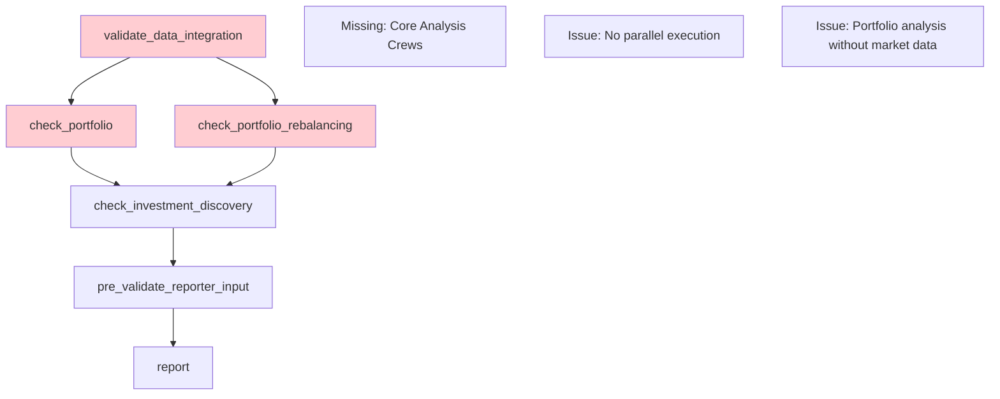
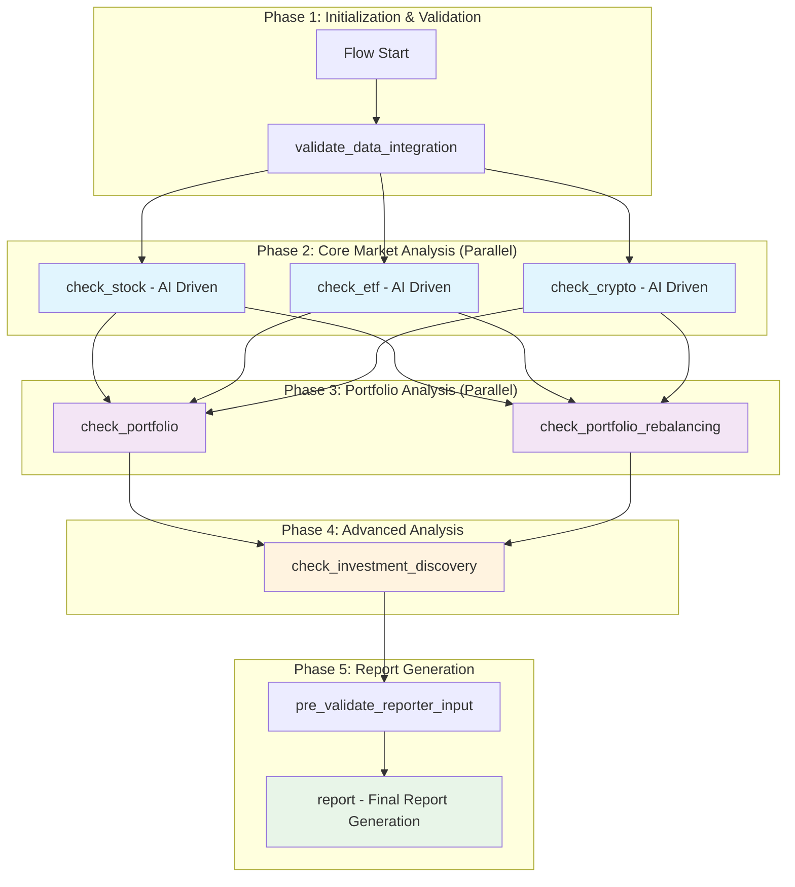

# Core Analysis Restoration Design Document

## Overview

This design document outlines the restoration of the core financial analysis capabilities (cryptocurrency, stock, and ETF analysis crews) to the FinWiz platform while ensuring seamless integration with all existing features including data integration, portfolio rebalancing, investment discovery, quantitative backtesting, and feature enforcement systems.

The design maintains FinWiz's architectural principles while ensuring that AI agents drive the analysis process, data freshness is maintained within 24 hours, and all existing features continue to function without disruption. The restoration will transform FinWiz back into a comprehensive financial analysis platform that leverages the full power of CrewAI's intelligent agent system.

## Architecture

### Current Flow Layout (Suboptimal)



### Improved Flow Layout Architecture



### Flow Execution Phases

**Phase 1: Initialization (Sequential)**

- Data integration validation and system health checks

**Phase 2: Core Analysis (Parallel)**  

- Stock, ETF, and Crypto crews execute simultaneously for maximum efficiency
- Each crew performs AI-driven analysis with fresh market data

**Phase 3: Portfolio Analysis (Parallel)**

- Portfolio review and rebalancing execute in parallel
- Both can leverage core analysis results from Phase 2

**Phase 4: Advanced Analysis (Sequential)**

- Investment discovery uses all previous analysis results
- Identifies A+ opportunities based on comprehensive market data

**Phase 5: Report Generation (Sequential)**

- Consolidates all analysis into final comprehensive report
- Maintains tool-free reporter architecture

### Design Principles

1. **AI-First Analysis**: CrewAI agents are the primary decision makers, using tools for data gathering but applying LLM reasoning for insights
2. **Non-Breaking Integration**: All existing features continue to work unchanged
3. **Data Freshness Enforcement**: All market data must be ≤24 hours old
4. **Parallel Execution**: Core analysis crews run in parallel for optimal performance
5. **Graceful Degradation**: System continues with partial data when services fail
6. **Feature Flag Control**: All restored functionality can be enabled/disabled independently

## Components and Interfaces

### 1. Restored Core Analysis Crews

#### Stock Crew Enhancement

```python
class RestoredStockCrew:
    """AI-driven stock analysis crew with comprehensive tool integration."""
    
    def __init__(self):
        self.data_integration = CrewDataIntegrationManager()
        self.freshness_validator = DataFreshnessValidator(max_age_hours=24)
        self.feature_enforcer = CrewAIFeatureEnforcer()
        
    @agent
    def stock_researcher(self) -> Agent:
        """AI agent that conducts comprehensive stock research."""
        return Agent(
            config=self.agents_config['stock_researcher'],
            tools=self._get_stock_analysis_tools(),
            llm=self._get_configured_llm()
        )
    
    @agent  
    def fundamental_analyst(self) -> Agent:
        """AI agent specializing in fundamental analysis and SEC filings."""
        return Agent(
            config=self.agents_config['fundamental_analyst'],
            tools=self._get_fundamental_tools(),
            llm=self._get_configured_llm()
        )
    
    @task
    def comprehensive_stock_analysis(self) -> Task:
        """AI-driven comprehensive stock analysis task."""
        return Task(
            config=self.tasks_config['comprehensive_analysis'],
            agent=self.stock_researcher(),
            tools=self._get_stock_analysis_tools()
        )
    
    @task
    def sec_filing_analysis(self) -> Task:
        """AI-driven SEC filing analysis with EDGAR integration."""
        return Task(
            config=self.tasks_config['sec_analysis'],
            agent=self.fundamental_analyst(),
            tools=self._get_sec_tools()
        )
    
    @crew
    def crew(self) -> Crew:
        """Stock analysis crew with AI agents and data integration."""
        return Crew(
            agents=[self.stock_researcher(), self.fundamental_analyst()],
            tasks=[self.comprehensive_stock_analysis(), self.sec_filing_analysis()],
            process=Process.sequential,
            verbose=True
        )
    
    def _get_stock_analysis_tools(self) -> List[BaseTool]:
        """Get validated, fresh-data stock analysis tools."""
        tools = [
            EnhancedYahooFinanceTool(),
            AlphaVantageStockTool(),
            QuantitativeAnalysisTool(),
            TechnicalAnalysisTool(),
            SentimentAnalysisTool()
        ]
        
        # Wrap tools with freshness validation
        return [FreshnessValidatedTool(tool, self.freshness_validator) for tool in tools]
    
    def _get_fundamental_tools(self) -> List[BaseTool]:
        """Get SEC and fundamental analysis tools."""
        return [
            EnhancedSECTool(),
            TenKInsightExtractor(),
            FinancialRatioCalculator()
        ]
    
    def _get_sec_tools(self) -> List[BaseTool]:
        """Get SEC EDGAR specific tools."""
        return [
            SECEDGARTool(),
            FilingAnalysisTool(),
            CitationExtractorTool()
        ]
```

#### ETF Crew Enhancement

```python
class RestoredETFCrew:
    """AI-driven ETF analysis crew with enhanced factsheet parsing."""
    
    @agent
    def etf_researcher(self) -> Agent:
        """AI agent that analyzes ETF fundamentals and performance."""
        return Agent(
            config=self.agents_config['etf_researcher'],
            tools=self._get_etf_analysis_tools(),
            llm=self._get_configured_llm()
        )
    
    @agent
    def expense_analyst(self) -> Agent:
        """AI agent specializing in ETF cost analysis and efficiency."""
        return Agent(
            config=self.agents_config['expense_analyst'],
            tools=self._get_expense_tools(),
            llm=self._get_configured_llm()
        )
    
    @task
    def etf_comprehensive_analysis(self) -> Task:
        """AI-driven ETF analysis including holdings and performance."""
        return Task(
            config=self.tasks_config['comprehensive_analysis'],
            agent=self.etf_researcher(),
            async_execution=True  # I/O bound operations
        )
    
    @task
    def expense_ratio_analysis(self) -> Task:
        """AI-driven expense and cost analysis."""
        return Task(
            config=self.tasks_config['expense_analysis'],
            agent=self.expense_analyst(),
            async_execution=False  # Final task remains synchronous
        )
    
    def _get_etf_analysis_tools(self) -> List[BaseTool]:
        """Get ETF-specific analysis tools with freshness validation."""
        tools = [
            EnhancedETFTool(),
            YahooFinanceETFHoldingsTool(),
            ETFFactsheetParser(),
            TrackingErrorCalculator()
        ]
        return [FreshnessValidatedTool(tool, self.freshness_validator) for tool in tools]
```

#### Crypto Crew Enhancement

```python
class RestoredCryptoCrew:
    """AI-driven cryptocurrency analysis crew with market dynamics focus."""
    
    @agent
    def crypto_researcher(self) -> Agent:
        """AI agent that analyzes crypto fundamentals and market dynamics."""
        return Agent(
            config=self.agents_config['crypto_researcher'],
            tools=self._get_crypto_analysis_tools(),
            llm=self._get_configured_llm()
        )
    
    @agent
    def defi_analyst(self) -> Agent:
        """AI agent specializing in DeFi protocols and tokenomics."""
        return Agent(
            config=self.agents_config['defi_analyst'],
            tools=self._get_defi_tools(),
            llm=self._get_configured_llm()
        )
    
    @task
    def crypto_market_analysis(self) -> Task:
        """AI-driven crypto market and technical analysis."""
        return Task(
            config=self.tasks_config['market_analysis'],
            agent=self.crypto_researcher(),
            async_execution=True
        )
    
    @task
    def tokenomics_analysis(self) -> Task:
        """AI-driven tokenomics and protocol analysis."""
        return Task(
            config=self.tasks_config['tokenomics_analysis'],
            agent=self.defi_analyst(),
            async_execution=False  # Final task
        )
    
    def _get_crypto_analysis_tools(self) -> List[BaseTool]:
        """Get crypto-specific analysis tools."""
        tools = [
            EnhancedCryptoTool(),
            CoinMarketCapTool(),
            KrakenAPITool(),
            DeFiMetricsTool(),
            CryptoSentimentTool()
        ]
        return [FreshnessValidatedTool(tool, self.freshness_validator) for tool in tools]
```

### 2. Data Freshness Validation System

#### Freshness Validator

```python
class DataFreshnessValidator:
    """Validates that all market data is within acceptable age limits."""
    
    def __init__(self, max_age_hours: int = 24):
        self.max_age_hours = max_age_hours
        self.market_calendar = MarketCalendar()
        
    def validate_data_freshness(self, data: Dict[str, Any], data_source: str) -> FreshnessResult:
        """Validate data freshness considering market hours and weekends."""
        try:
            timestamp = self._extract_timestamp(data)
            if not timestamp:
                return FreshnessResult(
                    is_fresh=False,
                    age_hours=None,
                    warning="No timestamp found in data",
                    should_refresh=True
                )
            
            age_hours = self._calculate_age_hours(timestamp)
            
            # Adjust for market hours and weekends
            effective_age = self._adjust_for_market_schedule(age_hours, timestamp)
            
            is_fresh = effective_age <= self.max_age_hours
            
            return FreshnessResult(
                is_fresh=is_fresh,
                age_hours=age_hours,
                effective_age_hours=effective_age,
                warning=None if is_fresh else f"Data is {age_hours:.1f} hours old",
                should_refresh=not is_fresh,
                data_source=data_source
            )
            
        except Exception as e:
            logger.error(f"Freshness validation failed for {data_source}: {e}")
            return FreshnessResult(
                is_fresh=False,
                age_hours=None,
                warning=f"Validation error: {str(e)}",
                should_refresh=True,
                data_source=data_source
            )
    
    def _adjust_for_market_schedule(self, age_hours: float, timestamp: datetime) -> float:
        """Adjust age calculation for weekends and market holidays."""
        if self.market_calendar.is_weekend(timestamp):
            # Weekend data can be older
            return age_hours * 0.7  # Reduce effective age for weekend data
        
        if self.market_calendar.is_holiday(timestamp):
            # Holiday data can be older
            return age_hours * 0.8
        
        return age_hours
    
    def refresh_stale_data(self, data_source: str, refresh_callback: Callable) -> RefreshResult:
        """Attempt to refresh stale data using provided callback."""
        try:
            logger.info(f"Refreshing stale data from {data_source}")
            fresh_data = refresh_callback()
            
            # Validate the refreshed data
            freshness_result = self.validate_data_freshness(fresh_data, data_source)
            
            return RefreshResult(
                success=freshness_result.is_fresh,
                data=fresh_data if freshness_result.is_fresh else None,
                error=None if freshness_result.is_fresh else freshness_result.warning
            )
            
        except Exception as e:
            logger.error(f"Data refresh failed for {data_source}: {e}")
            return RefreshResult(
                success=False,
                data=None,
                error=str(e)
            )

class FreshnessValidatedTool(BaseTool):
    """Wrapper that adds freshness validation to any tool."""
    
    def __init__(self, base_tool: BaseTool, validator: DataFreshnessValidator):
        self.base_tool = base_tool
        self.validator = validator
        super().__init__(
            name=f"FreshData_{base_tool.name}",
            description=f"{base_tool.description} (with freshness validation)"
        )
    
    def _run(self, *args, **kwargs) -> Any:
        """Execute tool with freshness validation."""
        # Get data from base tool
        result = self.base_tool._run(*args, **kwargs)
        
        # Validate freshness
        freshness_result = self.validator.validate_data_freshness(
            result, self.base_tool.name
        )
        
        if not freshness_result.is_fresh:
            logger.warning(f"Stale data detected: {freshness_result.warning}")
            
            # Attempt refresh if possible
            if hasattr(self.base_tool, 'refresh_data'):
                refresh_result = self.validator.refresh_stale_data(
                    self.base_tool.name,
                    lambda: self.base_tool.refresh_data(*args, **kwargs)
                )
                
                if refresh_result.success:
                    logger.info(f"Successfully refreshed data from {self.base_tool.name}")
                    result = refresh_result.data
                else:
                    logger.warning(f"Data refresh failed: {refresh_result.error}")
        
        # Add freshness metadata to result
        if isinstance(result, dict):
            result['_freshness_info'] = {
                'is_fresh': freshness_result.is_fresh,
                'age_hours': freshness_result.age_hours,
                'validated_at': datetime.now().isoformat(),
                'data_source': freshness_result.data_source
            }
        
        return result
```

### 3. Flow Orchestration Integration

#### Enhanced FinwizFlow

```python
class EnhancedFinwizFlow(Flow[FinwizState]):
    """Enhanced flow with restored core analysis crews."""
    
    def __init__(self, *args: Any, **kwargs: Any) -> None:
        super().__init__(*args, **kwargs)
        
        # Initialize feature flags
        self.feature_flags = FeatureFlags()
        
        # Initialize data integration (existing)
        self.integration_manager = CrewDataIntegrationManager()
        self.data_accessor = CrewDataAccessor(self.integration_manager)
        
        # Initialize freshness validation (new)
        self.freshness_validator = DataFreshnessValidator(max_age_hours=24)
        
        # Initialize restored crews
        self.stock_crew = RestoredStockCrew() if self.feature_flags.is_enabled('stock_analysis') else None
        self.etf_crew = RestoredETFCrew() if self.feature_flags.is_enabled('etf_analysis') else None
        self.crypto_crew = RestoredCryptoCrew() if self.feature_flags.is_enabled('crypto_analysis') else None
        
        logger.info("Enhanced FinwizFlow initialized with restored core analysis crews")
    
    @start()
    def validate_data_integration(self) -> None:
        """Validate data integration system before crew execution (EXISTING)."""
        # Existing implementation remains unchanged
        pass
    
    @listen(validate_data_integration)
    def execute_core_analysis(self) -> None:
        """Execute core analysis crews in parallel (RESTORED)."""
        if not any([self.stock_crew, self.etf_crew, self.crypto_crew]):
            logger.info("No core analysis crews enabled, skipping core analysis")
            return
        
        try:
            logger.info("Starting parallel execution of core analysis crews")
            
            # Prepare inputs with freshness requirements
            analysis_inputs = {
                **self.inputs,
                'freshness_required': True,
                'max_data_age_hours': 24,
                'require_ai_reasoning': True  # Ensure AI agents drive analysis
            }
            
            # Execute enabled crews in parallel
            crew_results = {}
            
            if self.stock_crew and self.feature_flags.is_enabled('stock_analysis'):
                logger.info("Executing Stock Crew with AI-driven analysis")
                stock_result = self.stock_crew.crew().kickoff(inputs=analysis_inputs)
                crew_results['stock'] = stock_result
                self.inputs['stock_analysis_result'] = str(stock_result.raw) if hasattr(stock_result, 'raw') else str(stock_result)
            
            if self.etf_crew and self.feature_flags.is_enabled('etf_analysis'):
                logger.info("Executing ETF Crew with AI-driven analysis")
                etf_result = self.etf_crew.crew().kickoff(inputs=analysis_inputs)
                crew_results['etf'] = etf_result
                self.inputs['etf_analysis_result'] = str(etf_result.raw) if hasattr(etf_result, 'raw') else str(etf_result)
            
            if self.crypto_crew and self.feature_flags.is_enabled('crypto_analysis'):
                logger.info("Executing Crypto Crew with AI-driven analysis")
                crypto_result = self.crypto_crew.crew().kickoff(inputs=analysis_inputs)
                crew_results['crypto'] = crypto_result
                self.inputs['crypto_analysis_result'] = str(crypto_result.raw) if hasattr(crypto_result, 'raw') else str(crypto_result)
            
            # Store results in data integration system
            for crew_type, result in crew_results.items():
                self.integration_manager.store_crew_output(crew_type, result)
            
            # Update data availability status
            self.inputs['core_analysis_completed'] = True
            self.inputs['core_analysis_crews'] = list(crew_results.keys())
            
            logger.info(f"Core analysis completed for crews: {list(crew_results.keys())}")
            
        except Exception as e:
            logger.error(f"Core analysis execution failed: {e}", exc_info=True)
            # Continue with graceful degradation
            self.inputs['core_analysis_error'] = str(e)
            self.inputs['core_analysis_completed'] = False
    
    @listen(execute_core_analysis)
    def check_portfolio(self) -> None:
        """Run portfolio keep-or-sell review (EXISTING - UNCHANGED)."""
        # Existing implementation remains unchanged
        pass
    
    @listen(and_(check_portfolio, execute_core_analysis))
    def check_portfolio_rebalancing(self) -> None:
        """Run portfolio rebalancing analysis (EXISTING - ENHANCED)."""
        # Enhanced to use core analysis results
        if not self.feature_flags.is_enabled("portfolio_rebalancing"):
            logger.info("Portfolio rebalancing disabled via feature flag")
            return
        
        try:
            # Check if we have core analysis results
            core_analysis_available = self.inputs.get('core_analysis_completed', False)
            
            if core_analysis_available:
                logger.info("Running portfolio rebalancing with core analysis integration")
                
                # Prepare enhanced inputs with core analysis
                crew_inputs = {
                    "full_date": datetime.now().strftime("%B %d, %Y"),
                    "portfolio_data": self.inputs.get("portfolio_review", {}),
                    "target_allocations": self.inputs.get("target_allocations", {}),
                    "tolerance_bands": self.inputs.get("tolerance_bands", {}),
                    "available_capital": self.inputs.get("available_capital", 0.0),
                    # Enhanced with core analysis results
                    "stock_analysis": self.inputs.get("stock_analysis_result"),
                    "etf_analysis": self.inputs.get("etf_analysis_result"),
                    "crypto_analysis": self.inputs.get("crypto_analysis_result"),
                    "market_conditions": self._extract_market_conditions()
                }
            else:
                # Fallback to existing behavior
                crew_inputs = {
                    "full_date": datetime.now().strftime("%B %d, %Y"),
                    "portfolio_data": self.inputs.get("portfolio_review", {}),
                    "target_allocations": self.inputs.get("target_allocations", {}),
                    "tolerance_bands": self.inputs.get("tolerance_bands", {}),
                    "available_capital": self.inputs.get("available_capital", 0.0),
                }
            
            # Execute portfolio rebalancing crew (existing)
            portfolio_rebalancing_crew = PortfolioRebalancingCrew()
            result = portfolio_rebalancing_crew.crew().kickoff(inputs=crew_inputs)
            
            # Store results (existing pattern)
            if hasattr(result, "raw"):
                self.inputs["portfolio_rebalancing_result"] = str(result.raw)
            else:
                self.inputs["portfolio_rebalancing_result"] = str(result)
            self.inputs["portfolio_rebalancing_available"] = True
            
            logger.info("Portfolio rebalancing analysis completed with core analysis integration")
            
        except Exception as e:
            logger.error(f"Portfolio rebalancing analysis failed: {e}")
            self.inputs["portfolio_rebalancing_available"] = False
    
    def _extract_market_conditions(self) -> Dict[str, Any]:
        """Extract market conditions from core analysis results."""
        conditions = {}
        
        if self.inputs.get("stock_analysis_result"):
            # Extract market sentiment and trends from stock analysis
            conditions["stock_market_sentiment"] = "Available from stock analysis"
        
        if self.inputs.get("etf_analysis_result"):
            # Extract sector trends from ETF analysis
            conditions["sector_trends"] = "Available from ETF analysis"
        
        if self.inputs.get("crypto_analysis_result"):
            # Extract crypto market dynamics
            conditions["crypto_market_dynamics"] = "Available from crypto analysis"
        
        return conditions
    
    # All other existing methods remain unchanged
    @listen(and_(check_portfolio, check_portfolio_rebalancing))
    def check_investment_discovery(self) -> None:
        """Run investment discovery analysis (EXISTING - ENHANCED)."""
        # Enhanced to leverage core analysis results
        pass
    
    @listen(check_investment_discovery)
    def pre_validate_reporter_input(self) -> None:
        """Validate ReporterInput payload (EXISTING - ENHANCED)."""
        # Enhanced to include core analysis data
        pass
    
    @listen(pre_validate_reporter_input)
    def report(self) -> None:
        """Generate consolidated report (EXISTING - ENHANCED)."""
        # Enhanced to include core analysis insights
        pass
```

### 4. Feature Flag Integration

#### Enhanced Feature Flags

```python
class EnhancedFeatureFlags(FeatureFlags):
    """Enhanced feature flags with core analysis crew controls."""
    
    def _load_feature_flags(self) -> Dict[str, bool]:
        """Load feature flags including core analysis crews."""
        base_flags = super()._load_feature_flags()
        
        # Add core analysis crew flags
        core_analysis_flags = {
            'stock_analysis': self._get_flag('FINWIZ_FF_STOCK_ANALYSIS', True),
            'etf_analysis': self._get_flag('FINWIZ_FF_ETF_ANALYSIS', True),
            'crypto_analysis': self._get_flag('FINWIZ_FF_CRYPTO_ANALYSIS', True),
            'core_analysis_parallel': self._get_flag('FINWIZ_FF_CORE_PARALLEL', True),
            'data_freshness_validation': self._get_flag('FINWIZ_FF_DATA_FRESHNESS', True),
            'ai_driven_analysis': self._get_flag('FINWIZ_FF_AI_DRIVEN', True),
        }
        
        return {**base_flags, **core_analysis_flags}
    
    def get_enabled_core_crews(self) -> List[str]:
        """Get list of enabled core analysis crews."""
        enabled_crews = []
        
        if self.is_enabled('stock_analysis'):
            enabled_crews.append('stock')
        if self.is_enabled('etf_analysis'):
            enabled_crews.append('etf')
        if self.is_enabled('crypto_analysis'):
            enabled_crews.append('crypto')
        
        return enabled_crews
```

## Data Models

### Core Analysis Output Schemas

```python
class CoreAnalysisResult(BaseModel):
    """Standardized output schema for core analysis crews."""
    
    crew_type: str = Field(..., description="Type of crew (stock, etf, crypto)")
    analysis_timestamp: datetime = Field(..., description="When analysis was performed")
    data_freshness: FreshnessInfo = Field(..., description="Data freshness validation results")
    
    # AI-driven insights
    ai_recommendation: str = Field(..., description="AI agent's investment recommendation")
    ai_reasoning: str = Field(..., description="AI agent's reasoning process")
    confidence_score: float = Field(..., ge=0.0, le=1.0, description="AI confidence in analysis")
    
    # Standardized risk assessment
    risk_score: int = Field(..., ge=1, le=10, description="Standardized risk score")
    risk_factors: List[str] = Field(..., description="Identified risk factors")
    
    # Market data and metrics
    current_price: Optional[float] = Field(None, description="Current market price")
    price_target: Optional[float] = Field(None, description="12-month price target")
    
    # Integration with existing systems
    ten_k_insights: Optional[TenKInsight] = Field(None, description="SEC filing insights")
    market_sentiment: Optional[MarketSentiment] = Field(None, description="Sentiment analysis")
    quantitative_metrics: Optional[Dict[str, Any]] = Field(None, description="Quantitative analysis results")
    
    # Validation and provenance
    data_sources: List[str] = Field(..., description="Data sources used")
    validation_status: str = Field(..., description="Schema validation status")
    
    model_config = ConfigDict(extra='forbid')

class FreshnessInfo(BaseModel):
    """Data freshness validation information."""
    
    is_fresh: bool = Field(..., description="Whether data meets freshness requirements")
    age_hours: Optional[float] = Field(None, description="Age of data in hours")
    effective_age_hours: Optional[float] = Field(None, description="Market-adjusted age")
    data_source: str = Field(..., description="Source of the data")
    validated_at: datetime = Field(..., description="When freshness was validated")
    warning: Optional[str] = Field(None, description="Freshness warning message")
    
    model_config = ConfigDict(extra='forbid')
```

## Error Handling

### Graceful Degradation Strategy

```python
class CoreAnalysisErrorHandler:
    """Handles errors in core analysis crews with graceful degradation."""
    
    def __init__(self, integration_manager: CrewDataIntegrationManager):
        self.integration_manager = integration_manager
        self.fallback_strategies = self._initialize_fallback_strategies()
    
    def handle_crew_failure(self, crew_type: str, error: Exception) -> FallbackResponse:
        """Handle crew failure with appropriate fallback strategy."""
        logger.error(f"{crew_type} crew failed: {error}")
        
        strategy = self.fallback_strategies.get(crew_type)
        if not strategy:
            return FallbackResponse(success=False, message=f"No fallback for {crew_type}")
        
        # Try cached data first
        cached_result = self.integration_manager.get_cached_crew_output(crew_type)
        if cached_result and self._is_cache_acceptable(cached_result):
            logger.info(f"Using cached data for {crew_type} crew")
            return FallbackResponse(
                success=True,
                data=cached_result,
                message=f"Using cached {crew_type} analysis",
                degraded_functionality=['stale_data']
            )
        
        # Try alternative data sources
        for alt_source in strategy.alternative_sources:
            try:
                alt_result = self._get_alternative_analysis(crew_type, alt_source)
                if alt_result:
                    logger.info(f"Using alternative source {alt_source} for {crew_type}")
                    return FallbackResponse(
                        success=True,
                        data=alt_result,
                        message=f"Using alternative analysis for {crew_type}",
                        degraded_functionality=['reduced_depth']
                    )
            except Exception as alt_error:
                logger.warning(f"Alternative source {alt_source} failed: {alt_error}")
        
        # Complete fallback - continue without this crew
        logger.warning(f"No fallback available for {crew_type}, continuing without")
        return FallbackResponse(
            success=False,
            message=f"{crew_type} analysis unavailable",
            degraded_functionality=['missing_analysis']
        )
    
    def _initialize_fallback_strategies(self) -> Dict[str, FallbackStrategy]:
        """Initialize fallback strategies for each crew type."""
        return {
            'stock': FallbackStrategy(
                alternative_sources=['yahoo_finance_basic', 'alpha_vantage_basic'],
                cache_acceptable_age_hours=48,
                degraded_functionality=['no_sec_analysis', 'basic_metrics_only']
            ),
            'etf': FallbackStrategy(
                alternative_sources=['yahoo_finance_etf', 'morningstar_basic'],
                cache_acceptable_age_hours=72,  # ETF data changes less frequently
                degraded_functionality=['no_holdings_analysis', 'basic_performance_only']
            ),
            'crypto': FallbackStrategy(
                alternative_sources=['coinmarketcap_basic', 'coingecko_basic'],
                cache_acceptable_age_hours=24,  # Crypto data changes rapidly
                degraded_functionality=['no_defi_analysis', 'price_data_only']
            )
        }
```

## Testing Strategy

### Comprehensive Test Coverage

```python
class CoreAnalysisTestSuite:
    """Comprehensive test suite for restored core analysis crews."""
    
    def test_crew_restoration_integration(self):
        """Test that restored crews integrate properly with existing systems."""
        # Test data integration
        # Test feature flag control
        # Test flow orchestration
        # Test backward compatibility
    
    def test_ai_driven_analysis(self):
        """Test that AI agents are driving analysis decisions."""
        # Mock LLM responses
        # Verify agent reasoning is captured
        # Test tool usage by agents
        # Validate AI-generated insights
    
    def test_data_freshness_validation(self):
        """Test data freshness validation and refresh mechanisms."""
        # Test stale data detection
        # Test refresh mechanisms
        # Test market schedule adjustments
        # Test fallback to cached data
    
    def test_parallel_execution(self):
        """Test parallel execution of core analysis crews."""
        # Test concurrent crew execution
        # Test resource management
        # Test error isolation between crews
        # Test performance improvements
    
    def test_backward_compatibility(self):
        """Test that existing features continue to work unchanged."""
        # Test portfolio review functionality
        # Test investment discovery integration
        # Test report generation
        # Test quantitative analysis integration
    
    def test_graceful_degradation(self):
        """Test system behavior when crews fail or data is unavailable."""
        # Test crew failure handling
        # Test partial data scenarios
        # Test fallback mechanisms
        # Test user feedback for degraded functionality
```

## Performance Considerations

### Optimization Strategies

1. **Parallel Execution**: Core analysis crews run concurrently to minimize total execution time
2. **Intelligent Caching**: Fresh data is cached with appropriate TTL to reduce API calls
3. **Lazy Loading**: Crews are only initialized when enabled via feature flags
4. **Resource Management**: Memory and CPU usage optimized for concurrent crew execution
5. **Async I/O**: I/O-bound tasks use async execution where possible

### Monitoring and Metrics

```python
class CoreAnalysisMetrics:
    """Performance and health metrics for core analysis crews."""
    
    def __init__(self):
        self.execution_times = {}
        self.success_rates = {}
        self.data_freshness_stats = {}
        self.error_counts = {}
    
    def record_crew_execution(self, crew_type: str, duration: float, success: bool):
        """Record crew execution metrics."""
        if crew_type not in self.execution_times:
            self.execution_times[crew_type] = []
            self.success_rates[crew_type] = []
        
        self.execution_times[crew_type].append(duration)
        self.success_rates[crew_type].append(success)
    
    def get_performance_summary(self) -> Dict[str, Any]:
        """Get performance summary for all crews."""
        summary = {}
        
        for crew_type in self.execution_times:
            times = self.execution_times[crew_type]
            successes = self.success_rates[crew_type]
            
            summary[crew_type] = {
                'avg_execution_time': sum(times) / len(times) if times else 0,
                'success_rate': sum(successes) / len(successes) if successes else 0,
                'total_executions': len(times)
            }
        
        return summary
```

## Testing Strategy

### Current Test Structure Issues

```
tests/
├── 50+ scattered test files in root directory ❌
├── unit/ (partially organized) ⚠️
├── integration/ (some organization) ⚠️
├── performance/ (minimal) ⚠️
└── validation/ (unclear purpose) ❌
```

### Improved Test Organization

```
tests/
├── conftest.py                           # Global test configuration
├── fixtures/                             # Shared test fixtures
│   ├── api_mocks.py                     # API response mocks
│   ├── crew_fixtures.py                 # Crew test data
│   └── flow_fixtures.py                 # Flow state fixtures
├── unit/                                 # Unit tests (isolated components)
│   ├── crews/                           # Crew-specific tests
│   │   ├── stock_crew/
│   │   │   ├── test_agents.py          # Agent behavior tests
│   │   │   ├── test_tasks.py           # Task execution tests
│   │   │   └── test_tools.py           # Tool integration tests
│   │   ├── etf_crew/
│   │   ├── crypto_crew/
│   │   ├── investment_discovery_crew/
│   │   ├── portfolio_rebalancing_crew/
│   │   └── report_crew/
│   ├── flow/                            # Flow orchestration tests
│   │   ├── test_main_flow.py           # Main flow logic
│   │   ├── test_dependencies.py        # Flow dependencies
│   │   └── test_error_handling.py      # Error scenarios
│   ├── tools/                           # Tool-specific tests
│   │   ├── finance/                    # Financial tools
│   │   ├── validation/                 # Validation tools
│   │   └── integration/                # Integration tools
│   ├── schemas/                         # Schema validation tests
│   └── utils/                           # Utility function tests
├── integration/                          # Integration tests (component interaction)
│   ├── core_analysis/                   # Core analysis integration
│   │   ├── test_crew_data_flow.py      # Data flow between crews
│   │   ├── test_parallel_execution.py  # Parallel crew execution
│   │   └── test_freshness_validation.py # Data freshness integration
│   ├── portfolio/                       # Portfolio feature integration
│   ├── quantitative/                    # Quantitative analysis integration
│   └── end_to_end/                      # Full system tests
├── performance/                          # Performance tests
│   ├── core_analysis/                   # Core analysis performance
│   ├── flow_execution/                  # Flow execution benchmarks
│   └── memory_usage/                    # Memory profiling tests
└── contract/                            # Contract tests (API/schema contracts)
    ├── crew_outputs/                    # Crew output contracts
    ├── data_integration/                # Data integration contracts
    └── reporter_inputs/                 # Reporter input contracts
```

### Test Categories and Best Practices

#### 1. Unit Tests (`tests/unit/`)

- **Purpose**: Test individual components in isolation
- **Scope**: Single class/function testing
- **Mocking**: Mock all external dependencies
- **Speed**: < 1 second per test
- **Coverage**: 90%+ code coverage

#### 2. Integration Tests (`tests/integration/`)

- **Purpose**: Test component interactions
- **Scope**: Multiple components working together
- **Mocking**: Mock only external services (APIs)
- **Speed**: < 10 seconds per test
- **Focus**: Data flow, crew interactions, system integration

#### 3. Performance Tests (`tests/performance/`)

- **Purpose**: Validate performance requirements
- **Scope**: System performance under load
- **Metrics**: Execution time, memory usage, throughput
- **Benchmarks**: Baseline performance tracking

#### 4. Contract Tests (`tests/contract/`)

- **Purpose**: Validate API/schema contracts
- **Scope**: Input/output validation
- **Focus**: Schema compliance, data contracts
- **Stability**: Prevent breaking changes

### Test Execution Strategy

```bash
# Fast feedback loop (< 30 seconds)
pytest tests/unit/ -m "not slow"

# Integration validation (< 5 minutes)  
pytest tests/integration/ -m "not performance"

# Performance benchmarks (as needed)
pytest tests/performance/ -m "benchmark"

# Coverage reporting (when needed)
pytest tests/unit/ tests/integration/ --cov=src/finwiz --cov-report=html
```

### Benefits of Improved Structure

- **🎯 Clear Organization**: Easy to find relevant tests
- **⚡ Fast Feedback**: Quick unit test execution
- **🔍 Focused Testing**: Each test type has clear purpose
- **📊 Better Coverage**: Systematic test coverage
- **🚀 Scalable**: Easy to add new tests in right place
- **🛡️ Reliable**: Consistent test patterns and practices

This design ensures that the restored core analysis crews integrate seamlessly with all existing FinWiz features while providing enhanced AI-driven analysis capabilities with proper data freshness validation and graceful degradation strategies.
