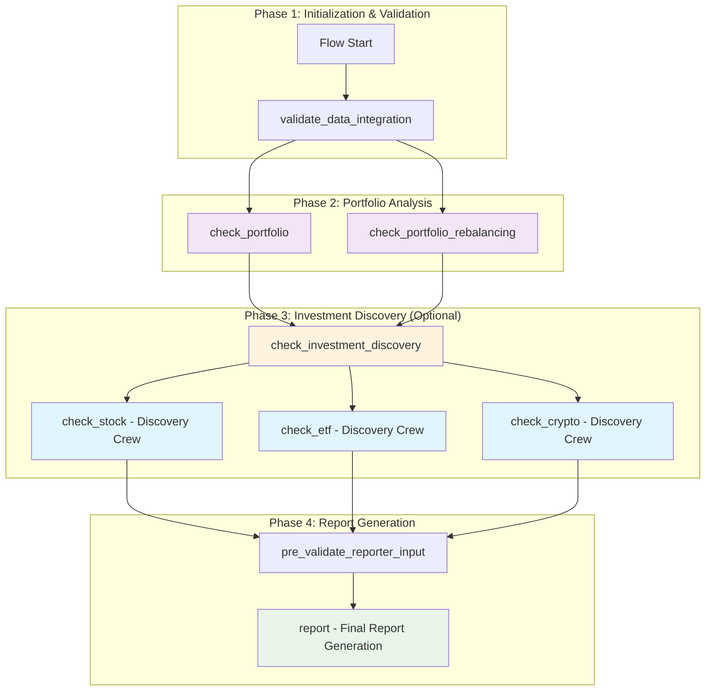
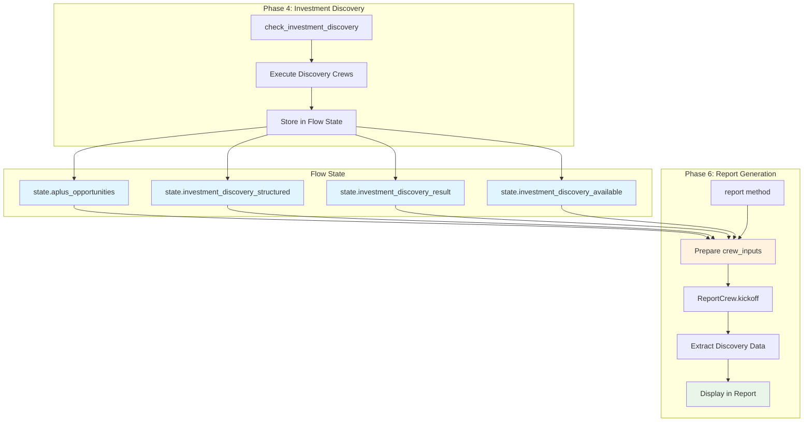

# Core Analysis Restoration Design Document

## Overview

This design document addresses the critical data consolidation bug where core analysis data is missing despite crews being marked as available, and outlines the integration of discovery results into the final report. The design focuses on fixing the data retrieval system, ensuring proper data flow between Flow state and report generation, and maintaining backward compatibility with all existing features.

The key issues addressed are:

1. **Data Consolidation Bug**: Core analysis crews execute successfully but their outputs are not retrieved by the data consolidation system, causing "Core analysis data missing" warnings and portfolio holdings receiving fallback grade D values
2. **Discovery Results Integration**: Investment discovery results are not passed from Flow state to the report crew, causing "Discovery status not provided" messages despite successful discovery execution
3. **Missing Required Inputs**: Several required inputs (validated_tickers_list, discovery_status, backtesting_status, data_availability_summary_formatted) are not passed to the report crew, causing "INSUFFICIENT / PARTIAL" validation errors

The design maintains FinWiz's architectural principles while ensuring that data flows correctly through the system, AI agents drive the analysis process, and all existing features continue to function without disruption.

## Architecture

### Current Flow Architecture

The current FinWiz flow has the following structure:



### Key Architecture Notes

**Current Implementation:**

1. **Discovery Crews (check_stock, check_etf, check_crypto)**: These are "top 10" screening crews that find A+ investment opportunities across the market. They are NOT core analysis crews that analyze specific tickers.

2. **Dual-Crew Architecture**: The system has two types of crews:
   - **Discovery Crews**: Screen markets to find "top 10" A+ opportunities (existing)
   - **Deep Analysis Crew**: Analyze specific portfolio holdings (existing, separate from discovery)

3. **Data Consolidation Bug**: The critical issue is that crew outputs are stored successfully but not retrieved by `get_crew_data_with_freshness_check()`, causing:
   - "Core analysis data missing" warnings
   - Portfolio holdings receiving fallback grade D values
   - Empty consolidated_data despite successful crew execution

4. **Discovery Results Not Integrated**: Discovery crew results exist in Flow state but are not passed to the report crew, causing:
   - "Discovery status not provided" messages
   - Missing A+ opportunities in final report
   - "INSUFFICIENT / PARTIAL" validation errors for missing required inputs

### Flow Execution Phases

**Phase 1: Initialization (Sequential)**
- Data integration validation and system health checks

**Phase 2: Portfolio Analysis (Parallel)**
- Portfolio review and rebalancing execute in parallel
- Use existing portfolio holdings data

**Phase 3: Investment Discovery (Optional, Sequential)**
- Discovery crews screen markets for "top 10" A+ opportunities
- Runs only when --discovery flag is enabled
- Results stored in Flow state (aplus_opportunities, investment_discovery_structured)

**Phase 4: Report Generation (Sequential)**
- Consolidates all analysis into final comprehensive report
- **CRITICAL**: Must receive ALL required inputs from Flow state
- Maintains tool-free reporter architecture

### Design Principles

1. **Fix Data Retrieval Bug**: Ensure crew outputs stored successfully can be retrieved by the data consolidation system
2. **Complete Data Flow**: All Flow state data must be passed to downstream crews, especially the report crew
3. **AI-First Analysis**: CrewAI agents are the primary decision makers, using tools for data gathering but applying LLM reasoning for insights
4. **Non-Breaking Integration**: All existing features continue to work unchanged, including the dual-crew architecture (discovery + deep analysis)
5. **Data Freshness Enforcement**: All market data must be ≤24 hours old
6. **Graceful Degradation**: System continues with partial data when services fail
7. **Feature Flag Control**: All functionality can be enabled/disabled independently
8. **Backward Compatibility**: Maintain existing discovery crew behavior (finding "top 10" opportunities)

## Components and Interfaces

### 1. Data Consolidation Bug Fix

#### Problem Analysis

The data consolidation system has a critical bug where crew outputs are stored successfully but cannot be retrieved:

```python
# Current Issue: get_crew_data_with_freshness_check() returns None
consolidated_data = {}
for crew_name in ["stock", "etf", "crypto"]:
    crew_data = registry_manager.get_crew_data_with_freshness_check(crew_name)
    if crew_data:
        consolidated_data[crew_name] = crew_data
    else:
        logger.warning(f"No data found for {crew_name} crew")  # Always triggers

# Result: consolidated_data is always empty despite successful crew execution
```

#### Root Cause Investigation

The bug occurs in the data retrieval chain:

1. **Crew Output Storage**: Crews store outputs with correct metadata
2. **Registry Manager Query**: `get_crew_data_with_freshness_check()` queries for stored data
3. **File System Lookup**: Method searches for crew output files in expected directory
4. **Retrieval Failure**: Files exist but are not found/parsed correctly

Potential causes:
- Incorrect file path construction
- Mismatched crew name keys (e.g., "stock_crew" vs "stock")
- JSON parsing errors
- File permission issues
- Timestamp/metadata format mismatches

#### Solution Design

```python
class DataConsolidationFix:
    """Fix for data consolidation retrieval bug."""
    
    def debug_crew_data_retrieval(self, crew_name: str) -> dict[str, Any]:
        """
        Debug why crew data retrieval fails.
        
        Returns diagnostic information about:
        - Expected file paths
        - Actual files found
        - File permissions
        - JSON parsing results
        - Metadata validation
        """
        diagnostics = {
            "crew_name": crew_name,
            "expected_paths": [],
            "found_files": [],
            "parsing_errors": [],
            "metadata_issues": [],
        }
        
        # Check expected directory structure
        base_dir = Path("data/crew_outputs")  # Adjust based on actual config
        expected_dir = base_dir / crew_name
        diagnostics["expected_paths"].append(str(expected_dir))
        
        # List actual files
        if expected_dir.exists():
            for file_path in expected_dir.glob("*.json"):
                diagnostics["found_files"].append(str(file_path))
                
                # Try parsing each file
                try:
                    with open(file_path, "r") as f:
                        data = json.load(f)
                        
                    # Validate metadata
                    if "timestamp" not in data:
                        diagnostics["metadata_issues"].append(
                            f"{file_path.name}: Missing timestamp"
                        )
                    if "crew_name" not in data:
                        diagnostics["metadata_issues"].append(
                            f"{file_path.name}: Missing crew_name"
                        )
                        
                except json.JSONDecodeError as e:
                    diagnostics["parsing_errors"].append(
                        f"{file_path.name}: {str(e)}"
                    )
                except Exception as e:
                    diagnostics["parsing_errors"].append(
                        f"{file_path.name}: {str(e)}"
                    )
        else:
            diagnostics["metadata_issues"].append(
                f"Directory does not exist: {expected_dir}"
            )
        
        return diagnostics
    
    def fix_crew_name_mapping(self) -> dict[str, str]:
        """
        Fix crew name mapping between storage and retrieval.
        
        Returns mapping of storage keys to retrieval keys.
        """
        # Investigate actual crew names used during storage
        # vs names used during retrieval
        
        return {
            "stock_crew": "stock",  # Example mapping
            "etf_crew": "etf",
            "crypto_crew": "crypto",
        }
    
    def verify_file_permissions(self, file_path: Path) -> dict[str, Any]:
        """Verify file can be read."""
        return {
            "exists": file_path.exists(),
            "is_file": file_path.is_file(),
            "readable": os.access(file_path, os.R_OK),
            "size": file_path.stat().st_size if file_path.exists() else 0,
        }
    
    def fix_json_parsing(self, file_path: Path) -> dict[str, Any] | None:
        """
        Attempt to parse JSON with error recovery.
        
        Handles common JSON issues:
        - Trailing commas
        - Single quotes instead of double quotes
        - Unescaped characters
        """
        try:
            with open(file_path, "r", encoding="utf-8") as f:
                content = f.read()
            
            # Try standard parsing first
            try:
                return json.loads(content)
            except json.JSONDecodeError:
                # Try fixing common issues
                content = content.replace("'", '"')  # Single to double quotes
                content = re.sub(r',\s*}', '}', content)  # Remove trailing commas
                content = re.sub(r',\s*]', ']', content)
                
                return json.loads(content)
                
        except Exception as e:
            logger.error(f"Failed to parse {file_path}: {e}")
            return None
```

#### Testing Strategy

```python
def test_should_retrieve_stored_crew_data():
    """Test that stored crew outputs can be retrieved."""
    # Arrange
    registry_manager = RegistryManager()
    
    # Store test data
    test_data = {
        "ticker": "AAPL",
        "analysis": "Test analysis",
        "timestamp": datetime.now().isoformat(),
        "crew_name": "stock",
    }
    registry_manager.store_crew_output("stock", test_data)
    
    # Act
    retrieved_data = registry_manager.get_crew_data_with_freshness_check("stock")
    
    # Assert
    assert retrieved_data is not None
    assert retrieved_data["ticker"] == "AAPL"
    assert retrieved_data["crew_name"] == "stock"

def test_should_handle_missing_crew_data_gracefully():
    """Test graceful handling when crew data doesn't exist."""
    # Arrange
    registry_manager = RegistryManager()
    
    # Act
    retrieved_data = registry_manager.get_crew_data_with_freshness_check("nonexistent")
    
    # Assert
    assert retrieved_data is None  # Should return None, not raise exception

def test_should_verify_file_system_structure():
    """Test that crew output directory structure is correct."""
    # Arrange
    base_dir = Path("data/crew_outputs")
    
    # Act & Assert
    assert base_dir.exists(), "Crew outputs directory should exist"
    
    for crew_name in ["stock", "etf", "crypto"]:
        crew_dir = base_dir / crew_name
        assert crew_dir.exists(), f"{crew_name} directory should exist"
```

### 2. Existing Crew Architecture (No Changes Required)

The existing crews (StockCrew, ETFCrew, CryptoCrew) are discovery crews that screen markets for "top 10" A+ opportunities. These crews do NOT need to be modified or "restored" - they are working as designed. The issue is with data retrieval, not crew functionality.

#### Existing Discovery Crew Pattern (Reference Only)

```python
class ExistingStockCrew:
    """
    Existing discovery crew that screens for top 10 stock opportunities.
    NO CHANGES REQUIRED - This is for reference only.
    """
    
    def __init__(self):
        self.data_integration = CrewDataIntegrationManager()
        self.freshness_validator = DataFreshnessValidator(max_age_hours=24)
        self.feature_enforcer = CrewAIFeatureEnforcer()
        
    @agent
    def stock_researcher(self) -> Agent:
        """AI agent that conducts comprehensive stock research."""
        return Agent(
            config=self.agents_config['stock_researcher'],
            tools=self._get_stock_analysis_tools(),
            llm=self._get_configured_llm()
        )
    
    @agent  
    def fundamental_analyst(self) -> Agent:
        """AI agent specializing in fundamental analysis and SEC filings."""
        return Agent(
            config=self.agents_config['fundamental_analyst'],
            tools=self._get_fundamental_tools(),
            llm=self._get_configured_llm()
        )
    
    @task
    def comprehensive_stock_analysis(self) -> Task:
        """AI-driven comprehensive stock analysis task."""
        return Task(
            config=self.tasks_config['comprehensive_analysis'],
            agent=self.stock_researcher(),
            tools=self._get_stock_analysis_tools()
        )
    
    @task
    def sec_filing_analysis(self) -> Task:
        """AI-driven SEC filing analysis with EDGAR integration."""
        return Task(
            config=self.tasks_config['sec_analysis'],
            agent=self.fundamental_analyst(),
            tools=self._get_sec_tools()
        )
    
    @crew
    def crew(self) -> Crew:
        """Stock analysis crew with AI agents and data integration."""
        return Crew(
            agents=[self.stock_researcher(), self.fundamental_analyst()],
            tasks=[self.comprehensive_stock_analysis(), self.sec_filing_analysis()],
            process=Process.sequential,
            verbose=True
        )
    
    def _get_stock_analysis_tools(self) -> List[BaseTool]:
        """Get validated, fresh-data stock analysis tools."""
        tools = [
            EnhancedYahooFinanceTool(),
            AlphaVantageStockTool(),
            QuantitativeAnalysisTool(),
            TechnicalAnalysisTool(),
            SentimentAnalysisTool()
        ]
        
        # Wrap tools with freshness validation
        return [FreshnessValidatedTool(tool, self.freshness_validator) for tool in tools]
    
    def _get_fundamental_tools(self) -> List[BaseTool]:
        """Get SEC and fundamental analysis tools."""
        return [
            EnhancedSECTool(),
            TenKInsightExtractor(),
            FinancialRatioCalculator()
        ]
    
    def _get_sec_tools(self) -> List[BaseTool]:
        """Get SEC EDGAR specific tools."""
        return [
            SECEDGARTool(),
            FilingAnalysisTool(),
            CitationExtractorTool()
        ]
```

#### Existing ETF Discovery Crew (Reference Only)

```python
class ExistingETFCrew:
    """
    Existing discovery crew that screens for top 10 ETF opportunities.
    NO CHANGES REQUIRED - This is for reference only.
    """
    
    @agent
    def etf_researcher(self) -> Agent:
        """AI agent that analyzes ETF fundamentals and performance."""
        return Agent(
            config=self.agents_config['etf_researcher'],
            tools=self._get_etf_analysis_tools(),
            llm=self._get_configured_llm()
        )
    
    @agent
    def expense_analyst(self) -> Agent:
        """AI agent specializing in ETF cost analysis and efficiency."""
        return Agent(
            config=self.agents_config['expense_analyst'],
            tools=self._get_expense_tools(),
            llm=self._get_configured_llm()
        )
    
    @task
    def etf_comprehensive_analysis(self) -> Task:
        """AI-driven ETF analysis including holdings and performance."""
        return Task(
            config=self.tasks_config['comprehensive_analysis'],
            agent=self.etf_researcher(),
            async_execution=True  # I/O bound operations
        )
    
    @task
    def expense_ratio_analysis(self) -> Task:
        """AI-driven expense and cost analysis."""
        return Task(
            config=self.tasks_config['expense_analysis'],
            agent=self.expense_analyst(),
            async_execution=False  # Final task remains synchronous
        )
    
    def _get_etf_analysis_tools(self) -> List[BaseTool]:
        """Get ETF-specific analysis tools with freshness validation."""
        tools = [
            EnhancedETFTool(),
            YahooFinanceETFHoldingsTool(),
            ETFFactsheetParser(),
            TrackingErrorCalculator()
        ]
        return [FreshnessValidatedTool(tool, self.freshness_validator) for tool in tools]
```

#### Existing Crypto Discovery Crew (Reference Only)

```python
class ExistingCryptoCrew:
    """
    Existing discovery crew that screens for top 10 crypto opportunities.
    NO CHANGES REQUIRED - This is for reference only.
    """
    
    @agent
    def crypto_researcher(self) -> Agent:
        """AI agent that analyzes crypto fundamentals and market dynamics."""
        return Agent(
            config=self.agents_config['crypto_researcher'],
            tools=self._get_crypto_analysis_tools(),
            llm=self._get_configured_llm()
        )
    
    @agent
    def defi_analyst(self) -> Agent:
        """AI agent specializing in DeFi protocols and tokenomics."""
        return Agent(
            config=self.agents_config['defi_analyst'],
            tools=self._get_defi_tools(),
            llm=self._get_configured_llm()
        )
    
    @task
    def crypto_market_analysis(self) -> Task:
        """AI-driven crypto market and technical analysis."""
        return Task(
            config=self.tasks_config['market_analysis'],
            agent=self.crypto_researcher(),
            async_execution=True
        )
    
    @task
    def tokenomics_analysis(self) -> Task:
        """AI-driven tokenomics and protocol analysis."""
        return Task(
            config=self.tasks_config['tokenomics_analysis'],
            agent=self.defi_analyst(),
            async_execution=False  # Final task
        )
    
    def _get_crypto_analysis_tools(self) -> List[BaseTool]:
        """Get crypto-specific analysis tools."""
        tools = [
            EnhancedCryptoTool(),
            CoinMarketCapTool(),
            KrakenAPITool(),
            DeFiMetricsTool(),
            CryptoSentimentTool()
        ]
        return [FreshnessValidatedTool(tool, self.freshness_validator) for tool in tools]
```

### 2. Data Freshness Validation System

#### Freshness Validator

```python
class DataFreshnessValidator:
    """Validates that all market data is within acceptable age limits."""
    
    def __init__(self, max_age_hours: int = 24):
        self.max_age_hours = max_age_hours
        self.market_calendar = MarketCalendar()
        
    def validate_data_freshness(self, data: Dict[str, Any], data_source: str) -> FreshnessResult:
        """Validate data freshness considering market hours and weekends."""
        try:
            timestamp = self._extract_timestamp(data)
            if not timestamp:
                return FreshnessResult(
                    is_fresh=False,
                    age_hours=None,
                    warning="No timestamp found in data",
                    should_refresh=True
                )
            
            age_hours = self._calculate_age_hours(timestamp)
            
            # Adjust for market hours and weekends
            effective_age = self._adjust_for_market_schedule(age_hours, timestamp)
            
            is_fresh = effective_age <= self.max_age_hours
            
            return FreshnessResult(
                is_fresh=is_fresh,
                age_hours=age_hours,
                effective_age_hours=effective_age,
                warning=None if is_fresh else f"Data is {age_hours:.1f} hours old",
                should_refresh=not is_fresh,
                data_source=data_source
            )
            
        except Exception as e:
            logger.error(f"Freshness validation failed for {data_source}: {e}")
            return FreshnessResult(
                is_fresh=False,
                age_hours=None,
                warning=f"Validation error: {str(e)}",
                should_refresh=True,
                data_source=data_source
            )
    
    def _adjust_for_market_schedule(self, age_hours: float, timestamp: datetime) -> float:
        """Adjust age calculation for weekends and market holidays."""
        if self.market_calendar.is_weekend(timestamp):
            # Weekend data can be older
            return age_hours * 0.7  # Reduce effective age for weekend data
        
        if self.market_calendar.is_holiday(timestamp):
            # Holiday data can be older
            return age_hours * 0.8
        
        return age_hours
    
    def refresh_stale_data(self, data_source: str, refresh_callback: Callable) -> RefreshResult:
        """Attempt to refresh stale data using provided callback."""
        try:
            logger.info(f"Refreshing stale data from {data_source}")
            fresh_data = refresh_callback()
            
            # Validate the refreshed data
            freshness_result = self.validate_data_freshness(fresh_data, data_source)
            
            return RefreshResult(
                success=freshness_result.is_fresh,
                data=fresh_data if freshness_result.is_fresh else None,
                error=None if freshness_result.is_fresh else freshness_result.warning
            )
            
        except Exception as e:
            logger.error(f"Data refresh failed for {data_source}: {e}")
            return RefreshResult(
                success=False,
                data=None,
                error=str(e)
            )

class FreshnessValidatedTool(BaseTool):
    """Wrapper that adds freshness validation to any tool."""
    
    def __init__(self, base_tool: BaseTool, validator: DataFreshnessValidator):
        self.base_tool = base_tool
        self.validator = validator
        super().__init__(
            name=f"FreshData_{base_tool.name}",
            description=f"{base_tool.description} (with freshness validation)"
        )
    
    def _run(self, *args, **kwargs) -> Any:
        """Execute tool with freshness validation."""
        # Get data from base tool
        result = self.base_tool._run(*args, **kwargs)
        
        # Validate freshness
        freshness_result = self.validator.validate_data_freshness(
            result, self.base_tool.name
        )
        
        if not freshness_result.is_fresh:
            logger.warning(f"Stale data detected: {freshness_result.warning}")
            
            # Attempt refresh if possible
            if hasattr(self.base_tool, 'refresh_data'):
                refresh_result = self.validator.refresh_stale_data(
                    self.base_tool.name,
                    lambda: self.base_tool.refresh_data(*args, **kwargs)
                )
                
                if refresh_result.success:
                    logger.info(f"Successfully refreshed data from {self.base_tool.name}")
                    result = refresh_result.data
                else:
                    logger.warning(f"Data refresh failed: {refresh_result.error}")
        
        # Add freshness metadata to result
        if isinstance(result, dict):
            result['_freshness_info'] = {
                'is_fresh': freshness_result.is_fresh,
                'age_hours': freshness_result.age_hours,
                'validated_at': datetime.now().isoformat(),
                'data_source': freshness_result.data_source
            }
        
        return result
```

### 3. Flow Orchestration Integration

#### Current FinwizFlow (With Bug Fixes)

The existing FinwizFlow implementation needs minimal changes - primarily fixing data retrieval and ensuring complete data passing to the report crew:

```python
class FinwizFlow(Flow[FinwizState]):
    """
    Existing flow with bug fixes for data consolidation and discovery integration.
    NO MAJOR ARCHITECTURAL CHANGES - Only fixing data retrieval and passing.
    """
    
    @start()
    def validate_data_integration(self) -> None:
        """Validate data integration system before crew execution (EXISTING - NO CHANGES)."""
        # Existing implementation remains unchanged
        pass
    
    @listen(validate_data_integration)
    def check_portfolio(self) -> None:
        """Run portfolio keep-or-sell review (EXISTING - NO CHANGES)."""
        # Existing implementation remains unchanged
        pass
    
    @listen(validate_data_integration)
    def check_portfolio_rebalancing(self) -> None:
        """Run portfolio rebalancing analysis (EXISTING - NO CHANGES)."""
        # Existing implementation remains unchanged
        pass
    
    @listen(and_(check_portfolio, check_portfolio_rebalancing))
    def check_investment_discovery(self) -> None:
        """
        Run investment discovery analysis (EXISTING - ENSURE STATE STORAGE).
        
        CRITICAL: Ensure discovery results are stored in Flow state:
        - self.state.aplus_opportunities
        - self.state.investment_discovery_structured
        - self.state.investment_discovery_result
        - self.state.investment_discovery_available
        """
        if not self.feature_flags.is_enabled("investment_discovery"):
            logger.info("Investment discovery disabled via feature flag")
            self.state.investment_discovery_available = False
            return
        
        try:
            logger.info("Running investment discovery crews")
            
            # Execute discovery crews (existing logic)
            # ... existing implementation ...
            
            # CRITICAL: Store results in Flow state for report crew
            self.state.aplus_opportunities = aplus_results
            self.state.investment_discovery_structured = structured_results
            self.state.investment_discovery_result = raw_result
            self.state.investment_discovery_available = True
            
            logger.info("Investment discovery completed and stored in Flow state")
            
        except Exception as e:
            logger.error(f"Investment discovery failed: {e}")
            self.state.investment_discovery_available = False
    
    @listen(check_investment_discovery)
    def pre_validate_reporter_input(self) -> None:
        """Validate ReporterInput payload (EXISTING - MINIMAL CHANGES)."""
        # Existing validation logic
        # Ensure consolidated_data includes discovery results if available
        pass
    
    @listen(pre_validate_reporter_input)
    def report(self) -> dict[str, Any]:
        """
        Generate consolidated report (EXISTING - FIX DATA PASSING).
        
        CRITICAL FIXES:
        1. Pass ALL Flow state fields to report crew inputs
        2. Extract validated_tickers_list from portfolio_review
        3. Construct discovery_status and backtesting_status objects
        4. Include data_availability_summary_formatted
        """
        try:
            logger.info("Generating consolidated report with complete data integration")
            
            # Extract validated tickers from portfolio review
            validated_tickers_list = self._extract_validated_tickers()
            
            # Construct status objects
            discovery_status = self._construct_discovery_status()
            backtesting_status = self._construct_backtesting_status()
            
            # Prepare crew inputs with ALL required fields
            crew_inputs = {
                # Basic metadata
                "full_date": datetime.now().strftime("%B %d, %Y"),
                "current_date": self.state.current_date,
                "report_language": self.state.report_language,
                
                # Portfolio data
                "portfolio_review": self.state.portfolio_review,
                
                # CRITICAL: Discovery results from Flow state
                "aplus_opportunities": self.state.aplus_opportunities,
                "investment_discovery_structured": self.state.investment_discovery_structured,
                "investment_discovery_result": self.state.investment_discovery_result,
                "investment_discovery_available": self.state.investment_discovery_available,
                
                # CRITICAL: Required inputs that were missing
                "validated_tickers_list": validated_tickers_list,
                "discovery_status": discovery_status,
                "backtesting_status": backtesting_status,
                "data_availability_summary_formatted": self.state.data_availability_summary_formatted,
                
                # Rebalancing results
                "portfolio_rebalancing_result": self.state.portfolio_rebalancing_result,
                "portfolio_rebalancing_available": self.state.portfolio_rebalancing_available,
                
                # Consolidated data
                "consolidated_data": self.state.consolidated_data,
                "integrated_data_available": self.state.integrated_data_available,
                
                # Additional state fields
                "data_availability_summary": self.state.data_availability_summary,
                "core_analysis_summary": self.state.core_analysis_summary,
                "market_sentiment": self.state.market_sentiment,
            }
            
            # Log what we're passing for debugging
            logger.info(
                "Passing complete inputs to report crew",
                extra={
                    "has_aplus_opportunities": crew_inputs["aplus_opportunities"] is not None,
                    "discovery_available": crew_inputs["investment_discovery_available"],
                    "validated_tickers_count": len(validated_tickers_list),
                    "discovery_status": discovery_status["status"],
                }
            )
            
            # Execute report crew with complete inputs
            report_crew = ReportCrew()
            result = report_crew.crew().kickoff(inputs=crew_inputs)
            
            # Store result in state
            if hasattr(result, "raw"):
                self.state.final_report = str(result.raw)
            else:
                self.state.final_report = str(result)
            
            logger.info("Report generation completed with complete data integration")
            
            return {
                "report_generated": True,
                "discovery_included": self.state.investment_discovery_available,
                "inputs_complete": True,
            }
            
        except Exception as e:
            logger.error(f"Report generation failed: {e}", exc_info=True)
            self.state.report_error = str(e)
            return {"report_generated": False, "error": str(e)}
    
    def _extract_validated_tickers(self) -> list[str]:
        """Extract validated tickers from portfolio review."""
        validated_tickers = []
        
        if self.state.portfolio_review:
            portfolio_data = self.state.portfolio_review
            
            # Handle dict format
            if isinstance(portfolio_data, dict) and "holdings" in portfolio_data:
                validated_tickers = [
                    h.get("ticker") for h in portfolio_data["holdings"] 
                    if h.get("ticker")
                ]
            # Handle Pydantic model format
            elif hasattr(portfolio_data, "holdings"):
                validated_tickers = [
                    h.ticker for h in portfolio_data.holdings 
                    if hasattr(h, "ticker")
                ]
        
        return validated_tickers
    
    def _construct_discovery_status(self) -> dict[str, Any]:
        """Construct discovery status object from Flow state."""
        return {
            "has_results": self.state.investment_discovery_available or False,
            "message": (
                "A+ discovery results available" 
                if self.state.investment_discovery_available 
                else "Discovery not run - use --discovery flag"
            ),
            "status": (
                "available" 
                if self.state.investment_discovery_available 
                else "not_run"
            ),
        }
    
    def _construct_backtesting_status(self) -> dict[str, Any]:
        """Construct backtesting status object from consolidated data."""
        backtesting_status = {
            "has_data": False,
            "message": "Backtesting data not available",
            "status": "not_available",
        }
        
        if self.state.consolidated_data:
            backtesting_data = self.state.consolidated_data.get("backtesting_data")
            if backtesting_data:
                backtesting_status = {
                    "has_data": True,
                    "message": "Backtesting data available",
                    "status": "available",
                }
        
        return backtesting_status
```

### 4. Feature Flag Integration (Existing - No Changes)

The existing feature flag system already supports controlling discovery crews and other features. No changes are required to the feature flag system for this bug fix.

```python
class FeatureFlags:
    """
    Existing feature flags system (NO CHANGES REQUIRED).
    
    Already supports:
    - investment_discovery: Enable/disable discovery crews
    - portfolio_rebalancing: Enable/disable rebalancing
    - data_freshness_validation: Enable/disable freshness checks
    """
    
    def is_enabled(self, feature_name: str) -> bool:
        """Check if feature is enabled."""
        return self.flags.get(feature_name, False)
```

## Data Models

### Core Analysis Output Schemas

```python
class CoreAnalysisResult(BaseModel):
    """Standardized output schema for core analysis crews."""
    
    crew_type: str = Field(..., description="Type of crew (stock, etf, crypto)")
    analysis_timestamp: datetime = Field(..., description="When analysis was performed")
    data_freshness: FreshnessInfo = Field(..., description="Data freshness validation results")
    
    # AI-driven insights
    ai_recommendation: str = Field(..., description="AI agent's investment recommendation")
    ai_reasoning: str = Field(..., description="AI agent's reasoning process")
    confidence_score: float = Field(..., ge=0.0, le=1.0, description="AI confidence in analysis")
    
    # Standardized risk assessment
    risk_score: int = Field(..., ge=1, le=10, description="Standardized risk score")
    risk_factors: List[str] = Field(..., description="Identified risk factors")
    
    # Market data and metrics
    current_price: Optional[float] = Field(None, description="Current market price")
    price_target: Optional[float] = Field(None, description="12-month price target")
    
    # Integration with existing systems
    ten_k_insights: Optional[TenKInsight] = Field(None, description="SEC filing insights")
    market_sentiment: Optional[MarketSentiment] = Field(None, description="Sentiment analysis")
    quantitative_metrics: Optional[Dict[str, Any]] = Field(None, description="Quantitative analysis results")
    
    # Validation and provenance
    data_sources: List[str] = Field(..., description="Data sources used")
    validation_status: str = Field(..., description="Schema validation status")
    
    model_config = ConfigDict(extra='forbid')

class FreshnessInfo(BaseModel):
    """Data freshness validation information."""
    
    is_fresh: bool = Field(..., description="Whether data meets freshness requirements")
    age_hours: Optional[float] = Field(None, description="Age of data in hours")
    effective_age_hours: Optional[float] = Field(None, description="Market-adjusted age")
    data_source: str = Field(..., description="Source of the data")
    validated_at: datetime = Field(..., description="When freshness was validated")
    warning: Optional[str] = Field(None, description="Freshness warning message")
    
    model_config = ConfigDict(extra='forbid')
```

## Error Handling

### Graceful Degradation Strategy

```python
class CoreAnalysisErrorHandler:
    """Handles errors in core analysis crews with graceful degradation."""
    
    def __init__(self, integration_manager: CrewDataIntegrationManager):
        self.integration_manager = integration_manager
        self.fallback_strategies = self._initialize_fallback_strategies()
    
    def handle_crew_failure(self, crew_type: str, error: Exception) -> FallbackResponse:
        """Handle crew failure with appropriate fallback strategy."""
        logger.error(f"{crew_type} crew failed: {error}")
        
        strategy = self.fallback_strategies.get(crew_type)
        if not strategy:
            return FallbackResponse(success=False, message=f"No fallback for {crew_type}")
        
        # Try cached data first
        cached_result = self.integration_manager.get_cached_crew_output(crew_type)
        if cached_result and self._is_cache_acceptable(cached_result):
            logger.info(f"Using cached data for {crew_type} crew")
            return FallbackResponse(
                success=True,
                data=cached_result,
                message=f"Using cached {crew_type} analysis",
                degraded_functionality=['stale_data']
            )
        
        # Try alternative data sources
        for alt_source in strategy.alternative_sources:
            try:
                alt_result = self._get_alternative_analysis(crew_type, alt_source)
                if alt_result:
                    logger.info(f"Using alternative source {alt_source} for {crew_type}")
                    return FallbackResponse(
                        success=True,
                        data=alt_result,
                        message=f"Using alternative analysis for {crew_type}",
                        degraded_functionality=['reduced_depth']
                    )
            except Exception as alt_error:
                logger.warning(f"Alternative source {alt_source} failed: {alt_error}")
        
        # Complete fallback - continue without this crew
        logger.warning(f"No fallback available for {crew_type}, continuing without")
        return FallbackResponse(
            success=False,
            message=f"{crew_type} analysis unavailable",
            degraded_functionality=['missing_analysis']
        )
    
    def _initialize_fallback_strategies(self) -> Dict[str, FallbackStrategy]:
        """Initialize fallback strategies for each crew type."""
        return {
            'stock': FallbackStrategy(
                alternative_sources=['yahoo_finance_basic', 'alpha_vantage_basic'],
                cache_acceptable_age_hours=48,
                degraded_functionality=['no_sec_analysis', 'basic_metrics_only']
            ),
            'etf': FallbackStrategy(
                alternative_sources=['yahoo_finance_etf', 'morningstar_basic'],
                cache_acceptable_age_hours=72,  # ETF data changes less frequently
                degraded_functionality=['no_holdings_analysis', 'basic_performance_only']
            ),
            'crypto': FallbackStrategy(
                alternative_sources=['coinmarketcap_basic', 'coingecko_basic'],
                cache_acceptable_age_hours=24,  # Crypto data changes rapidly
                degraded_functionality=['no_defi_analysis', 'price_data_only']
            )
        }
```

## Testing Strategy

### Comprehensive Test Coverage

```python
class CoreAnalysisTestSuite:
    """Comprehensive test suite for restored core analysis crews."""
    
    def test_crew_restoration_integration(self):
        """Test that restored crews integrate properly with existing systems."""
        # Test data integration
        # Test feature flag control
        # Test flow orchestration
        # Test backward compatibility
    
    def test_ai_driven_analysis(self):
        """Test that AI agents are driving analysis decisions."""
        # Mock LLM responses
        # Verify agent reasoning is captured
        # Test tool usage by agents
        # Validate AI-generated insights
    
    def test_data_freshness_validation(self):
        """Test data freshness validation and refresh mechanisms."""
        # Test stale data detection
        # Test refresh mechanisms
        # Test market schedule adjustments
        # Test fallback to cached data
    
    def test_parallel_execution(self):
        """Test parallel execution of core analysis crews."""
        # Test concurrent crew execution
        # Test resource management
        # Test error isolation between crews
        # Test performance improvements
    
    def test_backward_compatibility(self):
        """Test that existing features continue to work unchanged."""
        # Test portfolio review functionality
        # Test investment discovery integration
        # Test report generation
        # Test quantitative analysis integration
    
    def test_graceful_degradation(self):
        """Test system behavior when crews fail or data is unavailable."""
        # Test crew failure handling
        # Test partial data scenarios
        # Test fallback mechanisms
        # Test user feedback for degraded functionality
```

## Performance Considerations

### Optimization Strategies

1. **Parallel Execution**: Core analysis crews run concurrently to minimize total execution time
2. **Intelligent Caching**: Fresh data is cached with appropriate TTL to reduce API calls
3. **Lazy Loading**: Crews are only initialized when enabled via feature flags
4. **Resource Management**: Memory and CPU usage optimized for concurrent crew execution
5. **Async I/O**: I/O-bound tasks use async execution where possible

### Monitoring and Metrics

```python
class CoreAnalysisMetrics:
    """Performance and health metrics for core analysis crews."""
    
    def __init__(self):
        self.execution_times = {}
        self.success_rates = {}
        self.data_freshness_stats = {}
        self.error_counts = {}
    
    def record_crew_execution(self, crew_type: str, duration: float, success: bool):
        """Record crew execution metrics."""
        if crew_type not in self.execution_times:
            self.execution_times[crew_type] = []
            self.success_rates[crew_type] = []
        
        self.execution_times[crew_type].append(duration)
        self.success_rates[crew_type].append(success)
    
    def get_performance_summary(self) -> Dict[str, Any]:
        """Get performance summary for all crews."""
        summary = {}
        
        for crew_type in self.execution_times:
            times = self.execution_times[crew_type]
            successes = self.success_rates[crew_type]
            
            summary[crew_type] = {
                'avg_execution_time': sum(times) / len(times) if times else 0,
                'success_rate': sum(successes) / len(successes) if successes else 0,
                'total_executions': len(times)
            }
        
        return summary
```

## Testing Strategy

### Current Test Structure Issues

```
tests/
├── 50+ scattered test files in root directory ❌
├── unit/ (partially organized) ⚠️
├── integration/ (some organization) ⚠️
├── performance/ (minimal) ⚠️
└── validation/ (unclear purpose) ❌
```

### Improved Test Organization

```
tests/
├── conftest.py                           # Global test configuration
├── fixtures/                             # Shared test fixtures
│   ├── api_mocks.py                     # API response mocks
│   ├── crew_fixtures.py                 # Crew test data
│   └── flow_fixtures.py                 # Flow state fixtures
├── unit/                                 # Unit tests (isolated components)
│   ├── crews/                           # Crew-specific tests
│   │   ├── stock_crew/
│   │   │   ├── test_agents.py          # Agent behavior tests
│   │   │   ├── test_tasks.py           # Task execution tests
│   │   │   └── test_tools.py           # Tool integration tests
│   │   ├── etf_crew/
│   │   ├── crypto_crew/
│   │   ├── investment_discovery_crew/
│   │   ├── portfolio_rebalancing_crew/
│   │   └── report_crew/
│   ├── flow/                            # Flow orchestration tests
│   │   ├── test_main_flow.py           # Main flow logic
│   │   ├── test_dependencies.py        # Flow dependencies
│   │   └── test_error_handling.py      # Error scenarios
│   ├── tools/                           # Tool-specific tests
│   │   ├── finance/                    # Financial tools
│   │   ├── validation/                 # Validation tools
│   │   └── integration/                # Integration tools
│   ├── schemas/                         # Schema validation tests
│   └── utils/                           # Utility function tests
├── integration/                          # Integration tests (component interaction)
│   ├── core_analysis/                   # Core analysis integration
│   │   ├── test_crew_data_flow.py      # Data flow between crews
│   │   ├── test_parallel_execution.py  # Parallel crew execution
│   │   └── test_freshness_validation.py # Data freshness integration
│   ├── portfolio/                       # Portfolio feature integration
│   ├── quantitative/                    # Quantitative analysis integration
│   └── end_to_end/                      # Full system tests
├── performance/                          # Performance tests
│   ├── core_analysis/                   # Core analysis performance
│   ├── flow_execution/                  # Flow execution benchmarks
│   └── memory_usage/                    # Memory profiling tests
└── contract/                            # Contract tests (API/schema contracts)
    ├── crew_outputs/                    # Crew output contracts
    ├── data_integration/                # Data integration contracts
    └── reporter_inputs/                 # Reporter input contracts
```

### Test Categories and Best Practices

#### 1. Unit Tests (`tests/unit/`)

- **Purpose**: Test individual components in isolation
- **Scope**: Single class/function testing
- **Mocking**: Mock all external dependencies
- **Speed**: < 1 second per test
- **Coverage**: 90%+ code coverage

#### 2. Integration Tests (`tests/integration/`)

- **Purpose**: Test component interactions
- **Scope**: Multiple components working together
- **Mocking**: Mock only external services (APIs)
- **Speed**: < 10 seconds per test
- **Focus**: Data flow, crew interactions, system integration

#### 3. Performance Tests (`tests/performance/`)

- **Purpose**: Validate performance requirements
- **Scope**: System performance under load
- **Metrics**: Execution time, memory usage, throughput
- **Benchmarks**: Baseline performance tracking

#### 4. Contract Tests (`tests/contract/`)

- **Purpose**: Validate API/schema contracts
- **Scope**: Input/output validation
- **Focus**: Schema compliance, data contracts
- **Stability**: Prevent breaking changes

### Test Execution Strategy

```bash
# Fast feedback loop (< 30 seconds)
pytest tests/unit/ -m "not slow"

# Integration validation (< 5 minutes)  
pytest tests/integration/ -m "not performance"

# Performance benchmarks (as needed)
pytest tests/performance/ -m "benchmark"

# Coverage reporting (when needed)
pytest tests/unit/ tests/integration/ --cov=src/finwiz --cov-report=html
```

### Benefits of Improved Structure

- **🎯 Clear Organization**: Easy to find relevant tests
- **⚡ Fast Feedback**: Quick unit test execution
- **🔍 Focused Testing**: Each test type has clear purpose
- **📊 Better Coverage**: Systematic test coverage
- **🚀 Scalable**: Easy to add new tests in right place
- **🛡️ Reliable**: Consistent test patterns and practices

This design ensures that the restored core analysis crews integrate seamlessly with all existing FinWiz features while providing enhanced AI-driven analysis capabilities with proper data freshness validation and graceful degradation strategies.


## Discovery Results Integration

### Problem Statement

The investment discovery crews execute successfully and find A+ opportunities, but these results are not being properly passed to the report crew. Additionally, several other required inputs are missing, causing the report crew to show "INSUFFICIENT / PARTIAL" errors. The specific issues are:

1. **Discovery Data Not Passed**: `aplus_opportunities` and `investment_discovery_structured` are not included in crew inputs
2. **Missing validated_tickers_list**: List of validated tickers from portfolio review not passed
3. **Missing discovery_status**: Discovery status object not constructed and passed
4. **Missing backtesting_status**: Backtesting status object not constructed and passed
5. **Missing data_availability_summary_formatted**: Formatted data availability summary not passed

These missing inputs cause the report crew to show "Discovery status not provided" messages and "INSUFFICIENT / PARTIAL" validation errors, even when the data exists in the Flow state.

### Root Cause Analysis

1. **Flow State Not Passed**: The `report()` method in `flow_orchestrator.py` does not pass discovery-related state fields to the report crew inputs
2. **Missing Data Keys**: The report crew expects multiple required inputs that are not being passed from Flow state:
   - `aplus_opportunities` - Discovery results
   - `investment_discovery_structured` - Structured discovery data
   - `validated_tickers_list` - List of validated tickers
   - `discovery_status` - Discovery execution status
   - `backtesting_status` - Backtesting data status
   - `data_availability_summary_formatted` - Formatted availability summary
3. **Incomplete Data Flow**: Discovery results and other data are stored in Flow state but not propagated to downstream crew execution
4. **No Status Construction**: Status objects (discovery_status, backtesting_status) need to be constructed from Flow state before passing to report crew
5. **Missing Data Extraction**: Validated tickers need to be extracted from portfolio_review before passing to report crew

### Solution Design

#### Enhanced Flow State to Report Crew Data Passing

```python
@listen("pre_validate_reporter_input")
def report(self) -> dict[str, Any]:
    """Generate consolidated report with ALL required inputs from Flow state."""
    try:
        logger.info("Generating consolidated report with complete data integration")
        
        # Extract validated tickers from portfolio review or consolidated data
        validated_tickers_list = []
        if self.state.portfolio_review:
            portfolio_data = self.state.portfolio_review
            if isinstance(portfolio_data, dict) and "holdings" in portfolio_data:
                validated_tickers_list = [
                    h.get("ticker") for h in portfolio_data["holdings"] 
                    if h.get("ticker")
                ]
            elif hasattr(portfolio_data, "holdings"):
                validated_tickers_list = [
                    h.ticker for h in portfolio_data.holdings 
                    if hasattr(h, "ticker")
                ]
        
        # Construct discovery_status from Flow state
        discovery_status = {
            "has_results": self.state.investment_discovery_available or False,
            "message": (
                "A+ discovery results available" 
                if self.state.investment_discovery_available 
                else "Discovery not run - use --discovery flag"
            ),
            "status": (
                "available" 
                if self.state.investment_discovery_available 
                else "not_run"
            ),
        }
        
        # Construct backtesting_status from consolidated data or state
        backtesting_status = {
            "has_data": False,
            "message": "Backtesting data not available",
            "status": "not_available",
        }
        
        # Check if backtesting data exists in consolidated data
        if self.state.consolidated_data:
            backtesting_data = self.state.consolidated_data.get("backtesting_data")
            if backtesting_data:
                backtesting_status = {
                    "has_data": True,
                    "message": "Backtesting data available",
                    "status": "available",
                }
        
        # Prepare crew inputs with ALL required fields
        crew_inputs = {
            # Basic metadata
            "full_date": datetime.now().strftime("%B %d, %Y"),
            "current_date": self.state.current_date,
            "current_day": self.state.current_day,
            "current_month": self.state.current_month,
            "current_year": self.state.current_year,
            "timestamp": self.state.timestamp,
            "report_language": self.state.report_language,
            
            # Portfolio data
            "portfolio_review": self.state.portfolio_review,
            
            # CRITICAL: Discovery results from Flow state
            "aplus_opportunities": self.state.aplus_opportunities,
            "investment_discovery_structured": self.state.investment_discovery_structured,
            "investment_discovery_result": self.state.investment_discovery_result,
            "investment_discovery_available": self.state.investment_discovery_available,
            
            # CRITICAL: Required inputs that were missing
            "validated_tickers_list": validated_tickers_list,
            "discovery_status": discovery_status,
            "backtesting_status": backtesting_status,
            "data_availability_summary_formatted": self.state.data_availability_summary_formatted,
            
            # Rebalancing results
            "portfolio_rebalancing_result": self.state.portfolio_rebalancing_result,
            "portfolio_rebalancing_available": self.state.portfolio_rebalancing_available,
            
            # Consolidated data
            "consolidated_data": self.state.consolidated_data,
            "integrated_data_available": self.state.integrated_data_available,
            
            # Data availability information
            "data_availability_summary": self.state.data_availability_summary,
            
            # Core analysis summary
            "core_analysis_summary": self.state.core_analysis_summary,
            "core_analysis_status": self.state.core_analysis_status,
            
            # Market context
            "market_sentiment": self.state.market_sentiment,
            "ticker_validation": self.state.ticker_validation,
            
            # Additional state fields
            "portfolio_allocation_updates": self.state.portfolio_allocation_updates,
            "aplus_availability_status": self.state.aplus_availability_status,
        }
        
        # Log what we're passing to help with debugging
        logger.info(
            "Passing complete inputs to report crew",
            extra={
                "has_aplus_opportunities": crew_inputs["aplus_opportunities"] is not None,
                "has_discovery_structured": crew_inputs["investment_discovery_structured"] is not None,
                "discovery_available": crew_inputs["investment_discovery_available"],
                "validated_tickers_count": len(validated_tickers_list),
                "discovery_status": discovery_status["status"],
                "backtesting_status": backtesting_status["status"],
                "has_data_availability_summary": crew_inputs["data_availability_summary_formatted"] is not None,
            }
        )
        
        # Execute report crew with complete inputs
        report_crew = ReportCrew()
        result = report_crew.crew().kickoff(inputs=crew_inputs)
        
        # Store result in state
        if hasattr(result, "raw"):
            self.state.final_report = str(result.raw)
        else:
            self.state.final_report = str(result)
        
        logger.info("Report generation completed with complete data integration")
        
        return {
            "report_generated": True,
            "discovery_included": self.state.investment_discovery_available,
            "inputs_complete": True,
        }
        
    except Exception as e:
        logger.error(f"Report generation failed: {e}", exc_info=True)
        self.state.report_error = str(e)
        return {"report_generated": False, "error": str(e)}
```

#### Enhanced Report Crew Discovery Data Extraction

```python
def _get_discovery_status(self, inputs: dict[str, Any] | None = None) -> dict[str, Any]:
    """
    Get A+ discovery status with proper Flow state integration.
    
    Checks for discovery data in this order:
    1. Flow state inputs (aplus_opportunities) - PRIMARY
    2. Flow state inputs (investment_discovery_structured) - SECONDARY
    3. Flow state inputs (investment_discovery_available) - STATUS CHECK
    4. File-based discovery accessor (fallback) - LEGACY
    """
    if not inputs:
        logger.warning("No inputs provided to _get_discovery_status")
        return {
            "has_results": False,
            "message": "No inputs provided to report crew",
            "status": "error"
        }
    
    # Check if discovery was explicitly marked as available
    discovery_available = inputs.get("investment_discovery_available", False)
    
    if not discovery_available:
        logger.info("Discovery marked as not available in Flow state")
        return {
            "has_results": False,
            "message": "A+ discovery not run - use --discovery flag to enable",
            "status": "not_run"
        }
    
    # Check for aplus_opportunities (preferred format)
    aplus_opportunities = inputs.get("aplus_opportunities")
    if aplus_opportunities:
        logger.info("Discovery data found in Flow state (aplus_opportunities)")
        return {
            "has_results": True,
            "message": "A+ discovery results available",
            "status": "available",
            "data_source": "flow_state_aplus"
        }
    
    # Check for investment_discovery_structured (alternative format)
    discovery_structured = inputs.get("investment_discovery_structured")
    if discovery_structured and discovery_structured.get("has_a_plus_analysis"):
        logger.info("Discovery data found in Flow state (investment_discovery_structured)")
        return {
            "has_results": True,
            "message": "A+ discovery results available",
            "status": "available",
            "data_source": "flow_state_structured"
        }
    
    # Check for raw discovery result
    discovery_result = inputs.get("investment_discovery_result")
    if discovery_result:
        logger.info("Discovery data found in Flow state (investment_discovery_result)")
        return {
            "has_results": True,
            "message": "A+ discovery results available",
            "status": "available",
            "data_source": "flow_state_result"
        }
    
    # Fallback to file-based checking (legacy support)
    has_results = self.discovery_accessor.has_discovery_results()
    if has_results:
        logger.info("Discovery data found via file-based accessor (legacy)")
        return {
            "has_results": True,
            "message": "A+ discovery results available",
            "status": "available",
            "data_source": "file_based"
        }
    
    # Discovery was marked as available but no data found
    logger.warning("Discovery marked as available but no data found in any source")
    return {
        "has_results": False,
        "message": "Discovery data missing despite being marked as available",
        "status": "data_missing"
    }
```

#### Enhanced Discovery Data Extraction

```python
def _extract_discovery_results(self, inputs: dict[str, Any]) -> dict[str, Any] | None:
    """
    Extract discovery results from Flow state inputs.
    
    Handles multiple data formats:
    - aplus_opportunities (APlusOpportunitySection)
    - investment_discovery_structured (dict with opportunities)
    - investment_discovery_result (raw crew output)
    """
    # Try aplus_opportunities first (structured format)
    aplus_opportunities = inputs.get("aplus_opportunities")
    if aplus_opportunities:
        logger.info("Extracting discovery results from aplus_opportunities")
        
        # Handle both dict and Pydantic model formats
        if hasattr(aplus_opportunities, "model_dump"):
            return aplus_opportunities.model_dump()
        elif isinstance(aplus_opportunities, dict):
            return aplus_opportunities
    
    # Try investment_discovery_structured (alternative format)
    discovery_structured = inputs.get("investment_discovery_structured")
    if discovery_structured and discovery_structured.get("has_a_plus_analysis"):
        logger.info("Extracting discovery results from investment_discovery_structured")
        
        # Convert to aplus_opportunities format
        return {
            "has_a_plus_analysis": True,
            "total_opportunities_found": (
                len(discovery_structured.get("etf_opportunities", []))
                + len(discovery_structured.get("stock_opportunities", []))
                + len(discovery_structured.get("crypto_opportunities", []))
            ),
            "etf_opportunities": discovery_structured.get("etf_opportunities", []),
            "stock_opportunities": discovery_structured.get("stock_opportunities", []),
            "crypto_opportunities": discovery_structured.get("crypto_opportunities", []),
        }
    
    # Try raw discovery result (last resort)
    discovery_result = inputs.get("investment_discovery_result")
    if discovery_result:
        logger.info("Extracting discovery results from raw investment_discovery_result")
        
        # Parse raw result to extract opportunities
        # This is a fallback and may require text parsing
        return {
            "has_a_plus_analysis": True,
            "raw_result": discovery_result,
            "note": "Extracted from raw crew output"
        }
    
    logger.warning("No discovery results found in any input format")
    return None
```

### Data Flow Diagram



### Testing Strategy

#### Unit Tests

```python
def test_should_pass_discovery_data_to_report_crew(mocker):
    """Test that discovery data is passed from Flow state to report crew."""
    # Arrange
    flow = FinwizFlow()
    flow.state.aplus_opportunities = {
        "has_a_plus_analysis": True,
        "total_opportunities_found": 5,
        "etf_opportunities": ["SPY", "QQQ"],
        "stock_opportunities": ["AAPL", "MSFT", "GOOGL"],
    }
    flow.state.investment_discovery_available = True
    
    mock_report_crew = mocker.patch("finwiz.crews.report_crew.report_crew.ReportCrew")
    
    # Act
    flow.report()
    
    # Assert
    call_args = mock_report_crew.return_value.crew.return_value.kickoff.call_args
    crew_inputs = call_args[1]["inputs"]
    
    assert "aplus_opportunities" in crew_inputs
    assert crew_inputs["aplus_opportunities"]["total_opportunities_found"] == 5
    assert crew_inputs["investment_discovery_available"] is True

def test_should_extract_discovery_results_from_inputs(mocker):
    """Test that report crew extracts discovery results from inputs."""
    # Arrange
    report_crew = ReportCrew()
    inputs = {
        "aplus_opportunities": {
            "has_a_plus_analysis": True,
            "etf_opportunities": ["SPY"],
            "stock_opportunities": ["AAPL", "MSFT"],
        },
        "investment_discovery_available": True,
    }
    
    # Act
    discovery_status = report_crew._get_discovery_status(inputs)
    
    # Assert
    assert discovery_status["has_results"] is True
    assert discovery_status["status"] == "available"
    assert discovery_status["data_source"] == "flow_state_aplus"
```

#### Integration Tests

```python
def test_should_include_discovery_in_final_report(tmp_path):
    """Test end-to-end discovery integration in report."""
    # Arrange
    flow = FinwizFlow()
    
    # Simulate discovery execution
    flow.state.aplus_opportunities = {
        "has_a_plus_analysis": True,
        "total_opportunities_found": 3,
        "etf_opportunities": ["SPY"],
        "stock_opportunities": ["AAPL", "MSFT"],
    }
    flow.state.investment_discovery_available = True
    
    # Act
    result = flow.report()
    
    # Assert
    assert result["report_generated"] is True
    assert result["discovery_included"] is True
    assert "SPY" in flow.state.final_report
    assert "AAPL" in flow.state.final_report
    assert "Discovery status not provided" not in flow.state.final_report
```

### Benefits

1. **Complete Data Flow**: Discovery results flow from execution → Flow state → report crew → final report
2. **Multiple Format Support**: Handles aplus_opportunities, investment_discovery_structured, and raw results
3. **Clear Status Messages**: Users see accurate status based on actual discovery execution
4. **Backward Compatible**: Maintains file-based fallback for legacy support
5. **Robust Error Handling**: Gracefully handles missing or malformed discovery data
6. **Testable**: Clear data flow makes testing straightforward

This design ensures that when discovery crews execute successfully, their results are properly integrated into the final report, providing users with actionable A+ investment opportunities.
