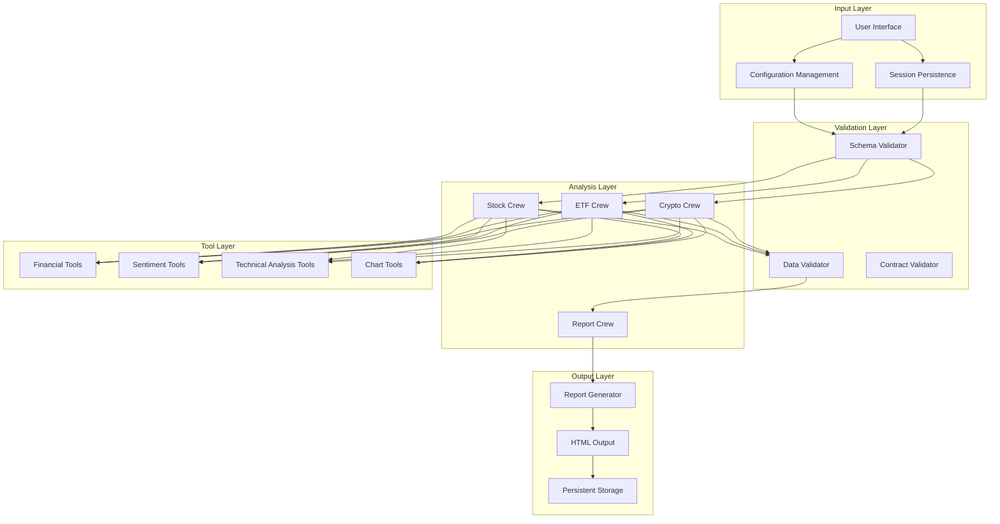

# FinWiz Enhancement Design Document

## Overview

This design document outlines comprehensive enhancements to the FinWiz financial analysis platform, focusing on strengthening data validation, expanding analytical capabilities, ensuring architectural compliance, and improving system reliability. The enhancements maintain FinWiz's core design principles of being "light as a haiku" with strict separation of concerns while addressing critical needs identified in recent change requests.

The design implements a layered approach with strict schema validation, enhanced analytical tools, improved testing coverage, and persistent session management to create a more robust and user-friendly financial analysis platform.

## Architecture

### High-Level Architecture



### Design Principles

1. **Strict Separation of Concerns**: Each crew focuses on its domain expertise
2. **Schema-First Validation**: All data exchanges use validated Pydantic models
3. **Tool-Free Reporter**: Final report crew has no external dependencies
4. **HTML-First Output**: Consistent, accessible report generation
5. **Graceful Degradation**: System continues operating with partial data
6. **Configuration-Driven**: Behavior controlled through YAML and environment variables

## Components and Interfaces

### 1. Schema Validation System

#### Core Components

- **ValidationManager**: Central validation orchestrator
- **SchemaRegistry**: Registry of all Pydantic models
- **ContractValidator**: Validates inter-crew data contracts
- **StrictnessController**: Manages validation modes (off/warn/error)

#### Key Interfaces

```python
class ValidationManager:
    def validate_crew_output(self, data: dict, crew_type: str) -> ValidationResult
    def validate_reporter_input(self, data: ReporterInput) -> ValidationResult
    def set_strictness_mode(self, mode: ValidationMode) -> None

class ValidationResult:
    is_valid: bool
    errors: List[ValidationError]
    warnings: List[ValidationWarning]
    sanitized_data: Optional[dict]
```

#### Design Rationale

- **Pydantic v2 with `extra='forbid'`**: Prevents schema drift by rejecting unknown fields
- **Graduated strictness modes**: Allows gradual rollout without breaking existing workflows
- **Centralized validation**: Single point of control for all validation logic
- **Detailed error reporting**: Provides actionable feedback for debugging

### 2. Enhanced Financial Analysis Tools

#### Multi-Source Sentiment Analysis

```python
class SentimentAnalyzer:
    def analyze_multi_source(self, ticker: str) -> SentimentResult
    def extract_trending_topics(self, articles: List[Article]) -> List[TrendingTopic]
    def calculate_weighted_sentiment(self, sources: List[SentimentSource]) -> float
```

#### Advanced Technical Analysis

```python
class TechnicalAnalyzer:
    def calculate_fibonacci_levels(self, price_data: PriceData) -> FibonacciLevels
    def identify_support_resistance(self, price_data: PriceData) -> SupportResistance
    def find_indicator_confluence(self, indicators: List[Indicator]) -> ConfluenceZones
```

#### Chart Integration

```python
class ChartAnalyzer:
    def generate_visual_analysis(self, ticker: str) -> ChartAnalysis
    def extract_pattern_insights(self, chart_url: str) -> PatternInsights
```

#### Design Rationale

- **Multi-source integration**: Reduces single-point-of-failure and improves accuracy
- **Confluence detection**: Identifies high-probability trading signals
- **Visual pattern recognition**: Leverages LLM capabilities for chart analysis
- **Modular tool design**: Each tool can be used independently or in combination

### 3. Crew Architecture Compliance

#### Report Crew Constraints

```python
class ReportCrew:
    tools: List = []  # Enforced empty tools list
    
    def validate_no_external_calls(self) -> None:
        # Runtime validation to prevent tool usage
        
    def generate_html_report(self, context: ReporterInput) -> HTMLReport:
        # Pure data transformation, no external dependencies
```

#### Data Flow Validation

```python
class CrewOrchestrator:
    def validate_crew_contracts(self) -> ContractValidationResult
    def ensure_reporter_isolation(self) -> None
    def validate_html_output_standards(self, output: str) -> HTMLValidationResult
```

#### Design Rationale

- **Tool isolation**: Prevents architectural violations in the reporter
- **Contract validation**: Ensures consistent data flow between crews
- **HTML standardization**: Maintains consistent output quality and accessibility
- **Runtime enforcement**: Catches violations during execution, not just at build time

### 4. Testing & Quality Assurance Framework

#### Contract Testing

```python
class ContractTestSuite:
    def test_yaml_configuration_completeness(self) -> None
    def test_required_context_keys(self) -> None
    def test_schema_compatibility(self) -> None
```

#### Integration Testing

```python
class IntegrationTestSuite:
    def test_api_error_handling(self) -> None
    def test_response_parsing(self) -> None
    def test_rate_limit_handling(self) -> None
```

#### Output Validation Testing

```python
class OutputValidationSuite:
    def test_html_formatting_compliance(self) -> None
    def test_utf8_encoding_support(self) -> None
    def test_french_report_sections(self) -> None
```

#### Design Rationale

- **Layered testing approach**: Unit, integration, and contract tests serve different purposes
- **Mock-first strategy**: Prevents external dependencies in test execution
- **Performance constraints**: Tests must complete quickly for developer productivity
- **Behavioral focus**: Tests verify outcomes, not implementation details

### 5. Configuration & Environment Management

#### Configuration System

```python
class ConfigurationManager:
    """Centralized configuration management with validation and error handling."""
    
    REQUIRED_API_KEYS = [
        'OPENAI_API_KEY', 'SERPER_API_KEY', 'FIRECRAWL_API_KEY', 
        'ALPHA_VANTAGE_API_KEY', 'CHART_IMG_API_KEY', 'TWELVE_DATA_API_KEY'
    ]
    
    OPTIONAL_API_KEYS = [
        'COINMARKETCAP_API_KEY', 'KRAKEN_API_KEY', 'QUANTLIB_LICENSE_KEY'
    ]
    
    def __init__(self):
        self.config = self.load_environment_variables()
        self.feature_flags = FeatureFlags()
        self.cache_config = self.setup_caching_layer()
    
    def load_environment_variables(self) -> EnvironmentConfig:
        """Load and validate all environment variables at startup."""
        import os
        from dotenv import load_dotenv
        
        # Load .env file if it exists
        load_dotenv()
        
        config = EnvironmentConfig()
        
        # Load required API keys
        for key in self.REQUIRED_API_KEYS:
            value = os.getenv(key)
            if not value:
                raise ConfigurationError(f"Required API key {key} not found in environment")
            setattr(config, key.lower(), value)
        
        # Load optional API keys
        for key in self.OPTIONAL_API_KEYS:
            value = os.getenv(key)
            if value:
                setattr(config, key.lower(), value)
        
        # Load configuration settings
        config.validation_mode = os.getenv('FINWIZ_VALIDATION_MODE', 'warn')
        config.cache_ttl_minutes = int(os.getenv('FINWIZ_CACHE_TTL_MINUTES', '45'))
        config.log_level = os.getenv('FINWIZ_LOG_LEVEL', 'INFO')
        config.max_concurrent_requests = int(os.getenv('FINWIZ_MAX_CONCURRENT_REQUESTS', '10'))
        
        return config
    
    def validate_api_keys(self) -> ValidationResult:
        """Validate API keys by making test calls to each service."""
        validation_results = []
        
        for key in self.REQUIRED_API_KEYS:
            try:
                api_value = getattr(self.config, key.lower())
                validation_result = self._test_api_key(key, api_value)
                validation_results.append(validation_result)
            except Exception as e:
                validation_results.append(
                    APIKeyValidation(key=key, is_valid=False, error=str(e))
                )
        
        all_valid = all(result.is_valid for result in validation_results)
        
        return ValidationResult(
            is_valid=all_valid,
            api_key_results=validation_results,
            remediation_guidance=self._generate_remediation_guidance(validation_results)
        )
    
    def _test_api_key(self, key_name: str, api_key: str) -> APIKeyValidation:
        """Test individual API key by making a lightweight API call."""
        try:
            if key_name == 'OPENAI_API_KEY':
                return self._test_openai_key(api_key)
            elif key_name == 'ALPHA_VANTAGE_API_KEY':
                return self._test_alpha_vantage_key(api_key)
            elif key_name == 'CHART_IMG_API_KEY':
                return self._test_chart_img_key(api_key)
            # Add other API key tests...
            else:
                return APIKeyValidation(key=key_name, is_valid=True, message="Validation not implemented")
        except Exception as e:
            return APIKeyValidation(key=key_name, is_valid=False, error=str(e))
    
    def _test_openai_key(self, api_key: str) -> APIKeyValidation:
        """Test OpenAI API key with minimal request."""
        import openai
        try:
            client = openai.OpenAI(api_key=api_key)
            # Make a minimal request to test the key
            response = client.models.list()
            return APIKeyValidation(key='OPENAI_API_KEY', is_valid=True, message="Key validated successfully")
        except Exception as e:
            return APIKeyValidation(key='OPENAI_API_KEY', is_valid=False, error=str(e))
    
    def _test_alpha_vantage_key(self, api_key: str) -> APIKeyValidation:
        """Test Alpha Vantage API key with minimal request."""
        import httpx
        try:
            url = f"https://www.alphavantage.co/query?function=TIME_SERIES_INTRADAY&symbol=IBM&interval=1min&apikey={api_key}"
            with httpx.Client(timeout=10.0) as client:
                response = client.get(url)
                if response.status_code == 200 and "Error Message" not in response.text:
                    return APIKeyValidation(key='ALPHA_VANTAGE_API_KEY', is_valid=True, message="Key validated successfully")
                else:
                    return APIKeyValidation(key='ALPHA_VANTAGE_API_KEY', is_valid=False, error="Invalid API key or quota exceeded")
        except Exception as e:
            return APIKeyValidation(key='ALPHA_VANTAGE_API_KEY', is_valid=False, error=str(e))
    
    def _test_chart_img_key(self, api_key: str) -> APIKeyValidation:
        """Test Chart-img API key with minimal request."""
        # Implementation for Chart-img API validation
        return APIKeyValidation(key='CHART_IMG_API_KEY', is_valid=True, message="Key validation not implemented")
    
    def _generate_remediation_guidance(self, results: List[APIKeyValidation]) -> str:
        """Generate actionable guidance for fixing API key issues."""
        failed_keys = [result for result in results if not result.is_valid]
        
        if not failed_keys:
            return "All API keys validated successfully"
        
        guidance = ["API Key Configuration Issues Found:", ""]
        
        for failed_key in failed_keys:
            guidance.append(f"❌ {failed_key.key}:")
            guidance.append(f"   Error: {failed_key.error}")
            guidance.append(f"   Solution: {self._get_key_setup_instructions(failed_key.key)}")
            guidance.append("")
        
        guidance.append("For detailed setup instructions, see: docs/api_setup_guide.md")
        
        return "\n".join(guidance)
    
    def _get_key_setup_instructions(self, key_name: str) -> str:
        """Get setup instructions for specific API keys."""
        instructions = {
            'OPENAI_API_KEY': "Get your API key from https://platform.openai.com/api-keys",
            'ALPHA_VANTAGE_API_KEY': "Get your free API key from https://www.alphavantage.co/support/#api-key",
            'CHART_IMG_API_KEY': "Get your API key from https://chart-img.com/dashboard",
            'TWELVE_DATA_API_KEY': "Get your API key from https://twelvedata.com/account/api-keys",
            'SERPER_API_KEY': "Get your API key from https://serper.dev/dashboard",
            'FIRECRAWL_API_KEY': "Get your API key from https://firecrawl.dev/dashboard"
        }
        return instructions.get(key_name, "Check the service documentation for API key setup")
    
    def setup_caching_layer(self, ttl_minutes: int = None) -> CacheConfig:
        """Setup caching configuration with validation."""
        if ttl_minutes is None:
            ttl_minutes = self.config.cache_ttl_minutes
        
        # Validate TTL range (30-60 minutes as per requirements)
        if not 30 <= ttl_minutes <= 60:
            raise ConfigurationError(f"Cache TTL must be between 30-60 minutes, got {ttl_minutes}")
        
        return CacheConfig(
            ttl_minutes=ttl_minutes,
            max_cache_size=1000,  # Maximum number of cached items
            cache_backend='memory',  # Could be extended to Redis later
            enable_cache_warming=True
        )
    
    def get_feature_flags(self) -> FeatureFlags:
        """Get current feature flag configuration."""
        return self.feature_flags

class FeatureFlags:
    """Feature flag system for gradual rollout of new capabilities."""
    
    def __init__(self):
        self.flags = self._load_feature_flags()
    
    def _load_feature_flags(self) -> Dict[str, bool]:
        """Load feature flags from environment variables."""
        import os
        
        return {
            'enhanced_sentiment_analysis': self._get_flag('FINWIZ_FF_ENHANCED_SENTIMENT', True),
            'quantitative_backtesting': self._get_flag('FINWIZ_FF_QUANTITATIVE_BACKTESTING', False),
            'multi_source_validation': self._get_flag('FINWIZ_FF_MULTI_SOURCE_VALIDATION', True),
            'advanced_technical_analysis': self._get_flag('FINWIZ_FF_ADVANCED_TECHNICAL', True),
            'chart_pattern_recognition': self._get_flag('FINWIZ_FF_CHART_PATTERNS', False),
            'portfolio_optimization': self._get_flag('FINWIZ_FF_PORTFOLIO_OPTIMIZATION', False),
            'derivatives_pricing': self._get_flag('FINWIZ_FF_DERIVATIVES_PRICING', False),
            'real_time_data_streaming': self._get_flag('FINWIZ_FF_REAL_TIME_STREAMING', False),
            'session_persistence': self._get_flag('FINWIZ_FF_SESSION_PERSISTENCE', True),
            'strict_validation_mode': self._get_flag('FINWIZ_FF_STRICT_VALIDATION', False)
        }
    
    def _get_flag(self, env_var: str, default: bool) -> bool:
        """Get feature flag value from environment with default."""
        import os
        value = os.getenv(env_var, str(default)).lower()
        return value in ('true', '1', 'yes', 'on', 'enabled')
    
    def is_enabled(self, flag_name: str) -> bool:
        """Check if a feature flag is enabled."""
        return self.flags.get(flag_name, False)
    
    def enable_flag(self, flag_name: str) -> None:
        """Enable a feature flag at runtime."""
        if flag_name in self.flags:
            self.flags[flag_name] = True
        else:
            raise ValueError(f"Unknown feature flag: {flag_name}")
    
    def disable_flag(self, flag_name: str) -> None:
        """Disable a feature flag at runtime."""
        if flag_name in self.flags:
            self.flags[flag_name] = False
        else:
            raise ValueError(f"Unknown feature flag: {flag_name}")
    
    def get_enabled_flags(self) -> List[str]:
        """Get list of currently enabled feature flags."""
        return [flag for flag, enabled in self.flags.items() if enabled]

class GracefulDegradationManager:
    """Manages graceful degradation when external services fail."""
    
    def __init__(self, config_manager: ConfigurationManager):
        self.config = config_manager
        self.service_status = {}
        self.fallback_strategies = self._initialize_fallback_strategies()
    
    def _initialize_fallback_strategies(self) -> Dict[str, FallbackStrategy]:
        """Initialize fallback strategies for each external service."""
        return {
            'alpha_vantage': FallbackStrategy(
                primary_service='alpha_vantage',
                fallback_services=['yahoo_finance', 'twelve_data'],
                cache_fallback=True,
                degraded_functionality=['reduced_news_coverage', 'limited_fundamental_data']
            ),
            'chart_img': FallbackStrategy(
                primary_service='chart_img',
                fallback_services=[],
                cache_fallback=True,
                degraded_functionality=['no_chart_analysis', 'text_only_technical_analysis']
            ),
            'twelve_data': FallbackStrategy(
                primary_service='twelve_data',
                fallback_services=['alpha_vantage', 'yahoo_finance'],
                cache_fallback=True,
                degraded_functionality=['limited_technical_indicators']
            )
        }
    
    def handle_service_failure(self, service_name: str, error: Exception) -> FallbackResponse:
        """Handle service failure with appropriate fallback strategy."""
        strategy = self.fallback_strategies.get(service_name)
        if not strategy:
            raise ServiceNotConfiguredError(f"No fallback strategy for service: {service_name}")
        
        # Mark service as failed
        self.service_status[service_name] = ServiceStatus(
            name=service_name,
            is_available=False,
            last_error=str(error),
            last_check=datetime.now()
        )
        
        # Try fallback services
        for fallback_service in strategy.fallback_services:
            if self._is_service_available(fallback_service):
                return FallbackResponse(
                    fallback_service=fallback_service,
                    degraded_functionality=strategy.degraded_functionality,
                    success=True
                )
        
        # If no fallback services available, try cache
        if strategy.cache_fallback:
            return FallbackResponse(
                fallback_service='cache',
                degraded_functionality=strategy.degraded_functionality + ['stale_data'],
                success=True
            )
        
        # Complete failure
        return FallbackResponse(
            fallback_service=None,
            degraded_functionality=strategy.degraded_functionality + ['service_unavailable'],
            success=False
        )
    
    def _is_service_available(self, service_name: str) -> bool:
        """Check if a service is currently available."""
        status = self.service_status.get(service_name)
        if not status:
            return True  # Assume available if not checked yet
        
        # Consider service available if last failure was more than 5 minutes ago
        return status.is_available or (datetime.now() - status.last_check).seconds > 300
```

#### Caching Layer

```python
class CacheManager:
    """Enhanced caching system with TTL and intelligent invalidation."""
    
    def __init__(self, config: CacheConfig):
        self.config = config
        self.cache = {}
        self.cache_timestamps = {}
        self.cache_stats = CacheStats()
    
    def cache_api_response(self, key: str, data: dict, ttl: int = None) -> None:
        """Cache API response with TTL."""
        if ttl is None:
            ttl = self.config.ttl_minutes * 60  # Convert to seconds
        
        # Check cache size limit
        if len(self.cache) >= self.config.max_cache_size:
            self._evict_oldest_entries()
        
        self.cache[key] = data
        self.cache_timestamps[key] = {
            'created': datetime.now(),
            'ttl': ttl,
            'access_count': 0
        }
        
        self.cache_stats.cache_writes += 1
    
    def get_cached_response(self, key: str) -> Optional[dict]:
        """Get cached response if still valid."""
        if key not in self.cache:
            self.cache_stats.cache_misses += 1
            return None
        
        timestamp_info = self.cache_timestamps[key]
        age_seconds = (datetime.now() - timestamp_info['created']).total_seconds()
        
        if age_seconds > timestamp_info['ttl']:
            # Cache expired
            self._remove_cache_entry(key)
            self.cache_stats.cache_misses += 1
            return None
        
        # Cache hit
        timestamp_info['access_count'] += 1
        self.cache_stats.cache_hits += 1
        return self.cache[key]
    
    def invalidate_cache(self, pattern: str) -> int:
        """Invalidate cache entries matching pattern."""
        import re
        
        pattern_regex = re.compile(pattern)
        keys_to_remove = [key for key in self.cache.keys() if pattern_regex.match(key)]
        
        for key in keys_to_remove:
            self._remove_cache_entry(key)
        
        return len(keys_to_remove)
    
    def _evict_oldest_entries(self) -> None:
        """Evict oldest cache entries to make room for new ones."""
        # Remove 10% of oldest entries
        entries_to_remove = max(1, len(self.cache) // 10)
        
        # Sort by creation time
        sorted_entries = sorted(
            self.cache_timestamps.items(),
            key=lambda x: x[1]['created']
        )
        
        for key, _ in sorted_entries[:entries_to_remove]:
            self._remove_cache_entry(key)
    
    def _remove_cache_entry(self, key: str) -> None:
        """Remove cache entry and its metadata."""
        if key in self.cache:
            del self.cache[key]
        if key in self.cache_timestamps:
            del self.cache_timestamps[key]
    
    def get_cache_stats(self) -> CacheStats:
        """Get cache performance statistics."""
        self.cache_stats.current_size = len(self.cache)
        self.cache_stats.hit_rate = (
            self.cache_stats.cache_hits / 
            (self.cache_stats.cache_hits + self.cache_stats.cache_misses)
            if (self.cache_stats.cache_hits + self.cache_stats.cache_misses) > 0 else 0
        )
        return self.cache_stats
    
    def warm_cache(self, warm_up_data: Dict[str, Any]) -> None:
        """Pre-populate cache with frequently accessed data."""
        if not self.config.enable_cache_warming:
            return
        
        for key, data in warm_up_data.items():
            self.cache_api_response(key, data)
```

#### Design Rationale

- **Comprehensive validation**: Validates API keys at startup with actual API calls to catch configuration issues early
- **Standardized environment variables**: Consistent naming across all integrations with clear documentation
- **Intelligent caching**: Reduces API costs and improves performance with configurable TTL and size limits
- **Feature flag support**: Enables gradual rollout of new capabilities with runtime control
- **Graceful degradation**: System continues operating when external services fail with intelligent fallback strategies
- **Detailed error reporting**: Provides actionable remediation guidance for configuration issues
- **Performance monitoring**: Tracks cache performance and service availability for operational insights

### 6. Enhanced Crew Capabilities

#### Stock Crew Enhancements

```python
class EnhancedStockCrew:
    def extract_10k_insights(self, ticker: str) -> TenKInsights
    def analyze_sec_filings(self, ticker: str) -> SECAnalysis
    def calculate_standardized_risk(self, metrics: StockMetrics) -> RiskScore
```

#### ETF Crew Enhancements

```python
class EnhancedETFCrew:
    def parse_factsheet_data(self, etf_symbol: str) -> ETFFactsheet
    def analyze_tracking_performance(self, etf_symbol: str) -> TrackingAnalysis
    def extract_top_holdings(self, etf_symbol: str) -> List[ETFTopHolding]
```

#### Crypto Crew Enhancements

```python
class EnhancedCryptoCrew:
    def generate_investment_thesis(self, crypto_symbol: str) -> CryptoThesis
    def assess_crypto_risk(self, crypto_symbol: str) -> RiskAssessmentStandardized
    def analyze_market_dynamics(self, crypto_symbol: str) -> MarketDynamics
```

#### Design Rationale

- **Consistent analytical depth**: Each crew provides comprehensive analysis in its domain
- **Standardized risk scoring**: Enables cross-asset comparison
- **Rich data extraction**: Maximizes value from available data sources
- **Domain expertise**: Each crew focuses on asset-class-specific insights

### 7. Performance & Scalability

#### Asynchronous Execution

```python
class AsyncTaskManager:
    async def execute_parallel_tasks(self, tasks: List[Task]) -> List[TaskResult]
    def configure_task_execution(self, task: Task) -> TaskConfig
    def handle_sequential_constraints(self) -> None
```

#### Rate Limiting & Throttling

```python
class RateLimitManager:
    def throttle_api_calls(self, api_name: str) -> None
    def implement_backoff_strategy(self, failure_count: int) -> float
    def monitor_rate_limits(self) -> RateLimitStatus
```

#### Design Rationale

- **Selective async execution**: I/O-bound tasks run asynchronously, final tasks remain synchronous
- **Intelligent throttling**: Prevents API rate limit violations
- **Graceful degradation**: System continues with available data when services are unavailable
- **Performance monitoring**: Tracks and optimizes execution times

### 8. Persistent Financial Planning Session

#### Session Management

```python
class SessionManager:
    SESSION_FILE_PATH = "report/finwiz_family_financial_plan.html"
    
    def load_existing_session(self) -> Optional[FinancialPlan]
    def create_new_session(self) -> FinancialPlan
    def parse_html_report(self, html_content: str) -> FinancialPlan
    def validate_session_integrity(self, plan: FinancialPlan) -> ValidationResult
    def check_session_file_exists(self) -> bool
```

#### Data Persistence

```python
class PersistenceLayer:
    def save_financial_plan(self, plan: FinancialPlan) -> None
    def backup_session_data(self) -> None
    def recover_corrupted_session(self) -> FinancialPlan
```

#### Session Loading Logic

```python
class SessionLoader:
    def initialize_session(self) -> FinancialPlan:
        """Initialize session based on existing report file."""
        if self.session_file_exists():
            try:
                html_content = self.read_session_file()
                plan = self.parse_html_report(html_content)
                self.log_session_loaded()
                return plan
            except (FileNotFoundError, CorruptedFileError) as e:
                self.log_session_error(e)
                return self.create_default_session()
        else:
            plan = self.create_default_session()
            self.log_new_session_created()
            return plan
```

#### Design Rationale

- **HTML-based persistence**: Leverages existing report format for session storage at `report/finwiz_family_financial_plan.html`
- **Graceful recovery**: Handles corrupted or missing session files with automatic fallback to new session
- **Incremental updates**: Allows modification of existing plans without starting over
- **Data integrity**: Validates loaded sessions to ensure consistency
- **Explicit logging**: Provides clear feedback about session loading success or failure

### 9. Quantitative Analysis & Backtesting Framework

#### Backtesting Engine

```python
class BacktestingEngine:
    def __init__(self, framework: str = "backtrader"):
        self.framework = framework
        self.data_provider = FinancialDataManager()
        self.performance_analyzer = PerformanceAnalyzer()
        self.ta_lib_wrapper = TALibWrapper()
    
    def run_strategy_backtest(self, strategy: TradingStrategy, ticker: str, 
                            start_date: datetime, end_date: datetime) -> BacktestResult:
        """Execute complete backtesting workflow with professional-grade tools."""
        # Download historical data using yfinance
        ohlcv_data = self.data_provider.fetch_historical_data(ticker, start_date, end_date)
        
        # Validate data quality before backtesting
        quality_report = self.data_provider.validate_data_quality(ohlcv_data)
        if not quality_report.is_valid:
            raise DataQualityError(f"Invalid data for {ticker}: {quality_report.issues}")
        
        # Calculate technical indicators using TA-Lib
        indicators = self.ta_lib_wrapper.calculate_technical_indicators(ohlcv_data)
        
        # Execute backtest using Backtrader framework
        backtest_result = self._execute_backtrader_strategy(strategy, ohlcv_data, indicators)
        
        # Generate performance analysis with custom analytics
        performance_report = self.performance_analyzer.create_performance_report(
            backtest_result.returns, 
            benchmark_returns=self._get_benchmark_returns(ticker, start_date, end_date)
        )
        
        return BacktestResult(
            strategy_name=strategy.name,
            ticker=ticker,
            start_date=start_date,
            end_date=end_date,
            performance_metrics=self.performance_analyzer.calculate_risk_metrics(backtest_result.returns),
            tear_sheet=tear_sheet,
            trades=backtest_result.trades
        )
    
    def _execute_backtrader_strategy(self, strategy: TradingStrategy, data: OHLCVData, 
                                   indicators: TechnicalIndicators) -> BacktraderResult:
        """Execute strategy using Backtrader framework."""
        pass
    
    def _get_benchmark_returns(self, ticker: str, start_date: datetime, 
                             end_date: datetime) -> Series:
        """Get benchmark returns for comparison (e.g., SPY for stocks)."""
        pass
```

#### Technical Analysis Integration

```python
class TALibWrapper:
    """Wrapper for TA-Lib technical analysis library."""
    
    def __init__(self):
        import talib
        self.talib = talib
    
    def calculate_technical_indicators(self, price_data: OHLCVData) -> TechnicalIndicators:
        """Calculate comprehensive technical indicators using TA-Lib."""
        high = np.array(price_data.high_prices)
        low = np.array(price_data.low_prices)
        close = np.array(price_data.close_prices)
        volume = np.array(price_data.volumes)
        
        return TechnicalIndicators(
            sma_20=self.talib.SMA(close, timeperiod=20).tolist(),
            sma_50=self.talib.SMA(close, timeperiod=50).tolist(),
            rsi=self.talib.RSI(close, timeperiod=14).tolist(),
            macd=self._calculate_macd(close),
            bollinger_bands=self._calculate_bollinger_bands(close),
            stochastic=self.talib.STOCH(high, low, close),
            williams_r=self.talib.WILLR(high, low, close, timeperiod=14).tolist(),
            atr=self.talib.ATR(high, low, close, timeperiod=14).tolist()
        )
    
    def _calculate_macd(self, close_prices: np.array) -> List[float]:
        """Calculate MACD indicator."""
        macd, macd_signal, macd_hist = self.talib.MACD(close_prices)
        return {
            'macd': macd.tolist(),
            'signal': macd_signal.tolist(),
            'histogram': macd_hist.tolist()
        }
    
    def _calculate_bollinger_bands(self, close_prices: np.array) -> Dict[str, List[float]]:
        """Calculate Bollinger Bands."""
        upper, middle, lower = self.talib.BBANDS(close_prices, timeperiod=20)
        return {
            'upper': upper.tolist(),
            'middle': middle.tolist(),
            'lower': lower.tolist()
        }

class QuantitativeAnalyzer:
    def __init__(self):
        self.ta_lib_wrapper = TALibWrapper()
        self.portfolio_optimizer = PortfolioOptimizer()
        self.quantlib_wrapper = QuantLibWrapper()
    
    def optimize_portfolio(self, assets: List[str], returns: DataFrame, 
                          risk_tolerance: float = 0.1) -> OptimalPortfolio:
        """Use modern optimization libraries for efficient frontier calculations."""
        import cvxpy as cp
        import numpy as np
        from scipy.optimize import minimize
        
        # Calculate expected returns and risk model
        mu = expected_returns.mean_historical_return(returns)
        S = risk_models.sample_cov(returns)
        
        # Optimize portfolio
        ef = EfficientFrontier(mu, S)
        weights = ef.max_sharpe()
        cleaned_weights = ef.clean_weights()
        
        performance = ef.portfolio_performance(verbose=False)
        
        return OptimalPortfolio(
            assets=assets,
            weights=cleaned_weights,
            expected_return=performance[0],
            volatility=performance[1],
            sharpe_ratio=performance[2],
            efficient_frontier_data=self._generate_efficient_frontier(mu, S)
        )
    
    def price_derivatives(self, instrument: Derivative) -> PricingResult:
        """Use QuantLib for advanced derivatives pricing."""
        return self.quantlib_wrapper.price_instrument(instrument)
    
    def _generate_efficient_frontier(self, mu: Series, S: DataFrame) -> EfficientFrontierData:
        """Generate efficient frontier data points for visualization."""
        pass

class QuantLibWrapper:
    """Wrapper for QuantLib derivatives pricing library."""
    
    def __init__(self):
        import QuantLib as ql
        self.ql = ql
    
    def price_instrument(self, instrument: Derivative) -> PricingResult:
        """Price derivatives using QuantLib."""
        if instrument.type == "european_option":
            return self._price_european_option(instrument)
        elif instrument.type == "bond":
            return self._price_bond(instrument)
        else:
            raise UnsupportedInstrumentError(f"Instrument type {instrument.type} not supported")
    
    def _price_european_option(self, option: EuropeanOption) -> PricingResult:
        """Price European option using Black-Scholes model."""
        pass
    
    def _price_bond(self, bond: Bond) -> PricingResult:
        """Price bond using yield curve."""
        pass
```

#### Data Management

```python
class FinancialDataManager:
    def __init__(self):
        self.yfinance_client = YFinanceClient()
        self.data_validator = DataQualityValidator()
        self.cache_manager = CacheManager()
    
    def fetch_historical_data(self, ticker: str, start_date: datetime, 
                            end_date: datetime, interval: str = "1d") -> OHLCVData:
        """Download historical OHLCV data using yfinance with caching."""
        cache_key = f"ohlcv_{ticker}_{start_date}_{end_date}_{interval}"
        
        # Check cache first
        cached_data = self.cache_manager.get_cached_response(cache_key)
        if cached_data:
            return OHLCVData.model_validate(cached_data)
        
        # Fetch from yfinance
        import yfinance as yf
        ticker_obj = yf.Ticker(ticker)
        hist_data = ticker_obj.history(start=start_date, end=end_date, interval=interval)
        
        if hist_data.empty:
            raise DataNotFoundError(f"No data found for {ticker} between {start_date} and {end_date}")
        
        ohlcv_data = OHLCVData(
            ticker=ticker,
            dates=hist_data.index.tolist(),
            open_prices=hist_data['Open'].tolist(),
            high_prices=hist_data['High'].tolist(),
            low_prices=hist_data['Low'].tolist(),
            close_prices=hist_data['Close'].tolist(),
            volumes=hist_data['Volume'].tolist()
        )
        
        # Cache the result
        self.cache_manager.cache_api_response(cache_key, ohlcv_data.model_dump(), ttl=3600)
        
        return ohlcv_data
    
    def validate_data_quality(self, data: OHLCVData) -> DataQualityReport:
        """Validate completeness and accuracy of financial data."""
        return self.data_validator.validate_ohlcv_data(data)

class DataQualityValidator:
    def validate_ohlcv_data(self, data: OHLCVData) -> DataQualityReport:
        """Comprehensive data quality validation."""
        issues = []
        
        # Check for missing data
        if len(data.dates) != len(data.close_prices):
            issues.append("Mismatched date and price array lengths")
        
        # Check for negative prices or volumes
        if any(price <= 0 for price in data.close_prices):
            issues.append("Invalid negative or zero prices detected")
        
        if any(vol < 0 for vol in data.volumes):
            issues.append("Invalid negative volumes detected")
        
        # Check for data gaps (weekends excluded)
        date_gaps = self._detect_date_gaps(data.dates)
        if date_gaps:
            issues.append(f"Data gaps detected: {len(date_gaps)} missing trading days")
        
        # Check for price anomalies (extreme movements)
        price_anomalies = self._detect_price_anomalies(data.close_prices)
        if price_anomalies:
            issues.append(f"Price anomalies detected: {len(price_anomalies)} extreme movements")
        
        return DataQualityReport(
            is_valid=len(issues) == 0,
            issues=issues,
            data_completeness=self._calculate_completeness(data),
            anomaly_count=len(price_anomalies)
        )
    
    def _detect_date_gaps(self, dates: List[datetime]) -> List[datetime]:
        """Detect missing trading days in date series."""
        pass
    
    def _detect_price_anomalies(self, prices: List[float]) -> List[int]:
        """Detect extreme price movements that may indicate data errors."""
        pass
    
    def _calculate_completeness(self, data: OHLCVData) -> float:
        """Calculate data completeness percentage."""
        pass
```

#### Performance Analysis

```python
class PerformanceAnalyzer:
    def __init__(self):
        self.analytics_engine = CustomAnalyticsEngine()
    
    def create_performance_report(self, returns: Series, benchmark_returns: Series = None) -> PerformanceReport:
        """Generate comprehensive performance analysis with custom analytics."""
        return self.analytics_engine.create_performance_report(returns, benchmark_returns)
    
    def calculate_risk_metrics(self, returns: Series) -> PerformanceMetrics:
        """Calculate comprehensive risk and performance metrics."""
        import numpy as np
        from scipy import stats
        
        # Convert to numpy array for calculations
        returns_array = np.array(returns.dropna())
        
        # Basic performance metrics
        total_return = (1 + returns_array).prod() - 1
        annual_return = (1 + total_return) ** (252 / len(returns_array)) - 1
        
        # Risk metrics
        volatility = returns_array.std() * np.sqrt(252)
        sharpe_ratio = annual_return / volatility if volatility > 0 else 0
        
        # Downside risk metrics
        downside_returns = returns_array[returns_array < 0]
        downside_deviation = np.sqrt(np.mean(downside_returns ** 2)) * np.sqrt(252)
        sortino_ratio = annual_return / downside_deviation if downside_deviation > 0 else 0
        
        # Maximum drawdown
        cumulative_returns = (1 + returns_array).cumprod()
        running_max = np.maximum.accumulate(cumulative_returns)
        drawdown = (cumulative_returns - running_max) / running_max
        max_drawdown = abs(drawdown.min())
        
        # Calmar ratio
        calmar_ratio = annual_return / max_drawdown if max_drawdown > 0 else 0
        
        # Win rate and profit factor
        winning_trades = returns_array[returns_array > 0]
        losing_trades = returns_array[returns_array < 0]
        win_rate = len(winning_trades) / len(returns_array) if len(returns_array) > 0 else 0
        
        gross_profit = winning_trades.sum() if len(winning_trades) > 0 else 0
        gross_loss = abs(losing_trades.sum()) if len(losing_trades) > 0 else 0
        profit_factor = gross_profit / gross_loss if gross_loss > 0 else float('inf')
        
        return PerformanceMetrics(
            total_return=total_return,
            annual_return=annual_return,
            sharpe_ratio=sharpe_ratio,
            sortino_ratio=sortino_ratio,
            max_drawdown=max_drawdown,
            calmar_ratio=calmar_ratio,
            win_rate=win_rate,
            profit_factor=profit_factor
        )
    
    def generate_performance_plots(self, results: BacktestResult) -> List[Plot]:
        """Create matplotlib visualizations for strategy performance."""
        plots = []
        
        # Cumulative returns plot
        plots.append(self._create_cumulative_returns_plot(results.returns))
        
        # Drawdown plot
        plots.append(self._create_drawdown_plot(results.returns))
        
        # Monthly returns heatmap
        plots.append(self._create_monthly_returns_heatmap(results.returns))
        
        # Risk-return scatter plot
        plots.append(self._create_risk_return_plot(results))
        
        return plots
    
    def _create_cumulative_returns_plot(self, returns: Series) -> Plot:
        """Create cumulative returns visualization."""
        pass
    
    def _create_drawdown_plot(self, returns: Series) -> Plot:
        """Create drawdown visualization."""
        pass
    
    def _create_monthly_returns_heatmap(self, returns: Series) -> Plot:
        """Create monthly returns heatmap."""
        pass
    
    def _create_risk_return_plot(self, results: BacktestResult) -> Plot:
        """Create risk-return scatter plot."""
        pass

class CustomAnalyticsEngine:
    """Custom performance analysis engine with modern libraries."""
    
    def __init__(self):
        import numpy as np
        import pandas as pd
        from scipy import stats
        self.np = np
        self.pd = pd
        self.stats = stats
    
    def create_performance_report(self, returns: Series, benchmark_returns: Series = None) -> PerformanceReport:
        """Generate comprehensive performance report with custom analytics."""
        # Calculate performance metrics using modern statistical methods
        performance_data = self._calculate_performance_metrics(
            returns, 
            benchmark_rets=benchmark_returns
        )
        
        return PerformanceReport(
            summary_stats=self._calculate_summary_stats(returns, benchmark_returns),
            charts=self._generate_performance_charts(performance_data),
            risk_metrics=self._calculate_risk_metrics(returns),
            performance_attribution=self._calculate_attribution(returns, benchmark_returns)
        )
    
    def _calculate_summary_stats(self, returns: Series, benchmark: Series = None) -> Dict[str, float]:
        """Calculate summary statistics using custom analytics."""
        pass
    
    def _generate_performance_charts(self, performance_data) -> List[Chart]:
        """Generate performance charts using modern visualization libraries."""
        pass
    
    def _calculate_risk_metrics(self, returns: Series) -> Dict[str, float]:
        """Calculate risk metrics using custom analytics."""
        pass
    
    def _extract_attribution(self, returns: Series, benchmark: Series = None) -> Dict[str, Any]:
        """Extract performance attribution analysis."""
        pass
```

#### Design Rationale

- **Professional-grade libraries**: Uses industry-standard tools (TA-Lib, Backtrader, QuantLib, cvxpy, scipy.optimize) for institutional-quality analysis
- **Modular architecture**: Each component can be used independently or as part of comprehensive backtesting workflow
- **Data quality focus**: Validates input data to ensure reliable backtesting results with comprehensive quality checks
- **Comprehensive reporting**: Generates detailed performance analysis with custom analytics including Sharpe ratio, maximum drawdown, and return analysis
- **Extensible framework**: Supports multiple backtesting engines and can be extended with additional strategies
- **Caching integration**: Leverages existing cache infrastructure to avoid redundant data downloads
- **Error handling**: Robust error handling for data quality issues and unsupported instruments
- **Performance optimization**: Efficient numpy-based calculations for large datasets

## Data Models

### Core Schema Definitions

#### Validation Models

```python
class ValidationMode(str, Enum):
    OFF = "off"
    WARN = "warn"
    ERROR = "error"

class ReporterInput(BaseModel):
    ten_k_insights: List[TenKInsight]
    market_sentiment: MarketSentiment
    risk_score_standardized: RiskAssessmentStandardized
    
    model_config = ConfigDict(extra='forbid', str_strip_whitespace=True)
```

#### Enhanced Analysis Models

```python
class SentimentResult(BaseModel):
    weighted_score: float = Field(..., ge=-1.0, le=1.0)
    article_count: int = Field(..., ge=0)
    trending_topics: List[TrendingTopic]
    source_breakdown: Dict[str, float]

class TechnicalAnalysis(BaseModel):
    fibonacci_levels: FibonacciLevels
    support_resistance: SupportResistance
    confluence_zones: List[ConfluenceZone]
    indicator_signals: List[IndicatorSignal]
```

#### Session Models

```python
class FinancialPlan(BaseModel):
    plan_id: str
    created_at: datetime
    last_updated: datetime
    portfolio_data: Dict[str, Any]
    analysis_history: List[AnalysisRecord]
    
    model_config = ConfigDict(extra='forbid')
```

#### Quantitative Analysis Models

```python
class TradingStrategy(BaseModel):
    name: str
    description: str
    parameters: Dict[str, Any]
    entry_rules: List[str]
    exit_rules: List[str]
    
    model_config = ConfigDict(extra='forbid')

class BacktestResult(BaseModel):
    strategy_name: str
    ticker: str
    start_date: datetime
    end_date: datetime
    total_return: float
    sharpe_ratio: float
    max_drawdown: float
    win_rate: float
    trades: List[Trade]
    
    model_config = ConfigDict(extra='forbid')

class TechnicalIndicators(BaseModel):
    sma_20: List[float]
    sma_50: List[float]
    rsi: List[float]
    macd: List[float]
    bollinger_bands: Dict[str, List[float]]
    
    model_config = ConfigDict(extra='forbid')

class OHLCVData(BaseModel):
    ticker: str
    dates: List[datetime]
    open_prices: List[float]
    high_prices: List[float]
    low_prices: List[float]
    close_prices: List[float]
    volumes: List[int]
    
    model_config = ConfigDict(extra='forbid')

class PerformanceMetrics(BaseModel):
    total_return: float = Field(..., description="Total strategy return")
    annual_return: float = Field(..., description="Annualized return")
    sharpe_ratio: float = Field(..., description="Risk-adjusted return metric")
    sortino_ratio: float = Field(..., description="Downside risk-adjusted return")
    max_drawdown: float = Field(..., ge=0.0, le=1.0, description="Maximum peak-to-trough decline")
    calmar_ratio: float = Field(..., description="Annual return / max drawdown")
    win_rate: float = Field(..., ge=0.0, le=1.0, description="Percentage of winning trades")
    profit_factor: float = Field(..., description="Gross profit / gross loss")
    
    model_config = ConfigDict(extra='forbid')

class OptimalPortfolio(BaseModel):
    assets: List[str] = Field(..., description="List of asset symbols in portfolio")
    weights: Dict[str, float] = Field(..., description="Optimal weights for each asset")
    expected_return: float = Field(..., description="Expected annual return")
    volatility: float = Field(..., description="Expected annual volatility")
    sharpe_ratio: float = Field(..., description="Expected Sharpe ratio")
    efficient_frontier_data: Optional[Dict[str, Any]] = Field(None, description="Efficient frontier plot data")
    
    model_config = ConfigDict(extra='forbid')

class Derivative(BaseModel):
    type: str = Field(..., description="Type of derivative (european_option, bond, etc.)")
    underlying: str = Field(..., description="Underlying asset symbol")
    strike_price: Optional[float] = Field(None, description="Strike price for options")
    expiry_date: Optional[datetime] = Field(None, description="Expiration date")
    option_type: Optional[str] = Field(None, description="Call or Put for options")
    
    model_config = ConfigDict(extra='forbid')

class PricingResult(BaseModel):
    instrument_type: str = Field(..., description="Type of priced instrument")
    fair_value: float = Field(..., description="Calculated fair value")
    greeks: Optional[Dict[str, float]] = Field(None, description="Option Greeks if applicable")
    pricing_model: str = Field(..., description="Model used for pricing")
    calculation_date: datetime = Field(default_factory=datetime.now)
    
    model_config = ConfigDict(extra='forbid')

class DataQualityReport(BaseModel):
    is_valid: bool = Field(..., description="Overall data quality assessment")
    issues: List[str] = Field(default_factory=list, description="List of data quality issues")
    data_completeness: float = Field(..., ge=0.0, le=1.0, description="Percentage of complete data")
    anomaly_count: int = Field(..., ge=0, description="Number of detected anomalies")
    
    model_config = ConfigDict(extra='forbid')

class TearSheet(BaseModel):
    summary_stats: Dict[str, float] = Field(..., description="Summary performance statistics")
    plots: List[Dict[str, Any]] = Field(..., description="Performance visualization data")
    risk_metrics: Dict[str, float] = Field(..., description="Risk analysis metrics")
    performance_attribution: Dict[str, Any] = Field(..., description="Performance attribution analysis")
    
    model_config = ConfigDict(extra='forbid')

class EfficientFrontierData(BaseModel):
    returns: List[float] = Field(..., description="Expected returns for frontier points")
    volatilities: List[float] = Field(..., description="Volatilities for frontier points")
    sharpe_ratios: List[float] = Field(..., description="Sharpe ratios for frontier points")
    optimal_portfolio: Dict[str, float] = Field(..., description="Maximum Sharpe ratio portfolio weights")
    
    model_config = ConfigDict(extra='forbid')

class Trade(BaseModel):
    entry_date: datetime = Field(..., description="Trade entry date")
    exit_date: Optional[datetime] = Field(None, description="Trade exit date")
    symbol: str = Field(..., description="Traded symbol")
    quantity: int = Field(..., description="Number of shares/units")
    entry_price: float = Field(..., description="Entry price")
    exit_price: Optional[float] = Field(None, description="Exit price")
    pnl: Optional[float] = Field(None, description="Profit/Loss for completed trades")
    trade_type: str = Field(..., description="BUY or SELL")
    
    model_config = ConfigDict(extra='forbid')

class Plot(BaseModel):
    title: str = Field(..., description="Plot title")
    plot_type: str = Field(..., description="Type of plot (line, bar, heatmap, etc.)")
    data: Dict[str, Any] = Field(..., description="Plot data and configuration")
    
    model_config = ConfigDict(extra='forbid')
```

#### Code Quality Models

```python
class QualityResult(BaseModel):
    ruff_compliant: bool
    line_length_valid: bool
    mock_library_correct: bool
    external_calls_mocked: bool
    violations: List[QualityViolation]
    
    model_config = ConfigDict(extra='forbid')

class QualityViolation(BaseModel):
    file_path: str
    line_number: int
    violation_type: str
    message: str
    remediation_guidance: str
    
    model_config = ConfigDict(extra='forbid')

class NetworkCallError(Exception):
    """Raised when unmocked external network call is detected in tests."""
    pass

class MockingValidationResult(BaseModel):
    all_calls_mocked: bool
    unmocked_calls: List[str]
    mock_coverage_percentage: float
    
    model_config = ConfigDict(extra='forbid')

class PerformanceResult(BaseModel):
    execution_time: float
    within_limits: bool
    shared_state_detected: bool
    test_count: int
    
    model_config = ConfigDict(extra='forbid')

class EnvironmentConfig(BaseModel):
    """Configuration loaded from environment variables."""
    openai_api_key: str = Field(..., description="OpenAI API key")
    serper_api_key: str = Field(..., description="Serper API key")
    firecrawl_api_key: str = Field(..., description="Firecrawl API key")
    alpha_vantage_api_key: str = Field(..., description="Alpha Vantage API key")
    chart_img_api_key: str = Field(..., description="Chart-img API key")
    twelve_data_api_key: str = Field(..., description="Twelve Data API key")
    
    # Optional API keys
    coinmarketcap_api_key: Optional[str] = Field(None, description="CoinMarketCap API key")
    kraken_api_key: Optional[str] = Field(None, description="Kraken API key")
    quantlib_license_key: Optional[str] = Field(None, description="QuantLib license key")
    
    # Configuration settings
    validation_mode: str = Field(default="warn", description="Validation strictness mode")
    cache_ttl_minutes: int = Field(default=45, ge=30, le=60, description="Cache TTL in minutes")
    log_level: str = Field(default="INFO", description="Logging level")
    max_concurrent_requests: int = Field(default=10, ge=1, le=50, description="Max concurrent API requests")
    
    model_config = ConfigDict(extra='forbid')

class APIKeyValidation(BaseModel):
    """Result of API key validation."""
    key: str = Field(..., description="API key name")
    is_valid: bool = Field(..., description="Whether the key is valid")
    message: Optional[str] = Field(None, description="Success message")
    error: Optional[str] = Field(None, description="Error message if validation failed")
    
    model_config = ConfigDict(extra='forbid')

class CacheConfig(BaseModel):
    """Cache configuration settings."""
    ttl_minutes: int = Field(..., ge=30, le=60, description="Cache TTL in minutes")
    max_cache_size: int = Field(default=1000, ge=100, description="Maximum number of cached items")
    cache_backend: str = Field(default="memory", description="Cache backend type")
    enable_cache_warming: bool = Field(default=True, description="Enable cache warming")
    
    model_config = ConfigDict(extra='forbid')

class CacheStats(BaseModel):
    """Cache performance statistics."""
    cache_hits: int = Field(default=0, description="Number of cache hits")
    cache_misses: int = Field(default=0, description="Number of cache misses")
    cache_writes: int = Field(default=0, description="Number of cache writes")
    current_size: int = Field(default=0, description="Current cache size")
    hit_rate: float = Field(default=0.0, ge=0.0, le=1.0, description="Cache hit rate")
    
    model_config = ConfigDict(extra='forbid')

class ServiceStatus(BaseModel):
    """Status of an external service."""
    name: str = Field(..., description="Service name")
    is_available: bool = Field(..., description="Whether service is available")
    last_error: Optional[str] = Field(None, description="Last error message")
    last_check: datetime = Field(..., description="Last availability check time")
    
    model_config = ConfigDict(extra='forbid')

class FallbackStrategy(BaseModel):
    """Fallback strategy for service failures."""
    primary_service: str = Field(..., description="Primary service name")
    fallback_services: List[str] = Field(default_factory=list, description="Fallback service names")
    cache_fallback: bool = Field(default=True, description="Use cache as fallback")
    degraded_functionality: List[str] = Field(default_factory=list, description="Functionality limitations")
    
    model_config = ConfigDict(extra='forbid')

class FallbackResponse(BaseModel):
    """Response from fallback handling."""
    fallback_service: Optional[str] = Field(None, description="Service used as fallback")
    degraded_functionality: List[str] = Field(default_factory=list, description="Functionality limitations")
    success: bool = Field(..., description="Whether fallback was successful")
    
    model_config = ConfigDict(extra='forbid')

class ConfigurationError(Exception):
    """Raised when configuration validation fails."""
    pass

class ServiceNotConfiguredError(Exception):
    """Raised when a service has no fallback strategy configured."""
    pass

class DataNotFoundError(Exception):
    """Raised when requested financial data is not available."""
    pass

class DataQualityError(Exception):
    """Raised when data quality validation fails."""
    pass

class UnsupportedInstrumentError(Exception):
    """Raised when trying to price an unsupported derivative instrument."""
    pass
```

## Error Handling

### Validation Error Handling

```python
class ValidationErrorHandler:
    def handle_schema_violation(self, error: ValidationError) -> ErrorResponse
    def log_validation_failure(self, context: str, error: ValidationError) -> None
    def provide_remediation_guidance(self, error: ValidationError) -> str
```

### API Error Handling

```python
class APIErrorHandler:
    def handle_rate_limit_exceeded(self, api_name: str) -> RetryStrategy
    def handle_service_unavailable(self, service: str) -> FallbackStrategy
    def handle_authentication_failure(self, api_name: str) -> ErrorResponse
```

### Code Quality Error Handling

```python
class CodeQualityErrorHandler:
    def handle_ruff_violations(self, violations: List[RuffViolation]) -> RemediationPlan
    def handle_test_timeout(self, test_suite: str, execution_time: float) -> OptimizationSuggestions
    def handle_mock_library_violations(self, file_path: str) -> RefactoringGuidance
    def handle_unmocked_external_calls(self, calls: List[str]) -> MockingGuidance
    def provide_stack_trace_analysis(self, error: Exception) -> ErrorAnalysis

class MockingGuidance(BaseModel):
    unmocked_functions: List[str]
    suggested_patches: Dict[str, str]
    example_mock_setup: str
    
    model_config = ConfigDict(extra='forbid')
```

### Design Rationale

- **Graceful degradation**: System continues operating with partial functionality
- **Detailed error reporting**: Provides actionable information for troubleshooting with clear stack traces
- **Automatic recovery**: Implements retry and fallback strategies
- **User-friendly messages**: Abstracts technical details for end users
- **Code quality enforcement**: Ruff linting with 110 character limit ensures consistent, maintainable code
- **Test performance optimization**: 5-second test suite limit improves developer productivity and CI/CD efficiency

## Testing Strategy

### Test Categories

#### Unit Tests

- **Schema validation logic**: Test Pydantic model behavior with dynamic data
- **Business logic**: Test analysis algorithms and calculations using Faker-generated inputs
- **Utility functions**: Test helper and formatting functions with varied test cases
- **Error handling**: Test exception scenarios and recovery with realistic edge cases

#### Dynamic Test Data Strategy

All tests must use the Faker library for generating realistic test data instead of static identifiers:

```python
def test_should_validate_ticker_input_when_valid_symbol_provided(faker):
    # Arrange - Use Faker for dynamic test data
    test_ticker = faker.lexify(text='????', letters='ABCDEFGHIJKLMNOPQRSTUVWXYZ')
    test_user = {
        'name': faker.name(),
        'email': faker.email(),
        'portfolio_id': faker.uuid4()
    }
    
    # Act & Assert with dynamic data
    result = validate_ticker_input(test_ticker, test_user)
    assert result.is_valid
    assert result.ticker == test_ticker
```

#### pytest-mock Standardization (Required)

All external API interactions must be mocked using pytest-mock exclusively, never unittest.mock:

```python
def test_should_return_analysis_when_api_succeeds(mocker, faker):
    # Arrange - Setup mock with explicit behavior using pytest-mock
    mock_api = mocker.patch('finwiz.tools.yahoo_finance_tool.get_data')
    mock_api.return_value = {
        'symbol': faker.lexify(text='????'),
        'price': faker.pyfloat(min_value=1, max_value=1000, right_digits=2),
        'volume': faker.pyint(min_value=1000, max_value=1000000)
    }
    
    # Act
    result = analyze_stock(faker.lexify(text='????'))
    
    # Assert - Verify mock behavior and results
    assert result is not None
    mock_api.assert_called_once()
```

#### External Call Mocking Enforcement

All external API calls must be mocked to prevent real network requests during testing:

```python
class ExternalCallMonitor:
    EXTERNAL_MODULES = [
        'httpx', 'requests', 'urllib', 'socket',
        'finwiz.tools.yahoo_finance_tool',
        'finwiz.tools.alpha_vantage_tool',
        'finwiz.tools.twelve_data_tool',
        'finwiz.tools.chart_img_tool'
    ]
    
    def setup_network_isolation(self) -> None:
        """Prevent any real network calls during test execution."""
        for module in self.EXTERNAL_MODULES:
            pytest.MonkeyPatch().setattr(module, 'get', self.mock_network_call)
            pytest.MonkeyPatch().setattr(module, 'post', self.mock_network_call)
    
    def mock_network_call(self, *args, **kwargs):
        """Raise error if unmocked network call is attempted."""
        raise NetworkCallError("Unmocked external call detected in test")
    
    def validate_all_calls_mocked(self, test_function) -> ValidationResult:
        """Ensure all external calls in test are properly mocked."""
        pass

class TestMockingEnforcement:
    def setup_method(self):
        """Setup network isolation for each test."""
        self.call_monitor = ExternalCallMonitor()
        self.call_monitor.setup_network_isolation()
    
    def test_should_mock_all_yahoo_finance_calls(self, mocker, faker):
        """Example of properly mocked external API call."""
        # Mock the specific function that makes external calls
        mock_yahoo = mocker.patch('finwiz.tools.yahoo_finance_tool.get_stock_data')
        mock_yahoo.return_value = {
            'symbol': faker.lexify(text='????'),
            'price': faker.pyfloat(min_value=1, max_value=1000)
        }
        
        # Test will fail if any unmocked external call is made
        result = analyze_stock(faker.lexify(text='????'))
        assert result is not None
        mock_yahoo.assert_called_once()
```

#### Code Quality Standards Integration

All tests must adhere to strict quality standards:

```python
class TestCodeQualityCompliance:
    def test_should_complete_within_time_limit(self, mocker, faker):
        """Tests must complete in under 5 seconds per suite."""
        start_time = time.time()
        
        # Test implementation with dynamic data and mocked external calls
        ticker = faker.lexify(text='????')
        mock_api = mocker.patch('finwiz.tools.yahoo_finance_tool.get_data')
        mock_api.return_value = {'symbol': ticker, 'price': faker.pyfloat()}
        
        result = analyze_stock(ticker)
        
        execution_time = time.time() - start_time
        assert execution_time < 5.0
        assert result is not None
        mock_api.assert_called_once()  # Verify mock was used
    
    def test_should_have_no_shared_state_dependencies(self, mocker, faker):
        """Tests must be independent with no shared state."""
        # Each test generates its own data and mocks
        unique_ticker = faker.lexify(text='????')
        mock_api = mocker.patch('finwiz.tools.yahoo_finance_tool.get_data')
        mock_api.return_value = {'symbol': unique_ticker}
        
        # Test passes regardless of execution order
        result = analyze_stock(unique_ticker)
        assert result.symbol == unique_ticker
        mock_api.assert_called_once()  # Verify no real external calls
```

#### Contract Tests

- **YAML configuration**: Validate all required keys are present
- **Schema compatibility**: Test backward compatibility of models
- **Inter-crew contracts**: Validate data exchange formats
- **Output format compliance**: Test HTML output standards

### Code Quality & Test Infrastructure

#### Code Quality Standards

```python
class CodeQualityManager:
    REQUIRED_STANDARDS = {
        'line_limit': 110,
        'test_timeout': 5.0,  # seconds per test suite
        'mock_library': 'pytest-mock',  # Never unittest.mock
        'linter': 'ruff'
    }
    
    def validate_code_quality(self, file_path: str) -> QualityResult:
        """Validate code meets quality standards."""
        return QualityResult(
            ruff_compliant=self.check_ruff_compliance(file_path),
            line_length_valid=self.check_line_length(file_path),
            mock_library_correct=self.check_mock_usage(file_path)
        )
    
    def provide_remediation_guidance(self, violations: List[QualityViolation]) -> str:
        """Provide actionable guidance for fixing quality issues."""
        pass
```

#### Test Performance Requirements

```python
class TestPerformanceMonitor:
    MAX_TEST_SUITE_TIME = 5.0  # seconds
    
    def monitor_test_execution(self, test_suite: str) -> PerformanceResult:
        """Monitor test execution time and shared state dependencies."""
        start_time = time.time()
        
        # Execute test suite
        result = pytest.main([test_suite])
        
        execution_time = time.time() - start_time
        
        return PerformanceResult(
            execution_time=execution_time,
            within_limits=execution_time < self.MAX_TEST_SUITE_TIME,
            shared_state_detected=self.detect_shared_state()
        )
```

#### Design Rationale for Code Quality

- **Ruff Enforcement**: Ensures consistent code style and catches potential issues early
- **Performance Constraints**: Fast test execution improves developer productivity and CI/CD pipeline efficiency
- **pytest-mock Standardization**: Eliminates confusion between mocking libraries and ensures consistent behavior
- **External Call Isolation**: Network isolation during tests prevents accidental real API calls and ensures test reliability
- **Mock Coverage Validation**: Automated detection of unmocked external calls with specific remediation guidance
- **Clear Error Messages**: Detailed stack traces and remediation guidance reduce debugging time
- **Shared State Prevention**: Independent tests improve reliability and parallel execution capability

### Test Infrastructure

#### Dynamic Test Data Generation

```python
class TestDataFactory:
    def __init__(self):
        self.faker = Faker()
    
    def generate_ticker_symbol(self) -> str:
        """Generate realistic ticker symbols for testing."""
        return self.faker.lexify(text='????', letters='ABCDEFGHIJKLMNOPQRSTUVWXYZ')
    
    def generate_financial_data(self) -> Dict[str, Any]:
        """Generate realistic financial metrics for testing."""
        return {
            'price': self.faker.pyfloat(min_value=1, max_value=1000, right_digits=2),
            'volume': self.faker.pyint(min_value=1000, max_value=10000000),
            'market_cap': self.faker.pyint(min_value=1000000, max_value=1000000000000)
        }
    
    def generate_user_profile(self) -> Dict[str, str]:
        """Generate realistic user data for testing."""
        return {
            'name': self.faker.name(),
            'email': self.faker.email(),
            'phone': self.faker.phone_number()
        }
```

#### Mock Strategy with pytest-mock

```python
class APITestMocks:
    @staticmethod
    def setup_yahoo_finance_mock(mocker) -> Mock:
        """Setup comprehensive Yahoo Finance API mock."""
        mock_api = mocker.patch('finwiz.tools.yahoo_finance_tool.get_stock_data')
        mock_api.return_value = {
            'symbol': 'TEST',
            'price': 150.25,
            'pe_ratio': 18.5,
            'market_cap': 2500000000
        }
        return mock_api
    
    @staticmethod
    def setup_alpha_vantage_mock(mocker) -> Mock:
        """Setup Alpha Vantage API mock with realistic responses."""
        mock_api = mocker.patch('finwiz.tools.alpha_vantage_tool.get_news')
        mock_api.return_value = {
            'feed': [
                {
                    'title': 'Market Update',
                    'summary': 'Positive earnings report',
                    'sentiment_score': 0.75
                }
            ]
        }
        return mock_api
```

#### Test Fixtures

```python
class TestFixtures:
    def mock_api_responses(self) -> Dict[str, Any]
    def create_sample_data(self) -> TestDataSet
    def setup_test_environment(self) -> TestEnvironment
```

#### Design Rationale for Dynamic Testing

- **Faker Integration**: Generates realistic, varied test data to improve test coverage and catch edge cases
- **pytest-mock Standardization**: Consistent mocking approach across all tests with explicit behavior specification, completely replacing unittest.mock
- **Realistic Data Patterns**: Test data mirrors real-world scenarios without hardcoded values
- **Maintainable Tests**: Dynamic data reduces test brittleness and improves long-term maintainability
- **Code Quality Enforcement**: Tests must complete within 5 seconds and have no shared state dependencies
- **Ruff Compliance**: All code must pass ruff linting with 110 character line limit enforcement

## Deployment Considerations

### Environment Configuration

- **Development**: Full validation with detailed logging
- **Staging**: Production-like validation with performance monitoring  
- **Production**: Optimized validation with minimal logging overhead

### Feature Rollout Strategy

- **Phase 1**: Schema validation with warn mode
- **Phase 2**: Enhanced tools with feature flags
- **Phase 3**: Full validation enforcement
- **Phase 4**: Performance optimizations and monitoring

### Monitoring & Observability

- **Validation metrics**: Track validation success/failure rates
- **Performance metrics**: Monitor execution times and resource usage
- **Error tracking**: Aggregate and analyze error patterns
- **API usage**: Monitor external service consumption and costs

This design provides a comprehensive foundation for implementing the FinWiz enhancements while maintaining the system's core architectural principles and ensuring robust, scalable operation.
