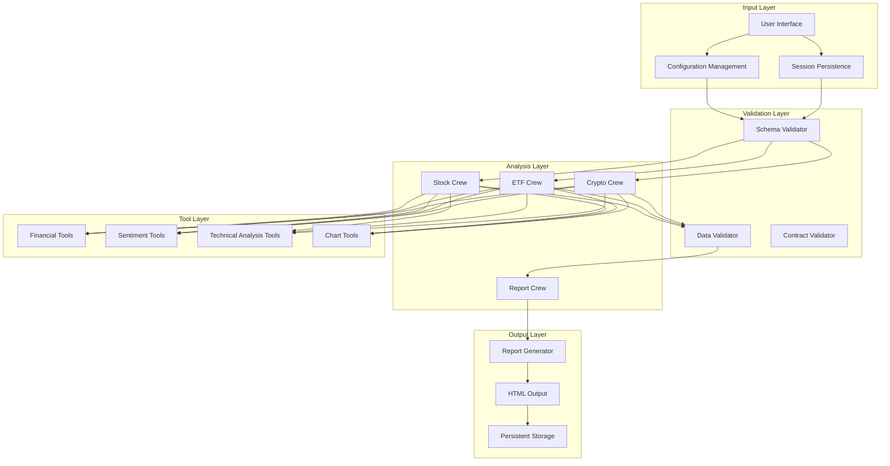

# FinWiz Enhancement Design Document

## Overview

This design document outlines comprehensive enhancements to the FinWiz financial analysis platform, focusing on strengthening data validation, expanding analytical capabilities, ensuring architectural compliance, and improving system reliability. The enhancements maintain FinWiz's core design principles of being "light as a haiku" with strict separation of concerns while addressing critical needs identified in recent change requests.

The design implements a layered approach with strict schema validation, enhanced analytical tools, improved testing coverage, and persistent session management to create a more robust and user-friendly financial analysis platform.

## Architecture

### High-Level Architecture



### Design Principles

1. **Strict Separation of Concerns**: Each crew focuses on its domain expertise
2. **Schema-First Validation**: All data exchanges use validated Pydantic models
3. **Tool-Free Reporter**: Final report crew has no external dependencies
4. **HTML-First Output**: Consistent, accessible report generation
5. **Graceful Degradation**: System continues operating with partial data
6. **Configuration-Driven**: Behavior controlled through YAML and environment variables

## Components and Interfaces

### 1. Schema Validation System

#### Core Components
- **ValidationManager**: Central validation orchestrator
- **SchemaRegistry**: Registry of all Pydantic models
- **ContractValidator**: Validates inter-crew data contracts
- **StrictnessController**: Manages validation modes (off/warn/error)

#### Key Interfaces
```python
class ValidationManager:
    def validate_crew_output(self, data: dict, crew_type: str) -> ValidationResult
    def validate_reporter_input(self, data: ReporterInput) -> ValidationResult
    def set_strictness_mode(self, mode: ValidationMode) -> None

class ValidationResult:
    is_valid: bool
    errors: List[ValidationError]
    warnings: List[ValidationWarning]
    sanitized_data: Optional[dict]
```

#### Design Rationale
- **Pydantic v2 with `extra='forbid'`**: Prevents schema drift by rejecting unknown fields
- **Graduated strictness modes**: Allows gradual rollout without breaking existing workflows
- **Centralized validation**: Single point of control for all validation logic
- **Detailed error reporting**: Provides actionable feedback for debugging

### 2. Enhanced Financial Analysis Tools

#### Multi-Source Sentiment Analysis
```python
class SentimentAnalyzer:
    def analyze_multi_source(self, ticker: str) -> SentimentResult
    def extract_trending_topics(self, articles: List[Article]) -> List[TrendingTopic]
    def calculate_weighted_sentiment(self, sources: List[SentimentSource]) -> float
```

#### Advanced Technical Analysis
```python
class TechnicalAnalyzer:
    def calculate_fibonacci_levels(self, price_data: PriceData) -> FibonacciLevels
    def identify_support_resistance(self, price_data: PriceData) -> SupportResistance
    def find_indicator_confluence(self, indicators: List[Indicator]) -> ConfluenceZones
```

#### Chart Integration
```python
class ChartAnalyzer:
    def generate_visual_analysis(self, ticker: str) -> ChartAnalysis
    def extract_pattern_insights(self, chart_url: str) -> PatternInsights
```

#### Design Rationale
- **Multi-source integration**: Reduces single-point-of-failure and improves accuracy
- **Confluence detection**: Identifies high-probability trading signals
- **Visual pattern recognition**: Leverages LLM capabilities for chart analysis
- **Modular tool design**: Each tool can be used independently or in combination

### 3. Crew Architecture Compliance

#### Report Crew Constraints
```python
class ReportCrew:
    tools: List = []  # Enforced empty tools list
    
    def validate_no_external_calls(self) -> None:
        # Runtime validation to prevent tool usage
        
    def generate_html_report(self, context: ReporterInput) -> HTMLReport:
        # Pure data transformation, no external dependencies
```

#### Data Flow Validation
```python
class CrewOrchestrator:
    def validate_crew_contracts(self) -> ContractValidationResult
    def ensure_reporter_isolation(self) -> None
    def validate_html_output_standards(self, output: str) -> HTMLValidationResult
```

#### Design Rationale
- **Tool isolation**: Prevents architectural violations in the reporter
- **Contract validation**: Ensures consistent data flow between crews
- **HTML standardization**: Maintains consistent output quality and accessibility
- **Runtime enforcement**: Catches violations during execution, not just at build time

### 4. Testing & Quality Assurance Framework

#### Contract Testing
```python
class ContractTestSuite:
    def test_yaml_configuration_completeness(self) -> None
    def test_required_context_keys(self) -> None
    def test_schema_compatibility(self) -> None
```

#### Integration Testing
```python
class IntegrationTestSuite:
    def test_api_error_handling(self) -> None
    def test_response_parsing(self) -> None
    def test_rate_limit_handling(self) -> None
```

#### Output Validation Testing
```python
class OutputValidationSuite:
    def test_html_formatting_compliance(self) -> None
    def test_utf8_encoding_support(self) -> None
    def test_french_report_sections(self) -> None
```

#### Design Rationale
- **Layered testing approach**: Unit, integration, and contract tests serve different purposes
- **Mock-first strategy**: Prevents external dependencies in test execution
- **Performance constraints**: Tests must complete quickly for developer productivity
- **Behavioral focus**: Tests verify outcomes, not implementation details

### 5. Configuration & Environment Management

#### Configuration System
```python
class ConfigurationManager:
    REQUIRED_API_KEYS = [
        'OPENAI_API_KEY', 'SERPER_API_KEY', 'FIRECRAWL_API_KEY', 
        'ALPHA_VANTAGE_API_KEY', 'CHART_IMG_API_KEY', 'TWELVE_DATA_API_KEY'
    ]
    
    def load_environment_variables(self) -> EnvironmentConfig
    def validate_api_keys(self) -> ValidationResult
    def setup_caching_layer(self, ttl_minutes: int = 45) -> CacheConfig  # Default 45min, configurable 30-60min range
    def configure_feature_flags(self) -> FeatureFlags
```

#### Caching Layer
```python
class CacheManager:
    def cache_api_response(self, key: str, data: dict, ttl: int) -> None
    def get_cached_response(self, key: str) -> Optional[dict]
    def invalidate_cache(self, pattern: str) -> None
```

#### Design Rationale
- **Standardized environment variables**: Consistent naming across all integrations
- **Intelligent caching**: Reduces API costs and improves performance
- **Feature flag support**: Enables gradual rollout of new capabilities
- **Graceful degradation**: System continues operating when external services fail

### 6. Enhanced Crew Capabilities

#### Stock Crew Enhancements
```python
class EnhancedStockCrew:
    def extract_10k_insights(self, ticker: str) -> TenKInsights
    def analyze_sec_filings(self, ticker: str) -> SECAnalysis
    def calculate_standardized_risk(self, metrics: StockMetrics) -> RiskScore
```

#### ETF Crew Enhancements
```python
class EnhancedETFCrew:
    def parse_factsheet_data(self, etf_symbol: str) -> ETFFactsheet
    def analyze_tracking_performance(self, etf_symbol: str) -> TrackingAnalysis
    def extract_top_holdings(self, etf_symbol: str) -> List[ETFTopHolding]
```

#### Crypto Crew Enhancements
```python
class EnhancedCryptoCrew:
    def generate_investment_thesis(self, crypto_symbol: str) -> CryptoThesis
    def assess_crypto_risk(self, crypto_symbol: str) -> RiskAssessmentStandardized
    def analyze_market_dynamics(self, crypto_symbol: str) -> MarketDynamics
```

#### Design Rationale
- **Consistent analytical depth**: Each crew provides comprehensive analysis in its domain
- **Standardized risk scoring**: Enables cross-asset comparison
- **Rich data extraction**: Maximizes value from available data sources
- **Domain expertise**: Each crew focuses on asset-class-specific insights

### 7. Performance & Scalability

#### Asynchronous Execution
```python
class AsyncTaskManager:
    async def execute_parallel_tasks(self, tasks: List[Task]) -> List[TaskResult]
    def configure_task_execution(self, task: Task) -> TaskConfig
    def handle_sequential_constraints(self) -> None
```

#### Rate Limiting & Throttling
```python
class RateLimitManager:
    def throttle_api_calls(self, api_name: str) -> None
    def implement_backoff_strategy(self, failure_count: int) -> float
    def monitor_rate_limits(self) -> RateLimitStatus
```

#### Design Rationale
- **Selective async execution**: I/O-bound tasks run asynchronously, final tasks remain synchronous
- **Intelligent throttling**: Prevents API rate limit violations
- **Graceful degradation**: System continues with available data when services are unavailable
- **Performance monitoring**: Tracks and optimizes execution times

### 8. Persistent Financial Planning Session

#### Session Management
```python
class SessionManager:
    SESSION_FILE_PATH = "report/finwiz_family_financial_plan.html"
    
    def load_existing_session(self) -> Optional[FinancialPlan]
    def create_new_session(self) -> FinancialPlan
    def parse_html_report(self, html_content: str) -> FinancialPlan
    def validate_session_integrity(self, plan: FinancialPlan) -> ValidationResult
    def check_session_file_exists(self) -> bool
```

#### Data Persistence
```python
class PersistenceLayer:
    def save_financial_plan(self, plan: FinancialPlan) -> None
    def backup_session_data(self) -> None
    def recover_corrupted_session(self) -> FinancialPlan
```

#### Session Loading Logic
```python
class SessionLoader:
    def initialize_session(self) -> FinancialPlan:
        """Initialize session based on existing report file."""
        if self.session_file_exists():
            try:
                html_content = self.read_session_file()
                plan = self.parse_html_report(html_content)
                self.log_session_loaded()
                return plan
            except (FileNotFoundError, CorruptedFileError) as e:
                self.log_session_error(e)
                return self.create_default_session()
        else:
            plan = self.create_default_session()
            self.log_new_session_created()
            return plan
```

#### Design Rationale
- **HTML-based persistence**: Leverages existing report format for session storage at `report/finwiz_family_financial_plan.html`
- **Graceful recovery**: Handles corrupted or missing session files with automatic fallback to new session
- **Incremental updates**: Allows modification of existing plans without starting over
- **Data integrity**: Validates loaded sessions to ensure consistency
- **Explicit logging**: Provides clear feedback about session loading success or failure

## Data Models

### Core Schema Definitions

#### Validation Models
```python
class ValidationMode(str, Enum):
    OFF = "off"
    WARN = "warn"
    ERROR = "error"

class ReporterInput(BaseModel):
    ten_k_insights: List[TenKInsight]
    market_sentiment: MarketSentiment
    risk_score_standardized: RiskAssessmentStandardized
    
    model_config = ConfigDict(extra='forbid', str_strip_whitespace=True)
```

#### Enhanced Analysis Models
```python
class SentimentResult(BaseModel):
    weighted_score: float = Field(..., ge=-1.0, le=1.0)
    article_count: int = Field(..., ge=0)
    trending_topics: List[TrendingTopic]
    source_breakdown: Dict[str, float]

class TechnicalAnalysis(BaseModel):
    fibonacci_levels: FibonacciLevels
    support_resistance: SupportResistance
    confluence_zones: List[ConfluenceZone]
    indicator_signals: List[IndicatorSignal]
```

#### Session Models
```python
class FinancialPlan(BaseModel):
    plan_id: str
    created_at: datetime
    last_updated: datetime
    portfolio_data: Dict[str, Any]
    analysis_history: List[AnalysisRecord]
    
    model_config = ConfigDict(extra='forbid')
```

#### Code Quality Models
```python
class QualityResult(BaseModel):
    ruff_compliant: bool
    line_length_valid: bool
    mock_library_correct: bool
    external_calls_mocked: bool
    violations: List[QualityViolation]
    
    model_config = ConfigDict(extra='forbid')

class QualityViolation(BaseModel):
    file_path: str
    line_number: int
    violation_type: str
    message: str
    remediation_guidance: str
    
    model_config = ConfigDict(extra='forbid')

class NetworkCallError(Exception):
    """Raised when unmocked external network call is detected in tests."""
    pass

class MockingValidationResult(BaseModel):
    all_calls_mocked: bool
    unmocked_calls: List[str]
    mock_coverage_percentage: float
    
    model_config = ConfigDict(extra='forbid')

class PerformanceResult(BaseModel):
    execution_time: float
    within_limits: bool
    shared_state_detected: bool
    test_count: int
    
    model_config = ConfigDict(extra='forbid')
```

## Error Handling

### Validation Error Handling
```python
class ValidationErrorHandler:
    def handle_schema_violation(self, error: ValidationError) -> ErrorResponse
    def log_validation_failure(self, context: str, error: ValidationError) -> None
    def provide_remediation_guidance(self, error: ValidationError) -> str
```

### API Error Handling
```python
class APIErrorHandler:
    def handle_rate_limit_exceeded(self, api_name: str) -> RetryStrategy
    def handle_service_unavailable(self, service: str) -> FallbackStrategy
    def handle_authentication_failure(self, api_name: str) -> ErrorResponse
```

### Code Quality Error Handling
```python
class CodeQualityErrorHandler:
    def handle_ruff_violations(self, violations: List[RuffViolation]) -> RemediationPlan
    def handle_test_timeout(self, test_suite: str, execution_time: float) -> OptimizationSuggestions
    def handle_mock_library_violations(self, file_path: str) -> RefactoringGuidance
    def handle_unmocked_external_calls(self, calls: List[str]) -> MockingGuidance
    def provide_stack_trace_analysis(self, error: Exception) -> ErrorAnalysis

class MockingGuidance(BaseModel):
    unmocked_functions: List[str]
    suggested_patches: Dict[str, str]
    example_mock_setup: str
    
    model_config = ConfigDict(extra='forbid')
```

### Design Rationale
- **Graceful degradation**: System continues operating with partial functionality
- **Detailed error reporting**: Provides actionable information for troubleshooting with clear stack traces
- **Automatic recovery**: Implements retry and fallback strategies
- **User-friendly messages**: Abstracts technical details for end users
- **Code quality enforcement**: Ruff linting with 110 character limit ensures consistent, maintainable code
- **Test performance optimization**: 5-second test suite limit improves developer productivity and CI/CD efficiency

## Testing Strategy

### Test Categories

#### Unit Tests
- **Schema validation logic**: Test Pydantic model behavior with dynamic data
- **Business logic**: Test analysis algorithms and calculations using Faker-generated inputs
- **Utility functions**: Test helper and formatting functions with varied test cases
- **Error handling**: Test exception scenarios and recovery with realistic edge cases

#### Dynamic Test Data Strategy
All tests must use the Faker library for generating realistic test data instead of static identifiers:

```python
def test_should_validate_ticker_input_when_valid_symbol_provided(faker):
    # Arrange - Use Faker for dynamic test data
    test_ticker = faker.lexify(text='????', letters='ABCDEFGHIJKLMNOPQRSTUVWXYZ')
    test_user = {
        'name': faker.name(),
        'email': faker.email(),
        'portfolio_id': faker.uuid4()
    }
    
    # Act & Assert with dynamic data
    result = validate_ticker_input(test_ticker, test_user)
    assert result.is_valid
    assert result.ticker == test_ticker
```

#### pytest-mock Standardization (Required)
All external API interactions must be mocked using pytest-mock exclusively, never unittest.mock:

```python
def test_should_return_analysis_when_api_succeeds(mocker, faker):
    # Arrange - Setup mock with explicit behavior using pytest-mock
    mock_api = mocker.patch('finwiz.tools.yahoo_finance_tool.get_data')
    mock_api.return_value = {
        'symbol': faker.lexify(text='????'),
        'price': faker.pyfloat(min_value=1, max_value=1000, right_digits=2),
        'volume': faker.pyint(min_value=1000, max_value=1000000)
    }
    
    # Act
    result = analyze_stock(faker.lexify(text='????'))
    
    # Assert - Verify mock behavior and results
    assert result is not None
    mock_api.assert_called_once()
```

#### External Call Mocking Enforcement
All external API calls must be mocked to prevent real network requests during testing:

```python
class ExternalCallMonitor:
    EXTERNAL_MODULES = [
        'httpx', 'requests', 'urllib', 'socket',
        'finwiz.tools.yahoo_finance_tool',
        'finwiz.tools.alpha_vantage_tool',
        'finwiz.tools.twelve_data_tool',
        'finwiz.tools.chart_img_tool'
    ]
    
    def setup_network_isolation(self) -> None:
        """Prevent any real network calls during test execution."""
        for module in self.EXTERNAL_MODULES:
            pytest.MonkeyPatch().setattr(module, 'get', self.mock_network_call)
            pytest.MonkeyPatch().setattr(module, 'post', self.mock_network_call)
    
    def mock_network_call(self, *args, **kwargs):
        """Raise error if unmocked network call is attempted."""
        raise NetworkCallError("Unmocked external call detected in test")
    
    def validate_all_calls_mocked(self, test_function) -> ValidationResult:
        """Ensure all external calls in test are properly mocked."""
        pass

class TestMockingEnforcement:
    def setup_method(self):
        """Setup network isolation for each test."""
        self.call_monitor = ExternalCallMonitor()
        self.call_monitor.setup_network_isolation()
    
    def test_should_mock_all_yahoo_finance_calls(self, mocker, faker):
        """Example of properly mocked external API call."""
        # Mock the specific function that makes external calls
        mock_yahoo = mocker.patch('finwiz.tools.yahoo_finance_tool.get_stock_data')
        mock_yahoo.return_value = {
            'symbol': faker.lexify(text='????'),
            'price': faker.pyfloat(min_value=1, max_value=1000)
        }
        
        # Test will fail if any unmocked external call is made
        result = analyze_stock(faker.lexify(text='????'))
        assert result is not None
        mock_yahoo.assert_called_once()
```

#### Code Quality Standards Integration
All tests must adhere to strict quality standards:

```python
class TestCodeQualityCompliance:
    def test_should_complete_within_time_limit(self, mocker, faker):
        """Tests must complete in under 5 seconds per suite."""
        start_time = time.time()
        
        # Test implementation with dynamic data and mocked external calls
        ticker = faker.lexify(text='????')
        mock_api = mocker.patch('finwiz.tools.yahoo_finance_tool.get_data')
        mock_api.return_value = {'symbol': ticker, 'price': faker.pyfloat()}
        
        result = analyze_stock(ticker)
        
        execution_time = time.time() - start_time
        assert execution_time < 5.0
        assert result is not None
        mock_api.assert_called_once()  # Verify mock was used
    
    def test_should_have_no_shared_state_dependencies(self, mocker, faker):
        """Tests must be independent with no shared state."""
        # Each test generates its own data and mocks
        unique_ticker = faker.lexify(text='????')
        mock_api = mocker.patch('finwiz.tools.yahoo_finance_tool.get_data')
        mock_api.return_value = {'symbol': unique_ticker}
        
        # Test passes regardless of execution order
        result = analyze_stock(unique_ticker)
        assert result.symbol == unique_ticker
        mock_api.assert_called_once()  # Verify no real external calls
```


#### Contract Tests
- **YAML configuration**: Validate all required keys are present
- **Schema compatibility**: Test backward compatibility of models
- **Inter-crew contracts**: Validate data exchange formats
- **Output format compliance**: Test HTML output standards

### Code Quality & Test Infrastructure

#### Code Quality Standards
```python
class CodeQualityManager:
    REQUIRED_STANDARDS = {
        'line_limit': 110,
        'test_timeout': 5.0,  # seconds per test suite
        'mock_library': 'pytest-mock',  # Never unittest.mock
        'linter': 'ruff'
    }
    
    def validate_code_quality(self, file_path: str) -> QualityResult:
        """Validate code meets quality standards."""
        return QualityResult(
            ruff_compliant=self.check_ruff_compliance(file_path),
            line_length_valid=self.check_line_length(file_path),
            mock_library_correct=self.check_mock_usage(file_path)
        )
    
    def provide_remediation_guidance(self, violations: List[QualityViolation]) -> str:
        """Provide actionable guidance for fixing quality issues."""
        pass
```

#### Test Performance Requirements
```python
class TestPerformanceMonitor:
    MAX_TEST_SUITE_TIME = 5.0  # seconds
    
    def monitor_test_execution(self, test_suite: str) -> PerformanceResult:
        """Monitor test execution time and shared state dependencies."""
        start_time = time.time()
        
        # Execute test suite
        result = pytest.main([test_suite])
        
        execution_time = time.time() - start_time
        
        return PerformanceResult(
            execution_time=execution_time,
            within_limits=execution_time < self.MAX_TEST_SUITE_TIME,
            shared_state_detected=self.detect_shared_state()
        )
```

#### Design Rationale for Code Quality
- **Ruff Enforcement**: Ensures consistent code style and catches potential issues early
- **Performance Constraints**: Fast test execution improves developer productivity and CI/CD pipeline efficiency
- **pytest-mock Standardization**: Eliminates confusion between mocking libraries and ensures consistent behavior
- **External Call Isolation**: Network isolation during tests prevents accidental real API calls and ensures test reliability
- **Mock Coverage Validation**: Automated detection of unmocked external calls with specific remediation guidance
- **Clear Error Messages**: Detailed stack traces and remediation guidance reduce debugging time
- **Shared State Prevention**: Independent tests improve reliability and parallel execution capability

### Test Infrastructure

#### Dynamic Test Data Generation
```python
class TestDataFactory:
    def __init__(self):
        self.faker = Faker()
    
    def generate_ticker_symbol(self) -> str:
        """Generate realistic ticker symbols for testing."""
        return self.faker.lexify(text='????', letters='ABCDEFGHIJKLMNOPQRSTUVWXYZ')
    
    def generate_financial_data(self) -> Dict[str, Any]:
        """Generate realistic financial metrics for testing."""
        return {
            'price': self.faker.pyfloat(min_value=1, max_value=1000, right_digits=2),
            'volume': self.faker.pyint(min_value=1000, max_value=10000000),
            'market_cap': self.faker.pyint(min_value=1000000, max_value=1000000000000)
        }
    
    def generate_user_profile(self) -> Dict[str, str]:
        """Generate realistic user data for testing."""
        return {
            'name': self.faker.name(),
            'email': self.faker.email(),
            'phone': self.faker.phone_number()
        }
```

#### Mock Strategy with pytest-mock
```python
class APITestMocks:
    @staticmethod
    def setup_yahoo_finance_mock(mocker) -> Mock:
        """Setup comprehensive Yahoo Finance API mock."""
        mock_api = mocker.patch('finwiz.tools.yahoo_finance_tool.get_stock_data')
        mock_api.return_value = {
            'symbol': 'TEST',
            'price': 150.25,
            'pe_ratio': 18.5,
            'market_cap': 2500000000
        }
        return mock_api
    
    @staticmethod
    def setup_alpha_vantage_mock(mocker) -> Mock:
        """Setup Alpha Vantage API mock with realistic responses."""
        mock_api = mocker.patch('finwiz.tools.alpha_vantage_tool.get_news')
        mock_api.return_value = {
            'feed': [
                {
                    'title': 'Market Update',
                    'summary': 'Positive earnings report',
                    'sentiment_score': 0.75
                }
            ]
        }
        return mock_api
```

#### Test Fixtures
```python
class TestFixtures:
    def mock_api_responses(self) -> Dict[str, Any]
    def create_sample_data(self) -> TestDataSet
    def setup_test_environment(self) -> TestEnvironment
```

#### Design Rationale for Dynamic Testing
- **Faker Integration**: Generates realistic, varied test data to improve test coverage and catch edge cases
- **pytest-mock Standardization**: Consistent mocking approach across all tests with explicit behavior specification, completely replacing unittest.mock
- **Realistic Data Patterns**: Test data mirrors real-world scenarios without hardcoded values
- **Maintainable Tests**: Dynamic data reduces test brittleness and improves long-term maintainability
- **Code Quality Enforcement**: Tests must complete within 5 seconds and have no shared state dependencies
- **Ruff Compliance**: All code must pass ruff linting with 110 character line limit enforcement

## Deployment Considerations

### Environment Configuration
- **Development**: Full validation with detailed logging
- **Staging**: Production-like validation with performance monitoring  
- **Production**: Optimized validation with minimal logging overhead

### Feature Rollout Strategy
- **Phase 1**: Schema validation with warn mode
- **Phase 2**: Enhanced tools with feature flags
- **Phase 3**: Full validation enforcement
- **Phase 4**: Performance optimizations and monitoring

### Monitoring & Observability
- **Validation metrics**: Track validation success/failure rates
- **Performance metrics**: Monitor execution times and resource usage
- **Error tracking**: Aggregate and analyze error patterns
- **API usage**: Monitor external service consumption and costs

This design provides a comprehensive foundation for implementing the FinWiz enhancements while maintaining the system's core architectural principles and ensuring robust, scalable operation.