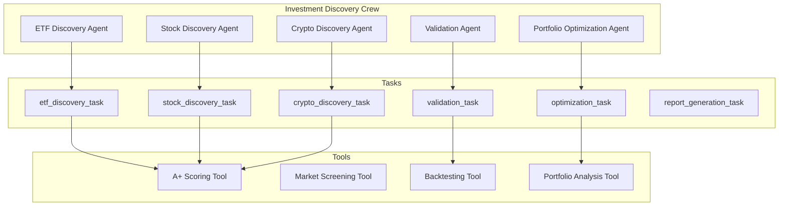

# Design - Agents de Recherche d'Investissements A+

## Overview

Ce document décrit l'architecture et la conception des agents IA spécialisés dans la découverte proactive d'investissements de grade A+. Le système transforme FinWiz d'un évaluateur passif en un découvreur actif d'opportunités d'investissement exceptionnelles.

## Architecture

### Vue d'ensemble du système CrewAI



### Flux de données

1. **Discovery Phase** : Les agents scannent leurs marchés respectifs
2. **Scoring Phase** : Application des critères A+ dynamiques
3. **Validation Phase** : Backtesting et analyse de risque
4. **Integration Phase** : Optimisation du portefeuille et génération de rapports

## Components and Interfaces

### 1. CrewAI Agents

#### ETF Discovery Agent
```yaml
# config/agents.yaml
etf_discovery_agent:
  role: "Expert ETF Analyst and Opportunity Scout"
  goal: "Discover and analyze ETFs with A+ potential (score ≥ 0.95) across global markets"
  backstory: >
    You are a seasoned ETF specialist with 15+ years of experience in passive investing.
    Your expertise lies in identifying exceptional ETFs that combine low costs, strong tracking,
    and superior risk-adjusted returns. You have a keen eye for spotting hidden gems in the
    ETF universe that most investors overlook.
  tools:
    - market_screening_tool
    - a_plus_scoring_tool
    - etf_analysis_tool
  verbose: true
```

#### Stock Discovery Agent  
```yaml
# config/agents.yaml
stock_discovery_agent:
  role: "Elite Stock Picker and Fundamental Analyst"
  goal: "Identify individual stocks with A+ characteristics through rigorous fundamental analysis"
  backstory: >
    You are a world-class equity analyst with a track record of identifying multi-bagger stocks
    before they become mainstream. Your methodology combines quantitative screening with deep
    qualitative analysis to find companies with exceptional competitive moats and growth prospects.
  tools:
    - fundamental_analysis_tool
    - a_plus_scoring_tool
    - stock_screening_tool
  verbose: true
```

#### Crypto Discovery Agent
```yaml
# config/agents.yaml  
crypto_discovery_agent:
  role: "Crypto Research Specialist and DeFi Expert"
  goal: "Discover A+ grade cryptocurrencies with strong fundamentals and institutional adoption"
  backstory: >
    You are a blockchain technology expert and crypto analyst with deep knowledge of DeFi,
    tokenomics, and institutional crypto adoption. You excel at separating legitimate projects
    with real utility from speculative tokens, focusing on long-term value creation.
  tools:
    - crypto_analysis_tool
    - a_plus_scoring_tool
    - defi_metrics_tool
  verbose: true

portfolio_optimization_agent:
  role: "Portfolio Optimization Strategist"
  goal: "Integrate A+ discoveries into existing portfolios for maximum improvement"
  backstory: >
    You are a quantitative portfolio manager with expertise in modern portfolio theory
    and risk management. Your specialty is seamlessly integrating new high-quality
    investments while maintaining optimal risk-return profiles.
  tools:
    - portfolio_analysis_tool
    - optimization_tool
    - risk_assessment_tool
  verbose: true

validation_agent:
  role: "Investment Validation and Risk Analyst"
  goal: "Validate A+ candidates through rigorous backtesting and risk analysis"
  backstory: >
    You are a risk management expert and quantitative analyst who ensures that all
    investment recommendations meet the highest standards of due diligence. Your
    rigorous validation process prevents costly mistakes.
  tools:
    - backtesting_tool
    - risk_analysis_tool
    - correlation_tool
  verbose: true
```

### 2. CrewAI Tasks

#### Discovery Tasks
```yaml
# config/tasks.yaml
etf_discovery_task:
  description: >
    Scan global ETF markets to identify A+ grade opportunities with exceptional
    characteristics. Focus on low-cost, well-diversified ETFs with strong tracking
    records and UCITS compatibility for European investors.
    
    Analysis Requirements:
    - Screen ETFs with expense ratios ≤ 0.15% (broad market) or ≤ 0.25% (specialized)
    - Minimum AUM of $1B for liquidity
    - Tracking error ≤ 0.20% over 3 years
    - Minimum 3-year operating history
    - UCITS compliance verification for Swiss investors
    
  expected_output: >
    A ranked list of top 10 A+ grade ETF candidates with detailed analysis including:
    - Composite scores and letter grades
    - Cost analysis and tracking performance
    - Liquidity metrics and trading considerations
    - Comparison with existing portfolio ETFs
    - Specific replacement recommendations where applicable
    
  agent: etf_discovery_agent
  output_file: "output/discovery/a_plus_etfs.md"
  output_pydantic: APlusDiscoveryResult
  async_execution: true

stock_discovery_task:
  description: >
    Identify individual stocks with A+ potential through comprehensive fundamental
    analysis. Focus on companies with exceptional competitive moats, strong financials,
    and sustainable growth prospects.
    
    Screening Criteria:
    - ROE ≥ 20% sustained over 3 years
    - Revenue growth ≥ 15% annually over 5 years  
    - Debt-to-equity ratio ≤ 0.3
    - Positive and growing free cash flow
    - Market cap ≥ $1B for liquidity
    - Dominant market position in growing sectors
    
  expected_output: >
    A curated list of top 15 A+ grade stock candidates with comprehensive analysis:
    - Fundamental analysis summary with key metrics
    - Competitive positioning and moat analysis
    - Growth prospects and risk factors
    - Valuation assessment and entry points
    - Portfolio fit analysis and allocation suggestions
    
  agent: stock_discovery_agent
  output_file: "output/discovery/a_plus_stocks.md"
  output_pydantic: APlusDiscoveryResult
  async_execution: true
  depends_on:
    - etf_discovery_task
```

#### MarketContextAnalyzer
```python
class MarketContextAnalyzer:
    def get_current_market_regime(self) -> MarketRegime:
        """Identifie le régime de marché actuel"""
        
    def get_macro_indicators(self) -> MacroIndicators:
        """Collecte les indicateurs macroéconomiques clés"""
        
    def assess_market_stress(self) -> StressLevel:
        """Évalue le niveau de stress du marché"""
```

### 3. CrewAI Tools

#### A+ Scoring Tool
```python
class APlusScoringTool(BaseTool):
    name: str = "A+ Investment Scoring Tool"
    description: str = """
    Calculates comprehensive A+ scores for investment candidates using dynamic
    criteria that adapt to market conditions. Integrates with the existing
    FinWiz grading system (A+ to F).
    """
    
    def _run(self, 
             symbol: str, 
             asset_type: str,
             fundamental_data: dict,
             market_context: dict) -> dict:
        """Calculate A+ score with detailed breakdown"""
        
class MarketScreeningTool(BaseTool):
    name: str = "Market Screening Tool"
    description: str = """
    Screens large universes of investments using quantitative filters
    to identify A+ candidates efficiently. Supports ETFs, stocks, and crypto.
    """
    
    def _run(self,
             asset_type: str,
             screening_criteria: dict,
             market_region: str = "global") -> dict:
        """Screen market for A+ candidates"""

class BacktestingTool(BaseTool):
    name: str = "Investment Backtesting Tool"
    description: str = """
    Validates A+ candidates through rigorous historical backtesting
    across multiple market regimes and time periods.
    """
    
    def _run(self,
             symbol: str,
             backtest_period_years: int = 5,
             benchmark: str = "SPY") -> dict:
        """Backtest investment performance and risk metrics"""
```

### 4. Integration Components

#### PortfolioOptimizer
```python
class PortfolioOptimizer:
    def __init__(self, current_portfolio: Portfolio):
        self.portfolio = current_portfolio
    
    def suggest_improvements(self, 
                             a_plus_candidates: List[InvestmentCandidate]) -> List[Improvement]:
        """Suggère des améliorations basées sur les découvertes A+"""
        
    def calculate_impact(self, improvement: Improvement) -> ImpactAnalysis:
        """Calcule l'impact d'une amélioration sur le portefeuille"""
        
    def optimize_allocation(self, 
                            new_investments: List[Investment]) -> OptimizedPortfolio:
        """Optimise l'allocation avec les nouveaux investissements A+"""
```

## Data Models

### Core Models

```python
@dataclass
class InvestmentCandidate:
    symbol: str
    name: str
    asset_type: AssetType
    current_price: float
    market_cap: float
    preliminary_score: float
    discovery_date: datetime
    
@dataclass
class APlusAnalysis:
    candidate: InvestmentCandidate
    fundamental_score: float
    technical_score: float
    quality_score: float
    risk_score: float
    final_grade: Grade
    confidence_level: float
    rationale: List[str]
    
@dataclass
class PortfolioImprovement:
    current_holding: Optional[Holding]
    recommended_replacement: InvestmentCandidate
    expected_grade_improvement: float
    risk_impact: RiskImpact
    cost_analysis: CostAnalysis
    implementation_priority: Priority
```

### Screening Criteria Models

```python
@dataclass
class ETFScreeningCriteria:
    max_expense_ratio: float = 0.15
    min_aum: float = 1e9
    max_tracking_error: float = 0.002
    min_history_years: int = 3
    required_regions: List[str] = field(default_factory=list)
    
@dataclass
class StockScreeningCriteria:
    min_roe: float = 0.20
    min_revenue_growth: float = 0.15
    max_debt_to_equity: float = 0.3
    min_market_cap: float = 1e9
    required_free_cash_flow: bool = True
    
@dataclass
class CryptoScreeningCriteria:
    min_market_cap: float = 10e9
    min_daily_volume: float = 500e6
    min_age_months: int = 36
    required_institutional_adoption: bool = True
```

## Error Handling

### Discovery Errors
- **Data Source Unavailable** : Fallback vers sources alternatives
- **API Rate Limits** : Implémentation de backoff exponentiel
- **Invalid Data** : Validation et nettoyage automatique

### Scoring Errors
- **Missing Fundamentals** : Score partiel avec flag de confiance réduite
- **Calculation Errors** : Logging détaillé et valeurs par défaut sécurisées

### Integration Errors
- **Portfolio Conflicts** : Résolution automatique avec préférences utilisateur
- **Optimization Failures** : Fallback vers recommandations simples

## Testing Strategy

### Unit Tests
- Tests de chaque agent de découverte avec données mockées
- Validation des critères de scoring dans différents contextes
- Tests de régression pour les changements de critères

### Integration Tests
- Tests end-to-end du pipeline de découverte
- Validation de l'intégration avec le système de grading existant
- Tests de performance avec de gros volumes de données

### Backtesting Validation
- Validation historique des critères A+ sur 10 ans
- Tests de robustesse dans différents régimes de marché
- Comparaison avec des benchmarks de référence

## Performance Considerations

### Optimizations
- **Caching** : Mise en cache des résultats de screening pour 24h
- **Parallel Processing** : Analyse parallèle des candidats
- **Incremental Updates** : Mise à jour incrémentale des scores

### Scalability
- **Database Indexing** : Index optimisés pour les requêtes de screening
- **API Throttling** : Gestion intelligente des limites d'API
- **Memory Management** : Traitement par batch pour les gros datasets

### Monitoring
- **Performance Metrics** : Temps de découverte, précision des scores
- **Quality Metrics** : Taux de maintien du grade A+ sur 6 mois
- **User Adoption** : Taux d'acceptation des recommandations

## Security Considerations

### Data Protection
- Chiffrement des données de marché sensibles
- Anonymisation des patterns de trading utilisateur

### API Security
- Authentification sécurisée pour les sources de données
- Rate limiting pour éviter les abus

### Audit Trail
- Logging complet des décisions de scoring
- Traçabilité des recommandations d'investissement