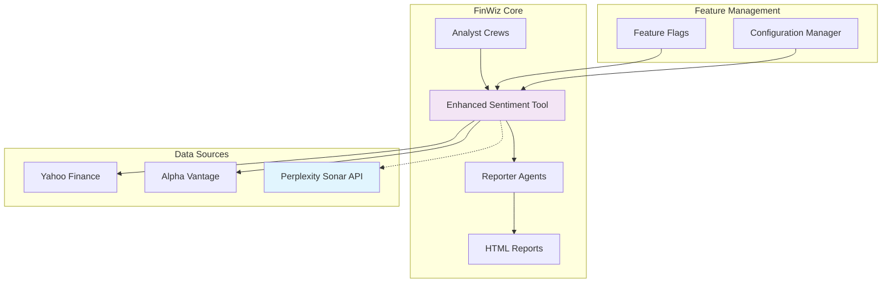

# Design Document

## Overview

The Perplexity Sonar Integration adds supplementary research capabilities to FinWiz analyst crews by integrating Perplexity's Sonar Search API as an optional data source. A basic `PerplexitySearchTool` has already been implemented in `src/finwiz/tools/perplexity_search_tool.py` with comprehensive unit tests. This design focuses on completing the integration by adding feature flag support, integrating with the enhanced sentiment tool, and implementing full observability.

The integration follows FinWiz's feature flag pattern for gradual rollout and graceful degradation, ensuring operational stability while providing measurable quality improvements to analyst outputs.

## Architecture

### High-Level Architecture



### Integration Points

1. **Existing Tool**: `src/finwiz/tools/perplexity_search_tool.py` (already implemented)
2. **Primary Integration**: `src/finwiz/tools/enhanced_sentiment_tool.py` (needs integration)
3. **Feature Flag**: `PERPLEXITY_RESEARCH` in `src/finwiz/utils/feature_flags.py` (needs implementation)
4. **Configuration**: `PPLX_API_KEY` environment variable (already supported)
5. **API Client**: Direct HTTP requests to Perplexity API (already implemented)

## Components and Interfaces

### Existing Perplexity Tool

The `PerplexitySearchTool` is already implemented with the following capabilities:

```python
class PerplexitySearchTool(BaseTool):
    """Tool that performs a grounded web search using Perplexity Sonar."""
    
    # Already implemented features:
    # - Direct HTTP API integration
    # - Rate limiting with @api_tool decorator
    # - Configurable model selection (sonar-small-chat, etc.)
    # - Search filters (recency, domain filtering)
    # - Error handling for missing API keys
    # - Comprehensive unit tests
```

### Enhanced Integration Wrapper

A new wrapper class will integrate the existing tool with enhanced sentiment analysis:

```python
class PerplexitySentimentIntegration:
    """Integration wrapper for Perplexity tool with sentiment analysis."""
    
    def __init__(self):
        self.perplexity_tool = PerplexitySearchTool()
        self.feature_flags = get_feature_flags()
        
    async def search_financial_news(
        self, 
        query: str, 
        ticker: str,
        asset_type: str,
        max_results: int = 10
    ) -> SonarSearchResult:
        """Search for financial news using existing Perplexity tool."""
        
    def parse_perplexity_response(self, raw_response: str) -> List[SonarArticle]:
        """Parse JSON response from PerplexitySearchTool into structured data."""
```

### Data Models

```python
class SonarSearchResult(BaseModel):
    """Structured result from Perplexity Sonar search."""
    
    query: str = Field(..., description="Original search query")
    results: List[SonarArticle] = Field(default_factory=list)
    total_results: int = Field(0, description="Total number of results found")
    search_time_ms: int = Field(0, description="Search execution time")
    source: str = Field("perplexity_sonar", description="Data source identifier")

class SonarArticle(BaseModel):
    """Individual article from Sonar search."""
    
    title: str = Field(..., description="Article title")
    url: str = Field(..., description="Article URL")
    summary: str = Field("", description="Article summary/snippet")
    publisher: str = Field("", description="Publisher name")
    published_date: Optional[str] = Field(None, description="Publication date")
    relevance_score: float = Field(0.0, ge=0.0, le=1.0, description="Relevance to query")
    content_type: str = Field("news", description="Type of content (news, filing, analysis)")

class EnhancedSentimentResult(BaseModel):
    """Enhanced sentiment analysis result with Sonar integration."""
    
    # Existing fields from current implementation
    overall_sentiment: str
    sentiment_score: float
    sentiment_distribution: Dict[str, int]
    confidence: float
    
    # New Sonar-enhanced fields
    sonar_articles: List[SonarArticle] = Field(default_factory=list)
    data_sources: List[str] = Field(default_factory=list)
    freshness_score: float = Field(0.0, description="Freshness of combined data")
    coverage_breadth: int = Field(0, description="Number of unique sources")
```

### Enhanced Sentiment Tool Integration

The integration extends the existing `EnhancedSentimentAnalysisTool` with optional Sonar capabilities:

```python
class EnhancedSentimentAnalysisTool(BaseTool):
    def __init__(self):
        super().__init__()
        self.feature_flags = get_feature_flags()
        self.sonar_client = None
        self._initialize_sonar_client()
    
    def _initialize_sonar_client(self):
        """Initialize Sonar client if feature is enabled."""
        if self.feature_flags.is_enabled("perplexity_research"):
            api_key = os.getenv("PPLX_API_KEY")
            if api_key:
                self.sonar_client = PerplexitySonarClient(api_key)
            else:
                logger.warning("PPLX_API_KEY not found, Sonar integration disabled")
    
    async def _get_enhanced_news_data(self, ticker: str, asset_type: str, max_articles: int) -> Dict:
        """Get news data from multiple sources including Sonar."""
        # Get existing Yahoo Finance data
        yahoo_data = self._get_news_data(ticker, max_articles)
        
        # Optionally enhance with Sonar data
        sonar_data = []
        if self.sonar_client and self.feature_flags.is_enabled("perplexity_research"):
            try:
                sonar_result = await self.sonar_client.search_financial_news(
                    query=f"{ticker} financial news analysis",
                    ticker=ticker,
                    asset_type=asset_type,
                    max_results=max_articles // 2
                )
                sonar_data = sonar_result.results
                self.feature_flags.record_success("perplexity_research")
            except Exception as e:
                logger.warning(f"Sonar search failed for {ticker}: {e}")
                self.feature_flags.record_failure("perplexity_research")
        
        return {
            "yahoo_articles": yahoo_data,
            "sonar_articles": sonar_data,
            "combined_count": len(yahoo_data) + len(sonar_data)
        }
```

## Data Models

### Request/Response Schemas

All data models follow FinWiz's strict Pydantic v2 validation patterns:

```python
class PerplexitySearchRequest(BaseModel):
    """Request schema for Perplexity search operations."""
    
    model_config = ConfigDict(str_strip_whitespace=True, str_upper=False)
    
    query: str = Field(..., min_length=1, max_length=500, description="Search query")
    ticker: str = Field(..., pattern=r'^[A-Z0-9.-]{1,10}$', description="Asset ticker symbol")
    asset_type: str = Field(..., pattern=r'^(stock|etf|crypto)$', description="Asset type")
    max_results: int = Field(10, ge=1, le=50, description="Maximum results to return")
    search_filters: Optional[Dict[str, str]] = Field(None, description="Additional search filters")

class PerplexitySearchResponse(BaseModel):
    """Response schema for Perplexity search operations."""
    
    success: bool = Field(..., description="Whether search was successful")
    results: List[SonarArticle] = Field(default_factory=list)
    metadata: Dict[str, Any] = Field(default_factory=dict)
    error_message: Optional[str] = Field(None, description="Error message if search failed")
    rate_limit_info: Optional[Dict[str, int]] = Field(None, description="Rate limit status")
```

### Configuration Schema

```python
class PerplexityConfig(BaseModel):
    """Configuration for Perplexity Sonar integration."""
    
    api_key: str = Field(..., description="Perplexity API key")
    timeout_seconds: float = Field(30.0, ge=1.0, le=120.0, description="Request timeout")
    max_retries: int = Field(3, ge=0, le=10, description="Maximum retry attempts")
    backoff_factor: float = Field(2.0, ge=1.0, le=10.0, description="Exponential backoff factor")
    rate_limit_buffer: int = Field(5, ge=1, le=60, description="Rate limit buffer in seconds")
    
    # Search configuration
    default_max_results: int = Field(10, ge=1, le=50)
    financial_news_filters: Dict[str, str] = Field(
        default_factory=lambda: {
            "site": "bloomberg.com,reuters.com,wsj.com,ft.com,cnbc.com",
            "date": "past_week"
        }
    )
    sec_filing_filters: Dict[str, str] = Field(
        default_factory=lambda: {
            "site": "sec.gov",
            "filetype": "pdf,html"
        }
    )
```

## Error Handling

### Error Classification and Recovery

```python
class PerplexityError(Exception):
    """Base exception for Perplexity integration errors."""
    pass

class PerplexityRateLimitError(PerplexityError):
    """Raised when rate limits are exceeded."""
    
    def __init__(self, retry_after: int = None):
        self.retry_after = retry_after
        super().__init__(f"Rate limit exceeded, retry after {retry_after} seconds")

class PerplexityAPIError(PerplexityError):
    """Raised when API returns an error response."""
    
    def __init__(self, status_code: int, message: str):
        self.status_code = status_code
        super().__init__(f"API error {status_code}: {message}")

class PerplexityTimeoutError(PerplexityError):
    """Raised when requests timeout."""
    pass
```

### Retry and Backoff Strategy

```python
async def _execute_with_retry(self, operation: Callable, *args, **kwargs) -> Any:
    """Execute operation with exponential backoff retry."""
    
    for attempt in range(self.config.max_retries + 1):
        try:
            return await operation(*args, **kwargs)
            
        except PerplexityRateLimitError as e:
            if attempt == self.config.max_retries:
                raise
            
            wait_time = e.retry_after or (self.config.backoff_factor ** attempt)
            logger.warning(f"Rate limited, waiting {wait_time}s before retry {attempt + 1}")
            await asyncio.sleep(wait_time)
            
        except PerplexityTimeoutError:
            if attempt == self.config.max_retries:
                logger.error("Max retries exceeded for Perplexity request")
                raise
            
            wait_time = self.config.backoff_factor ** attempt
            logger.warning(f"Timeout, retrying in {wait_time}s (attempt {attempt + 1})")
            await asyncio.sleep(wait_time)
            
        except Exception as e:
            logger.error(f"Unexpected error in Perplexity request: {e}")
            raise
```

### Graceful Degradation

The integration implements multiple fallback strategies:

1. **API Failure**: Continue with existing Yahoo Finance data only
2. **Rate Limiting**: Use cached results if available, otherwise skip Sonar enhancement
3. **Timeout**: Log warning and proceed with available data
4. **Configuration Error**: Disable Sonar integration and log configuration issue

## Testing Strategy

### Unit Testing Approach

```python
class TestPerplexitySonarIntegration:
    """Test suite for Perplexity Sonar integration."""
    
    @pytest.fixture
    def mock_sonar_client(self, mocker):
        """Mock Perplexity client for testing."""
        client = mocker.Mock(spec=PerplexitySonarClient)
        return client
    
    @pytest.fixture
    def sample_sonar_response(self):
        """Sample Sonar API response for testing."""
        return SonarSearchResult(
            query="AAPL financial news",
            results=[
                SonarArticle(
                    title="Apple Reports Strong Q4 Earnings",
                    url="https://example.com/apple-earnings",
                    summary="Apple exceeded expectations...",
                    publisher="Reuters",
                    published_date="2024-01-15",
                    relevance_score=0.95
                )
            ],
            total_results=1,
            search_time_ms=250
        )
    
    async def test_should_enhance_sentiment_when_sonar_enabled(
        self, mock_sonar_client, sample_sonar_response, mocker
    ):
        """Test sentiment enhancement with Sonar data."""
        # Arrange
        mocker.patch('finwiz.utils.feature_flags.is_feature_enabled', return_value=True)
        mock_sonar_client.search_financial_news.return_value = sample_sonar_response
        
        tool = EnhancedSentimentAnalysisTool()
        tool.sonar_client = mock_sonar_client
        
        # Act
        result = await tool._get_enhanced_news_data("AAPL", "stock", 20)
        
        # Assert
        assert len(result["sonar_articles"]) == 1
        assert result["sonar_articles"][0].title == "Apple Reports Strong Q4 Earnings"
        mock_sonar_client.search_financial_news.assert_called_once()
    
    async def test_should_fallback_gracefully_when_sonar_fails(
        self, mock_sonar_client, mocker
    ):
        """Test graceful fallback when Sonar API fails."""
        # Arrange
        mocker.patch('finwiz.utils.feature_flags.is_feature_enabled', return_value=True)
        mock_sonar_client.search_financial_news.side_effect = PerplexityAPIError(500, "Server Error")
        
        tool = EnhancedSentimentAnalysisTool()
        tool.sonar_client = mock_sonar_client
        
        # Act
        result = await tool._get_enhanced_news_data("AAPL", "stock", 20)
        
        # Assert
        assert result["sonar_articles"] == []
        assert len(result["yahoo_articles"]) > 0  # Yahoo data still available
    
    def test_should_disable_sonar_when_feature_flag_off(self, mocker):
        """Test that Sonar is disabled when feature flag is off."""
        # Arrange
        mocker.patch('finwiz.utils.feature_flags.is_feature_enabled', return_value=False)
        
        # Act
        tool = EnhancedSentimentAnalysisTool()
        
        # Assert
        assert tool.sonar_client is None
```

### Integration Testing

```python
class TestPerplexityIntegration:
    """Integration tests for Perplexity Sonar API."""
    
    @pytest.mark.integration
    async def test_real_sonar_api_call(self):
        """Test actual Sonar API call (requires API key)."""
        api_key = os.getenv("PPLX_API_KEY")
        if not api_key:
            pytest.skip("PPLX_API_KEY not available for integration test")
        
        client = PerplexitySonarClient(api_key)
        result = await client.search_financial_news("AAPL earnings", "AAPL", "stock")
        
        assert isinstance(result, SonarSearchResult)
        assert len(result.results) > 0
        assert all(isinstance(article, SonarArticle) for article in result.results)
    
    @pytest.mark.integration
    def test_feature_flag_integration(self):
        """Test feature flag integration with environment variables."""
        with patch.dict(os.environ, {"FF_PERPLEXITY_RESEARCH": "true"}):
            flags = FeatureFlags()
            assert flags.is_enabled("perplexity_research")
        
        with patch.dict(os.environ, {"FF_PERPLEXITY_RESEARCH": "false"}):
            flags = FeatureFlags()
            assert not flags.is_enabled("perplexity_research")
```

### Performance Testing

```python
class TestPerplexityPerformance:
    """Performance tests for Perplexity integration."""
    
    @pytest.mark.performance
    async def test_response_time_within_limits(self, mock_sonar_client):
        """Test that Sonar requests complete within acceptable time limits."""
        # Simulate realistic API response time
        async def delayed_response(*args, **kwargs):
            await asyncio.sleep(1.5)  # 1.5 second delay
            return SonarSearchResult(query="test", results=[])
        
        mock_sonar_client.search_financial_news = delayed_response
        
        start_time = time.time()
        result = await mock_sonar_client.search_financial_news("test", "AAPL", "stock")
        end_time = time.time()
        
        # Should complete within 2x baseline (assuming 1s baseline)
        assert (end_time - start_time) < 2.0
        assert isinstance(result, SonarSearchResult)
```

## Implementation Plan

### Phase 1: Core Infrastructure (Week 1)

1. **Feature Flag Setup**
   - Add `perplexity_research` flag to `feature_flags.py`
   - Update documentation in `docs/feature_flags_guide.md`
   - Add environment variable configuration

2. **Perplexity Client Implementation**
   - Create `PerplexitySonarClient` class
   - Implement async search methods
   - Add error handling and retry logic

3. **Data Models**
   - Define Pydantic schemas for requests/responses
   - Add validation and serialization logic
   - Create configuration models

### Phase 2: Tool Integration (Week 2)

1. **Enhanced Sentiment Tool Modification**
   - Integrate Sonar client into existing tool
   - Implement data combination logic
   - Add feature flag conditional execution

2. **Error Handling and Logging**
   - Implement comprehensive error handling
   - Add structured logging for observability
   - Create fallback mechanisms

3. **Configuration Management**
   - Add environment variable handling
   - Implement configuration validation
   - Create setup documentation

### Phase 3: Testing and Validation (Week 3)

1. **Unit Test Implementation**
   - Create comprehensive test suite
   - Mock external API calls
   - Test error scenarios and edge cases

2. **Integration Testing**
   - Test with real API (limited scope)
   - Validate feature flag behavior
   - Performance benchmarking

3. **Manual Validation**
   - Run analyst crews with flag enabled/disabled
   - Compare output quality and freshness
   - Document findings and metrics

### Phase 4: Documentation and Deployment (Week 4)

1. **Documentation Updates**
   - Update `DOCUMENTATION_UPDATES.md`
   - Create setup and configuration guides
   - Document troubleshooting procedures

2. **Deployment Preparation**
   - Environment configuration
   - API key setup procedures
   - Monitoring and alerting setup

3. **Rollout Strategy**
   - Gradual feature flag rollout
   - Performance monitoring
   - Feedback collection and analysis
