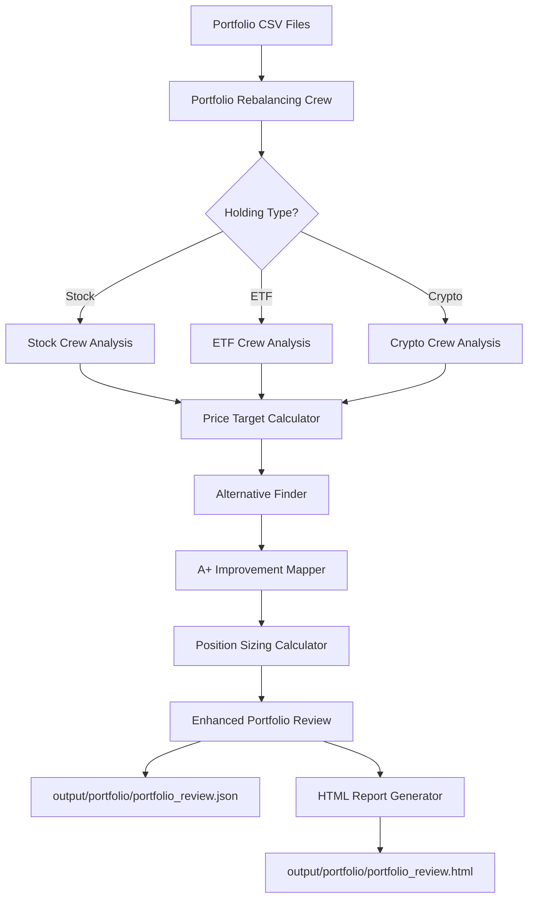

# Portfolio Holdings Analysis - Design Document

## Overview

This design enhances the FinWiz portfolio review system to provide deep, actionable analysis for each holding in a user's portfolio. The system will transform generic "baseline" placeholder data into comprehensive, ticker-specific recommendations with price targets, alternatives, and A+ improvement paths.

### Current State

- Portfolio review reads holdings from `data/etf.csv` and `data/stock.csv`
- Outputs generic analysis to `output/portfolio/portfolio_review.json`
- Contains only ticker validation and baseline scores
- No specific buy/sell price targets or alternatives

### Target State

- Deep fundamental analysis for each holding
- Specific buy/sell/keep recommendations with price targets
- Alternative investment suggestions for underperforming holdings
- A+ improvement roadmap with phased transition plan
- Risk-adjusted position sizing recommendations
- Multi-currency support with FX risk assessment
- HTML report output (not markdown) for user-friendly viewing

## Architecture

### High-Level Flow



### Component Architecture

```
src/finwiz/
├── crews/
│   ├── portfolio_rebalancing_crew/
│   │   ├── portfolio_rebalancing_crew.py (ENHANCED)
│   │   └── config/
│   │       ├── agents.yaml (ENHANCED)
│   │       └── tasks.yaml (ENHANCED)
│   ├── stock_crew/ (EXISTING - leverage outputs)
│   ├── etf_crew/ (EXISTING - leverage outputs)
│   └── crypto_crew/ (EXISTING - leverage outputs)
├── tools/
│   ├── price_target_calculator.py (NEW)
│   ├── alternative_finder_tool.py (NEW)
│   ├── position_sizing_tool.py (NEW)
│   └── holding_analyzer_orchestrator.py (NEW)
└── schemas/
    └── portfolio_review.py (ENHANCED)
```

## Components and Interfaces

### 1. Enhanced Portfolio Rebalancing Crew

**Purpose**: Orchestrate deep analysis of each portfolio holding

**New Agents**:

- `holding_analyzer`: Coordinates analysis for each ticker
- `price_target_specialist`: Calculates buy/sell price targets
- `alternative_researcher`: Finds better alternatives for underperforming holdings

**Enhanced Agents**:

- `portfolio_analyst`: Now triggers individual holding analysis
- `rebalancing_strategist`: Now includes A+ improvement roadmap
- `risk_manager`: Now includes position sizing recommendations
- `report_generator`: Generates French HTML report directly with emojis and professional styling

**Key Methods**:

```python
def analyze_holding(ticker: str, asset_class: str) -> HoldingAnalysis:
    """Analyze individual holding with crew-specific analysis."""
    
def calculate_price_targets(holding: HoldingAnalysis) -> PriceTargets:
    """Calculate buy/sell/stop-loss price targets."""
    
def find_alternatives(holding: HoldingAnalysis) -> list[Alternative]:
    """Find better alternatives for underperforming holdings."""
```

### 2. Holding Analyzer Orchestrator (NEW)

**Purpose**: Coordinate analysis across stock/ETF/crypto crews

**File**: `src/finwiz/tools/holding_analyzer_orchestrator.py`

**Key Responsibilities**:

- Check for existing crew analysis (< 7 days old)
- Trigger appropriate crew if analysis missing/stale
- Map crew outputs to portfolio review schema
- Handle analysis failures with graceful fallback

**Interface**:

```python
class HoldingAnalyzerOrchestrator:
    def analyze_holding(
        self,
        ticker: str,
        asset_class: AssetClass,
        currency: str
    ) -> HoldingAnalysis:
        """
        Orchestrate deep analysis for a single holding.
        
        Returns:
            HoldingAnalysis with crew-specific data mapped to schema
        """
        
    def get_cached_analysis(
        self,
        ticker: str,
        max_age_days: int = 7
    ) -> Optional[dict]:
        """Check for recent crew analysis output."""
        
    def trigger_crew_analysis(
        self,
        ticker: str,
        asset_class: AssetClass
    ) -> dict:
        """Trigger appropriate crew for fresh analysis."""
```

### 3. Price Target Calculator (NEW)

**Purpose**: Calculate actionable buy/sell price targets

**File**: `src/finwiz/tools/price_target_calculator.py`

**Calculation Methods**:

**For Stocks**:

- Fair value from DCF/multiples analysis
- Technical support/resistance levels
- Analyst consensus targets
- Risk-adjusted stop-loss levels

**For ETFs**:

- NAV premium/discount analysis
- Historical trading ranges
- Expense ratio impact on returns
- Tracking error considerations

**For Crypto**:

- Technical analysis (support/resistance)
- Volatility-based stop-loss
- Market structure levels
- ATR-based targets

**Interface**:

```python
class PriceTargetCalculator:
    def calculate_targets(
        self,
        ticker: str,
        asset_class: AssetClass,
        current_price: float,
        analysis_data: dict
    ) -> PriceTargets:
        """
        Calculate buy/sell/stop-loss price targets.
        
        Returns:
            PriceTargets with specific levels and rationale
        """
        
    def calculate_fair_value(
        self,
        fundamental_data: dict
    ) -> FairValueEstimate:
        """Calculate fair value estimate for stocks."""
        
    def calculate_technical_levels(
        self,
        price_history: list[float]
    ) -> TechnicalLevels:
        """Calculate support/resistance from price history."""
```

### 4. Alternative Finder Tool (NEW)

**Purpose**: Find better alternatives for underperforming holdings

**File**: `src/finwiz/tools/alternative_finder_tool.py`

**Matching Criteria**:

- Similar asset class and sector
- Better fundamental metrics (stocks)
- Lower expense ratios (ETFs)
- Higher liquidity (crypto)
- Similar or better risk profile
- A+ grade candidates prioritized

**Data Sources**:

- Investment Discovery Crew A+ outputs
- Same-sector holdings from crew analyses
- ETF database for similar exposures
- Crypto market cap and liquidity data

**Interface**:

```python
class AlternativeFinder:
    def find_alternatives(
        self,
        holding: HoldingAnalysis,
        max_alternatives: int = 3
    ) -> list[Alternative]:
        """
        Find better alternatives for a holding.
        
        Prioritizes:
        1. A+ candidates from discovery crew
        2. Same sector/exposure with better metrics
        3. Lower cost alternatives (ETFs)
        """
        
    def match_exposure(
        self,
        holding: HoldingAnalysis
    ) -> list[str]:
        """Find tickers with similar exposure."""
        
    def compare_metrics(
        self,
        current: HoldingAnalysis,
        alternative: HoldingAnalysis
    ) -> ComparisonResult:
        """Compare key metrics between holdings."""
```

### 5. Position Sizing Tool (NEW)

**Purpose**: Calculate risk-adjusted position sizing recommendations

**File**: `src/finwiz/tools/position_sizing_tool.py`

**Calculation Factors**:

- Holding risk score (0-10 scale)
- Correlation with other portfolio holdings
- User risk tolerance
- Concentration limits
- Volatility-based sizing

**Sizing Rules**:

- High-risk holdings (score > 7): ≤ 3% of portfolio
- Medium-risk holdings (score 4-7): 3-8% of portfolio
- Low-risk holdings (score < 4): 5-15% of portfolio
- Single stock limit: 10% maximum
- Sector concentration: 35% maximum

**Interface**:

```python
class PositionSizingTool:
    def calculate_position_size(
        self,
        holding: HoldingAnalysis,
        portfolio: PortfolioReview,
        risk_tolerance: str = "moderate"
    ) -> PositionSizeRecommendation:
        """
        Calculate optimal position size.
        
        Returns:
            Recommended size, current size, action (add/trim/hold)
        """
        
    def calculate_correlation(
        self,
        ticker: str,
        portfolio_tickers: list[str]
    ) -> float:
        """Calculate correlation with existing holdings."""
        
    def apply_concentration_limits(
        self,
        recommended_size: float,
        sector: str,
        portfolio: PortfolioReview
    ) -> float:
        """Apply concentration limits to sizing."""
```

## Data Models

### Enhanced HoldingDecision Schema

```python
class PriceTargets(BaseModel):
    """Price targets for buy/sell decisions."""
    
    current_price: float
    currency: str
    fair_value_estimate: Optional[float] = None
    
    # Buy targets
    buy_target_primary: Optional[float] = None
    buy_target_secondary: Optional[float] = None
    buy_rationale: str = ""
    
    # Sell targets
    sell_target_primary: Optional[float] = None
    sell_target_secondary: Optional[float] = None
    stop_loss_level: Optional[float] = None
    sell_rationale: str = ""
    
    # Technical levels
    support_levels: list[float] = Field(default_factory=list)
    resistance_levels: list[float] = Field(default_factory=list)
    
    # Metadata
    calculation_method: str = ""
    confidence_level: float = Field(ge=0.0, le=1.0)
    data_as_of: datetime
    data_sources: list[str] = Field(default_factory=list)


class PositionSizeRecommendation(BaseModel):
    """Position sizing recommendation."""
    
    current_size_pct: float = Field(ge=0.0, le=100.0)
    recommended_size_pct: float = Field(ge=0.0, le=100.0)
    sizing_action: Literal["add", "trim", "hold", "exit"]
    
    # Rationale
    sizing_rationale: str
    risk_contribution: float = Field(ge=0.0, le=100.0)
    correlation_with_portfolio: float = Field(ge=-1.0, le=1.0)
    
    # Constraints applied
    concentration_limits_applied: bool = False
    risk_limits_applied: bool = False


class HoldingAnalysis(BaseModel):
    """Complete analysis for a single holding."""
    
    # Basic info
    ticker: str
    name: str
    asset_class: AssetClass
    currency: str
    
    # Analysis data
    fundamental_analysis: Optional[dict] = None
    technical_analysis: Optional[dict] = None
    sec_citations: list[dict] = Field(default_factory=list)
    
    # Recommendations
    decision: Decision
    composite_score: float = Field(ge=0.0, le=1.0)
    grade: Grade
    price_targets: Optional[PriceTargets] = None
    position_sizing: Optional[PositionSizeRecommendation] = None
    
    # Alternatives and improvements
    alternatives: list[Alternative] = Field(default_factory=list)
    a_plus_improvement_suggestions: list[APlusImprovementSuggestion] = Field(default_factory=list)
    
    # Metadata
    analysis_date: datetime
    data_freshness: Literal["fresh", "recent", "stale"]
    crew_analysis_used: Optional[str] = None
```

### Enhanced Alternative Schema

```python
class Alternative(BaseModel):
    """Enhanced alternative with transition strategy."""
    
    # ... existing fields ...
    
    # NEW: Transition strategy
    transition_strategy: str = ""
    swap_timing: Literal["immediate", "gradual", "tax_optimized"] = "gradual"
    tax_implications: str = ""
    expected_cost_basis_impact: Optional[float] = None
    
    # NEW: Comparison metrics
    expense_ratio_savings: Optional[float] = None  # For ETFs
    fundamental_improvement: Optional[dict] = None  # For stocks
    liquidity_improvement: Optional[float] = None  # For crypto
```

## Error Handling

### Graceful Degradation Strategy

1. **Crew Analysis Failure**:
   - Log error with ticker and crew type
   - Fall back to baseline analysis with warning flag
   - Set `data_freshness` to "stale"
   - Reduce confidence scores by 30%

2. **Price Target Calculation Failure**:
   - Use simple technical levels only
   - Mark targets as "low confidence"
   - Provide wider ranges

3. **Alternative Finding Failure**:
   - Return empty alternatives list
   - Set `has_a_plus_opportunities` to False
   - Log for manual review

4. **Position Sizing Failure**:
   - Use default conservative sizing (5% max)
   - Apply strict concentration limits
   - Flag for manual review

### Error Response Schema

```python
class AnalysisError(BaseModel):
    """Error information for failed analysis."""
    
    ticker: str
    error_type: str
    error_message: str
    fallback_used: bool
    confidence_reduction: float
    timestamp: datetime
```

## Testing Strategy

### Unit Tests

1. **HoldingAnalyzerOrchestrator**:
   - Test crew selection logic
   - Test cache hit/miss scenarios
   - Test fallback behavior
   - Mock all crew calls

2. **PriceTargetCalculator**:
   - Test fair value calculations
   - Test technical level detection
   - Test multi-currency handling
   - Test edge cases (missing data)

3. **AlternativeFinder**:
   - Test matching logic
   - Test A+ prioritization
   - Test sector/exposure matching
   - Test comparison metrics

4. **PositionSizingTool**:
   - Test sizing calculations
   - Test concentration limits
   - Test correlation calculations
   - Test risk-based adjustments

### Integration Tests

1. **End-to-End Portfolio Analysis**:
   - Load sample portfolio CSV
   - Run full analysis pipeline
   - Verify all holdings have price targets
   - Verify alternatives for low-grade holdings
   - Verify position sizing sums to 100%

2. **Crew Integration**:
   - Test stock crew integration
   - Test ETF crew integration
   - Test crypto crew integration
   - Test cache reuse

3. **Multi-Currency Handling**:
   - Test EUR-denominated holdings
   - Test CHF-denominated holdings
   - Test USD-denominated holdings
   - Verify FX risk notes

### Test Data

```python
# Sample test portfolio
TEST_PORTFOLIO = {
    "etfs": [
        {"ticker": "VUSA.L", "currency": "USD", "asset_class": "etf"},
        {"ticker": "2B7K.DE", "currency": "EUR", "asset_class": "etf"},
    ],
    "stocks": [
        {"ticker": "AAPL", "currency": "USD", "asset_class": "stock"},
        {"ticker": "NESN.SW", "currency": "CHF", "asset_class": "stock"},
    ]
}
```

## Performance Considerations

### Optimization Strategies

1. **Parallel Analysis**:
   - Analyze holdings in parallel using asyncio
   - Batch API calls where possible
   - Use connection pooling

2. **Caching**:
   - Cache crew analysis outputs (7-day TTL)
   - Cache price data (1-hour TTL)
   - Cache alternative matches (24-hour TTL)

3. **Rate Limiting**:
   - Respect API rate limits (20 RPM for CrewAI)
   - Implement exponential backoff
   - Queue holdings for batch processing

4. **Memory Management**:
   - Stream large portfolios
   - Process in chunks of 10 holdings
   - Clear intermediate results

### Performance Targets

- **Small Portfolio (< 20 holdings)**: < 5 minutes
- **Medium Portfolio (20-50 holdings)**: < 15 minutes
- **Large Portfolio (50-100 holdings)**: < 30 minutes

## Implementation Phases

### Phase 1: Core Infrastructure (Week 1)

- Create HoldingAnalyzerOrchestrator
- Enhance portfolio_rebalancing_crew
- Add crew integration logic
- Implement caching mechanism

### Phase 2: Price Targets (Week 2)

- Implement PriceTargetCalculator
- Add fair value calculations
- Add technical level detection
- Add multi-currency support

### Phase 3: Alternatives & A+ Integration (Week 3)

- Implement AlternativeFinder
- Integrate with discovery crew outputs
- Add comparison metrics
- Add transition strategies

### Phase 4: Position Sizing (Week 4)

- Implement PositionSizingTool
- Add correlation calculations
- Add concentration limits
- Add risk-based adjustments

### Phase 5: Testing & Refinement (Week 5)

- Write comprehensive unit tests
- Write integration tests
- Performance optimization
- Documentation

## Migration Strategy

### Backward Compatibility

- Maintain existing `PortfolioReview` schema structure
- Add new fields as optional
- Set `schema_version` to "2.1"
- Provide migration script for old outputs

### Rollout Plan

1. **Alpha**: Test with 5-holding sample portfolio
2. **Beta**: Test with user's full 65-holding portfolio
3. **Production**: Full rollout with monitoring

## Monitoring and Observability

### Key Metrics

- Analysis success rate per holding
- Average analysis time per holding
- Cache hit rate
- API call volume
- Error rate by component

### Logging Strategy

```python
logger.info("Analyzing holding", extra={
    "ticker": ticker,
    "asset_class": asset_class,
    "cache_hit": cache_hit,
    "analysis_time_ms": elapsed_ms
})
```

### Alerts

- Alert if analysis failure rate > 10%
- Alert if average analysis time > 2 minutes
- Alert if cache hit rate < 50%
- Alert if API rate limit exceeded

## Security Considerations

### Data Privacy

- Never log personal financial amounts
- Sanitize ticker symbols in logs
- Encrypt cached analysis data
- Secure API keys in environment variables

### Input Validation

- Validate ticker format (regex)
- Validate currency codes (ISO 4217)
- Validate asset class enum
- Sanitize CSV inputs

### API Security

- Use HTTPS for all external calls
- Verify SSL certificates
- Implement request timeouts
- Rate limit internal calls

## Dependencies

### New Dependencies

```toml
# No new external dependencies required
# Leverage existing FinWiz tools and crews
```

### Existing Dependencies Used

- `crewai`: Agent orchestration
- `pydantic`: Data validation
- `pandas`: CSV processing
- `httpx`: Async HTTP calls
- `yfinance`: Price data (via existing tools)

## Output Format

### HTML Report Structure

Following the existing FinWiz pattern (like stock_crew and crypto_crew), the system will generate:

- `output/portfolio/portfolio_review_fr.html` (French HTML report)
- `output/portfolio/portfolio_review.json` (structured data)

The HTML report will include:

**Sections**:

1. **Portfolio Summary Dashboard**
   - Total holdings count
   - Grade distribution chart
   - A+ opportunities count
   - Overall portfolio health score

2. **Holdings Analysis Table**
   - Sortable/filterable table
   - Columns: Ticker, Name, Grade, Decision, Current Price, Price Targets
   - Expandable rows for detailed analysis

3. **Price Targets Section** (per holding)
   - Current price vs fair value
   - Buy targets with rationale
   - Sell/stop-loss targets with rationale
   - Visual price chart with target levels

4. **Alternatives Section** (for underperforming holdings)
   - Side-by-side comparison table
   - Key metrics comparison
   - Transition strategy
   - Expected improvement

5. **A+ Improvement Roadmap**
   - Phased implementation plan
   - Expected grade improvements
   - Timeline and priorities
   - Cost/benefit analysis

6. **Position Sizing Recommendations**
   - Current vs recommended allocation
   - Visual pie charts
   - Rebalancing actions needed

**Styling** (following existing FinWiz pattern):

- Professional HTML structure with FinWiz branding
- Responsive design (mobile-friendly)
- Emojis for visual appeal (📊 📈 📉 💰 ⚠️ ✅ ❌)
- Color-coded grades (green for A+/A, yellow for B/C, red for D/F)
- Collapsible sections for detailed data
- Print-friendly CSS

**Output Files**:

- `portfolio_review_fr.html` - French HTML report
- `portfolio_review.json` - Structured data
- **No PDF generation** (user can print to PDF from browser if needed)
- **No English version** (French only as per user requirement)

### JSON Output

`output/portfolio/portfolio_review.json` remains as structured data for:

- API consumption
- Further processing
- Backup/archival

## Documentation Requirements

### User Documentation

- How to interpret price targets in HTML report
- How to use alternative suggestions
- How to implement A+ improvements
- Position sizing recommendations guide
- How to navigate the HTML report

### Developer Documentation

- Component architecture diagrams
- API reference for new tools
- Integration guide for crews
- Testing guide
- HTML template customization guide

### Example Outputs

Provide sample outputs:

- `portfolio_review.json` with complete data
- `portfolio_review.html` with rendered report
- Screenshots of key report sections
