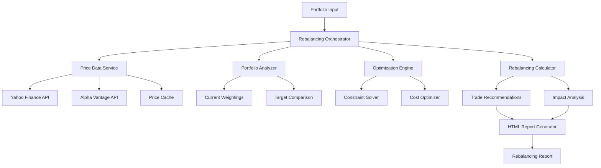

# Design Document

## Overview

The Portfolio Rebalancing System is a comprehensive module that extends FinWiz's existing portfolio management capabilities to provide intelligent buy/sell quantity recommendations. The system integrates with FinWiz's current architecture, leveraging existing price data APIs, validation frameworks, and reporting infrastructure while introducing new optimization algorithms and rebalancing logic.

The design follows FinWiz's core principles of strict data validation using Pydantic v2, async operations for I/O-bound tasks, and HTML-first reporting with professional financial terminology. The system will be implemented as a new orchestrator module that coordinates with existing tools and schemas.

## Architecture

### High-Level Architecture



### Integration with Existing FinWiz Components

The rebalancing system integrates with existing FinWiz infrastructure:

- **Price Data**: Leverages existing `yahoo_finance_ticker_info_tool.py` and `yahoo_finance_history_tool.py`
- **Validation**: Uses existing Pydantic validation patterns from `src/finwiz/schemas/`
- **Caching**: Integrates with existing cache management system
- **Reporting**: Extends existing HTML report generation framework
- **Error Handling**: Follows established error handling patterns

### Data Flow

1. **Input Validation**: Portfolio configuration and target weightings validated using Pydantic schemas
2. **Price Retrieval**: Current market prices fetched using existing Yahoo Finance tools with caching
3. **Portfolio Analysis**: Current weightings calculated and compared against targets
4. **Optimization**: Rebalancing trades optimized considering constraints and costs
5. **Report Generation**: Comprehensive HTML report generated with trade recommendations

## Components and Interfaces

### Core Components

#### 1. Portfolio Rebalancing Orchestrator (`src/finwiz/orchestrators/portfolio_rebalancing.py`)

Main orchestration class that coordinates the rebalancing process:

```python
class PortfolioRebalancingOrchestrator:
    """Main orchestrator for portfolio rebalancing operations."""
    
    async def rebalance_portfolio(
        self, 
        portfolio_config: PortfolioConfiguration,
        available_capital: float = 0.0
    ) -> RebalancingResult
    
    async def analyze_current_portfolio(
        self, 
        holdings: List[Holding]
    ) -> PortfolioAnalysis
    
    async def generate_rebalancing_report(
        self, 
        result: RebalancingResult
    ) -> str  # HTML report
```

#### 2. Price Data Service (`src/finwiz/tools/portfolio_price_service.py`)

Centralized service for retrieving current market prices:

```python
class PortfolioPriceService:
    """Service for retrieving current market prices for portfolio holdings."""
    
    async def get_current_prices(
        self, 
        symbols: List[str]
    ) -> Dict[str, PriceData]
    
    async def get_price_with_fallback(
        self, 
        symbol: str
    ) -> PriceData
    
    def _cache_price_data(
        self, 
        symbol: str, 
        price_data: PriceData
    ) -> None
```

#### 3. Portfolio Analyzer (`src/finwiz/quantitative/portfolio_analyzer.py`)

Analyzes current portfolio composition and calculates weightings:

```python
class PortfolioAnalyzer:
    """Analyzes portfolio composition and calculates current weightings."""
    
    def calculate_current_weightings(
        self, 
        holdings: List[Holding], 
        prices: Dict[str, float]
    ) -> Dict[str, float]
    
    def identify_rebalancing_needs(
        self, 
        current_weights: Dict[str, float],
        target_weights: Dict[str, float],
        tolerance_bands: Dict[str, float]
    ) -> List[RebalancingNeed]
    
    def calculate_portfolio_metrics(
        self, 
        holdings: List[Holding], 
        prices: Dict[str, float]
    ) -> PortfolioMetrics
```

#### 4. Rebalancing Engine (`src/finwiz/quantitative/rebalancing_engine.py`)

Core optimization engine for calculating optimal trades:

```python
class RebalancingEngine:
    """Optimization engine for calculating optimal rebalancing trades."""
    
    def optimize_rebalancing_trades(
        self, 
        current_portfolio: Portfolio,
        target_weights: Dict[str, float],
        available_capital: float,
        constraints: List[RebalancingConstraint]
    ) -> OptimizedTrades
    
    def minimize_transaction_costs(
        self, 
        trades: List[Trade]
    ) -> List[Trade]
    
    def calculate_tax_implications(
        self, 
        trades: List[Trade], 
        cost_basis: Dict[str, float]
    ) -> TaxAnalysis
```

### Interface Definitions

#### Primary Interfaces

```python
# Input Configuration Interface
class PortfolioConfiguration(BaseModel):
    """Configuration for portfolio rebalancing."""
    holdings: List[Holding]
    target_weights: Dict[str, float]
    tolerance_bands: Dict[str, float]
    available_capital: float = 0.0
    transaction_cost_rate: float = 0.001
    min_trade_size: float = 0.01
    rebalancing_method: RebalancingMethod = RebalancingMethod.MINIMIZE_TRADES

# Output Interface
class RebalancingResult(BaseModel):
    """Result of portfolio rebalancing analysis."""
    current_portfolio: PortfolioAnalysis
    recommended_trades: List[TradeRecommendation]
    projected_portfolio: PortfolioAnalysis
    cost_analysis: CostAnalysis
    risk_analysis: RiskAnalysis
    execution_summary: ExecutionSummary
```

#### Supporting Interfaces

```python
class Holding(BaseModel):
    """Individual portfolio holding."""
    symbol: str
    shares: float
    cost_basis: Optional[float] = None
    acquisition_date: Optional[datetime] = None

class TradeRecommendation(BaseModel):
    """Individual trade recommendation."""
    symbol: str
    action: TradeAction  # BUY, SELL, HOLD
    quantity: float
    estimated_cost: float
    priority: int
    rationale: str

class PortfolioAnalysis(BaseModel):
    """Analysis of portfolio composition."""
    total_value: float
    weightings: Dict[str, float]
    deviations_from_target: Dict[str, float]
    positions_needing_rebalancing: List[str]
    risk_metrics: Dict[str, float]
```

## Data Models

### Core Data Models

#### Portfolio Configuration Schema

```python
class PortfolioConfiguration(BaseModel):
    """Portfolio rebalancing configuration schema."""
    
    model_config = ConfigDict(extra="forbid", str_strip_whitespace=True)
    
    # Portfolio holdings
    holdings: List[Holding] = Field(..., min_items=1, description="Current portfolio holdings")
    
    # Target allocation
    target_weights: Dict[str, float] = Field(
        ..., 
        description="Target percentage weights for each symbol"
    )
    
    # Tolerance settings
    tolerance_bands: Dict[str, float] = Field(
        default_factory=dict,
        description="Tolerance bands for each position (defaults to global tolerance)"
    )
    global_tolerance: float = Field(
        default=0.05, 
        ge=0.001, 
        le=0.5, 
        description="Default tolerance band (5% = ±5%)"
    )
    
    # Capital constraints
    available_capital: float = Field(
        default=0.0, 
        description="Available capital for rebalancing (positive=invest, negative=withdraw)"
    )
    
    # Trading parameters
    transaction_cost_rate: float = Field(
        default=0.001, 
        ge=0.0, 
        le=0.1, 
        description="Transaction cost as percentage of trade value"
    )
    min_trade_size: float = Field(
        default=0.01, 
        ge=0.001, 
        description="Minimum trade size to execute"
    )
    
    # Optimization settings
    rebalancing_method: RebalancingMethod = Field(
        default=RebalancingMethod.MINIMIZE_TRADES,
        description="Rebalancing optimization method"
    )
    
    @validator("target_weights")
    def validate_target_weights_sum(cls, v: Dict[str, float]) -> Dict[str, float]:
        """Validate that target weights sum to 100% or less."""
        total = sum(v.values())
        if total > 1.01:  # Allow small rounding errors
            raise ValueError(f"Target weights sum to {total:.1%}, must be ≤ 100%")
        return v
    
    @validator("tolerance_bands")
    def validate_tolerance_bands(cls, v: Dict[str, float], values: Dict[str, Any]) -> Dict[str, float]:
        """Validate tolerance bands are reasonable."""
        for symbol, tolerance in v.items():
            if tolerance < 0.001 or tolerance > 0.5:
                raise ValueError(f"Tolerance for {symbol} must be between 0.1% and 50%")
        return v
```

#### Trade Recommendation Schema

```python
class TradeRecommendation(BaseModel):
    """Individual trade recommendation schema."""
    
    model_config = ConfigDict(extra="forbid", str_strip_whitespace=True)
    
    # Trade details
    symbol: str = Field(..., description="Stock symbol")
    action: TradeAction = Field(..., description="Trade action (BUY/SELL/HOLD)")
    quantity: float = Field(..., description="Number of shares to trade")
    current_price: float = Field(..., gt=0, description="Current market price")
    
    # Financial impact
    trade_value: float = Field(..., description="Total value of trade")
    estimated_commission: float = Field(..., ge=0, description="Estimated commission cost")
    estimated_spread_cost: float = Field(..., ge=0, description="Estimated bid-ask spread cost")
    total_estimated_cost: float = Field(..., ge=0, description="Total estimated transaction cost")
    
    # Portfolio impact
    current_weight: float = Field(..., ge=0, le=1, description="Current portfolio weight")
    target_weight: float = Field(..., ge=0, le=1, description="Target portfolio weight")
    weight_deviation: float = Field(..., description="Current deviation from target")
    projected_weight_after_trade: float = Field(..., ge=0, le=1, description="Projected weight after trade")
    
    # Execution details
    priority: int = Field(..., ge=1, le=10, description="Execution priority (1=highest)")
    urgency: UrgencyLevel = Field(..., description="Trade urgency level")
    rationale: str = Field(..., min_length=10, description="Rationale for trade recommendation")
    
    # Risk considerations
    tax_implications: Optional[str] = Field(None, description="Tax implications if applicable")
    market_impact_warning: Optional[str] = Field(None, description="Market impact warnings")
```

#### Rebalancing Result Schema

```python
class RebalancingResult(BaseModel):
    """Complete rebalancing analysis result schema."""
    
    model_config = ConfigDict(extra="forbid", str_strip_whitespace=True)
    
    # Analysis metadata
    analysis_timestamp: datetime = Field(default_factory=datetime.now, description="Analysis timestamp")
    portfolio_id: Optional[str] = Field(None, description="Portfolio identifier")
    
    # Current portfolio state
    current_portfolio: PortfolioAnalysis = Field(..., description="Current portfolio analysis")
    
    # Rebalancing recommendations
    trade_recommendations: List[TradeRecommendation] = Field(
        default_factory=list, 
        description="Individual trade recommendations"
    )
    
    # Projected outcomes
    projected_portfolio: PortfolioAnalysis = Field(..., description="Projected portfolio after rebalancing")
    
    # Cost analysis
    total_transaction_costs: float = Field(..., ge=0, description="Total estimated transaction costs")
    cost_benefit_ratio: float = Field(..., description="Cost-benefit ratio of rebalancing")
    break_even_analysis: str = Field(..., description="Break-even analysis summary")
    
    # Risk analysis
    current_risk_score: float = Field(..., ge=0, le=10, description="Current portfolio risk score")
    projected_risk_score: float = Field(..., ge=0, le=10, description="Projected risk score after rebalancing")
    risk_improvement: float = Field(..., description="Risk score improvement")
    
    # Execution summary
    total_trades_required: int = Field(..., ge=0, description="Total number of trades required")
    positions_requiring_action: int = Field(..., ge=0, description="Number of positions requiring action")
    positions_within_tolerance: int = Field(..., ge=0, description="Number of positions within tolerance")
    
    # Alternative scenarios
    alternative_scenarios: List[AlternativeScenario] = Field(
        default_factory=list,
        max_items=3,
        description="Alternative rebalancing scenarios"
    )
    
    # Recommendations
    overall_recommendation: RebalancingRecommendation = Field(..., description="Overall rebalancing recommendation")
    next_review_date: datetime = Field(..., description="Recommended next review date")
```

## Error Handling

### Error Handling Strategy

The rebalancing system implements comprehensive error handling following FinWiz's established patterns:

#### 1. Input Validation Errors

```python
class PortfolioRebalancingError(Exception):
    """Base exception for portfolio rebalancing errors."""
    pass

class InvalidPortfolioConfigurationError(PortfolioRebalancingError):
    """Raised when portfolio configuration is invalid."""
    
    def __init__(self, field: str, message: str):
        super().__init__(f"Invalid portfolio configuration - {field}: {message}")
        self.field = field

class InsufficientDataError(PortfolioRebalancingError):
    """Raised when insufficient data is available for rebalancing."""
    
    def __init__(self, missing_data: List[str]):
        super().__init__(f"Insufficient data for rebalancing: {', '.join(missing_data)}")
        self.missing_data = missing_data
```

#### 2. Price Data Errors

```python
class PriceDataError(PortfolioRebalancingError):
    """Raised when price data cannot be retrieved."""
    
    def __init__(self, symbol: str, reason: str):
        super().__init__(f"Failed to retrieve price data for {symbol}: {reason}")
        self.symbol = symbol
        self.reason = reason

class StaleDataWarning(UserWarning):
    """Warning for stale price data."""
    pass
```

#### 3. Optimization Errors

```python
class OptimizationError(PortfolioRebalancingError):
    """Raised when optimization fails."""
    
    def __init__(self, method: str, reason: str):
        super().__init__(f"Optimization failed using {method}: {reason}")
        self.method = method
        self.reason = reason
```

### Error Recovery Strategies

1. **Price Data Fallback**: If primary price source fails, automatically fallback to secondary sources
2. **Graceful Degradation**: If optimization fails, provide simplified equal-weight recommendations
3. **Partial Results**: If some positions fail analysis, continue with available data and note limitations
4. **User Guidance**: Provide clear error messages with specific remediation steps

## Testing Strategy

### Testing Approach

The testing strategy follows FinWiz's established patterns using pytest with comprehensive mocking:

#### 1. Unit Tests

```python
class TestPortfolioRebalancingOrchestrator:
    """Unit tests for portfolio rebalancing orchestrator."""
    
    def test_should_calculate_correct_weightings_when_valid_portfolio_provided(self, mocker):
        # Arrange
        mock_price_service = mocker.patch('finwiz.tools.portfolio_price_service.PortfolioPriceService')
        mock_price_service.get_current_prices.return_value = {
            'AAPL': 150.0,
            'GOOGL': 2500.0,
            'MSFT': 300.0
        }
        
        holdings = [
            Holding(symbol='AAPL', shares=100),
            Holding(symbol='GOOGL', shares=10),
            Holding(symbol='MSFT', shares=50)
        ]
        
        # Act
        orchestrator = PortfolioRebalancingOrchestrator()
        result = await orchestrator.analyze_current_portfolio(holdings)
        
        # Assert
        assert result.total_value == 55000.0  # 15000 + 25000 + 15000
        assert abs(result.weightings['AAPL'] - 0.273) < 0.001
        assert abs(result.weightings['GOOGL'] - 0.455) < 0.001
        assert abs(result.weightings['MSFT'] - 0.273) < 0.001
    
    def test_should_recommend_buy_when_position_underweighted(self, mocker):
        # Test rebalancing logic for underweighted positions
        pass
    
    def test_should_recommend_sell_when_position_overweighted(self, mocker):
        # Test rebalancing logic for overweighted positions
        pass
```

#### 2. Integration Tests

```python
class TestPortfolioRebalancingIntegration:
    """Integration tests for portfolio rebalancing system."""
    
    @pytest.mark.integration
    def test_should_complete_full_rebalancing_workflow_when_valid_input_provided(self, mocker):
        # Test complete workflow from input to report generation
        pass
    
    @pytest.mark.integration
    def test_should_handle_api_failures_gracefully(self, mocker):
        # Test error handling when external APIs fail
        pass
```

#### 3. Performance Tests

```python
class TestPortfolioRebalancingPerformance:
    """Performance tests for portfolio rebalancing system."""
    
    def test_should_complete_rebalancing_within_time_limit(self):
        # Test that rebalancing completes within acceptable time limits
        pass
    
    def test_should_handle_large_portfolios_efficiently(self):
        # Test performance with large portfolios (100+ positions)
        pass
```

### Test Data Strategy

- **Mock External APIs**: All price data APIs mocked using pytest-mock
- **Realistic Test Data**: Use Faker library for generating realistic portfolio data
- **Edge Cases**: Test boundary conditions, empty portfolios, single-asset portfolios
- **Error Scenarios**: Test various failure modes and recovery strategies

### Coverage Requirements

- **Minimum Coverage**: 90% line coverage for all rebalancing modules
- **Critical Path Coverage**: 100% coverage for core rebalancing logic
- **Error Path Coverage**: All error handling paths must be tested

## Integration Points

### Integration with Existing FinWiz Components

#### 1. Price Data Integration

```python
# Leverage existing Yahoo Finance tools
from finwiz.tools.yahoo_finance_ticker_info_tool import YahooFinanceTickerInfoTool
from finwiz.tools.yahoo_finance_history_tool import YahooFinanceHistoryTool

class PortfolioPriceService:
    def __init__(self):
        self.ticker_info_tool = YahooFinanceTickerInfoTool()
        self.history_tool = YahooFinanceHistoryTool()
    
    async def get_current_price(self, symbol: str) -> float:
        # Use existing tool with error handling
        try:
            result = await self.ticker_info_tool._run(ticker=symbol)
            return result.get('current_price', 0.0)
        except Exception as e:
            logger.warning(f"Failed to get price for {symbol}: {e}")
            raise PriceDataError(symbol, str(e))
```

#### 2. Validation Framework Integration

```python
# Extend existing validation patterns
from finwiz.schemas.common import RiskAssessmentStandardized
from finwiz.validation.manager import ValidationManager

class PortfolioRebalancingValidator:
    def __init__(self):
        self.validation_manager = ValidationManager()
    
    def validate_portfolio_configuration(self, config: PortfolioConfiguration) -> ValidationResult:
        # Use existing validation framework
        return self.validation_manager.validate_schema(config)
```

#### 3. Reporting Integration

```python
# Extend existing HTML report generation
from finwiz.tools.html_report_generator import HTMLReportGenerator

class RebalancingReportGenerator(HTMLReportGenerator):
    def generate_rebalancing_report(self, result: RebalancingResult) -> str:
        # Use existing HTML template framework
        template_data = {
            'title': 'Portfolio Rebalancing Analysis',
            'result': result,
            'timestamp': datetime.now(),
            'base_currency': 'USD'
        }
        return self.render_template('rebalancing_report.html', template_data)
```

#### 4. Caching Integration

```python
# Leverage existing cache management
from finwiz.utils.cache_manager import CacheManager

class PortfolioPriceService:
    def __init__(self):
        self.cache_manager = CacheManager()
    
    async def get_cached_price(self, symbol: str) -> Optional[float]:
        cache_key = f"price:{symbol}"
        return await self.cache_manager.get(cache_key)
    
    async def cache_price(self, symbol: str, price: float) -> None:
        cache_key = f"price:{symbol}"
        await self.cache_manager.set(cache_key, price, ttl=300)  # 5 minute TTL
```

### New Integration Points

#### 1. Portfolio Data Storage

```python
# New portfolio persistence layer
class PortfolioStorage:
    """Persistent storage for portfolio configurations and history."""
    
    async def save_portfolio_config(self, config: PortfolioConfiguration) -> str:
        """Save portfolio configuration and return ID."""
        pass
    
    async def load_portfolio_config(self, portfolio_id: str) -> PortfolioConfiguration:
        """Load portfolio configuration by ID."""
        pass
    
    async def save_rebalancing_history(self, result: RebalancingResult) -> None:
        """Save rebalancing analysis for historical tracking."""
        pass
```

#### 2. Notification System

```python
# New notification system for rebalancing alerts
class RebalancingNotificationService:
    """Service for sending rebalancing notifications."""
    
    async def send_rebalancing_alert(self, portfolio_id: str, urgency: UrgencyLevel) -> None:
        """Send notification when rebalancing is needed."""
        pass
    
    async def send_execution_reminder(self, trades: List[TradeRecommendation]) -> None:
        """Send reminder to execute recommended trades."""
        pass
```

### API Extensions

#### 1. REST API Endpoints

```python
# New API endpoints for portfolio rebalancing
@app.post("/api/portfolio/rebalance")
async def rebalance_portfolio(config: PortfolioConfiguration) -> RebalancingResult:
    """Analyze portfolio and generate rebalancing recommendations."""
    pass

@app.get("/api/portfolio/{portfolio_id}/analysis")
async def get_portfolio_analysis(portfolio_id: str) -> PortfolioAnalysis:
    """Get current portfolio analysis."""
    pass

@app.post("/api/portfolio/{portfolio_id}/simulate")
async def simulate_rebalancing(portfolio_id: str, scenario: RebalancingScenario) -> RebalancingResult:
    """Simulate rebalancing under different scenarios."""
    pass
```

#### 2. WebSocket Integration

```python
# Real-time portfolio monitoring
class PortfolioMonitoringService:
    """Real-time portfolio monitoring with WebSocket updates."""
    
    async def monitor_portfolio(self, portfolio_id: str) -> AsyncGenerator[PortfolioUpdate, None]:
        """Stream real-time portfolio updates."""
        pass
    
    async def alert_rebalancing_needed(self, portfolio_id: str) -> None:
        """Send real-time alert when rebalancing is needed."""
        pass
```

This comprehensive design provides a robust foundation for implementing the portfolio rebalancing feature while maintaining consistency with FinWiz's existing architecture and design principles.
