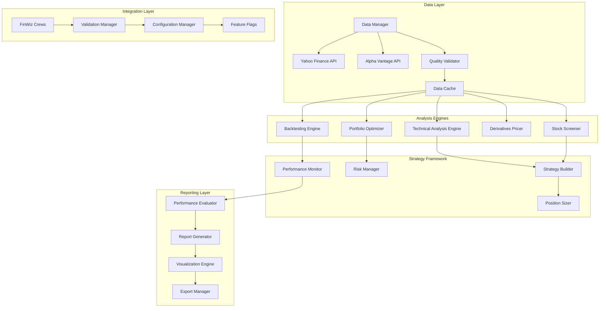

# Quantitative Backtesting & Stock Screening Design Document

## Overview

This design document outlines a comprehensive quantitative analysis framework for FinWiz that integrates professional-grade Python libraries for backtesting, portfolio optimization, derivatives pricing, and stock screening. The framework transforms FinWiz into a complete quantitative analysis platform suitable for retail and institutional users.

The design implements a modular architecture with clear separation between data acquisition, analysis engines, strategy development, and reporting components. It leverages industry-standard libraries (TA-Lib, Backtrader, Pyfolio, QuantLib, PyPortfolioOpt) while maintaining integration with FinWiz's existing CrewAI-based architecture.

## Architecture

### High-Level Architecture



### Design Principles

1. **Modular Architecture**: Each component can be used independently or in combination
2. **Professional-Grade Libraries**: Leverage industry-standard tools for institutional-quality analysis
3. **Data Quality Focus**: Comprehensive validation and quality assurance for all market data
4. **Performance Optimization**: Efficient caching, parallel processing, and memory management
5. **Extensible Framework**: Support for custom strategies and new asset classes
6. **Integration Consistency**: Seamless integration with existing FinWiz architecture and patterns

## Components and Interfaces

### 1. Data Management System

#### Historical Data Manager
```python
class HistoricalDataManager:
    """Manages historical market data acquisition and quality validation."""
    
    def __init__(self, config: QuantConfig):
        self.config = config
        self.primary_source = YahooFinanceProvider()
        self.fallback_source = AlphaVantageProvider()
        self.cache = DataCache(ttl_hours=24)
        self.validator = DataQualityValidator()
    
    async def fetch_ohlcv_data(self, symbol: str, start_date: datetime, 
                              end_date: datetime) -> OHLCVData:
        """Fetch historical OHLCV data with quality validation."""
        cache_key = f"ohlcv_{symbol}_{start_date}_{end_date}"
        
        # Check cache first
        cached_data = await self.cache.get(cache_key)
        if cached_data and self._is_data_fresh(cached_data):
            return cached_data
        
        # Fetch from primary source
        try:
            data = await self.primary_source.fetch_data(symbol, start_date, end_date)
            quality_report = self.validator.validate_data(data)
            
            if quality_report.is_valid:
                await self.cache.set(cache_key, data)
                return data
            else:
                # Try fallback source for quality issues
                return await self._fetch_with_fallback(symbol, start_date, end_date)
                
        except DataProviderError:
            return await self._fetch_with_fallback(symbol, start_date, end_date)
    
    async def _fetch_with_fallback(self, symbol: str, start_date: datetime, 
                                  end_date: datetime) -> OHLCVData:
        """Fetch data using fallback provider with cross-validation."""
        fallback_data = await self.fallback_source.fetch_data(symbol, start_date, end_date)
        
        # Cross-validate if both sources available
        if hasattr(self, '_primary_data'):
            validation_result = self._cross_validate_sources(self._primary_data, fallback_data)
            if validation_result.has_significant_discrepancies:
                logger.warning(f"Price discrepancies detected for {symbol}: {validation_result.issues}")
        
        return fallback_data
    
    def _cross_validate_sources(self, primary_data: OHLCVData, 
                               fallback_data: OHLCVData) -> CrossValidationResult:
        """Cross-validate data from multiple sources."""
        discrepancies = []
        
        for date in primary_data.dates:
            if date in fallback_data.dates:
                primary_close = primary_data.get_close(date)
                fallback_close = fallback_data.get_close(date)
                
                # Check for significant price differences (>2%)
                price_diff = abs(primary_close - fallback_close) / primary_close
                if price_diff > 0.02:
                    discrepancies.append(PriceDiscrepancy(
                        date=date,
                        primary_price=primary_close,
                        fallback_price=fallback_close,
                        difference_pct=price_diff * 100
                    ))
        
        return CrossValidationResult(
            has_significant_discrepancies=len(discrepancies) > 0,
            discrepancy_count=len(discrepancies),
            issues=discrepancies
        )

class DataQualityValidator:
    """Validates market data quality and completeness."""
    
    def validate_data(self, data: OHLCVData) -> DataQualityReport:
        """Comprehensive data quality validation."""
        issues = []
        
        # Check for missing dates
        missing_dates = self._check_missing_dates(data)
        if missing_dates:
            issues.append(DataQualityIssue(
                type="missing_dates",
                severity="warning",
                description=f"Missing {len(missing_dates)} trading days",
                affected_dates=missing_dates
            ))
        
        # Check for price anomalies
        anomalies = self._detect_price_anomalies(data)
        if anomalies:
            issues.append(DataQualityIssue(
                type="price_anomalies",
                severity="error" if len(anomalies) > 5 else "warning",
                description=f"Detected {len(anomalies)} price anomalies",
                affected_dates=[a.date for a in anomalies]
            ))
        
        # Check for zero volume days
        zero_volume_days = self._check_zero_volume(data)
        if zero_volume_days:
            issues.append(DataQualityIssue(
                type="zero_volume",
                severity="warning",
                description=f"Found {len(zero_volume_days)} zero volume days",
                affected_dates=zero_volume_days
            ))
        
        return DataQualityReport(
            is_valid=not any(issue.severity == "error" for issue in issues),
            issues=issues,
            completeness_score=self._calculate_completeness_score(data, issues),
            recommendation=self._generate_recommendation(issues)
        )
    
    def _detect_price_anomalies(self, data: OHLCVData) -> List[PriceAnomaly]:
        """Detect unusual price movements that may indicate data errors."""
        anomalies = []
        
        for i in range(1, len(data.closes)):
            prev_close = data.closes[i-1]
            current_close = data.closes[i]
            
            # Check for extreme price movements (>50% in one day)
            price_change = abs(current_close - prev_close) / prev_close
            if price_change > 0.5:
                anomalies.append(PriceAnomaly(
                    date=data.dates[i],
                    price_change_pct=price_change * 100,
                    previous_close=prev_close,
                    current_close=current_close,
                    anomaly_type="extreme_movement"
                ))
            
            # Check for impossible OHLC relationships
            high = data.highs[i]
            low = data.lows[i]
            open_price = data.opens[i]
            
            if not (low <= open_price <= high and low <= current_close <= high):
                anomalies.append(PriceAnomaly(
                    date=data.dates[i],
                    anomaly_type="invalid_ohlc",
                    description=f"Invalid OHLC relationship: O={open_price}, H={high}, L={low}, C={current_close}"
                ))
        
        return anomalies
```

#### Design Rationale
- **Multi-source validation**: Reduces single-point-of-failure and improves data reliability
- **Comprehensive quality checks**: Detects missing data, price anomalies, and structural issues
- **Intelligent caching**: Balances performance with data freshness requirements
- **Graceful degradation**: Continues operation with best available data when issues occur

### 2. Technical Analysis Engine

#### TA-Lib Integration
```python
class TechnicalAnalysisEngine:
    """Professional technical analysis using TA-Lib with fallback implementations."""
    
    def __init__(self):
        self.talib_available = self._check_talib_availability()
        if not self.talib_available:
            logger.warning("TA-Lib not available, using native Python implementations")
            self.native_calculator = NativeTechnicalCalculator()
    
    def calculate_indicators(self, data: OHLCVData, 
                           indicators: List[IndicatorConfig]) -> IndicatorResults:
        """Calculate multiple technical indicators efficiently."""
        results = IndicatorResults()
        
        for indicator_config in indicators:
            try:
                if self.talib_available:
                    result = self._calculate_with_talib(data, indicator_config)
                else:
                    result = self._calculate_with_native(data, indicator_config)
                
                results.add_indicator(indicator_config.name, result)
                
            except InsufficientDataError as e:
                logger.warning(f"Insufficient data for {indicator_config.name}: {e}")
                results.add_warning(indicator_config.name, str(e))
            
            except Exception as e:
                logger.error(f"Error calculating {indicator_config.name}: {e}")
                results.add_error(indicator_config.name, str(e))
        
        return results
    
    def _calculate_with_talib(self, data: OHLCVData, 
                             config: IndicatorConfig) -> IndicatorResult:
        """Calculate indicators using TA-Lib library."""
        import talib
        
        if config.name == "SMA":
            values = talib.SMA(data.closes, timeperiod=config.period)
        elif config.name == "EMA":
            values = talib.EMA(data.closes, timeperiod=config.period)
        elif config.name == "RSI":
            values = talib.RSI(data.closes, timeperiod=config.period)
        elif config.name == "MACD":
            macd, signal, histogram = talib.MACD(
                data.closes, 
                fastperiod=config.fast_period,
                slowperiod=config.slow_period,
                signalperiod=config.signal_period
            )
            return MACDResult(macd=macd, signal=signal, histogram=histogram)
        elif config.name == "BBANDS":
            upper, middle, lower = talib.BBANDS(
                data.closes,
                timeperiod=config.period,
                nbdevup=config.std_dev,
                nbdevdn=config.std_dev
            )
            return BollingerBandsResult(upper=upper, middle=middle, lower=lower)
        elif config.name == "STOCH":
            slowk, slowd = talib.STOCH(
                data.highs, data.lows, data.closes,
                fastk_period=config.fastk_period,
                slowk_period=config.slowk_period,
                slowd_period=config.slowd_period
            )
            return StochasticResult(slowk=slowk, slowd=slowd)
        else:
            raise UnsupportedIndicatorError(f"Indicator {config.name} not supported")
        
        return IndicatorResult(values=values, config=config)
    
    def _calculate_with_native(self, data: OHLCVData, 
                              config: IndicatorConfig) -> IndicatorResult:
        """Calculate indicators using native Python implementations."""
        return self.native_calculator.calculate(data, config)
    
    def _check_talib_availability(self) -> bool:
        """Check if TA-Lib is available and properly installed."""
        try:
            import talib
            # Test with dummy data to ensure it works
            test_data = np.array([1.0, 2.0, 3.0, 4.0, 5.0])
            talib.SMA(test_data, timeperiod=3)
            return True
        except ImportError:
            return False
        except Exception:
            return False

class NativeTechnicalCalculator:
    """Native Python implementations of technical indicators as TA-Lib fallback."""
    
    def calculate(self, data: OHLCVData, config: IndicatorConfig) -> IndicatorResult:
        """Calculate indicator using native Python implementation."""
        if config.name == "SMA":
            return self._calculate_sma(data.closes, config.period)
        elif config.name == "EMA":
            return self._calculate_ema(data.closes, config.period)
        elif config.name == "RSI":
            return self._calculate_rsi(data.closes, config.period)
        elif config.name == "MACD":
            return self._calculate_macd(data.closes, config)
        elif config.name == "BBANDS":
            return self._calculate_bollinger_bands(data.closes, config)
        else:
            raise UnsupportedIndicatorError(f"Native implementation for {config.name} not available")
    
    def _calculate_sma(self, prices: np.ndarray, period: int) -> IndicatorResult:
        """Calculate Simple Moving Average."""
        if len(prices) < period:
            raise InsufficientDataError(f"Need at least {period} data points for SMA")
        
        sma_values = np.convolve(prices, np.ones(period)/period, mode='valid')
        
        # Pad with NaN for alignment with original data
        padded_values = np.full(len(prices), np.nan)
        padded_values[period-1:] = sma_values
        
        return IndicatorResult(values=padded_values, config=IndicatorConfig(name="SMA", period=period))
    
    def _calculate_ema(self, prices: np.ndarray, period: int) -> IndicatorResult:
        """Calculate Exponential Moving Average."""
        if len(prices) < period:
            raise InsufficientDataError(f"Need at least {period} data points for EMA")
        
        alpha = 2.0 / (period + 1)
        ema_values = np.zeros_like(prices)
        ema_values[0] = prices[0]
        
        for i in range(1, len(prices)):
            ema_values[i] = alpha * prices[i] + (1 - alpha) * ema_values[i-1]
        
        return IndicatorResult(values=ema_values, config=IndicatorConfig(name="EMA", period=period))
    
    def _calculate_rsi(self, prices: np.ndarray, period: int) -> IndicatorResult:
        """Calculate Relative Strength Index."""
        if len(prices) < period + 1:
            raise InsufficientDataError(f"Need at least {period + 1} data points for RSI")
        
        # Calculate price changes
        deltas = np.diff(prices)
        gains = np.where(deltas > 0, deltas, 0)
        losses = np.where(deltas < 0, -deltas, 0)
        
        # Calculate average gains and losses
        avg_gains = np.zeros(len(gains))
        avg_losses = np.zeros(len(losses))
        
        # Initial averages
        avg_gains[period-1] = np.mean(gains[:period])
        avg_losses[period-1] = np.mean(losses[:period])
        
        # Smoothed averages
        for i in range(period, len(gains)):
            avg_gains[i] = (avg_gains[i-1] * (period-1) + gains[i]) / period
            avg_losses[i] = (avg_losses[i-1] * (period-1) + losses[i]) / period
        
        # Calculate RSI
        rs = avg_gains / (avg_losses + 1e-10)  # Avoid division by zero
        rsi = 100 - (100 / (1 + rs))
        
        # Pad with NaN for alignment
        padded_rsi = np.full(len(prices), np.nan)
        padded_rsi[period:] = rsi[period-1:]
        
        return IndicatorResult(values=padded_rsi, config=IndicatorConfig(name="RSI", period=period))
```

#### Design Rationale
- **Professional library integration**: Uses TA-Lib for institutional-quality calculations
- **Graceful fallback**: Native Python implementations when TA-Lib unavailable
- **Batch processing**: Efficient calculation of multiple indicators
- **Error handling**: Comprehensive validation and error reporting
- **Data alignment**: Proper handling of indicator lag and missing values

### 3. Backtesting Engine

#### Backtrader Integration
```python
class BacktestingEngine:
    """Professional backtesting engine using Backtrader framework."""
    
    def __init__(self, config: BacktestConfig):
        self.config = config
        self.cerebro = None
        self.results = None
        
    def run_backtest(self, strategy_class: Type[bt.Strategy], 
                    data: OHLCVData, 
                    strategy_params: Dict[str, Any] = None) -> BacktestResult:
        """Execute complete backtesting workflow."""
        
        # Initialize Backtrader cerebro
        self.cerebro = bt.Cerebro()
        
        # Add strategy with parameters
        if strategy_params:
            self.cerebro.addstrategy(strategy_class, **strategy_params)
        else:
            self.cerebro.addstrategy(strategy_class)
        
        # Add data feed
        data_feed = self._create_data_feed(data)
        self.cerebro.adddata(data_feed)
        
        # Set initial capital
        self.cerebro.broker.setcash(self.config.initial_capital)
        
        # Add commission and slippage
        self.cerebro.broker.setcommission(
            commission=self.config.commission_rate,
            margin=self.config.margin,
            mult=self.config.multiplier
        )
        
        # Add slippage model
        if self.config.slippage_model:
            self.cerebro.broker.set_slippage_perc(
                perc=self.config.slippage_percentage,
                slip_open=True,
                slip_limit=True,
                slip_match=True,
                slip_out=False
            )
        
        # Add analyzers for performance metrics
        self._add_analyzers()
        
        # Add observers for tracking
        self._add_observers()
        
        # Run backtest
        logger.info(f"Starting backtest with initial capital: ${self.config.initial_capital:,.2f}")
        start_time = time.time()
        
        self.results = self.cerebro.run()
        
        end_time = time.time()
        logger.info(f"Backtest completed in {end_time - start_time:.2f} seconds")
        
        # Extract results and generate report
        return self._generate_backtest_result()
    
    def _create_data_feed(self, data: OHLCVData) -> bt.feeds.PandasData:
        """Create Backtrader data feed from OHLCV data."""
        df = pd.DataFrame({
            'datetime': data.dates,
            'open': data.opens,
            'high': data.highs,
            'low': data.lows,
            'close': data.closes,
            'volume': data.volumes
        })
        df.set_index('datetime', inplace=True)
        
        return bt.feeds.PandasData(dataname=df)
    
    def _add_analyzers(self):
        """Add performance analyzers to cerebro."""
        # Returns analyzer
        self.cerebro.addanalyzer(bt.analyzers.Returns, _name='returns')
        
        # Sharpe ratio analyzer
        self.cerebro.addanalyzer(bt.analyzers.SharpeRatio, _name='sharpe')
        
        # Drawdown analyzer
        self.cerebro.addanalyzer(bt.analyzers.DrawDown, _name='drawdown')
        
        # Trade analyzer
        self.cerebro.addanalyzer(bt.analyzers.TradeAnalyzer, _name='trades')
        
        # Calmar ratio analyzer
        self.cerebro.addanalyzer(bt.analyzers.CalmarRatio, _name='calmar')
        
        # VWR (Variability-Weighted Return) analyzer
        self.cerebro.addanalyzer(bt.analyzers.VWR, _name='vwr')
        
        # Transactions analyzer
        self.cerebro.addanalyzer(bt.analyzers.Transactions, _name='transactions')
        
        # Positions analyzer
        self.cerebro.addanalyzer(bt.analyzers.Positions, _name='positions')
    
    def _add_observers(self):
        """Add observers for tracking portfolio metrics."""
        # Broker observer (cash and value)
        self.cerebro.addobserver(bt.observers.Broker)
        
        # Trades observer
        self.cerebro.addobserver(bt.observers.Trades)
        
        # Buy/Sell observer
        self.cerebro.addobserver(bt.observers.BuySell)
    
    def _generate_backtest_result(self) -> BacktestResult:
        """Generate comprehensive backtest result from Backtrader output."""
        if not self.results:
            raise BacktestError("No backtest results available")
        
        strat = self.results[0]
        
        # Extract analyzer results
        returns_analysis = strat.analyzers.returns.get_analysis()
        sharpe_analysis = strat.analyzers.sharpe.get_analysis()
        drawdown_analysis = strat.analyzers.drawdown.get_analysis()
        trades_analysis = strat.analyzers.trades.get_analysis()
        
        # Calculate additional metrics
        final_value = self.cerebro.broker.getvalue()
        total_return = (final_value - self.config.initial_capital) / self.config.initial_capital
        
        # Extract trade details
        trade_details = self._extract_trade_details(strat)
        
        return BacktestResult(
            initial_capital=self.config.initial_capital,
            final_value=final_value,
            total_return=total_return,
            total_return_pct=total_return * 100,
            sharpe_ratio=sharpe_analysis.get('sharperatio', 0),
            max_drawdown=drawdown_analysis.get('max', {}).get('drawdown', 0),
            max_drawdown_pct=drawdown_analysis.get('max', {}).get('drawdown', 0) * 100,
            total_trades=trades_analysis.get('total', {}).get('total', 0),
            winning_trades=trades_analysis.get('won', {}).get('total', 0),
            losing_trades=trades_analysis.get('lost', {}).get('total', 0),
            win_rate=self._calculate_win_rate(trades_analysis),
            avg_win=trades_analysis.get('won', {}).get('pnl', {}).get('average', 0),
            avg_loss=trades_analysis.get('lost', {}).get('pnl', {}).get('average', 0),
            profit_factor=self._calculate_profit_factor(trades_analysis),
            trade_details=trade_details,
            equity_curve=self._extract_equity_curve(strat),
            performance_metrics=self._calculate_additional_metrics(strat)
        )
    
    def _extract_trade_details(self, strategy) -> List[TradeDetail]:
        """Extract detailed trade information."""
        trade_details = []
        
        # Get transactions from analyzer
        transactions = strategy.analyzers.transactions.get_analysis()
        
        for date, trans_list in transactions.items():
            for trans in trans_list:
                trade_details.append(TradeDetail(
                    date=date,
                    size=trans[0],
                    price=trans[1],
                    value=trans[2],
                    commission=trans[3]
                ))
        
        return trade_details
    
    def _calculate_win_rate(self, trades_analysis: Dict) -> float:
        """Calculate win rate from trades analysis."""
        total_trades = trades_analysis.get('total', {}).get('total', 0)
        winning_trades = trades_analysis.get('won', {}).get('total', 0)
        
        return (winning_trades / total_trades * 100) if total_trades > 0 else 0
    
    def _calculate_profit_factor(self, trades_analysis: Dict) -> float:
        """Calculate profit factor (gross profit / gross loss)."""
        gross_profit = trades_analysis.get('won', {}).get('pnl', {}).get('total', 0)
        gross_loss = abs(trades_analysis.get('lost', {}).get('pnl', {}).get('total', 0))
        
        return gross_profit / gross_loss if gross_loss > 0 else float('inf')

class StrategyFramework:
    """Framework for developing and testing custom trading strategies."""
    
    def create_strategy_template(self, strategy_type: str) -> Type[bt.Strategy]:
        """Create strategy template based on type."""
        
        if strategy_type == "momentum":
            return self._create_momentum_strategy()
        elif strategy_type == "mean_reversion":
            return self._create_mean_reversion_strategy()
        elif strategy_type == "breakout":
            return self._create_breakout_strategy()
        else:
            raise UnsupportedStrategyError(f"Strategy type {strategy_type} not supported")
    
    def _create_momentum_strategy(self) -> Type[bt.Strategy]:
        """Create momentum-based strategy template."""
        
        class MomentumStrategy(bt.Strategy):
            params = (
                ('fast_period', 10),
                ('slow_period', 30),
                ('rsi_period', 14),
                ('rsi_overbought', 70),
                ('rsi_oversold', 30),
                ('stop_loss_pct', 0.05),
                ('take_profit_pct', 0.15)
            )
            
            def __init__(self):
                # Moving averages
                self.fast_ma = bt.indicators.SMA(self.data.close, period=self.params.fast_period)
                self.slow_ma = bt.indicators.SMA(self.data.close, period=self.params.slow_period)
                
                # RSI
                self.rsi = bt.indicators.RSI(self.data.close, period=self.params.rsi_period)
                
                # Crossover signal
                self.crossover = bt.indicators.CrossOver(self.fast_ma, self.slow_ma)
                
                # Track orders and positions
                self.order = None
                self.entry_price = None
            
            def next(self):
                # Check if we have an order pending
                if self.order:
                    return
                
                # Check if we are in the market
                if not self.position:
                    # Entry conditions: MA crossover and RSI not overbought
                    if self.crossover > 0 and self.rsi < self.params.rsi_overbought:
                        self.order = self.buy()
                        self.entry_price = self.data.close[0]
                
                else:
                    # Exit conditions
                    current_price = self.data.close[0]
                    
                    # Stop loss
                    if current_price <= self.entry_price * (1 - self.params.stop_loss_pct):
                        self.order = self.sell()
                    
                    # Take profit
                    elif current_price >= self.entry_price * (1 + self.params.take_profit_pct):
                        self.order = self.sell()
                    
                    # Exit signal: MA crossover down or RSI overbought
                    elif self.crossover < 0 or self.rsi > self.params.rsi_overbought:
                        self.order = self.sell()
            
            def notify_order(self, order):
                if order.status in [order.Completed]:
                    if order.isbuy():
                        self.log(f'BUY EXECUTED: Price: {order.executed.price:.2f}, '
                               f'Cost: {order.executed.value:.2f}, '
                               f'Comm: {order.executed.comm:.2f}')
                    else:
                        self.log(f'SELL EXECUTED: Price: {order.executed.price:.2f}, '
                               f'Cost: {order.executed.value:.2f}, '
                               f'Comm: {order.executed.comm:.2f}')
                
                self.order = None
            
            def log(self, txt, dt=None):
                dt = dt or self.datas[0].datetime.date(0)
                print(f'{dt.isoformat()}: {txt}')
        
        return MomentumStrategy
```

#### Design Rationale
- **Professional framework**: Uses Backtrader for institutional-quality backtesting
- **Realistic trading conditions**: Includes commission, slippage, and market impact
- **Comprehensive analysis**: Multiple analyzers for detailed performance metrics
- **Strategy templates**: Pre-built strategies for common trading approaches
- **Detailed reporting**: Complete trade logs and performance attribution

### 4. Stock Screening Engine

#### Yahoo Finance Integration
```python
class StockScreener:
    """Advanced stock screening using Yahoo Finance and fundamental metrics."""
    
    def __init__(self, config: ScreenerConfig):
        self.config = config
        self.yf_screener = YahooFinanceScreener()
        self.fundamental_analyzer = FundamentalAnalyzer()
        self.cache = ScreenerCache(ttl_hours=6)  # Cache for 6 hours
    
    async def screen_stocks(self, criteria: ScreeningCriteria) -> ScreeningResult:
        """Execute comprehensive stock screening with multiple criteria."""
        
        # Check cache first
        cache_key = self._generate_cache_key(criteria)
        cached_result = await self.cache.get(cache_key)
        if cached_result:
            logger.info("Returning cached screening results")
            return cached_result
        
        # Execute screening
        logger.info(f"Executing stock screening with {len(criteria.filters)} filters")
        
        # Get initial universe from Yahoo Finance screener
        initial_universe = await self.yf_screener.get_stock_universe(criteria.market_cap_min)
        logger.info(f"Initial universe: {len(initial_universe)} stocks")
        
        # Apply fundamental filters
        filtered_stocks = await self._apply_fundamental_filters(initial_universe, criteria)
        logger.info(f"After fundamental filtering: {len(filtered_stocks)} stocks")
        
        # Apply technical filters if specified
        if criteria.technical_filters:
            filtered_stocks = await self._apply_technical_filters(filtered_stocks, criteria)
            logger.info(f"After technical filtering: {len(filtered_stocks)} stocks")
        
        # Calculate composite scores
        scored_stocks = await self._calculate_composite_scores(filtered_stocks, criteria)
        
        # Rank and limit results
        final_results = self._rank_and_limit_results(scored_stocks, criteria.max_results)
        
        # Create result object
        result = ScreeningResult(
            criteria=criteria,
            total_universe_size=len(initial_universe),
            filtered_count=len(filtered_stocks),
            final_results=final_results,
            execution_time=time.time() - start_time,
            data_sources=['yahoo_finance', 'alpha_vantage'],
            screening_timestamp=datetime.now()
        )
        
        # Cache result
        await self.cache.set(cache_key, result)
        
        return result
    
    async def _apply_fundamental_filters(self, universe: List[str], 
                                       criteria: ScreeningCriteria) -> List[StockCandidate]:
        """Apply fundamental analysis filters to stock universe."""
        candidates = []
        
        # Process stocks in batches to avoid API rate limits
        batch_size = 50
        for i in range(0, len(universe), batch_size):
            batch = universe[i:i + batch_size]
            
            # Fetch fundamental data for batch
            fundamental_data = await self.fundamental_analyzer.get_batch_fundamentals(batch)
            
            for symbol, data in fundamental_data.items():
                if self._passes_fundamental_filters(data, criteria):
                    candidate = StockCandidate(
                        symbol=symbol,
                        fundamental_data=data,
                        screening_score=0  # Will be calculated later
                    )
                    candidates.append(candidate)
            
            # Rate limiting delay
            await asyncio.sleep(0.1)
        
        return candidates
    
    def _passes_fundamental_filters(self, data: FundamentalData, 
                                  criteria: ScreeningCriteria) -> bool:
        """Check if stock passes all fundamental filters."""
        
        for filter_config in criteria.fundamental_filters:
            if not self._evaluate_filter(data, filter_config):
                return False
        
        return True
    
    def _evaluate_filter(self, data: FundamentalData, 
                        filter_config: FilterConfig) -> bool:
        """Evaluate individual filter against fundamental data."""
        
        metric_value = getattr(data, filter_config.metric, None)
        if metric_value is None:
            return filter_config.allow_missing_data
        
        if filter_config.operator == "less_than":
            return metric_value < filter_config.value
        elif filter_config.operator == "greater_than":
            return metric_value > filter_config.value
        elif filter_config.operator == "between":
            return filter_config.min_value <= metric_value <= filter_config.max_value
        elif filter_config.operator == "equals":
            return metric_value == filter_config.value
        else:
            raise UnsupportedOperatorError(f"Operator {filter_config.operator} not supported")
    
    async def _calculate_composite_scores(self, candidates: List[StockCandidate], 
                                        criteria: ScreeningCriteria) -> List[StockCandidate]:
        """Calculate composite scores for ranking candidates."""
        
        for candidate in candidates:
            score = 0
            
            # Valuation score (lower P/E, P/S, PEG is better)
            if candidate.fundamental_data.pe_ratio:
                pe_score = max(0, 100 - candidate.fundamental_data.pe_ratio * 2)
                score += pe_score * criteria.scoring_weights.get('valuation', 0.3)
            
            # Growth score (higher EPS growth, revenue growth is better)
            growth_score = 0
            if candidate.fundamental_data.eps_growth_quarterly:
                growth_score += min(100, candidate.fundamental_data.eps_growth_quarterly * 2)
            if candidate.fundamental_data.revenue_growth_quarterly:
                growth_score += min(100, candidate.fundamental_data.revenue_growth_quarterly)
            
            score += growth_score * criteria.scoring_weights.get('growth', 0.4)
            
            # Quality score (higher ROE, lower debt-to-equity is better)
            quality_score = 0
            if candidate.fundamental_data.roe:
                quality_score += min(100, candidate.fundamental_data.roe * 5)
            if candidate.fundamental_data.debt_to_equity:
                quality_score += max(0, 100 - candidate.fundamental_data.debt_to_equity * 10)
            
            score += quality_score * criteria.scoring_weights.get('quality', 0.3)
            
            candidate.screening_score = score
        
        return candidates

class FundamentalAnalyzer:
    """Analyzes fundamental metrics for stock screening."""
    
    def __init__(self):
        self.yf_client = YahooFinanceClient()
        self.av_client = AlphaVantageClient()
    
    async def get_batch_fundamentals(self, symbols: List[str]) -> Dict[str, FundamentalData]:
        """Get fundamental data for multiple symbols efficiently."""
        results = {}
        
        # Use Yahoo Finance as primary source
        yf_data = await self.yf_client.get_batch_info(symbols)
        
        for symbol in symbols:
            if symbol in yf_data:
                try:
                    fundamental_data = self._parse_yahoo_data(yf_data[symbol])
                    results[symbol] = fundamental_data
                except Exception as e:
                    logger.warning(f"Error parsing data for {symbol}: {e}")
        
        return results
    
    def _parse_yahoo_data(self, yf_info: Dict) -> FundamentalData:
        """Parse Yahoo Finance data into standardized fundamental data."""
        
        return FundamentalData(
            symbol=yf_info.get('symbol'),
            market_cap=yf_info.get('marketCap'),
            pe_ratio=yf_info.get('trailingPE'),
            forward_pe=yf_info.get('forwardPE'),
            ps_ratio=yf_info.get('priceToSalesTrailing12Months'),
            pb_ratio=yf_info.get('priceToBook'),
            peg_ratio=yf_info.get('pegRatio'),
            eps_ttm=yf_info.get('trailingEps'),
            eps_forward=yf_info.get('forwardEps'),
            eps_growth_quarterly=yf_info.get('earningsQuarterlyGrowth'),
            revenue_growth_quarterly=yf_info.get('revenueQuarterlyGrowth'),
            roe=yf_info.get('returnOnEquity'),
            roa=yf_info.get('returnOnAssets'),
            debt_to_equity=yf_info.get('debtToEquity'),
            current_ratio=yf_info.get('currentRatio'),
            quick_ratio=yf_info.get('quickRatio'),
            gross_margin=yf_info.get('grossMargins'),
            operating_margin=yf_info.get('operatingMargins'),
            profit_margin=yf_info.get('profitMargins'),
            beta=yf_info.get('beta'),
            dividend_yield=yf_info.get('dividendYield'),
            payout_ratio=yf_info.get('payoutRatio'),
            sector=yf_info.get('sector'),
            industry=yf_info.get('industry'),
            last_updated=datetime.now()
        )
```

#### Design Rationale
- **Multi-criteria screening**: Supports complex combinations of fundamental and technical filters
- **Efficient batch processing**: Minimizes API calls through intelligent batching
- **Composite scoring**: Ranks stocks using weighted scoring across multiple dimensions
- **Flexible filtering**: Supports various operators and missing data handling
- **Performance optimization**: Caching and rate limiting for scalable operation

## Error Handling

### Comprehensive Error Management
```python
class QuantitativeAnalysisError(Exception):
    """Base exception for quantitative analysis errors."""
    pass

class DataQualityError(QuantitativeAnalysisError):
    """Raised when data quality issues prevent analysis."""
    pass

class InsufficientDataError(QuantitativeAnalysisError):
    """Raised when insufficient data for calculations."""
    pass

class BacktestError(QuantitativeAnalysisError):
    """Raised when backtesting fails."""
    pass

class ScreeningError(QuantitativeAnalysisError):
    """Raised when stock screening fails."""
    pass

class ErrorHandler:
    """Centralized error handling for quantitative analysis."""
    
    def handle_data_error(self, error: Exception, context: str) -> ErrorResponse:
        """Handle data-related errors with appropriate fallbacks."""
        if isinstance(error, DataQualityError):
            return ErrorResponse(
                error_type="data_quality",
                message="Data quality issues detected",
                suggested_action="Try alternative data source or adjust date range",
                can_continue=True,
                fallback_available=True
            )
        elif isinstance(error, InsufficientDataError):
            return ErrorResponse(
                error_type="insufficient_data",
                message=str(error),
                suggested_action="Extend date range or reduce indicator periods",
                can_continue=False,
                fallback_available=False
            )
        else:
            return ErrorResponse(
                error_type="unknown_data_error",
                message=f"Unexpected data error: {str(error)}",
                suggested_action="Check data source configuration",
                can_continue=False,
                fallback_available=False
            )
```

## Testing Strategy

### Comprehensive Testing Framework
```python
class QuantitativeTestSuite:
    """Comprehensive test suite for quantitative analysis components."""
    
    def test_data_quality_validation(self):
        """Test data quality validation with various scenarios."""
        # Test with clean data
        # Test with missing dates
        # Test with price anomalies
        # Test with zero volume days
        pass
    
    def test_technical_indicators(self):
        """Test technical indicator calculations."""
        # Test TA-Lib integration
        # Test native implementations
        # Test edge cases (insufficient data)
        # Compare TA-Lib vs native results
        pass
    
    def test_backtesting_engine(self):
        """Test backtesting functionality."""
        # Test strategy execution
        # Test performance metrics calculation
        # Test trade logging
        # Test commission and slippage handling
        pass
    
    def test_stock_screening(self):
        """Test stock screening functionality."""
        # Test fundamental filters
        # Test composite scoring
        # Test result ranking
        # Test caching behavior
        pass
```

This design provides a comprehensive foundation for professional-grade quantitative analysis within FinWiz, maintaining integration with existing architecture while adding powerful new capabilities for backtesting, portfolio optimization, and stock screening.