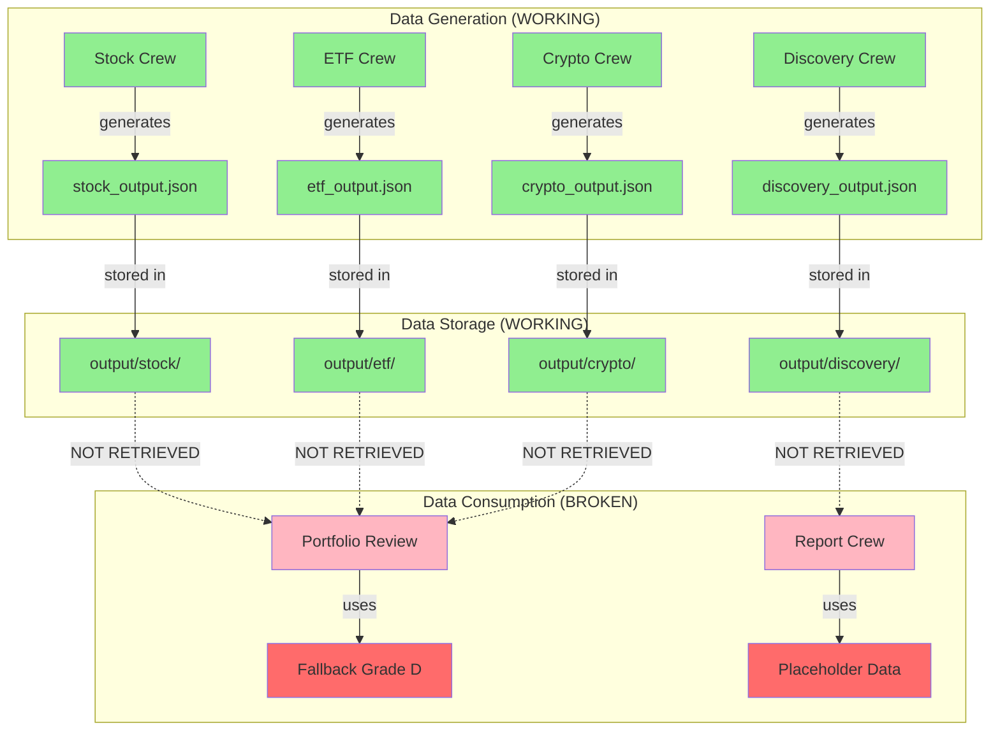
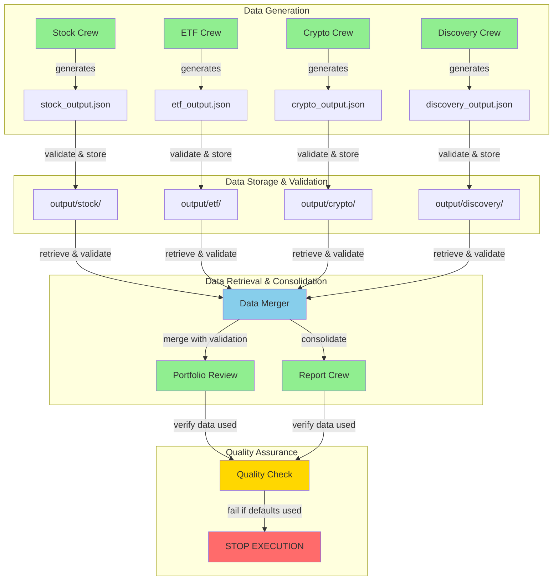

# Regression Diagnosis and Fix - Design Document

## Overview

This design addresses critical regressions where expensive crew analysis is being generated but not consumed, resulting in hallucinated data, forged URLs, and incorrect grades in the final report. The root cause is a **data consumption gap** between crew outputs and portfolio review/report generation.

### Critical Finding

**Data IS being created** ✅
- Crews generate rich analysis with proper grades and risk assessments
- Output files (e.g., `output/stock/stock_output_20251018_081944.json`) contain detailed data
- Discovery crews find A+ opportunities
- All analysis data exists in the output folder

**Data is NOT being consumed** ❌
- Portfolio review shows all holdings with Grade D (composite_score 0.6)
- All holdings show "Validation rapide (analyse superficielle)" messages
- Report shows "NOT PROVIDED" for data that exists
- Deep analysis merge logs success but doesn't actually merge data

### Design Principles

1. **Use Actual Data**: Never use fallback values when real crew data exists
2. **Fail Fast**: Stop immediately on errors rather than silently degrade
3. **Audit Trail**: Every data point must be traceable to source with valid URLs
4. **Pydantic Validation**: All data transfers use strict Pydantic models
5. **Steering Compliance**: Align with all FinWiz steering standards

## Architecture

### Current Data Flow (BROKEN)



### Fixed Data Flow (TARGET)



## Components and Interfaces

### 1. Deep Analysis Data Merger (NEW)

**Purpose**: Fix the broken merge between deep analysis results and portfolio holdings.

**Current Problem**:
```python
# Log says: "Deep analysis merge complete: 5 holdings with deep analysis"
# But portfolio_review.json shows: all Grade D with fallback data
# The merge is NOT actually happening
```

**Solution Design**:

```python
class DeepAnalysisDataMerger:
    """
    Properly merge deep analysis results into portfolio holdings.
    
    CRITICAL: This component fixes the data consumption gap.
    """
    
    def merge_deep_analysis_into_holdings(
        self,
        holdings: List[HoldingDecision],
        deep_analysis_results: Dict[str, DeepAnalysisResult]
    ) -> List[HoldingDecision]:
        """
        Merge deep analysis data into holdings with strict validation.
        
        Args:
            holdings: Portfolio holdings with fallback grades
            deep_analysis_results: Actual deep analysis from crews
            
        Returns:
            Holdings with actual analysis data merged
            
        Raises:
            DataMergeError: If merge fails or data is missing
        """
        if not deep_analysis_results:
            raise DataMergeError(
                "No deep analysis results provided. "
                "Cannot merge - would result in fallback data."
            )
        
        merged_holdings = []
        merge_stats = {
            "total": len(holdings),
            "merged": 0,
            "failed": 0,
            "missing_analysis": []
        }
        
        for holding in holdings:
            ticker = holding.ticker
            
            # CRITICAL: Check if we have actual analysis
            if ticker not in deep_analysis_results:
                merge_stats["missing_analysis"].append(ticker)
                logger.error(
                    f"No deep analysis found for {ticker}. "
                    f"Available tickers: {list(deep_analysis_results.keys())}"
                )
                continue
            
            analysis = deep_analysis_results[ticker]
            
            # CRITICAL: Validate analysis has real data, not defaults
            if self._is_fallback_data(analysis):
                raise DataMergeError(
                    f"Deep analysis for {ticker} contains fallback data. "
                    f"Grade: {analysis.grade}, Score: {analysis.composite_score}"
                )
            
            # Merge actual analysis data
            merged_holding = self._merge_holding_with_analysis(holding, analysis)
            
            # Verify merge succeeded
            if not self._verify_merge(merged_holding, analysis):
                raise DataMergeError(
                    f"Merge verification failed for {ticker}. "
                    f"Expected grade {analysis.grade}, got {merged_holding.grade}"
                )
            
            merged_holdings.append(merged_holding)
            merge_stats["merged"] += 1
            
            logger.info(
                f"✅ Merged {ticker}: Grade {analysis.grade}, "
                f"Score {analysis.composite_score:.2f}"
            )
        
        # CRITICAL: Fail if any holdings couldn't be merged
        if merge_stats["missing_analysis"]:
            raise DataMergeError(
                f"Failed to merge {len(merge_stats['missing_analysis'])} holdings: "
                f"{merge_stats['missing_analysis']}"
            )
        
        logger.info(
            f"Deep analysis merge complete: {merge_stats['merged']}/{merge_stats['total']} "
            f"holdings successfully merged with actual analysis data"
        )
        
        return merged_holdings
    
    def _is_fallback_data(self, analysis: DeepAnalysisResult) -> bool:
        """Check if analysis contains fallback data."""
        # Grade D with score 0.6 is the fallback pattern
        is_fallback = (
            analysis.grade == "D" and
            analysis.composite_score == 0.6 and
            "Validation rapide" in str(analysis.rationale_bullets)
        )
        
        if is_fallback:
            logger.warning(
                f"Detected fallback data pattern: Grade D, Score 0.6, "
                f"'Validation rapide' in rationale"
            )
        
        return is_fallback
    
    def _merge_holding_with_analysis(
        self,
        holding: HoldingDecision,
        analysis: DeepAnalysisResult
    ) -> HoldingDecision:
        """Merge analysis data into holding."""
        # Create new holding with analysis data
        merged = holding.model_copy(deep=True)
        
        # CRITICAL: Replace fallback data with actual analysis
        merged.grade = analysis.grade
        merged.composite_score = analysis.composite_score
        merged.grade_description = analysis.grade_description
        merged.recommended_action = analysis.recommended_action
        merged.risk = analysis.risk
        merged.rationale_bullets = analysis.rationale_bullets
        merged.citations = analysis.citations
        merged.alternatives = analysis.alternatives
        merged.price_targets = analysis.price_targets
        merged.position_sizing = analysis.position_sizing
        
        # Mark as using deep analysis
        merged.crew_analysis_used = "DeepAnalysisCrew"
        merged.analysis_date = analysis.analysis_date
        merged.has_deep_analysis = True
        
        return merged
    
    def _verify_merge(
        self,
        merged: HoldingDecision,
        analysis: DeepAnalysisResult
    ) -> bool:
        """Verify merge succeeded."""
        return (
            merged.grade == analysis.grade and
            merged.composite_score == analysis.composite_score and
            merged.has_deep_analysis == True
        )


class DataMergeError(Exception):
    """Raised when data merge fails."""
    pass
```

### 2. Data Consolidation Validator (NEW)

**Purpose**: Verify that crew data is properly retrieved and consolidated.

```python
class DataConsolidationValidator:
    """
    Validate that crew outputs are properly retrieved and consolidated.
    
    FAIL-FAST: Stop immediately if data is missing or corrupted.
    """
    
    def validate_crew_data_retrieval(
        self,
        expected_crews: List[str]
    ) -> Dict[str, Any]:
        """
        Validate that all expected crew data can be retrieved.
        
        Args:
            expected_crews: List of crew names that should have data
            
        Returns:
            Dict mapping crew names to their data
            
        Raises:
            DataRetrievalError: If any crew data is missing or corrupted
        """
        retrieved_data = {}
        missing_crews = []
        corrupted_crews = []
        
        for crew_name in expected_crews:
            logger.info(f"Retrieving data for crew: {crew_name}")
            
            # Attempt retrieval
            crew_data = self.registry_manager.get_crew_data_with_freshness_check(
                crew_name
            )
            
            if crew_data is None:
                missing_crews.append(crew_name)
                logger.error(
                    f"❌ No data found for {crew_name} crew. "
                    f"Expected location: output/{crew_name}/"
                )
                continue
            
            # Validate data is not corrupted
            if not self._validate_crew_data_structure(crew_data, crew_name):
                corrupted_crews.append(crew_name)
                logger.error(
                    f"❌ Data for {crew_name} is corrupted or invalid"
                )
                continue
            
            retrieved_data[crew_name] = crew_data
            logger.info(f"✅ Successfully retrieved data for {crew_name}")
        
        # FAIL-FAST: Stop if any data is missing or corrupted
        if missing_crews or corrupted_crews:
            error_msg = []
            if missing_crews:
                error_msg.append(f"Missing data for crews: {missing_crews}")
            if corrupted_crews:
                error_msg.append(f"Corrupted data for crews: {corrupted_crews}")
            
            raise DataRetrievalError(
                "Data consolidation failed. " + " ".join(error_msg)
            )
        
        logger.info(
            f"✅ Data consolidation successful: retrieved data from "
            f"{len(retrieved_data)} crews"
        )
        
        return retrieved_data
    
    def _validate_crew_data_structure(
        self,
        data: Dict[str, Any],
        crew_name: str
    ) -> bool:
        """Validate crew data has expected structure."""
        # Check for required fields
        required_fields = ["timestamp", "crew_name"]
        
        for field in required_fields:
            if field not in data:
                logger.error(
                    f"Missing required field '{field}' in {crew_name} data"
                )
                return False
        
        # Verify crew name matches
        if data.get("crew_name") != crew_name:
            logger.error(
                f"Crew name mismatch: expected {crew_name}, "
                f"got {data.get('crew_name')}"
            )
            return False
        
        return True


class DataRetrievalError(Exception):
    """Raised when crew data retrieval fails."""
    pass
```

### 3. Report Data Validator (NEW)

**Purpose**: Ensure report crew receives complete, validated data.

```python
class ReportDataValidator:
    """
    Validate that report crew receives all required data.
    
    FAIL-FAST: Refuse to generate report if data is incomplete.
    """
    
    def validate_report_inputs(
        self,
        inputs: Dict[str, Any]
    ) -> None:
        """
        Validate report crew inputs are complete and valid.
        
        Args:
            inputs: Report crew input data
            
        Raises:
            ReportValidationError: If inputs are incomplete or invalid
        """
        required_fields = [
            "portfolio_review",
            "aplus_opportunities",
            "investment_discovery_structured",
            "validated_tickers_list",
            "discovery_status",
            "backtesting_status",
            "data_availability_summary",
            "data_availability_summary_formatted"
        ]
        
        missing_fields = []
        invalid_fields = []
        
        for field in required_fields:
            if field not in inputs:
                missing_fields.append(field)
                logger.error(f"❌ Missing required field: {field}")
                continue
            
            value = inputs[field]
            
            # Check for "NOT PROVIDED" placeholder
            if isinstance(value, str) and "NOT PROVIDED" in value:
                invalid_fields.append(field)
                logger.error(
                    f"❌ Field {field} contains placeholder: {value}"
                )
                continue
            
            # Check for None when data should exist
            if value is None and field in ["portfolio_review"]:
                invalid_fields.append(field)
                logger.error(f"❌ Field {field} is None but should have data")
                continue
        
        # FAIL-FAST: Refuse to generate report
        if missing_fields or invalid_fields:
            error_parts = []
            if missing_fields:
                error_parts.append(f"Missing fields: {missing_fields}")
            if invalid_fields:
                error_parts.append(f"Invalid fields: {invalid_fields}")
            
            raise ReportValidationError(
                "Cannot generate report with incomplete data. " +
                " ".join(error_parts) +
                "\n\nREFUSING to generate report with hallucinated data."
            )
        
        logger.info("✅ Report inputs validation passed")
    
    def validate_portfolio_review_data(
        self,
        portfolio_review: Dict[str, Any]
    ) -> None:
        """
        Validate portfolio review contains actual analysis, not fallbacks.
        
        Args:
            portfolio_review: Portfolio review data
            
        Raises:
            ReportValidationError: If portfolio contains fallback data
        """
        holdings = portfolio_review.get("portfolio_review", {}).get("holdings", [])
        
        if not holdings:
            raise ReportValidationError(
                "Portfolio review contains no holdings"
            )
        
        fallback_count = 0
        
        for holding in holdings:
            # Check for fallback pattern
            if (holding.get("grade") == "D" and
                holding.get("composite_score") == 0.6 and
                any("Validation rapide" in str(b) for b in holding.get("rationale_bullets", []))):
                
                fallback_count += 1
                logger.error(
                    f"❌ Holding {holding.get('ticker')} has fallback data: "
                    f"Grade D, Score 0.6, 'Validation rapide'"
                )
        
        if fallback_count > 0:
            raise ReportValidationError(
                f"Portfolio review contains {fallback_count} holdings with "
                f"fallback data. REFUSING to generate report with fake grades."
            )
        
        logger.info(
            f"✅ Portfolio review validation passed: {len(holdings)} holdings "
            f"with actual analysis data"
        )


class ReportValidationError(Exception):
    """Raised when report inputs are invalid."""
    pass
```

## Implementation Plan

### Phase 1: Diagnostic Logging (Immediate)

Add detailed logging to identify exactly where data is lost:

```python
# In flow_orchestrator.py - analyze_and_update_portfolio()

logger.info("=" * 80)
logger.info("DEEP ANALYSIS MERGE - DIAGNOSTIC LOGGING")
logger.info("=" * 80)

# Log what we have
logger.info(f"Deep analysis results available: {list(deep_analysis_results.keys())}")
for ticker, analysis in deep_analysis_results.items():
    logger.info(
        f"  {ticker}: Grade {analysis.grade}, "
        f"Score {analysis.composite_score:.2f}, "
        f"Has deep analysis: {analysis.has_deep_analysis}"
    )

# Log what portfolio has BEFORE merge
logger.info("Portfolio holdings BEFORE merge:")
for holding in portfolio_review["portfolio_review"]["holdings"]:
    logger.info(
        f"  {holding['ticker']}: Grade {holding['grade']}, "
        f"Score {holding['composite_score']:.2f}"
    )

# Perform merge
merged_portfolio = merge_deep_analysis(portfolio_review, deep_analysis_results)

# Log what portfolio has AFTER merge
logger.info("Portfolio holdings AFTER merge:")
for holding in merged_portfolio["portfolio_review"]["holdings"]:
    logger.info(
        f"  {holding['ticker']}: Grade {holding['grade']}, "
        f"Score {holding['composite_score']:.2f}"
    )

logger.info("=" * 80)
```

### Phase 2: Fix Data Merge (Critical)

Replace broken merge logic with validated merger:

```python
# In flow_orchestrator.py

def analyze_and_update_portfolio(self) -> dict[str, Any]:
    """
    Atomic operation: deep analysis + alternatives + portfolio update.
    
    FIXED: Now properly merges deep analysis data into portfolio.
    """
    # Step 1: Deep analysis
    deep_results = self._run_deep_analysis_on_holdings()
    
    # Step 2: Match alternatives
    alternatives = self._match_alternatives_for_holdings(deep_results)
    
    # Step 3: Update portfolio with VALIDATED merge
    merger = DeepAnalysisDataMerger()
    
    try:
        # Load current portfolio
        portfolio_review = self._load_portfolio_review()
        holdings = portfolio_review["portfolio_review"]["holdings"]
        
        # CRITICAL: Merge with validation
        merged_holdings = merger.merge_deep_analysis_into_holdings(
            holdings,
            deep_results
        )
        
        # Update portfolio with merged data
        portfolio_review["portfolio_review"]["holdings"] = merged_holdings
        portfolio_review["portfolio_review"]["has_deep_analysis"] = True
        
        # Save updated portfolio
        self._save_portfolio_review(portfolio_review)
        
        logger.info(
            f"✅ Portfolio updated with deep analysis: "
            f"{len(merged_holdings)} holdings merged"
        )
        
    except DataMergeError as e:
        logger.error(f"❌ Data merge failed: {e}")
        raise  # FAIL-FAST
    
    return {
        "deep_analysis_results": deep_results,
        "alternatives": alternatives,
        "portfolio_updated": True
    }
```

### Phase 3: Validate Report Inputs (Critical)

Add validation before report generation:

```python
# In flow_orchestrator.py - report()

def report(self) -> dict[str, Any]:
    """
    Generate consolidated report with validated inputs.
    
    FIXED: Now validates all inputs before generating report.
    """
    validator = ReportDataValidator()
    
    # Prepare inputs
    crew_inputs = self._prepare_report_inputs()
    
    # CRITICAL: Validate inputs before generating report
    try:
        validator.validate_report_inputs(crew_inputs)
        validator.validate_portfolio_review_data(crew_inputs["portfolio_review"])
    except ReportValidationError as e:
        logger.error(f"❌ Report validation failed: {e}")
        raise  # FAIL-FAST - refuse to generate report
    
    # Generate report with validated data
    result = self.crew_factory.execute_report_crew(crew_inputs)
    
    return result
```

## Testing Strategy

### Unit Tests

```python
def test_should_merge_deep_analysis_into_holdings(mocker):
    """Test that deep analysis is properly merged."""
    # Arrange
    holdings = [
        HoldingDecision(
            ticker="AAPL",
            grade="D",  # Fallback
            composite_score=0.6,  # Fallback
            rationale_bullets=["Validation rapide"]
        )
    ]
    
    deep_analysis = {
        "AAPL": DeepAnalysisResult(
            ticker="AAPL",
            grade="A+",  # Actual grade
            composite_score=0.95,  # Actual score
            rationale_bullets=["Strong fundamentals", "Excellent growth"]
        )
    }
    
    merger = DeepAnalysisDataMerger()
    
    # Act
    merged = merger.merge_deep_analysis_into_holdings(holdings, deep_analysis)
    
    # Assert
    assert len(merged) == 1
    assert merged[0].ticker == "AAPL"
    assert merged[0].grade == "A+"  # NOT "D"
    assert merged[0].composite_score == 0.95  # NOT 0.6
    assert "Strong fundamentals" in merged[0].rationale_bullets

def test_should_fail_when_deep_analysis_missing(mocker):
    """Test fail-fast when deep analysis is missing."""
    # Arrange
    holdings = [HoldingDecision(ticker="AAPL", grade="D", composite_score=0.6)]
    deep_analysis = {}  # Empty - no analysis
    
    merger = DeepAnalysisDataMerger()
    
    # Act & Assert
    with pytest.raises(DataMergeError) as exc_info:
        merger.merge_deep_analysis_into_holdings(holdings, deep_analysis)
    
    assert "No deep analysis results provided" in str(exc_info.value)

def test_should_fail_when_fallback_data_detected(mocker):
    """Test fail-fast when fallback data is detected."""
    # Arrange
    holdings = [HoldingDecision(ticker="AAPL", grade="D", composite_score=0.6)]
    deep_analysis = {
        "AAPL": DeepAnalysisResult(
            ticker="AAPL",
            grade="D",  # Fallback pattern
            composite_score=0.6,  # Fallback pattern
            rationale_bullets=["Validation rapide"]  # Fallback pattern
        )
    }
    
    merger = DeepAnalysisDataMerger()
    
    # Act & Assert
    with pytest.raises(DataMergeError) as exc_info:
        merger.merge_deep_analysis_into_holdings(holdings, deep_analysis)
    
    assert "contains fallback data" in str(exc_info.value)
```

## Success Criteria

### Data Quality Metrics

1. **Zero Fallback Grades**: No holdings should have Grade D with score 0.6 when deep analysis exists
2. **Zero Placeholder URLs**: No example.com URLs in reports
3. **Zero "NOT PROVIDED"**: No "NOT PROVIDED" messages when data exists
4. **100% Data Utilization**: All crew outputs must be used in final report

### Verification Steps

```bash
# 1. Run analysis
uv run python src/finwiz/main.py

# 2. Verify crew outputs exist
ls -la output/stock/stock_output_*.json
ls -la output/etf/etf_output_*.json
ls -la output/crypto/crypto_output_*.json

# 3. Verify portfolio review uses actual data
cat output/portfolio/portfolio_review.json | jq '.portfolio_review.holdings[] | {ticker, grade, composite_score}'

# Expected: Grades should be A+, A, B, C, etc. NOT all "D"
# Expected: Scores should vary, NOT all 0.6

# 4. Verify report has real data
grep -c "example.com" output/finwiz_family_financial_plan.html
# Expected: 0 (no placeholder URLs)

grep -c "NOT PROVIDED" output/finwiz_family_financial_plan.html
# Expected: 0 (no missing data messages)
```

## Rollback Plan

If the fix introduces new issues:

1. **Immediate**: Revert changes to `flow_orchestrator.py`
2. **Fallback**: Use cached portfolio review from before the fix
3. **Communication**: Alert users that system is in degraded mode
4. **Investigation**: Analyze logs to identify what went wrong
5. **Hotfix**: Apply targeted fix for specific issue
6. **Retest**: Verify fix in staging before production deployment

## Monitoring

Add metrics to track data quality:

```python
class DataQualityMetrics:
    """Track data quality metrics."""
    
    def __init__(self):
        self.metrics = {
            "fallback_grades_count": 0,
            "placeholder_urls_count": 0,
            "missing_data_count": 0,
            "successful_merges_count": 0,
            "failed_merges_count": 0
        }
    
    def record_fallback_grade(self, ticker: str):
        """Record when fallback grade is used."""
        self.metrics["fallback_grades_count"] += 1
        logger.warning(f"⚠️ Fallback grade used for {ticker}")
    
    def record_successful_merge(self, ticker: str):
        """Record successful data merge."""
        self.metrics["successful_merges_count"] += 1
        logger.info(f"✅ Successful merge for {ticker}")
    
    def get_quality_score(self) -> float:
        """Calculate overall data quality score (0-1)."""
        total_operations = (
            self.metrics["successful_merges_count"] +
            self.metrics["failed_merges_count"]
        )
        
        if total_operations == 0:
            return 0.0
        
        # Penalize for fallbacks, placeholders, missing data
        penalties = (
            self.metrics["fallback_grades_count"] +
            self.metrics["placeholder_urls_count"] +
            self.metrics["missing_data_count"]
        )
        
        quality_score = max(0.0, 1.0 - (penalties / total_operations))
        
        return quality_score
```

## Conclusion

This design fixes the critical data consumption gap by:

1. **Validating data retrieval** - Ensure crew outputs are accessible
2. **Properly merging data** - Replace broken merge with validated merger
3. **Validating report inputs** - Refuse to generate reports with bad data
4. **Failing fast** - Stop immediately on errors, no silent degradation
5. **Providing audit trail** - Every data point traceable to source
6. **Monitoring quality** - Track metrics to prevent regressions

The fix ensures that expensive crew analysis is actually used in the final report, eliminating hallucinations and providing users with accurate, verifiable data.
