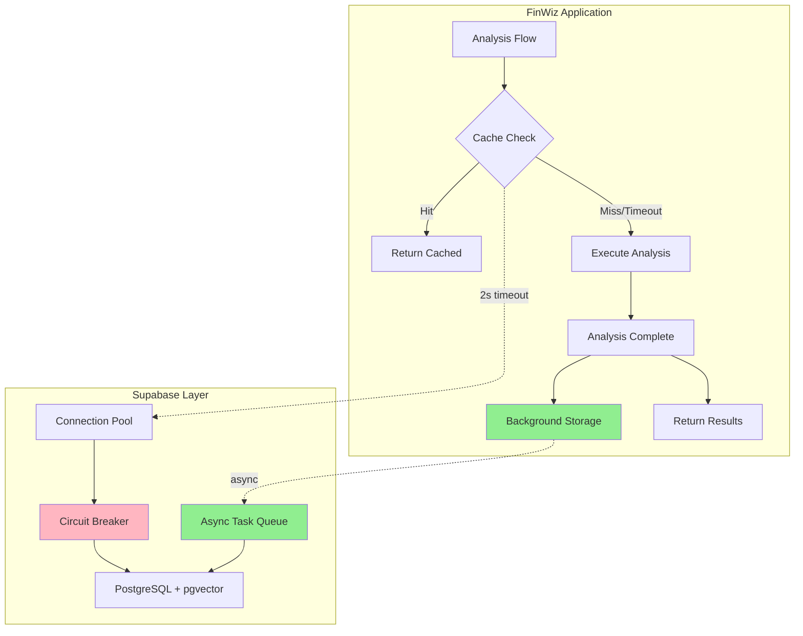

# Design Document

## Overview

This document describes the technical design for integrating Supabase as the centralized data persistence and vector storage layer for FinWiz. The design prioritizes **zero impact on analysis performance** through asynchronous operations, circuit breaker protection, and graceful degradation.

## Architecture

### High-Level Architecture



### Component Architecture

```
src/finwiz/
├── supabase/
│   ├── __init__.py
│   ├── client.py                    # Supabase client with connection pooling
│   ├── circuit_breaker.py           # Circuit breaker implementation
│   ├── models.py                    # Pydantic models for database schemas
│   ├── repositories/
│   │   ├── __init__.py
│   │   ├── analysis_repository.py   # Analysis CRUD operations
│   │   ├── portfolio_repository.py  # Portfolio snapshot operations
│   │   └── vector_repository.py     # Vector search operations
│   ├── services/
│   │   ├── __init__.py
│   │   ├── cache_service.py         # Analysis caching logic
│   │   ├── embedding_service.py     # Vector embedding generation
│   │   ├── migration_service.py     # Data migration from files
│   │   └── rag_service.py           # RAG context retrieval
│   └── utils/
│       ├── __init__.py
│       ├── async_tasks.py           # Background task management
│       └── monitoring.py            # Performance monitoring
```

## Components and Interfaces

### 1. Supabase Client (`client.py`)

**Purpose**: Manage Supabase connection with circuit breaker protection

**Interface**:
```python
from typing import Optional
from supabase import Client, create_client
from finwiz.supabase.circuit_breaker import CircuitBreaker

class SupabaseClient:
    """Supabase client with circuit breaker protection."""
    
    def __init__(self):
        self.url: str = os.getenv("SUPABASE_URL")
        self.key: str = os.getenv("SUPABASE_KEY")
        self.enabled: bool = os.getenv("SUPABASE_ENABLED", "true").lower() == "true"
        self.client: Optional[Client] = None
        self.circuit_breaker: CircuitBreaker = CircuitBreaker(
            failure_threshold=3,
            recovery_timeout=300  # 5 minutes
        )
    
    def get_client(self) -> Optional[Client]:
        """Get Supabase client if available and circuit is closed."""
        if not self.enabled:
            return None
        
        if self.circuit_breaker.is_open():
            logger.warning("Circuit breaker is open, skipping database operation")
            return None
        
        if not self.client:
            try:
                self.client = create_client(self.url, self.key)
                self.circuit_breaker.record_success()
            except Exception as e:
                self.circuit_breaker.record_failure()
                logger.error(f"Failed to connect to Supabase: {e}")
                return None
        
        return self.client
    
    def execute_with_timeout(
        self, 
        operation: callable, 
        timeout: float = 2.0
    ) -> Optional[Any]:
        """Execute operation with timeout and circuit breaker protection."""
        client = self.get_client()
        if not client:
            return None
        
        try:
            result = asyncio.wait_for(operation(client), timeout=timeout)
            self.circuit_breaker.record_success()
            return result
        except asyncio.TimeoutError:
            logger.warning(f"Database operation timed out after {timeout}s")
            self.circuit_breaker.record_failure()
            return None
        except Exception as e:
            logger.error(f"Database operation failed: {e}")
            self.circuit_breaker.record_failure()
            return None
```

**Key Features**:
- Connection pooling with lazy initialization
- Circuit breaker integration
- Timeout enforcement (default 2s for reads)
- Graceful failure handling

### 2. Circuit Breaker (`circuit_breaker.py`)

**Purpose**: Prevent cascading failures from database issues

**Interface**:
```python
from enum import Enum
from datetime import datetime, timedelta

class CircuitState(Enum):
    CLOSED = "closed"  # Normal operation
    OPEN = "open"      # Failures detected, skip operations
    HALF_OPEN = "half_open"  # Testing recovery

class CircuitBreaker:
    """Circuit breaker for database operations."""
    
    def __init__(self, failure_threshold: int = 3, recovery_timeout: int = 300):
        self.failure_threshold = failure_threshold
        self.recovery_timeout = recovery_timeout
        self.failure_count = 0
        self.last_failure_time: Optional[datetime] = None
        self.state = CircuitState.CLOSED
    
    def is_open(self) -> bool:
        """Check if circuit breaker is open."""
        if self.state == CircuitState.OPEN:
            # Check if recovery timeout has passed
            if self.last_failure_time:
                elapsed = (datetime.now() - self.last_failure_time).total_seconds()
                if elapsed >= self.recovery_timeout:
                    self.state = CircuitState.HALF_OPEN
                    logger.info("Circuit breaker entering half-open state")
                    return False
            return True
        return False
    
    def record_success(self):
        """Record successful operation."""
        if self.state == CircuitState.HALF_OPEN:
            logger.info("Circuit breaker closing after successful test")
            self.state = CircuitState.CLOSED
        self.failure_count = 0
    
    def record_failure(self):
        """Record failed operation."""
        self.failure_count += 1
        self.last_failure_time = datetime.now()
        
        if self.failure_count >= self.failure_threshold:
            if self.state != CircuitState.OPEN:
                logger.warning(
                    f"Circuit breaker opening after {self.failure_count} failures"
                )
                self.state = CircuitState.OPEN
```

**Key Features**:
- Three states: CLOSED, OPEN, HALF_OPEN
- Automatic recovery attempt after timeout
- Configurable failure threshold
- Thread-safe operation

### 3. Analysis Repository (`repositories/analysis_repository.py`)

**Purpose**: CRUD operations for analysis storage and retrieval

**Interface**:
```python
from typing import Optional, List
from datetime import datetime, timedelta
from finwiz.supabase.models import AnalysisRecord
from finwiz.schemas.crew_exports import CrewExport

class AnalysisRepository:
    """Repository for analysis storage and retrieval."""
    
    def __init__(self, client: SupabaseClient):
        self.client = client
        self.table = "analyses"
    
    async def get_cached_analysis(
        self,
        ticker: str,
        asset_class: str,
        ttl_hours: int = 24
    ) -> Optional[AnalysisRecord]:
        """Get cached analysis if within TTL."""
        cutoff_time = datetime.now() - timedelta(hours=ttl_hours)
        
        def query(client):
            return (
                client.table(self.table)
                .select("*")
                .eq("ticker", ticker.upper())
                .eq("asset_class", asset_class.lower())
                .gte("created_at", cutoff_time.isoformat())
                .order("created_at", desc=True)
                .limit(1)
                .execute()
            )
        
        result = self.client.execute_with_timeout(query, timeout=2.0)
        if result and result.data:
            return AnalysisRecord(**result.data[0])
        return None
    
    async def store_analysis(
        self,
        ticker: str,
        asset_class: str,
        export_data: CrewExport
    ) -> bool:
        """Store analysis asynchronously (background task)."""
        def insert(client):
            return (
                client.table(self.table)
                .insert({
                    "ticker": ticker.upper(),
                    "asset_class": asset_class.lower(),
                    "composite_score": export_data.composite_score,
                    "grade": export_data.grade,
                    "recommendation": export_data.recommendation,
                    "export_json": export_data.model_dump(),
                    "created_at": datetime.now().isoformat()
                })
                .execute()
            )
        
        # Execute in background task (non-blocking)
        asyncio.create_task(
            self._store_with_retry(insert)
        )
        return True  # Return immediately
    
    async def _store_with_retry(self, operation: callable, max_retries: int = 3):
        """Store with exponential backoff retry."""
        for attempt in range(max_retries):
            try:
                result = self.client.execute_with_timeout(operation, timeout=5.0)
                if result:
                    logger.info("Analysis stored successfully")
                    return
            except Exception as e:
                logger.error(f"Store attempt {attempt + 1} failed: {e}")
                if attempt < max_retries - 1:
                    await asyncio.sleep(2 ** attempt)  # Exponential backoff
        
        logger.error("Failed to store analysis after all retries")
```

**Key Features**:
- Async storage with background tasks
- Cache retrieval with strict timeout
- Exponential backoff retry for writes
- Non-blocking operations

### 4. Vector Repository (`repositories/vector_repository.py`)

**Purpose**: Vector embedding storage and semantic search

**Interface**:
```python
from typing import List, Tuple
from finwiz.supabase.services.embedding_service import EmbeddingService

class VectorRepository:
    """Repository for vector operations."""
    
    def __init__(self, client: SupabaseClient):
        self.client = client
        self.embedding_service = EmbeddingService()
        self.table = "analysis_embeddings"
    
    async def store_embedding(
        self,
        analysis_id: str,
        text: str
    ) -> bool:
        """Store vector embedding asynchronously."""
        # Generate embedding
        embedding = await self.embedding_service.generate_embedding(text)
        
        def insert(client):
            return (
                client.table(self.table)
                .insert({
                    "analysis_id": analysis_id,
                    "embedding": embedding,
                    "text": text,
                    "created_at": datetime.now().isoformat()
                })
                .execute()
            )
        
        # Execute in background task
        asyncio.create_task(
            self.client.execute_with_timeout(insert, timeout=5.0)
        )
        return True
    
    async def search_similar(
        self,
        query: str,
        limit: int = 5,
        similarity_threshold: float = 0.7
    ) -> List[Tuple[str, float]]:
        """Search for similar analyses using vector similarity."""
        # Generate query embedding
        query_embedding = await self.embedding_service.generate_embedding(query)
        
        def search(client):
            # Use pgvector similarity search
            return (
                client.rpc(
                    "match_analyses",
                    {
                        "query_embedding": query_embedding,
                        "match_threshold": similarity_threshold,
                        "match_count": limit
                    }
                )
                .execute()
            )
        
        result = self.client.execute_with_timeout(search, timeout=2.0)
        if result and result.data:
            return [(r["analysis_id"], r["similarity"]) for r in result.data]
        return []
```

**Key Features**:
- OpenAI text-embedding-3-small integration
- pgvector similarity search
- Configurable similarity threshold
- Async embedding generation

### 5. Cache Service (`services/cache_service.py`)

**Purpose**: High-level caching logic with fallback

**Interface**:
```python
from typing import Optional
from finwiz.schemas.crew_exports import CrewExport
from finwiz.supabase.repositories.analysis_repository import AnalysisRepository

class CacheService:
    """Service for analysis caching."""
    
    def __init__(self, repository: AnalysisRepository):
        self.repository = repository
        self.ttl_hours = int(os.getenv("ANALYSIS_CACHE_TTL_HOURS", "24"))
    
    async def get_or_execute(
        self,
        ticker: str,
        asset_class: str,
        execute_fn: callable
    ) -> Tuple[CrewExport, bool]:
        """Get cached analysis or execute crew."""
        # Try cache first (with timeout)
        cached = await self.repository.get_cached_analysis(
            ticker, asset_class, self.ttl_hours
        )
        
        if cached:
            logger.info(f"Cache hit for {ticker} ({asset_class})")
            return CrewExport(**cached.export_json), True
        
        # Cache miss or timeout - execute crew
        logger.info(f"Cache miss for {ticker} ({asset_class}), executing crew")
        result = await execute_fn()
        
        # Store result asynchronously (non-blocking)
        await self.repository.store_analysis(ticker, asset_class, result)
        
        return result, False
```

**Key Features**:
- Transparent caching layer
- Non-blocking storage
- Configurable TTL
- Cache hit/miss tracking

### 6. RAG Service (`services/rag_service.py`)

**Purpose**: Retrieve historical context for AI agents

**Interface**:
```python
from typing import List, Optional
from finwiz.supabase.repositories.vector_repository import VectorRepository
from finwiz.supabase.repositories.analysis_repository import AnalysisRepository

class RAGService:
    """Service for RAG context retrieval."""
    
    def __init__(
        self,
        vector_repo: VectorRepository,
        analysis_repo: AnalysisRepository
    ):
        self.vector_repo = vector_repo
        self.analysis_repo = analysis_repo
    
    async def get_context(
        self,
        query: str,
        limit: int = 3
    ) -> Optional[List[dict]]:
        """Get historical context for query."""
        # Search for similar analyses
        similar = await self.vector_repo.search_similar(query, limit=limit)
        
        if not similar:
            logger.info("No similar analyses found for RAG context")
            return None
        
        # Retrieve full analysis records
        context = []
        for analysis_id, similarity in similar:
            analysis = await self.analysis_repo.get_by_id(analysis_id)
            if analysis:
                context.append({
                    "ticker": analysis.ticker,
                    "asset_class": analysis.asset_class,
                    "grade": analysis.grade,
                    "recommendation": analysis.recommendation,
                    "similarity": similarity,
                    "summary": analysis.export_json.get("summary", "")
                })
        
        logger.info(f"Retrieved {len(context)} analyses for RAG context")
        return context if context else None
```

**Key Features**:
- Vector similarity search
- Top-k retrieval (default 3)
- Graceful failure handling
- Context formatting for agents

## Data Models

### Database Schema

```sql
-- Enable pgvector extension
CREATE EXTENSION IF NOT EXISTS vector;

-- Analyses table
CREATE TABLE analyses (
    id UUID PRIMARY KEY DEFAULT gen_random_uuid(),
    ticker VARCHAR(10) NOT NULL,
    asset_class VARCHAR(20) NOT NULL,
    composite_score FLOAT,
    grade VARCHAR(5),
    recommendation VARCHAR(10),
    export_json JSONB NOT NULL,
    created_at TIMESTAMP WITH TIME ZONE DEFAULT NOW(),
    updated_at TIMESTAMP WITH TIME ZONE DEFAULT NOW(),
    
    -- Indexes for performance
    INDEX idx_ticker_asset (ticker, asset_class),
    INDEX idx_created_at (created_at DESC),
    INDEX idx_grade (grade)
);

-- Analysis embeddings table
CREATE TABLE analysis_embeddings (
    id UUID PRIMARY KEY DEFAULT gen_random_uuid(),
    analysis_id UUID REFERENCES analyses(id) ON DELETE CASCADE,
    embedding vector(1536),  -- OpenAI text-embedding-3-small
    text TEXT NOT NULL,
    created_at TIMESTAMP WITH TIME ZONE DEFAULT NOW(),
    
    -- Index for vector similarity search
    INDEX idx_embedding ON analysis_embeddings USING ivfflat (embedding vector_cosine_ops)
);

-- Portfolio snapshots table
CREATE TABLE portfolio_snapshots (
    id UUID PRIMARY KEY DEFAULT gen_random_uuid(),
    snapshot_date TIMESTAMP WITH TIME ZONE DEFAULT NOW(),
    total_value FLOAT,
    holdings JSONB NOT NULL,
    created_at TIMESTAMP WITH TIME ZONE DEFAULT NOW(),
    
    INDEX idx_snapshot_date (snapshot_date DESC)
);

-- Vector similarity search function
CREATE OR REPLACE FUNCTION match_analyses(
    query_embedding vector(1536),
    match_threshold float,
    match_count int
)
RETURNS TABLE (
    analysis_id UUID,
    similarity float
)
LANGUAGE plpgsql
AS $$
BEGIN
    RETURN QUERY
    SELECT
        ae.analysis_id,
        1 - (ae.embedding <=> query_embedding) AS similarity
    FROM analysis_embeddings ae
    WHERE 1 - (ae.embedding <=> query_embedding) > match_threshold
    ORDER BY ae.embedding <=> query_embedding
    LIMIT match_count;
END;
$$;
```

### Pydantic Models

```python
from pydantic import BaseModel, Field
from datetime import datetime
from typing import Optional, Dict, Any

class AnalysisRecord(BaseModel):
    """Database record for analysis."""
    id: str
    ticker: str
    asset_class: str
    composite_score: float
    grade: str
    recommendation: str
    export_json: Dict[str, Any]
    created_at: datetime
    updated_at: datetime

class PortfolioSnapshot(BaseModel):
    """Database record for portfolio snapshot."""
    id: str
    snapshot_date: datetime
    total_value: float
    holdings: Dict[str, Any]
    created_at: datetime

class EmbeddingRecord(BaseModel):
    """Database record for vector embedding."""
    id: str
    analysis_id: str
    embedding: List[float] = Field(..., min_length=1536, max_length=1536)
    text: str
    created_at: datetime
```

## Error Handling

### Error Hierarchy

```python
class SupabaseError(Exception):
    """Base exception for Supabase operations."""
    pass

class ConnectionError(SupabaseError):
    """Failed to connect to Supabase."""
    pass

class TimeoutError(SupabaseError):
    """Operation timed out."""
    pass

class CircuitBreakerOpenError(SupabaseError):
    """Circuit breaker is open."""
    pass
```

### Error Handling Strategy

1. **Connection Failures**: Log error, open circuit breaker, continue with file-based storage
2. **Timeout Errors**: Log warning, proceed with fresh analysis (cache miss)
3. **Write Failures**: Log error, retry with exponential backoff (background task)
4. **Circuit Breaker Open**: Skip database operations, use file-based storage

## Testing Strategy

### Unit Tests

```python
# Test cache service
def test_should_return_cached_analysis_when_within_ttl(mocker):
    """Verify cache hit returns stored analysis."""
    # Arrange
    mock_repo = mocker.Mock()
    mock_repo.get_cached_analysis.return_value = AnalysisRecord(...)
    service = CacheService(mock_repo)
    
    # Act
    result, is_cached = await service.get_or_execute("AAPL", "stock", lambda: None)
    
    # Assert
    assert is_cached is True
    assert result.ticker == "AAPL"

# Test circuit breaker
def test_should_open_circuit_after_threshold_failures():
    """Verify circuit breaker opens after failures."""
    # Arrange
    breaker = CircuitBreaker(failure_threshold=3)
    
    # Act
    for _ in range(3):
        breaker.record_failure()
    
    # Assert
    assert breaker.is_open() is True
```

### Integration Tests

```python
@pytest.mark.integration
async def test_should_store_and_retrieve_analysis():
    """Integration test for full storage/retrieval cycle."""
    # Requires real Supabase connection
    client = SupabaseClient()
    repo = AnalysisRepository(client)
    
    # Store analysis
    export = StockCrewExport(ticker="AAPL", ...)
    await repo.store_analysis("AAPL", "stock", export)
    
    # Retrieve analysis
    cached = await repo.get_cached_analysis("AAPL", "stock")
    
    assert cached is not None
    assert cached.ticker == "AAPL"
```

### Performance Tests

```python
@pytest.mark.performance
async def test_cache_check_completes_within_timeout():
    """Verify cache check respects timeout."""
    # Arrange
    client = SupabaseClient()
    repo = AnalysisRepository(client)
    
    # Act
    start = time.time()
    result = await repo.get_cached_analysis("AAPL", "stock")
    duration = time.time() - start
    
    # Assert
    assert duration < 2.5  # 2s timeout + 0.5s buffer
```

## Integration Points

### 1. Flow Integration

```python
# In finwiz/flows/flow_orchestrator.py

from finwiz.supabase.services.cache_service import CacheService

class FinwizFlow(Flow[FinwizState]):
    def __init__(self):
        super().__init__()
        self.cache_service = CacheService(...)
    
    @listen("check_portfolio")
    async def analyze_holdings_deep(self) -> dict[str, Any]:
        """Analyze holdings with caching."""
        results = {}
        
        for holding in self.state.portfolio_holdings:
            # Try cache first
            analysis, is_cached = await self.cache_service.get_or_execute(
                ticker=holding.ticker,
                asset_class=holding.asset_class,
                execute_fn=lambda: self._execute_deep_analysis(holding)
            )
            
            results[holding.ticker] = analysis
            
            if is_cached:
                logger.info(f"Used cached analysis for {holding.ticker}")
        
        return {"deep_analysis_results": results}
```

### 2. RAG Integration

```python
# In finwiz/crews/stock_crew/stock_crew.py

from finwiz.supabase.services.rag_service import RAGService

class StockCrew(CrewBase):
    def __init__(self):
        super().__init__()
        self.rag_service = RAGService(...)
    
    @task
    def analysis_task(self) -> Task:
        return Task(
            description=self._get_task_description_with_rag(),
            agent=self.analyst(),
            ...
        )
    
    async def _get_task_description_with_rag(self) -> str:
        """Get task description with RAG context."""
        base_description = self.tasks_config["analysis_task"]["description"]
        
        # Get historical context
        context = await self.rag_service.get_context(
            query=f"Analysis of {self.ticker} stock"
        )
        
        if context:
            rag_context = "\n\nHistorical Context:\n"
            for item in context:
                rag_context += f"- {item['ticker']} ({item['grade']}): {item['summary']}\n"
            return base_description + rag_context
        
        return base_description
```

## Deployment Considerations

### Environment Variables

```bash
# Supabase Configuration
SUPABASE_ENABLED=true
SUPABASE_URL=https://your-project.supabase.co
SUPABASE_KEY=your-anon-key

# Cache Configuration
ANALYSIS_CACHE_TTL_HOURS=24

# Circuit Breaker Configuration
CIRCUIT_BREAKER_FAILURE_THRESHOLD=3
CIRCUIT_BREAKER_RECOVERY_TIMEOUT=300

# Performance Configuration
DATABASE_READ_TIMEOUT=2.0
DATABASE_WRITE_TIMEOUT=5.0
```

### Database Setup

1. Create Supabase project
2. Enable pgvector extension
3. Run schema migration SQL
4. Configure row-level security policies
5. Set up connection pooling

### Monitoring

```python
# Metrics to track
- cache_hit_rate: Percentage of cache hits
- cache_miss_rate: Percentage of cache misses
- circuit_breaker_state: Current circuit breaker state
- database_operation_duration: Time for database operations
- background_task_success_rate: Success rate of async writes
- embedding_generation_duration: Time to generate embeddings
```

## Migration Strategy

### Phase 1: Infrastructure Setup
1. Create Supabase project and database schema
2. Implement core client and circuit breaker
3. Add environment variable configuration
4. Deploy with SUPABASE_ENABLED=false

### Phase 2: Storage Implementation
1. Implement analysis repository
2. Add background storage tasks
3. Test with small portfolio (< 10 holdings)
4. Monitor performance impact

### Phase 3: Caching Implementation
1. Implement cache service
2. Integrate with flow orchestrator
3. Test cache hit/miss scenarios
4. Measure cost savings

### Phase 4: Vector Search
1. Implement embedding service
2. Add vector repository
3. Migrate existing analyses
4. Test semantic search

### Phase 5: RAG Integration
1. Implement RAG service
2. Integrate with crew task descriptions
3. Test with historical context
4. Measure recommendation quality

### Phase 6: Full Rollout
1. Enable for all users (SUPABASE_ENABLED=true)
2. Monitor performance and reliability
3. Optimize based on metrics
4. Document best practices

---

**Version**: 1.0  
**Created**: 2025-10-30  
**Status**: Design Complete
