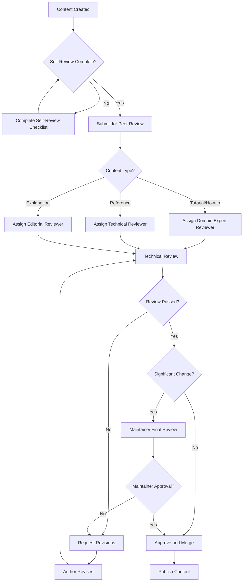

# Documentation Operations and Governance

Operational procedures for managing, deploying, and maintaining the FinWiz MkDocs documentation site.

## Content Review Process

### Review Workflow



### Review Criteria

#### Technical Accuracy

- [ ] **Code examples work**: All code has been tested
- [ ] **Current information**: No outdated references or deprecated features
- [ ] **Complete coverage**: All necessary information included
- [ ] **Correct procedures**: Step-by-step instructions are accurate

#### Content Quality

- [ ] **Clear objectives**: User knows what they'll accomplish
- [ ] **Appropriate audience**: Content matches intended skill level
- [ ] **Logical structure**: Information flows in sensible order
- [ ] **Actionable content**: User can successfully follow instructions

#### Editorial Standards

- [ ] **Grammar and spelling**: No errors in language
- [ ] **Style compliance**: Follows established style guide
- [ ] **Consistent terminology**: Uses standard FinWiz terms
- [ ] **Proper formatting**: Correct use of markdown and structure

#### Framework Compliance

- [ ] **Diátaxis alignment**: Content fits chosen category correctly
- [ ] **Template usage**: Follows appropriate content template
- [ ] **Navigation integration**: Properly integrated into site structure
- [ ] **Cross-references**: Links to related content where appropriate

### Review Types

#### Standard Review

**Triggers**:
- New content creation
- Minor content updates
- Regular maintenance updates

**Process**:
1. Author completes self-review checklist
2. Single reviewer assigned based on content type
3. Review completed within 3 business days
4. Feedback provided with specific, actionable comments
5. Author addresses feedback and resubmits
6. Reviewer approves or requests additional changes

#### Comprehensive Review

**Triggers**:
- Major content restructuring
- New content categories or templates
- Significant technical changes
- User feedback indicating problems

**Process**:
1. Multiple reviewers assigned (technical + editorial)
2. Extended review period (5-7 business days)
3. Review board discussion if needed
4. Detailed feedback with improvement recommendations
5. Multiple revision cycles if necessary
6. Final maintainer approval required

#### Emergency Review

**Triggers**:
- Critical errors in published content
- Security-related documentation updates
- Time-sensitive information updates

**Process**:
1. Immediate reviewer assignment
2. 24-hour review turnaround
3. Expedited approval process
4. Post-publication comprehensive review scheduled

## Approval Workflows

### Approval Authority Matrix

| Content Type | Creator | Reviewer | Maintainer | Notes |
|--------------|---------|----------|------------|-------|
| New tutorials | Create | Required | Optional | Standard review process |
| How-to guides | Create | Required | Optional | Domain expert review |
| Reference docs | Create | Required | Optional | Technical accuracy critical |
| Explanations | Create | Required | Optional | Editorial review important |
| Style guide changes | Propose | Required | Required | Affects all content |
| Template updates | Propose | Required | Required | Structural changes |
| Navigation changes | Propose | Required | Required | Site-wide impact |
| Major restructuring | Propose | Required | Required | Strategic decision |

### Approval Criteria

#### Automatic Approval

Content that can be approved without maintainer review:
- Minor text corrections (typos, grammar)
- Code example updates (same functionality)
- Link updates (same destination, new URL)
- Image replacements (same content, better quality)

#### Maintainer Approval Required

Content requiring maintainer review:
- New content categories or sections
- Changes to site structure or navigation
- Updates to style guide or templates
- Content that affects multiple pages
- Controversial or sensitive topics

### Escalation Process

#### Reviewer Disagreement

When reviewers disagree:
1. **Discussion phase**: Reviewers discuss concerns directly
2. **Compromise attempt**: Seek middle-ground solution
3. **Maintainer decision**: Escalate to maintainer for final decision
4. **Documentation**: Record decision rationale for future reference

#### Author-Reviewer Conflict

When author disagrees with reviewer feedback:
1. **Clarification request**: Author requests specific clarification
2. **Discussion**: Direct discussion between author and reviewer
3. **Second opinion**: Request additional reviewer if needed
4. **Maintainer mediation**: Escalate to maintainer if unresolved

## Setup and Deployment

### Prerequisites

#### System Requirements

- **Python**: 3.8 or higher
- **uv**: Python package manager (recommended)
- **Git**: Version control
- **Node.js**: For additional tooling (optional)

#### Environment Setup

1. **Install uv** (if not already installed):

   ```bash
   # macOS/Linux
   curl -LsSf https://astral.sh/uv/install.sh | sh
   
   # Windows
   powershell -c "irm https://astral.sh/uv/install.ps1 | iex"
   ```

2. **Clone the repository**:

   ```bash
   git clone https://github.com/finwiz/finwiz.git
   cd finwiz
   ```

3. **Install dependencies**:

   ```bash
   make docs-install
   # or manually:
   uv sync --group docs
   ```

### Local Development

#### Starting the Development Server

```bash
# Start MkDocs development server
make docs-serve

# Manual command
uv run mkdocs serve --dev-addr 127.0.0.1:8000
```

The documentation will be available at `http://127.0.0.1:8000` with hot reload enabled.

#### Development Workflow

1. **Edit documentation files** in the `docs/` directory
2. **Preview changes** in your browser (auto-refreshes)
3. **Validate changes** before committing:

   ```bash
   make docs-validate
   ```

4. **Commit and push** your changes

#### File Structure

```
docs/
├── index.md                    # Homepage
├── tutorials/                  # Learning-oriented content
├── how-to/                    # Problem-solving guides
├── reference/                 # Information-oriented content
├── explanations/              # Understanding-oriented content
├── assets/                    # Images, icons, etc.
├── stylesheets/              # Custom CSS
├── javascripts/              # Custom JavaScript
├── overrides/                # Theme customizations
└── includes/                 # Reusable content snippets
```

### Build Process

#### Local Build

```bash
# Standard build
make docs-build

# Production build (optimized)
make docs-build-production

# Fast build (no optimization)
make docs-build-fast
```

#### Build Validation

```bash
# Standard validation
make docs-validate

# Strict validation (fails on warnings)
make docs-validate-strict

# Validate built site
make docs-validate-build
```

#### Build Artifacts

- **Output directory**: `site/`
- **Static files**: HTML, CSS, JS, images
- **Search index**: For full-text search functionality

### Deployment

#### GitHub Pages (Recommended)

**Automatic deployment** via GitHub Actions:

1. **Push to main branch** triggers automatic deployment
2. **Site URL**: `https://finwiz.github.io/finwiz/`
3. **Custom domain**: Configure in repository settings

**Manual deployment**:

```bash
# Deploy to GitHub Pages
make docs-deploy

# Force deployment
make docs-deploy-force
```

#### Production Deployment

```bash
# Deploy to production
make docs-deploy-production

# Zero-downtime deployment
make docs-deploy-zero-downtime

# Check deployment status
make docs-status
```

#### Staging Deployment

```bash
# Deploy to staging
make docs-deploy-staging

# Zero-downtime staging deployment
make docs-deploy-zero-downtime-staging

# Check staging status
make docs-status-staging
```

#### Rollback Procedures

```bash
# Rollback production
make docs-rollback

# Rollback staging
make docs-rollback-staging
```

### Configuration Management

#### MkDocs Configuration (`mkdocs.yml`)

Key configuration sections:

```yaml
site_name: FinWiz Documentation
site_description: AI-powered financial analysis platform documentation
site_url: https://finwiz-docs.example.com

theme:
  name: material
  features:
    - navigation.tabs
    - navigation.sections
    - search.highlight
    - content.code.copy

plugins:
  - search
  - awesome-pages
  - mermaid2

markdown_extensions:
  - pymdownx.superfences
  - pymdownx.tabbed
  - admonition
  - toc
```

#### Environment Variables

Set these for production deployment:

```bash
# Google Analytics (optional)
export GOOGLE_ANALYTICS_KEY="G-XXXXXXXXXX"

# Custom domain (optional)
export DOCS_DOMAIN="docs.finwiz.com"
```

#### Theme Customization

- **Custom CSS**: `docs/stylesheets/extra.css`
- **Custom JavaScript**: `docs/javascripts/`
- **Theme overrides**: `docs/overrides/`
- **Assets**: `docs/assets/`

## Troubleshooting

### Quick Diagnostics

#### Health Check Commands

Run these commands to quickly identify issues:

```bash
# Check documentation health
make docs-validate

# Validate build
make docs-build

# Check for linting issues
make docs-lint

# Verbose build for detailed errors
uv run mkdocs build --verbose
```

#### Common Error Patterns

| Error Type | Quick Fix | Section |
|------------|-----------|---------|
| Build fails | Check syntax, links | [Build Issues](#build-issues) |
| Navigation missing | Check `.pages` files | [Navigation Issues](#navigation-issues) |
| Search not working | Rebuild site | [Search Issues](#search-issues) |
| Deployment fails | Check permissions | [Deployment Issues](#deployment-issues) |
| Slow performance | Optimize images | [Performance Issues](#performance-issues) |

### Build Issues

#### Build Fails with Syntax Errors

**Symptom**:
```
Error: Invalid YAML syntax in mkdocs.yml
```

**Diagnosis**:
```bash
# Check YAML syntax
python -c "import yaml; yaml.safe_load(open('mkdocs.yml'))"

# Check markdown syntax
make docs-lint
```

**Solutions**:

1. **YAML syntax errors**:
   ```bash
   # Common issues:
   # - Missing quotes around special characters
   # - Incorrect indentation
   # - Missing colons or dashes
   
   # Fix example:
   # Wrong:
   site_name: FinWiz Documentation: AI Platform
   
   # Correct:
   site_name: "FinWiz Documentation: AI Platform"
   ```

2. **Markdown syntax errors**:
   ```bash
   # Check specific file
   markdownlint docs/path/to/file.md
   
   # Common fixes:
   # - Add language to code blocks
   # - Fix heading hierarchy
   # - Close unclosed elements
   ```

#### Build Fails with Missing Files

**Symptom**:
```
Error: Documentation file 'path/to/file.md' does not exist
```

**Solutions**:

1. **Create missing file**:
   ```bash
   touch docs/path/to/file.md
   echo "# Placeholder" > docs/path/to/file.md
   ```

2. **Remove from navigation**:
   ```yaml
   # In .pages or mkdocs.yml, remove or comment out:
   # - missing-file.md
   ```

3. **Fix file path**:
   ```yaml
   # Check for typos in navigation
   nav:
     - "Correct Path": correct-path.md
   ```

### Navigation Issues

#### Pages Not Appearing in Navigation

**Symptom**:
- Files exist but don't show in site navigation
- Navigation structure doesn't match expected layout

**Solutions**:

1. **Add to .pages file**:
   ```yaml
   # docs/tutorials/.pages
   nav:
     - Getting Started: getting-started.md
     - New Tutorial: new-tutorial.md
   ```

2. **Add to mkdocs.yml**:
   ```yaml
   nav:
     - Home: index.md
     - Tutorials:
       - tutorials/getting-started.md
       - tutorials/new-tutorial.md
   ```

3. **Check file naming**:
   ```bash
   # Ensure files use correct naming convention
   # Use hyphens, not underscores or spaces
   mv "file name.md" "file-name.md"
   ```

### Search Issues

#### Search Returns No Results

**Solutions**:

1. **Rebuild search index**:
   ```bash
   # Clean and rebuild
   make docs-clean
   make docs-build
   ```

2. **Check search plugin configuration**:
   ```yaml
   plugins:
     - search:
         separator: '[\s\-,:!=\[\]()"`/]+|\.(?!\d)|&[lg]t;|(?!\b)(?=[A-Z][a-z])'
         lang: en
   ```

3. **Clear browser cache**:
   ```bash
   # Hard refresh in browser
   # Ctrl+Shift+R (Windows/Linux)
   # Cmd+Shift+R (macOS)
   ```

### Deployment Issues

#### GitHub Pages Deployment Fails

**Solutions**:

1. **Fix repository permissions**:
   ```bash
   # Ensure you have write access to repository
   # Check GitHub Pages source branch setting
   ```

2. **Configure deployment key**:
   ```bash
   # Generate SSH key if needed
   ssh-keygen -t rsa -b 4096 -C "your_email@example.com"
   
   # Add to GitHub repository deploy keys
   ```

3. **Use HTTPS instead of SSH**:
   ```bash
   git remote set-url origin https://github.com/username/repo.git
   ```

### Performance Issues

#### Slow Page Load Times

**Solutions**:

1. **Optimize images**:
   ```bash
   # Compress PNG images
   find docs -name "*.png" -exec optipng -o2 {} \;
   
   # Compress JPEG images
   find docs -name "*.jpg" -exec jpegoptim --max=85 {} \;
   ```

2. **Enable compression**:
   ```yaml
   # In mkdocs.yml
   plugins:
     - minify:
         minify_html: true
         minify_css: true
         minify_js: true
   ```

3. **Optimize theme configuration**:
   ```yaml
   theme:
     features:
       - navigation.instant      # Faster navigation
       - navigation.prefetch     # Prefetch pages
   ```

## Content Audit and Maintenance

### Regular Audit Schedule

#### Monthly Audits

**Scope**: High-traffic and critical content
**Focus Areas**:
- Accuracy of code examples
- Currency of external links
- User feedback and reported issues
- Analytics data review

**Process**:
1. Review analytics for top 20 pages
2. Check for reported issues or user feedback
3. Validate external links and references
4. Update outdated information
5. Schedule comprehensive review if needed

#### Quarterly Audits

**Scope**: Complete content inventory
**Focus Areas**:
- Content relevance and usefulness
- Structural organization and navigation
- Compliance with current standards
- Gap analysis for missing content

**Process**:
1. Complete content inventory and categorization
2. User journey analysis and pain point identification
3. Content performance analysis (engagement, bounce rate)
4. Competitive analysis and best practice review
5. Strategic recommendations for improvements

#### Annual Reviews

**Scope**: Comprehensive governance assessment
**Focus Areas**:
- Overall content strategy effectiveness
- Governance process improvements
- Technology and tooling updates
- Team structure and role definitions

**Process**:
1. Stakeholder feedback collection
2. Process efficiency analysis
3. Technology stack review and updates
4. Governance framework refinement
5. Strategic planning for next year

### Update Triggers

#### Automatic Updates

Content that should be updated automatically:
- **Code changes**: When APIs or functionality changes
- **Version updates**: When software versions change
- **Link rot**: When external links become invalid
- **Security updates**: When security practices change

#### Reactive Updates

Content updated in response to:
- **User feedback**: Reports of confusion or errors
- **Support tickets**: Common questions or issues
- **Analytics data**: High bounce rates or low engagement
- **Team feedback**: Internal reports of outdated information

#### Proactive Updates

Content updated proactively:
- **Industry changes**: New best practices or standards
- **Technology evolution**: New tools or methodologies
- **User needs evolution**: Changing user expectations
- **Competitive landscape**: Keeping pace with industry

### Maintenance Tasks

#### Regular Maintenance

**Weekly**:
- [ ] Check for broken links: `make docs-validate`
- [ ] Review and update outdated content
- [ ] Monitor site performance

**Monthly**:
- [ ] Update dependencies: `uv sync --group docs`
- [ ] Review analytics and user feedback
- [ ] Audit content for accuracy

**Quarterly**:
- [ ] Full content audit and reorganization
- [ ] Performance optimization review
- [ ] Security updates and dependency upgrades

#### Dependency Updates

```bash
# Update all dependencies
uv sync --group docs --upgrade

# Update specific package
uv add mkdocs-material@latest --group docs
```

#### Backup Procedures

**Content backup**:
- Documentation is version-controlled in Git
- Regular repository backups via GitHub

**Site backup**:
- Built site is stored in `gh-pages` branch
- Can be restored from any commit

## Security Considerations

### Access Control

- **Repository access**: Managed via GitHub permissions
- **Deployment keys**: Stored as GitHub Secrets
- **Custom domains**: Configure HTTPS and security headers

### Content Security

- **Sensitive information**: Never commit API keys or secrets
- **External links**: Regularly audit for security
- **User-generated content**: Validate and sanitize

### HTTPS Configuration

For custom domains:

1. **Configure DNS**: Point domain to GitHub Pages
2. **Enable HTTPS**: In repository settings
3. **Force HTTPS**: Redirect HTTP to HTTPS

## Support and Resources

### Getting Help

1. **Internal documentation**: Check this guide and content standards
2. **GitHub Issues**: Report bugs and request features
3. **Team chat**: Ask questions in development channels
4. **External resources**: MkDocs and Material theme documentation

### External Resources

- **MkDocs**: https://www.mkdocs.org/
- **Material Theme**: https://squidfunk.github.io/mkdocs-material/
- **Diátaxis Framework**: https://diataxis.fr/

---

**Version**: 3.0  
**Last Updated**: 2025-10-26  
**Consolidated from**: content-governance.md, setup-deployment-guide.md, troubleshooting-guide.md, content-audit-schedule.md