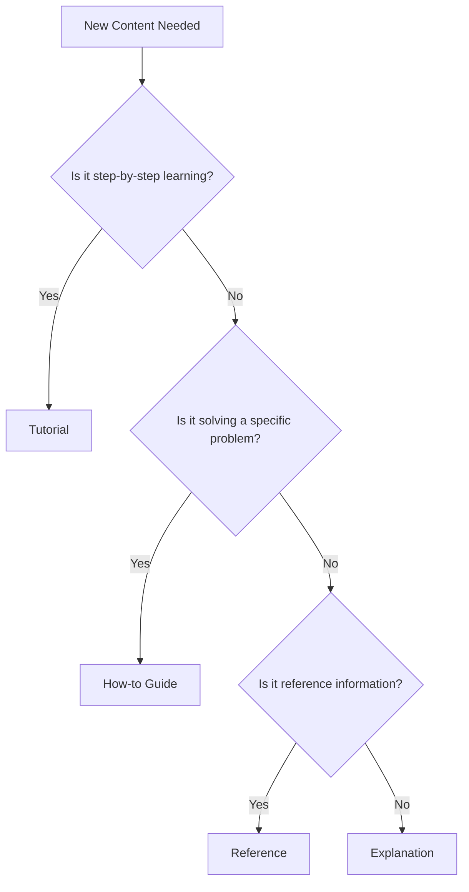

# Documentation Standards for FinWiz

Comprehensive standards for creating, organizing, and maintaining technical documentation in the FinWiz project.

## Documentation Architecture

### Diátaxis Framework (Required)

Organize all documentation using the four-category Diátaxis framework:

| Type | Purpose | Location | Examples |
|------|---------|----------|----------|
| **Tutorials** | Learning by doing | `docs/tutorials/` | Getting started, first analysis |
| **How-to Guides** | Solving problems | `docs/how-to/` | Deploy service, configure APIs |
| **Reference** | Information lookup | `docs/reference/` | API docs, CLI commands |
| **Explanation** | Understanding concepts | `docs/explanations/` | Architecture, design principles |

### Content Decision Tree



### Directory Structure (Required)

```
docs/
├── index.md                    # Main entry point
├── tutorials/
│   ├── getting_started.md
│   └── first_analysis.md
├── how-to/
│   ├── setup_environment.md
│   └── configure_crews.md
├── reference/
│   ├── api/
│   ├── cli_commands.md
│   └── schemas/
└── explanations/
    ├── architecture.md
    └── flow_patterns.md
```

## File Organization Standards

### Naming Conventions

- **Files**: `snake_case.md` for consistency with Python codebase
- **Directories**: `kebab-case/` for URL-friendly paths
- **One concept per file**: Each major topic gets its own file
- **Descriptive names**: `portfolio_analysis_guide.md` not `guide.md`

### Content Structure

**Every documentation file must include:**

1. **Clear H1 title** (only one per file)
2. **Purpose statement** in first paragraph
3. **Logical H2/H3 hierarchy**
4. **Code examples** with proper syntax highlighting
5. **Cross-references** using relative links

### Template Pattern

```markdown
# Document Title

Brief description of what this document covers and who should read it.

## Prerequisites

- Required knowledge
- System requirements
- Dependencies

## Main Content

### Section 1

Content with examples...

### Section 2

More content...

## Next Steps

- Links to related documentation
- Suggested follow-up actions

## References

- External links
- Related internal docs
```

## Writing Style Standards

### Voice and Tone

#### Active Voice

Use active voice to make instructions clear and direct.

✅ **Correct**:

- "Configure the API key in your environment"
- "The system validates the input data"
- "Run the command to start the server"

❌ **Avoid**:

- "The API key should be configured in your environment"
- "The input data is validated by the system"
- "The command should be run to start the server"

#### Present Tense

Use present tense for current functionality and procedures.

✅ **Correct**:

- "The application connects to the database"
- "Click the button to save changes"
- "The function returns a boolean value"

❌ **Avoid**:

- "The application will connect to the database"
- "You would click the button to save changes"
- "The function would return a boolean value"

#### Direct Address

Address the reader directly using "you" rather than impersonal constructions.

✅ **Correct**:

- "You can configure multiple environments"
- "When you run the command, you'll see output"
- "Follow these steps to complete setup"

❌ **Avoid**:

- "One can configure multiple environments"
- "When the command is run, output will be seen"
- "These steps should be followed to complete setup"

#### Professional but Approachable

Maintain a professional tone while being friendly and accessible.

✅ **Correct**:

- "This guide walks you through the setup process"
- "Let's configure your development environment"
- "You'll find this feature helpful for debugging"

❌ **Too casual**:

- "This guide is gonna show you how to set things up"
- "Let's hack together your dev environment"
- "This feature is pretty cool for debugging"

❌ **Too formal**:

- "This document shall provide comprehensive instructions"
- "One must configure the development environment"
- "This feature provides utility for debugging purposes"

### Language Guidelines

#### Clarity and Simplicity

**Use simple, common words** when possible:

✅ **Preferred**: use, help, show, start, stop, make, get
❌ **Avoid**: utilize, facilitate, demonstrate, initiate, terminate, construct, obtain

**Keep sentences concise** (aim for 15-20 words):

✅ **Good**: "Run this command to install the required dependencies."
❌ **Too long**: "Execute the following command in your terminal to install all of the required dependencies that are needed for the application to function properly."

**Be specific and precise**:

✅ **Specific**: "Set the timeout to 30 seconds"
❌ **Vague**: "Set an appropriate timeout value"

#### Consistency

**Use consistent terminology** throughout all documentation:

| Preferred Term | Avoid |
|----------------|-------|
| API key | API token, access key, secret key |
| configuration | config, settings (unless referring to specific files) |
| command line | terminal, console, shell (unless specifically referring to those) |
| repository | repo (in formal documentation) |
| directory | folder (in technical contexts) |

**Maintain consistent formatting** for similar elements:

- File names: `filename.py`
- Commands: `make docs-serve`
- Variables: `API_KEY`
- UI elements: **Bold text**

#### Inclusivity

**Use gender-neutral language**:

✅ **Inclusive**: "When a developer needs to...", "The user can..."
❌ **Avoid**: "When he needs to...", "The user can configure his settings..."

**Consider non-native English speakers**:

- Avoid idioms and cultural references
- Define technical terms when first used
- Use simple sentence structures
- Provide context for abbreviations

**Use accessible language** for the target audience:

- Match technical complexity to audience expertise
- Explain concepts before using them
- Provide links to background information
- Use progressive disclosure (simple to complex)

## Content Templates

### Tutorial Template

```markdown
# Tutorial Title

Brief description of what the user will learn and accomplish.

## Prerequisites

- Requirement 1
- Requirement 2
- Link to setup guide if needed

## What You'll Learn

By the end of this tutorial, you'll be able to:

- [ ] Learning objective 1
- [ ] Learning objective 2
- [ ] Learning objective 3

## Step 1: [Action Verb] [Object]

Explanation of what we're doing and why.

```bash
# Code example with explanation
command --option value
```

Expected output:

```
Output example
```

## Step 2: [Next Action]

Continue with clear, sequential steps...

## Troubleshooting

Common issues and solutions:

### Issue: Problem description

**Symptoms**: What the user sees
**Cause**: Why it happens
**Solution**: How to fix it

## Next Steps

- Link to related tutorials
- Link to how-to guides for advanced topics
- Link to reference documentation

## Summary

Recap what was accomplished and key takeaways.

```

### How-to Guide Template

```markdown
# How to [Accomplish Specific Task]

Brief description of the problem this guide solves.

## Prerequisites

- Requirement 1
- Requirement 2

## Overview

Quick summary of the approach and main steps.

## Method 1: [Approach Name] (Recommended)

### When to Use

Describe scenarios where this method is best.

### Steps

1. **Action 1**: Detailed instruction
   ```bash
   command example
   ```

2. **Action 2**: Next instruction

   ```bash
   another command
   ```

### Verification

How to confirm the task was completed successfully:

```bash
verification command
```

## Method 2: [Alternative Approach]

### When to Use

When Method 1 isn't suitable...

### Steps

Alternative approach steps...

## Troubleshooting

Common problems and solutions.

## Related Guides

- Link to related how-to guides
- Link to reference documentation

```

### Reference Template

```markdown
# [Component/API/Tool] Reference

Comprehensive reference for [component name].

## Overview

Brief description of what this component does.

## Quick Reference

| Item | Description | Example |
|------|-------------|---------|
| Item 1 | Description | `example` |
| Item 2 | Description | `example` |

## Detailed Reference

### Section 1

Comprehensive details...

#### Subsection

Specific information...

### Parameters/Options

| Parameter | Type | Required | Description | Default |
|-----------|------|----------|-------------|---------|
| param1 | string | Yes | Description | - |
| param2 | int | No | Description | 0 |

### Examples

#### Basic Example

```python
# Code example with explanation
example_code()
```

#### Advanced Example

```python
# More complex example
advanced_example()
```

## See Also

- Related reference pages
- Relevant tutorials
- How-to guides

```

### Explanation Template

```markdown
# [Concept/System] Explanation

Introduction to the concept and why it matters.

## Overview

High-level explanation of the concept.

## Background

Historical context or motivation for the concept.

## How It Works

Detailed explanation of the underlying mechanisms.

### Key Concepts

#### Concept 1

Explanation of important concept...

#### Concept 2

Another important concept...

## Benefits and Trade-offs

### Benefits

- Benefit 1
- Benefit 2

### Trade-offs

- Trade-off 1
- Trade-off 2

## Real-world Applications

Examples of how this concept is used in practice.

## Further Reading

- Links to tutorials
- Links to how-to guides
- External resources
```

## Formatting Standards

### Code and Commands

#### Code Blocks

Always specify the language for syntax highlighting:

```markdown
```python
def example_function():
    """Example function with docstring."""
    return "Hello, World!"
```

```bash
# Shell commands with comments
make docs-serve --port 8080
```

```yaml
# Configuration files
site_name: FinWiz Documentation
theme:
  name: material
```

```

#### Inline Code

Use backticks for inline code elements:

- File names: `config.yaml`
- Commands: `make install`
- Variables: `API_KEY`
- Function names: `analyze_stock()`
- Short code snippets: `return True`

#### Command Examples

**Include comments** for clarity:

```bash
# Install documentation dependencies
make docs-install

# Start development server on custom port
mkdocs serve --dev-addr 127.0.0.1:8080
```

**Show expected output** when helpful:

```bash
$ make docs-serve
🚀 Starting MkDocs development server...
INFO    -  Building documentation...
INFO    -  Serving on http://127.0.0.1:8000
```

**Use consistent prompt symbols**:

- `$` for regular user commands
- `#` for root/admin commands
- No prompt for code that should be copied

### Lists

#### Unordered Lists

Use for non-sequential items:

```markdown
- First item
- Second item
- Third item
  - Nested item
  - Another nested item
```

#### Ordered Lists

Use for sequential steps or ranked items:

```markdown
1. First step
2. Second step
3. Third step
   1. Sub-step
   2. Another sub-step
```

#### Task Lists

Use for checklists and requirements:

```markdown
- [ ] Incomplete task
- [x] Completed task
- [ ] Another incomplete task
```

### Links

#### Internal Links

Use relative paths for internal documentation links:

```markdown
# Link to file in same directory
[Related guide](related-guide.md)

# Link to file in parent directory
[Setup guide](../setup/installation.md)

# Link to specific section
[Configuration section](../setup/installation.md#configuration)
```

#### External Links

Use full URLs for external links:

```markdown
[MkDocs Documentation](https://www.mkdocs.org/)
[Python Official Site](https://python.org/)
```

#### Link Text

**Use descriptive link text**:

✅ **Good**: "See the [installation guide](setup.md) for details"
❌ **Avoid**: "Click [here](setup.md) for more information"

**Avoid "link" in link text**:

✅ **Good**: "Download the [configuration file](config.yaml)"
❌ **Avoid**: "Download the [configuration file link](config.yaml)"

### Images

#### Image Syntax

```markdown

*Optional caption text*
```

#### Alt Text Guidelines

**Write descriptive alt text** that explains the image content:

✅ **Good**: "Screenshot of the dashboard showing portfolio performance metrics"
❌ **Poor**: "Dashboard screenshot"

**For decorative images**, use empty alt text:

```markdown

```

#### Image Optimization

- **File size**: Keep under 500KB when possible
- **Format**: Use PNG for screenshots, JPG for photos, SVG for diagrams
- **Dimensions**: Optimize for web display (max 1200px wide)
- **Naming**: Use descriptive, kebab-case file names

### Tables

#### Basic Table Format

```markdown
| Column 1 | Column 2 | Column 3 |
|----------|----------|----------|
| Data 1   | Data 2   | Data 3   |
| Data 4   | Data 5   | Data 6   |
```

#### Table Alignment

```markdown
| Left Aligned | Center Aligned | Right Aligned |
|:-------------|:--------------:|--------------:|
| Left         | Center         | Right         |
| Text         | Text           | Text          |
```

#### Table Guidelines

- **Keep tables simple**: Avoid complex nested information
- **Use headers**: Always include descriptive column headers
- **Consistent formatting**: Align similar data types consistently
- **Alternative formats**: Consider lists for simple two-column data

### Admonitions

#### Standard Admonitions

```markdown
!!! note
    Additional information that's helpful but not critical.

!!! tip
    Helpful suggestions or best practices.

!!! warning
    Important information that could prevent errors.

!!! danger
    Critical information about potential problems or security issues.
```

#### Custom Titles

```markdown
!!! note "Custom Title"
    Admonition with custom title text.
```

#### Collapsible Admonitions

```markdown
??? note "Click to expand"
    This content is collapsed by default.

???+ warning "Expanded by default"
    This content is expanded by default but can be collapsed.
```

## Technical Writing Guidelines

### API Documentation

#### Function Documentation

```markdown
## `analyze_stock(ticker, period=365)`

Analyzes stock performance and generates investment recommendations.

**Parameters:**

| Parameter | Type | Required | Description | Default |
|-----------|------|----------|-------------|---------|
| `ticker` | string | Yes | Stock ticker symbol (e.g., "AAPL") | - |
| `period` | integer | No | Analysis period in days | 365 |

**Returns:**

`StockAnalysis` object containing:
- `recommendation`: "BUY", "HOLD", or "SELL"
- `confidence`: Float between 0.0 and 1.0
- `risk_score`: Integer between 1 and 10

**Example:**

```python
analysis = analyze_stock("AAPL", period=180)
print(f"Recommendation: {analysis.recommendation}")
print(f"Confidence: {analysis.confidence:.2f}")
```

**Raises:**

- `InvalidTickerError`: If ticker symbol is invalid
- `APIError`: If external data sources are unavailable

```

#### Error Documentation

```markdown
## Error Handling

### Common Errors

#### `InvalidTickerError`

**Cause**: Invalid or non-existent ticker symbol
**Solution**: Verify ticker symbol exists and is properly formatted
**Example**: "AAPL" not "Apple" or "aapl"

#### `APIError`

**Cause**: External API unavailable or rate limited
**Solution**: Check API key configuration and retry after delay
**Prevention**: Implement proper error handling and retry logic
```

### Configuration Documentation

#### Environment Variables

```markdown
## Environment Variables

| Variable | Required | Description | Example | Default |
|----------|----------|-------------|---------|---------|
| `OPENAI_API_KEY` | Yes | OpenAI API key for LLM calls | `sk-proj-...` | - |
| `DEBUG_MODE` | No | Enable debug logging | `true` | `false` |
| `CACHE_TTL` | No | Cache timeout in seconds | `3600` | `1800` |
```

#### Configuration Files

```markdown
## Configuration File: `config.yaml`

```yaml
# Database configuration
database:
  host: localhost
  port: 5432
  name: finwiz_db

# API settings
api:
  timeout: 30
  retries: 3
```

**Configuration Options:**

- `database.host`: Database server hostname
- `database.port`: Database server port (default: 5432)
- `api.timeout`: Request timeout in seconds (default: 30)

```

### Tutorial Writing

#### Step-by-Step Instructions

```markdown
## Step 1: Install Dependencies

Install the required Python packages using uv:

```bash
uv sync --group docs
```

This command will:

- Install MkDocs and the Material theme
- Set up all required plugins
- Configure the development environment

**Expected output:**

```
✅ Documentation dependencies installed
```

## Step 2: Configure MkDocs

Create the configuration file...

```

#### Verification Steps

```markdown
## Verify Installation

Confirm everything is working correctly:

1. **Check MkDocs version**:
   ```bash
   uv run mkdocs --version
   ```

   Expected output: `mkdocs, version 1.5.x`

2. **Test build process**:

   ```bash
   make docs-build
   ```

   Should complete without errors.

3. **Start development server**:

   ```bash
   make docs-serve
   ```

   Visit http://127.0.0.1:8000 to see the documentation site.

```

## Code Documentation Standards

### Code Blocks (Required)

Always use fenced code blocks with language specification:

```python
# ✅ CORRECT - Language specified
def analyze_stock(ticker: str) -> StockAnalysis:
    """Analyze stock with proper error handling."""
    return StockAnalysis(ticker=ticker)
```

### Examples Must Be Runnable

All code examples should be:

- **Syntactically correct**
- **Executable** in the FinWiz environment
- **Include imports** when necessary
- **Show expected output** when helpful

### FinWiz-Specific Patterns

Document common patterns used in the codebase:

```python
# CrewAI agent definition
@agent
def stock_analyst(self) -> Agent:
    return Agent(
        config=self.agents_config["stock_analyst"],
        tools=get_stock_crew_tools(include_rag=True),
        verbose=True
    )

# Pydantic validation
class TickerInput(BaseModel):
    symbol: str = Field(..., pattern=r'^[A-Z]{1,5}$')
    
    model_config = {"str_strip_whitespace": True}
```

## Quality Assurance

### Content Quality Checklist

#### Accuracy

- [ ] **Technical accuracy**: All code examples work
- [ ] **Current information**: No outdated references
- [ ] **Complete coverage**: All necessary information included
- [ ] **Correct links**: All links work and point to right content

#### Usability

- [ ] **Clear objectives**: User knows what they'll accomplish
- [ ] **Logical flow**: Information in sensible order
- [ ] **Appropriate depth**: Right level of detail for audience
- [ ] **Actionable content**: User can follow instructions

#### Accessibility

- [ ] **Alt text**: All images have descriptive alt text
- [ ] **Heading structure**: Proper heading hierarchy
- [ ] **Color contrast**: Text readable in light/dark modes
- [ ] **Screen reader friendly**: Content works with assistive technology

#### SEO and Discoverability

- [ ] **Descriptive titles**: Clear, searchable page titles
- [ ] **Meta descriptions**: Helpful page descriptions
- [ ] **Internal linking**: Connected to related content
- [ ] **Search keywords**: Uses terms users would search for

### Validation Tools

#### Automated Checks

```bash
# Markdown linting
make docs-lint

# Link validation
make docs-validate

# Build validation
make docs-build
```

#### Manual Review

- **Readability**: Read content aloud
- **User testing**: Have someone follow instructions
- **Cross-browser testing**: Check in different browsers
- **Mobile testing**: Verify mobile experience

## Integration with Codebase

### Inline Documentation

Follow Python docstring standards:

```python
def analyze_portfolio(holdings: List[Holding]) -> PortfolioAnalysis:
    """Analyze portfolio holdings and generate recommendations.
    
    Args:
        holdings: List of portfolio holdings to analyze
        
    Returns:
        PortfolioAnalysis with recommendations and risk assessment
        
    Raises:
        ValidationError: If holdings data is invalid
        APIError: If external data sources are unavailable
    """
```

### Schema Documentation

All Pydantic models must include field descriptions:

```python
class StockAnalysis(BaseModel):
    ticker: str = Field(..., description="Stock ticker symbol (e.g., AAPL)")
    recommendation: str = Field(..., description="BUY, HOLD, or SELL")
    confidence: float = Field(..., ge=0.0, le=1.0, description="Confidence level 0-1")
```

## Anti-Patterns (Avoid)

❌ **Monolithic files** - Split large documents into focused files
❌ **Generic titles** - Use specific, descriptive headings
❌ **Untested code** - All examples must be verified
❌ **Broken links** - Validate all cross-references
❌ **Inconsistent terminology** - Use standard FinWiz terms
❌ **Missing context** - Always explain prerequisites
❌ **Outdated examples** - Keep code examples current

---

**Version**: 3.0  
**Last Updated**: 2025-10-26  
**Consolidated from**: documentation_manager.md, style-guide.md, content-creation-guide.md
