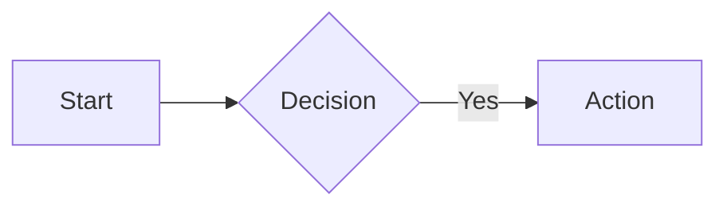

# MkDocs Migration Summary

## Overview

FinWiz documentation has been successfully migrated from Jekyll to MkDocs with Material theme. This provides a modern, feature-rich documentation experience with better developer workflow integration.

## What Changed

### New Files

1. **`mkdocs.yml`** - Main MkDocs configuration
   - Site metadata and navigation structure
   - Material theme configuration with light/dark mode
   - Plugin configuration (search, mermaid, git-revision-date)
   - Markdown extensions for enhanced formatting

2. **`.github/workflows/docs.yml`** - Automated documentation deployment
   - Builds documentation on push to main
   - Validates documentation on pull requests
   - Deploys to GitHub Pages automatically

3. **`docs/stylesheets/extra.css`** - Custom styling
   - FinWiz brand colors
   - Feature grid layout
   - Performance metric displays
   - API endpoint badges
   - Custom admonition styles

4. **`docs/javascripts/mathjax.js`** - Math rendering configuration
   - MathJax setup for mathematical notation
   - Inline and display math support

5. **`docs/includes/abbreviations.md`** - Auto-expanded abbreviations
   - Common acronyms (AI, API, ETF, etc.)
   - Financial terms (ROE, P/E, RSI, etc.)

6. **`docs/MKDOCS_SETUP.md`** - Documentation setup guide
   - Local development instructions
   - Writing guide with examples
   - Deployment procedures
   - Troubleshooting tips

### Updated Files

1. **`Makefile`** - Documentation commands updated
   - `make docs-serve` - Now uses MkDocs (was Jekyll)
   - `make docs-build` - Build static documentation
   - `make docs-deploy` - Deploy to GitHub Pages
   - `make docs-clean` - Clean build artifacts

2. **`.gitignore`** - Added MkDocs artifacts
   - `site/` - Built documentation
   - `.cache/` - Plugin cache

### Preserved Files

- All existing documentation in `docs/` directory
- Existing Jekyll `_config.yml` (for backward compatibility)
- All markdown content files

## Migration Benefits

### Developer Experience

1. **Faster builds**: MkDocs is Python-based, no Ruby dependencies
2. **Live reload**: Instant preview of documentation changes
3. **Integrated workflow**: Uses uv like the rest of the project
4. **Better search**: Full-text search with suggestions
5. **Modern UI**: Material Design with responsive layout

### Features

1. **Light/Dark mode**: Automatic theme switching
2. **Code blocks**: Syntax highlighting with copy button
3. **Mermaid diagrams**: Flowcharts and diagrams in markdown
4. **Math support**: LaTeX-style mathematical notation
5. **Tabbed content**: Organize information with tabs
6. **Admonitions**: Notes, warnings, tips with icons
7. **Git integration**: Shows last updated dates
8. **Instant loading**: Fast navigation with prefetching

### Documentation Organization

Follows the [Diátaxis framework](https://diataxis.fr/):

- **Tutorials**: Step-by-step learning guides
- **How-To Guides**: Task-oriented problem solving
- **Reference**: Technical API documentation
- **Explanations**: Conceptual understanding

## Getting Started

### Local Development

```bash
# Preview documentation locally
make docs-serve

# Build documentation
make docs-build

# Deploy to GitHub Pages
make docs-deploy
```

### Writing Documentation

```markdown
# Use admonitions for callouts
!!! note "Important"
    This is a note with custom title

!!! tip
    Pro tip for users!

# Add code blocks with syntax highlighting
```python
def example():
    return "Hello, World!"
```

# Create diagrams with Mermaid


# Use tabs for multiple options
=== "Option 1"
    Content for option 1

=== "Option 2"
    Content for option 2
```

### Deployment

#### Automatic (Recommended)

GitHub Actions automatically deploys documentation when:
- Changes are pushed to `main` in `docs/` or `mkdocs.yml`
- Manual workflow dispatch from GitHub UI

#### Manual

```bash
make docs-deploy
```

This builds and pushes to `gh-pages` branch.

## Configuration

### GitHub Pages Settings

1. Go to: Repository Settings → Pages
2. Set Source: `gh-pages` branch
3. Folder: `/ (root)`

Documentation will be available at:
`https://fjacquet.github.io/finwiz/`

### Local Preview

```bash
# Start development server
make docs-serve

# Open http://127.0.0.1:8000
```

Changes to markdown files are reflected immediately.

## Customization

### Theme Colors

Edit `mkdocs.yml`:

```yaml
theme:
  palette:
    primary: indigo  # Change primary color
    accent: blue     # Change accent color
```

### Navigation

Edit `mkdocs.yml` nav section:

```yaml
nav:
  - Home: index.md
  - Getting Started:
      - Installation: install.md
      - Quickstart: quickstart.md
```

### Custom CSS

Add styles to `docs/stylesheets/extra.css`:

```css
.custom-class {
    color: #3f51b5;
}
```

### Plugins

Add to `mkdocs.yml`:

```yaml
plugins:
  - search
  - mermaid2
  - git-revision-date-localized
```

## Troubleshooting

### Build Errors

```bash
# Build with strict mode to see warnings
uv run mkdocs build --strict
```

### Port in Use

```bash
# Use different port
uv run mkdocs serve -a localhost:8001
```

### Missing Dependencies

```bash
# Reinstall dependencies
uv sync --reinstall
```

## Validation

Test that everything works:

```bash
# 1. Build documentation
make docs-build

# 2. Check for errors
ls -la site/

# 3. Preview locally
make docs-serve

# 4. Test navigation and features
# - Open http://127.0.0.1:8000
# - Test light/dark mode toggle
# - Test search functionality
# - Test mobile responsiveness
```

## Next Steps

1. **Review navigation structure** in `mkdocs.yml`
2. **Add missing pages** to nav or create index pages
3. **Test on GitHub Pages** after first deploy
4. **Update README.md** to reference new documentation URL
5. **Consider adding**:
   - Code API documentation with mkdocstrings
   - Changelog plugin for version tracking
   - PDF export for offline reading
   - Versioning with mike

## Resources

- [MkDocs Documentation](https://www.mkdocs.org/)
- [Material for MkDocs](https://squidfunk.github.io/mkdocs-material/)
- [Setup Guide](docs/MKDOCS_SETUP.md)
- [Diátaxis Framework](https://diataxis.fr/)

## Support

For issues or questions:
1. Check [MKDOCS_SETUP.md](docs/MKDOCS_SETUP.md)
2. Review [Material for MkDocs docs](https://squidfunk.github.io/mkdocs-material/)
3. Open GitHub issue with `documentation` label

## Summary

✅ MkDocs installed and configured
✅ Material theme with light/dark mode
✅ Custom styling and branding
✅ GitHub Actions CI/CD pipeline
✅ Automatic deployment to GitHub Pages
✅ Local development workflow
✅ Comprehensive setup documentation

The documentation is now production-ready and will automatically deploy on every push to main.
