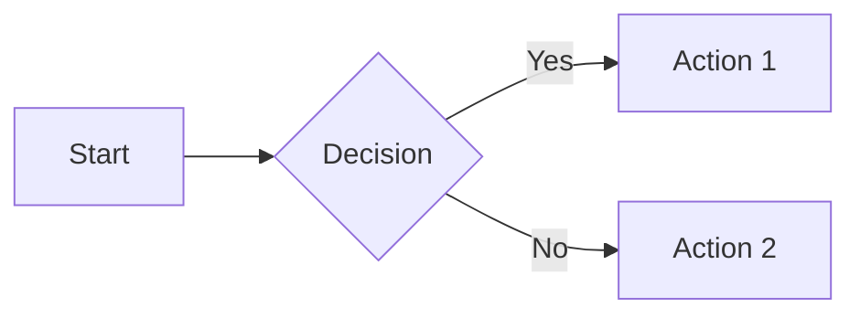

# MkDocs Documentation Setup

This document describes the MkDocs documentation setup for FinWiz.

## Overview

FinWiz documentation is built with [MkDocs](https://www.mkdocs.org/) using the [Material for MkDocs](https://squidfunk.github.io/mkdocs-material/) theme. The documentation is automatically deployed to GitHub Pages via GitHub Actions.

## Features

### Theme Features

- **Material Design**: Modern, responsive design with light/dark mode
- **Instant Loading**: Fast navigation with prefetching
- **Search**: Full-text search with suggestions
- **Code Highlighting**: Syntax highlighting with copy button
- **Tabs**: Organize content with tabbed sections
- **Admonitions**: Callouts for notes, warnings, tips
- **Mermaid Diagrams**: Flow charts and diagrams support
- **MathJax**: Mathematical notation support

### Plugins

1. **awesome-pages**: Automatic navigation from directory structure
2. **mermaid2**: Mermaid diagram rendering
3. **git-revision-date-localized**: Show last updated dates
4. **search**: Enhanced search functionality

## Local Development

### Prerequisites

- Python 3.12+
- uv (package manager)

### Installation

Dependencies are already included in `pyproject.toml`:

```bash
# Install all dependencies
uv sync

# Or install just docs dependencies
uv sync --group docs
```

### Preview Documentation

Start the local development server:

```bash
# Using Makefile (recommended)
make docs-serve

# Or directly with MkDocs
uv run mkdocs serve
```

Then open http://127.0.0.1:8000 in your browser.

The server will automatically reload when you save changes to documentation files.

### Build Documentation

Build static HTML files:

```bash
# Using Makefile
make docs-build

# Or directly with MkDocs
uv run mkdocs build
```

Built files are output to `site/` directory.

## Project Structure

```
finwiz/
├── mkdocs.yml                 # MkDocs configuration
├── docs/                      # Documentation source
│   ├── index.md              # Home page
│   ├── stylesheets/          # Custom CSS
│   │   └── extra.css
│   ├── javascripts/          # Custom JavaScript
│   │   └── mathjax.js
│   ├── includes/             # Reusable content
│   │   └── abbreviations.md  # Abbreviation definitions
│   ├── tutorials/            # Tutorial guides
│   ├── how-to/               # How-to guides
│   ├── reference/            # API reference
│   └── explanations/         # Conceptual explanations
└── site/                     # Built documentation (gitignored)
```

## Configuration

### mkdocs.yml

Main configuration file with:

- Site metadata (name, description, URL)
- Theme configuration (colors, features, fonts)
- Plugin configuration
- Navigation structure
- Markdown extensions

### Custom Styling

Custom CSS in `docs/stylesheets/extra.css`:

- Brand colors
- Custom admonitions
- Performance metrics styling
- Feature grid layout
- API endpoint badges

### Custom JavaScript

MathJax configuration in `docs/javascripts/mathjax.js` for mathematical notation.

## Writing Documentation

### Markdown Extensions

Enabled extensions:

- **Admonitions**: `!!! note`, `!!! warning`, `!!! tip`, etc.
- **Code blocks**: With syntax highlighting and line numbers
- **Tables**: Standard Markdown tables
- **Footnotes**: `[^1]` for footnotes
- **Abbreviations**: Auto-expanded from `includes/abbreviations.md`
- **Task lists**: `- [ ]` for checkboxes
- **Mermaid diagrams**: Fenced code blocks with `mermaid`
- **Tabs**: Content tabs with `=== "Tab Title"`
- **Math**: `\(...\)` for inline, `\[...\]` for display

### Example Admonition

```markdown
!!! note "Optional Title"
    This is a note admonition with custom styling.

!!! warning
    This is a warning without a title.

!!! tip
    Pro tip for users!
```

### Example Mermaid Diagram

````markdown

````

### Example Tabs

```markdown
=== "Python"
    ```python
    def hello():
        print("Hello, World!")
    ```

=== "JavaScript"
    ```javascript
    function hello() {
        console.log("Hello, World!");
    }
    ```
```

### Example Math

```markdown
Inline math: \( E = mc^2 \)

Display math:
\[
\int_{-\infty}^{\infty} e^{-x^2} dx = \sqrt{\pi}
\]
```

## Navigation Structure

Navigation follows the [Diátaxis framework](https://diataxis.fr/):

1. **Tutorials**: Learning-oriented, step-by-step guides
2. **How-To Guides**: Task-oriented, problem-solving guides
3. **Reference**: Information-oriented, technical descriptions
4. **Explanations**: Understanding-oriented, conceptual discussions

## Deployment

### Automatic Deployment (GitHub Actions)

Documentation is automatically built and deployed when:

- Changes are pushed to `main` branch in `docs/` or `mkdocs.yml`
- Manual workflow dispatch

Workflow: `.github/workflows/docs.yml`

### Manual Deployment

Deploy to GitHub Pages manually:

```bash
# Using Makefile (interactive confirmation)
make docs-deploy

# Or directly with MkDocs
uv run mkdocs gh-deploy --clean
```

This will:
1. Build the documentation
2. Push to `gh-pages` branch
3. Trigger GitHub Pages deployment

## GitHub Pages Configuration

**Repository Settings → Pages:**

- Source: Deploy from a branch
- Branch: `gh-pages`
- Folder: `/ (root)`

The documentation will be available at:
`https://fjacquet.github.io/finwiz/`

## Maintenance

### Clean Build Artifacts

```bash
# Using Makefile
make docs-clean

# Or manually
rm -rf site/ docs/_site/ docs/.jekyll-cache/
```

### Update Dependencies

```bash
# Update all dependencies
uv sync --upgrade

# Update specific package
uv pip install --upgrade mkdocs-material
```

### Validate Documentation

```bash
# Build with strict mode (fails on warnings)
uv run mkdocs build --strict

# Lint markdown files (if markdownlint installed)
make docs-lint

# Full validation
make docs-validate
```

## Troubleshooting

### Build Warnings

**"Excluding 'README.md' from the site"**
- Solution: README.md conflicts with index.md. This is expected and safe to ignore.

**"Page not included in nav"**
- Solution: Add the page to `nav` section in `mkdocs.yml` or use `.pages` file

### Port Already in Use

If port 8000 is already in use:

```bash
# Specify different port
uv run mkdocs serve -a localhost:8001
```

### Git Revision Plugin Warnings

**"File has no git logs"**
- Solution: Commit the file to git or ignore the warning (uses current timestamp)

### Plugin Not Found

If a plugin is missing:

```bash
# Reinstall dependencies
uv sync --reinstall
```

## Resources

- [MkDocs Documentation](https://www.mkdocs.org/)
- [Material for MkDocs](https://squidfunk.github.io/mkdocs-material/)
- [Diátaxis Framework](https://diataxis.fr/)
- [Markdown Guide](https://www.markdownguide.org/)
- [Mermaid Diagrams](https://mermaid.js.org/)
- [MathJax Documentation](https://docs.mathjax.org/)

## Tips

1. **Use the dev server**: Always preview changes with `make docs-serve`
2. **Test builds**: Run `make docs-build` before committing
3. **Follow Diátaxis**: Organize content by purpose (tutorials vs reference)
4. **Use admonitions**: Highlight important information
5. **Add diagrams**: Use Mermaid for flow charts and diagrams
6. **Link wisely**: Use relative links for internal pages
7. **Check navigation**: Ensure new pages are in `mkdocs.yml` nav
8. **Mobile first**: Material theme is responsive, test on mobile

## Contributing

When adding new documentation:

1. Create the markdown file in appropriate directory
2. Add to navigation in `mkdocs.yml`
3. Follow existing style and structure
4. Use appropriate Diátaxis category
5. Test locally with `make docs-serve`
6. Build to check for errors: `make docs-build`
7. Submit PR with documentation changes

The GitHub Actions workflow will validate your changes on PR.
