# Orchestrator Interactions

**Version**: 1.0  
**Last Updated**: 2025-01-18  
**Status**: Production

## Overview

This document provides detailed diagrams and explanations of how orchestrators interact within the FinWiz Flow architecture.

## Flow Execution Sequence

### Complete Workflow

```mermaid
sequenceDiagram
    participant User
    participant Flow as FinwizFlow
    participant Val as ValidationOrchestrator
    participant Deep as DeepAnalysisOrchestrator
    participant Alt as AlternativesMatchingOrchestrator
    participant Disc as DiscoveryOrchestrator
    participant Rep as ReportingOrchestrator
    participant State as FinwizState

    User->>Flow: kickoff()
    Flow->>State: Initialize state
    
    Flow->>Val: validate_data_integration()
    Val->>State: Update validation status
    Val-->>Flow: Return validation result
    
    Flow->>Val: check_portfolio()
    Val->>State: Update portfolio data
    Val-->>Flow: Return portfolio result
    
    Flow->>Deep: run_deep_analysis_on_holdings()
    Deep->>State: Update deep_analysis_results
    Deep-->>Flow: Return analysis results
    
    Flow->>Alt: match_alternatives_for_holdings()
    Alt->>State: Update portfolio_alternatives
    Alt-->>Flow: Return alternatives
    
    Flow->>Disc: check_investment_discovery()
    Disc->>State: Update discovery_results
    Disc-->>Flow: Return discovery results
    
    Flow->>Rep: report()
    Rep->>State: Update final_report_path
    Rep-->>Flow: Return report path
    
    Flow-->>User: Return final result
```

### Orchestrator Dependencies

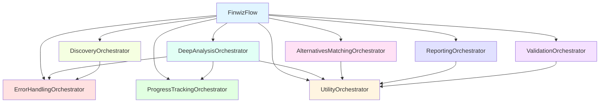

## Orchestrator Interactions

### 1. Deep Analysis Flow

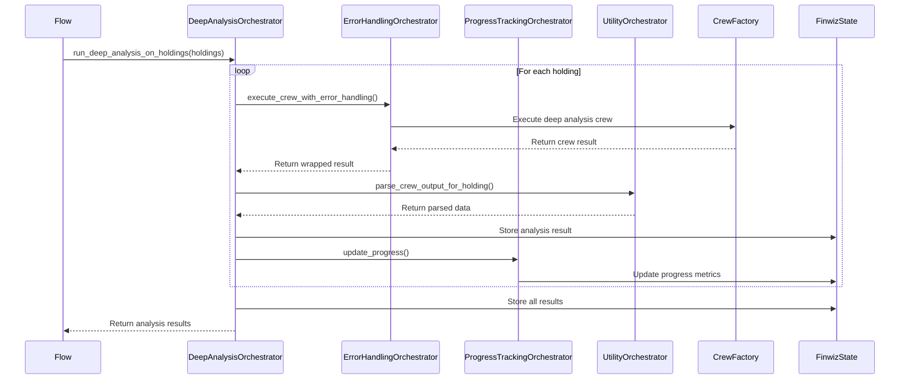

### 2. Alternative Matching Flow

```mermaid
sequenceDiagram
    participant Flow
    participant Alt as AlternativesMatchingOrchestrator
    participant Util as UtilityOrchestrator
    participant State as FinwizState

    Flow->>Alt: match_alternatives_for_holdings(holdings, discovery)
    
    loop For each holding
        Alt->>Alt: Check grade < B
        
        alt Grade < B
            Alt->>Util: parse_crew_output_for_holding()
            Util-->>Alt: Return parsed alternatives
            Alt->>State: Store alternatives for holding
        else Grade >= B
            Alt->>Alt: Skip (no alternatives needed)
        end
    end
    
    Alt->>State: Store all alternatives
    Alt-->>Flow: Return alternatives map
```

### 3. Discovery Flow

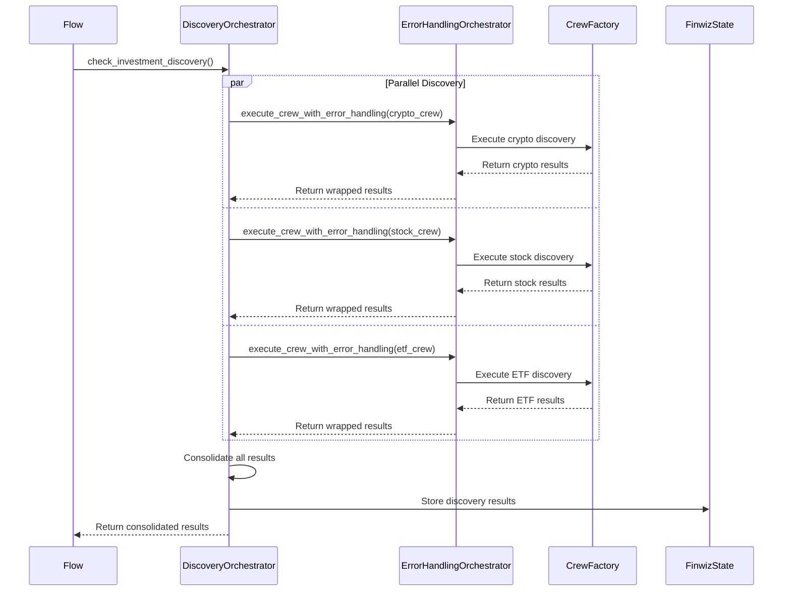

### 4. Reporting Flow

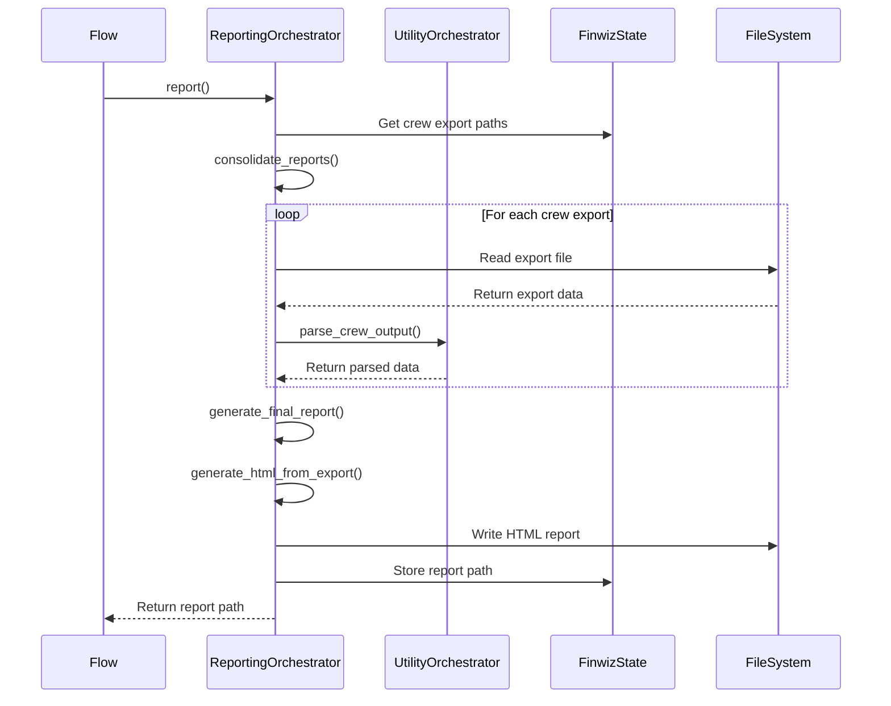

## State Management

### State Flow

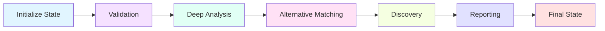

### State Updates by Orchestrator

| Orchestrator | State Fields Updated |
|--------------|---------------------|
| ValidationOrchestrator | `validation_complete`, `portfolio_data` |
| DeepAnalysisOrchestrator | `deep_analysis_results`, `deep_analysis_success`, `deep_analysis_error` |
| AlternativesMatchingOrchestrator | `portfolio_alternatives` |
| DiscoveryOrchestrator | `discovery_results` |
| ReportingOrchestrator | `final_report_path`, `crew_export_paths` |
| ProgressTrackingOrchestrator | `holdings_processed`, `total_holdings`, `progress_percentage` |

## Error Handling Flow

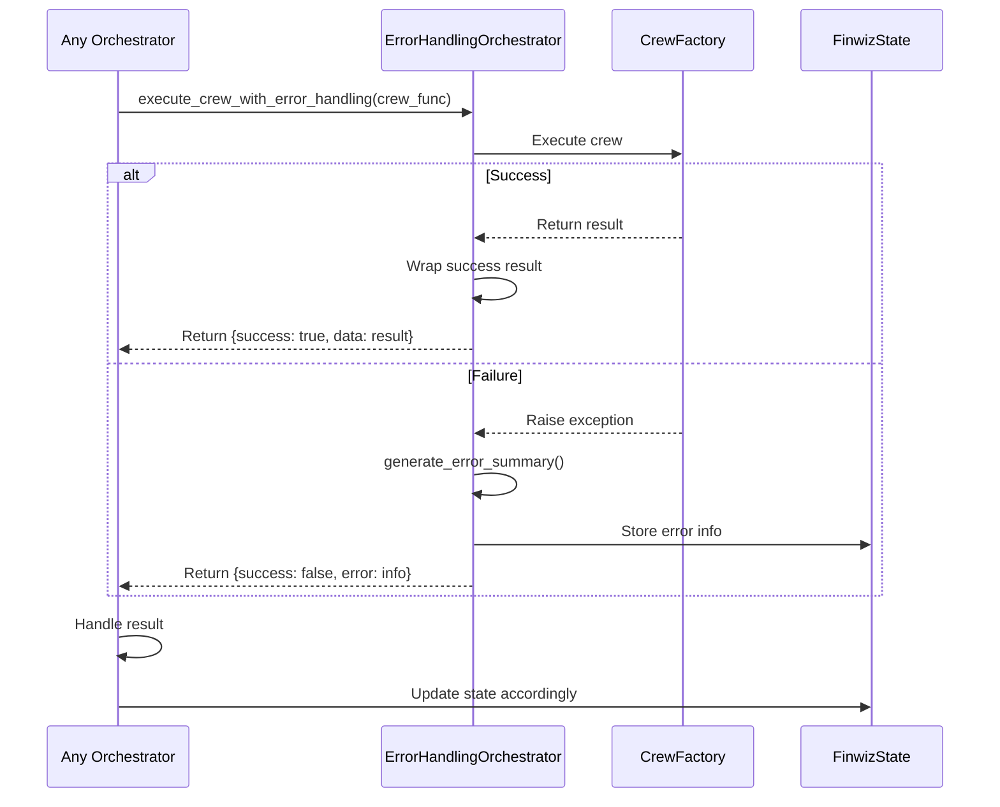

## Progress Tracking Flow

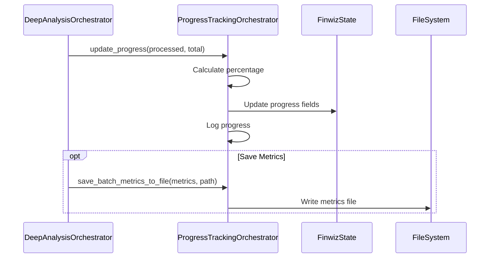

## Data Parsing Flow

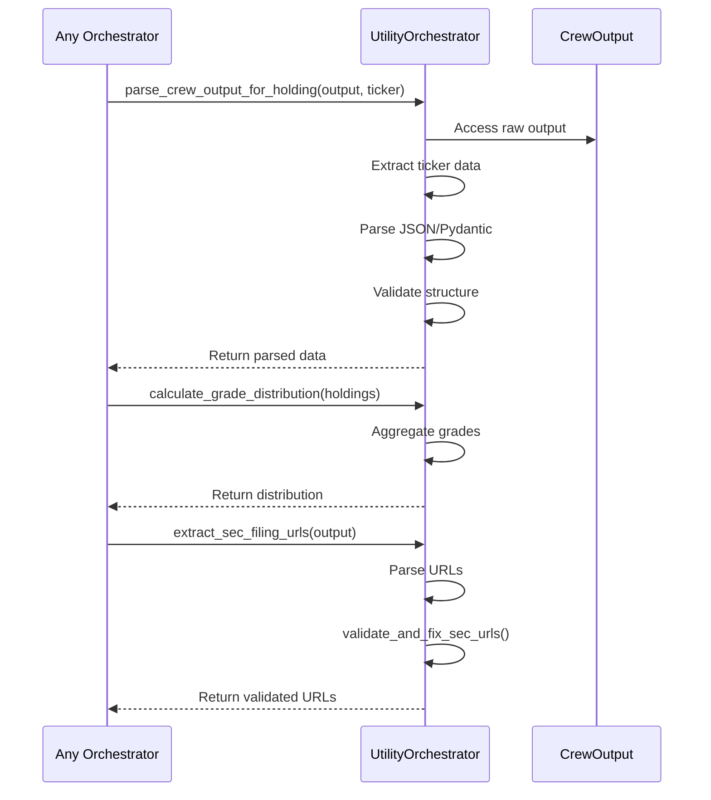

## Lazy Loading Pattern

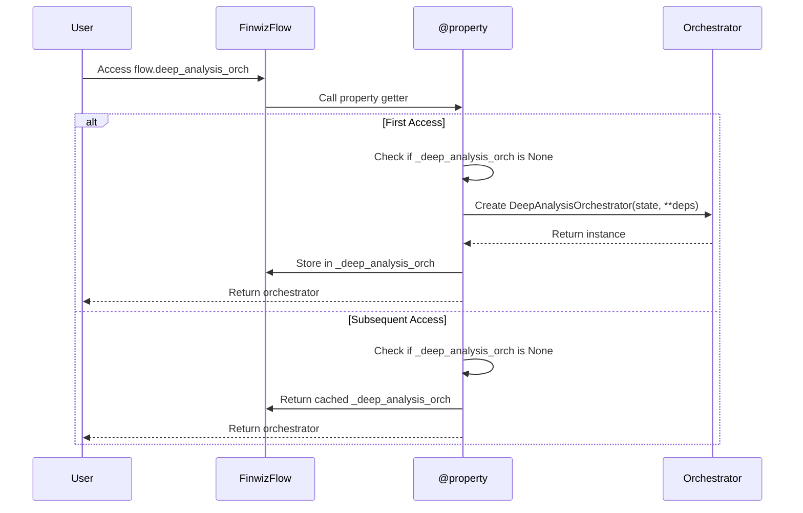

## Dependency Injection

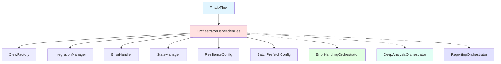

## Communication Patterns

### 1. Synchronous Communication

Most orchestrator interactions are synchronous:

```python
# Flow calls orchestrator
result = self.deep_analysis_orch.run_deep_analysis_on_holdings(holdings)

# Orchestrator calls another orchestrator
wrapped_result = self.error_handler_orch.execute_crew_with_error_handling(
    crew_func, "crew_name"
)
```

### 2. State-Based Communication

Orchestrators communicate through shared state:

```python
# Orchestrator A updates state
self.state.deep_analysis_results = results

# Orchestrator B reads state
results = self.state.deep_analysis_results
```

### 3. Return Value Communication

Flow methods return data for downstream listeners:

```python
@listen("check_portfolio")
def analyze_holdings(self) -> dict[str, Any]:
    results = self.deep_analysis_orch.run_deep_analysis_on_holdings(holdings)
    return {"analysis": results}  # Passed to next listener

@listen("analyze_holdings")
def match_alternatives(self, analysis_data: dict[str, Any]) -> dict[str, Any]:
    results = analysis_data["analysis"]  # Received from upstream
    # Process and return
```

## Performance Considerations

### Lazy Loading Benefits

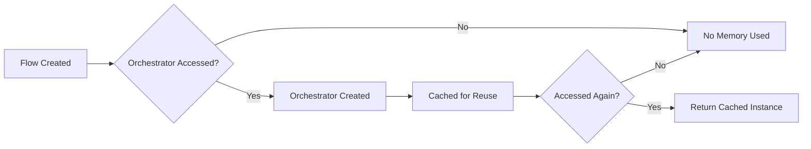

### Parallel Execution

Discovery crews can run in parallel:

```python
# Parallel execution using asyncio
async def run_discovery():
    crypto_task = asyncio.create_task(check_crypto())
    stock_task = asyncio.create_task(check_stock())
    etf_task = asyncio.create_task(check_etf())
    
    results = await asyncio.gather(
        crypto_task, stock_task, etf_task
    )
    return consolidate_results(results)
```

## Best Practices

### 1. Orchestrator Communication

✅ **DO**:
- Use state for persistent data
- Return data for downstream listeners
- Use error handling orchestrator for crew execution
- Keep orchestrators focused on single responsibility

❌ **DON'T**:
- Create circular dependencies
- Store large data in memory
- Skip error handling
- Mix responsibilities

### 2. State Management

✅ **DO**:
- Update state through orchestrators
- Use Pydantic models for type safety
- Validate state updates
- Document state fields

❌ **DON'T**:
- Modify state directly from Flow
- Use unstructured state
- Skip validation
- Create state inconsistencies

### 3. Error Handling

✅ **DO**:
- Wrap crew executions with error handling
- Log errors with context
- Return structured error info
- Update state with error status

❌ **DON'T**:
- Ignore errors
- Raise unhandled exceptions
- Lose error context
- Skip error logging

## Related Documentation

- [Architecture Documentation](ARCHITECTURE.md)
- [Developer Guide](DEVELOPER_GUIDE.md)
- [Migration Guide](.kiro/specs/flow-orchestrator-refactoring/MIGRATION_GUIDE.md)

---

**Version**: 1.0  
**Last Updated**: 2025-01-18  
**Status**: Production
