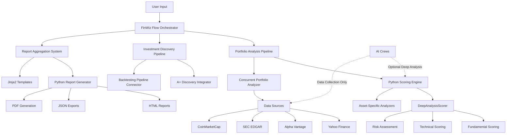

# Architecture Overview

FinWiz is built on a **Python-first, AI-minimalist** architecture that combines deterministic Python calculations with selective AI reasoning for maximum performance and reliability.

## System Architecture

## Core Components

### Python Scoring Engine (Primary)

- **DeepAnalysisScorer**: Deterministic financial scoring (10-20x faster than AI)
- **PortfolioDeepAnalyzer**: Concurrent portfolio analysis with Python calculations
- **Asset-Specific Analyzers**: Stock, ETF, and Crypto specialized scoring
- **Performance**: 10-30 seconds per ticker vs 5-10 minutes with AI

### Report Aggregation System

- **PythonReportGenerator**: Template-based HTML generation (NO AI)
- **Jinja2 Templates**: Professional French-language reports
- **JSON Export Pipeline**: Structured data exports for integration
- **A+ Discovery Integration**: Automatic opportunity identification

### CrewAI Flow Orchestration

- **Flow Management**: Coordinates Python and AI workflows
- **State Management**: Structured Pydantic state models
- **Conditional Routing**: Python-first with optional AI enhancement
- **Error Handling**: Graceful degradation and recovery

### Data Integration Layer

- **Batch Pre-fetching**: Concurrent API calls for portfolio analysis
- **Multi-source Data**: Yahoo Finance, Alpha Vantage, SEC filings
- **Data Validation**: Pydantic v2 strict validation
- **Rate Limiting**: Intelligent API throttling and management

### AI Crews (Selective Use)

- **Data Collection**: Fetch and structure financial data
- **Deep Analysis**: Optional reasoning for complex scenarios
- **Quality Assurance**: Validation and enhancement of Python results
- **Research Mode**: Experimental analysis and methodology development

## Design Principles

1. **AI Minimalism**: Use Python for deterministic tasks, AI only for reasoning
2. **Performance First**: 10-20x faster execution through Python calculations
3. **Cost Optimization**: 100% cost reduction for scoring and report generation
4. **Data Quality**: Multiple validation layers with Pydantic strict mode
5. **Modularity**: Loosely coupled components for flexibility
6. **Transparency**: Full audit trails and deterministic calculations
7. **Testability**: Complete unit test coverage for all Python components

## Technology Stack

- **Framework**: CrewAI Flow with Python 3.12+
- **Package Management**: uv for fast dependency resolution
- **Validation**: Pydantic v2 with strict mode
- **Testing**: pytest with pytest-mock (unittest.mock banned)
- **Code Quality**: Ruff linting and formatting

## Performance Architecture

### Python-First Performance

- **Execution Speed**: 10-30 seconds per ticker (vs 5-10 minutes with AI)
- **Portfolio Analysis**: 10-20 minutes for 66 holdings (vs 3-6 hours)
- **Cost Efficiency**: $0 for calculations (vs $13-36 per portfolio)
- **Deterministic Results**: Same input always produces same output

### Scalability Considerations

- **Concurrent Processing**: ThreadPoolExecutor for portfolio analysis
- **Batch Pre-fetching**: Parallel API calls reduce latency
- **Memory Management**: Efficient data processing and cleanup
- **Rate Limiting**: Respectful API usage patterns
- **Caching Strategy**: Multi-level caching for performance optimization

### Hybrid Approach Support

- **Maximum Speed Mode**: Pure Python scoring (10-30 seconds)
- **Balanced Mode**: Python + optional AI summary (15-40 seconds)
- **Research Mode**: Full AI analysis for methodology development (5-10 minutes)

## Security Architecture

- **API Key Management**: Environment-based configuration
- **Input Validation**: Strict Pydantic models
- **Error Handling**: No sensitive data in logs
- **Audit Trails**: Complete analysis tracking

## Implementation Status

### ✅ Completed Components

- **Python Scoring Engine**: Complete deterministic scoring system
- **Portfolio Analyzer**: Concurrent analysis with Python calculations
- **Report Generator**: Template-based HTML generation
- **Integration Functions**: Flow-compatible convenience functions
- **Batch Processing**: Optimized data pre-fetching system

### 🔄 Integration in Progress

- **Flow Integration**: Connecting Python components to CrewAI Flow
- **A+ Discovery**: Integrating discovery with analysis results
- **Backtesting Pipeline**: Connecting backtesting to opportunities
- **Final Report Assembly**: Template-based consolidation

### 📊 Performance Achievements

- **Speed Improvement**: 10-20x faster than AI-only approach
- **Cost Reduction**: 100% savings on calculations
- **Reliability**: Deterministic, testable results
- **Quality**: Professional French-language reports

## Next Steps

- [Python Scoring Engine](PYTHON_SCORING_ENGINE.md) - Detailed scoring methodology
- [Report Aggregation](REPORT_AGGREGATION_DEVELOPER_GUIDE.md) - Integration patterns
- [Data Flow](DATA_QUALITY_AND_FLOW_GUIDE.md) - Understand how data moves through the system
- [Performance Configuration](../how-to/PERFORMANCE_CONFIGURATION.md) - Optimization settings
- AI Minimalism - Decision framework for AI vs Python
