# Orchestrator Interactions

**Version**: 1.0
**Last Updated**: 2025-01-18
**Status**: Production

## Overview

This document provides detailed diagrams and explanations of how orchestrators interact within the FinWiz Flow architecture.

**A note on how this actually runs.** `FinwizFlow` has exactly one `@start()`
method, `run_sequential_workflow()` (`flows/orchestrator.py`), which drives
all six phases by calling orchestrator methods directly and imperatively —
`await self.deep_analysis_orch.analyze_and_update_portfolio()`, and so on.
The diagrams below describe that call sequence, and it is the only one.
`FinwizFlow` used to carry a parallel chain of `@listen(...)` methods
mirroring these phases; that chain was unreachable — nothing emitted its root
trigger — and it was deleted in #193.

## Flow Execution Sequence

### Complete Workflow

```mermaid
sequenceDiagram
    participant User
    participant Flow as FinwizFlow
    participant Val as ValidationOrchestrator
    participant Deep as DeepAnalysisOrchestrator
    participant Alt as AlternativesMatchingOrchestrator
    participant Disc as DiscoveryOrchestrator
    participant Rep as ReportingOrchestrator
    participant State as FinwizState

    User->>Flow: kickoff()
    Flow->>State: Initialize state

    Flow->>Val: validate_data_integration()
    Val->>State: Update validation status
    Val-->>Flow: Return validation result

    Flow->>Val: check_portfolio()
    Val->>State: Update portfolio data
    Val-->>Flow: Return portfolio result

    Flow->>Deep: analyze_and_update_portfolio()
    Deep->>State: Update deep_analysis_results
    Deep-->>Flow: Return analysis results

    Flow->>Disc: check_investment_discovery()
    Disc->>State: Update investment_discovery_result / investment_discovery_structured
    Disc-->>Flow: Return discovery results

    Flow->>Alt: match_alternatives_for_holdings()
    Note over Alt: Runs after discovery (Phase 5), consuming its output —
    Note over Alt: match_alternatives_after_discovery(discovery_data)
    Alt->>State: Update portfolio_alternatives
    Alt-->>Flow: Return alternatives

    Flow->>Rep: report()
    Rep->>State: Update report_path
    Rep-->>Flow: Return report path

    Flow-->>User: Return final result
```

### Orchestrator Dependencies

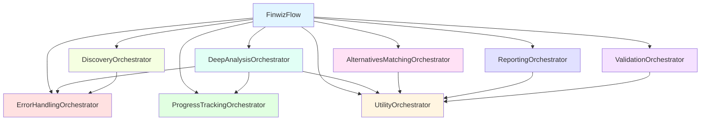

## Orchestrator Interactions

### 1. Deep Analysis Flow

`ErrorHandlingOrchestrator.execute_crew_with_error_handling()` and
`ProgressTrackingOrchestrator.update_progress()` both still exist, but
neither has any caller anywhere in `src/finwiz` — the deep analysis path
below does not go through either of them. What actually runs is
`finwiz.analysis.analyze_holding()`, called once per holding, concurrently,
by `DeepAnalysisOrchestrator.run_deep_analysis_concurrent()`:

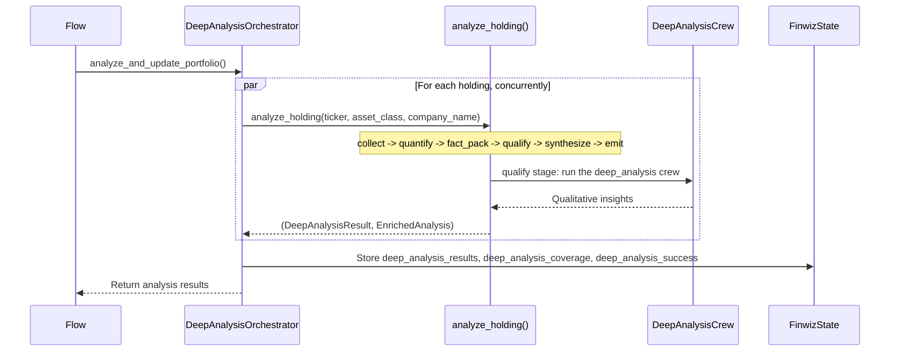

### 2. Alternative Matching Flow

```mermaid
sequenceDiagram
    participant Flow
    participant Alt as AlternativesMatchingOrchestrator
    participant Util as UtilityOrchestrator
    participant State as FinwizState

    Flow->>Alt: match_alternatives_for_holdings(holdings, discovery)

    loop For each holding
        Alt->>Alt: Check grade < B

        alt Grade < B
            Note over Alt,Util: parse_crew_output_for_holding() does not exist on UtilityOrchestrator
            Alt->>State: Store alternatives for holding
        else Grade >= B
            Alt->>Alt: Skip (no alternatives needed)
        end
    end

    Alt->>State: Store all alternatives
    Alt-->>Flow: Return alternatives map
```

### 3. Discovery Flow

Discovery is Python scoring, not crews — there is no `crypto_crew`,
`stock_crew`, or `etf_crew` any more (deleted, see #187), and
`run_sequential_workflow` calls the three `check_*` methods sequentially, not
in parallel:

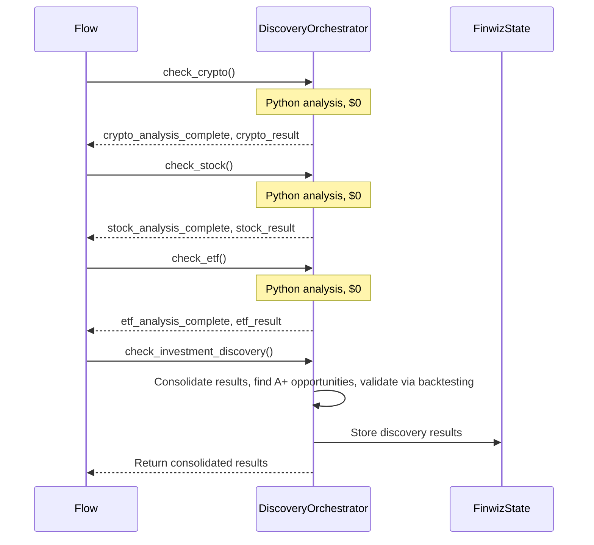

### 4. Reporting Flow

`ReportingOrchestrator.report()` reads deep analysis results back off disk.
(`consolidate_reports()`, the crew-export consolidation entry point, was
deleted with the subsystem in #187.)

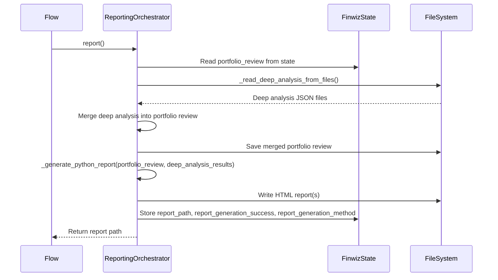

## State Management

### State Flow

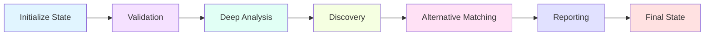

### State Updates by Orchestrator

| Orchestrator | State Fields Updated |
|--------------|---------------------|
| ValidationOrchestrator | `portfolio_review`, `portfolio_review_success`, `data_availability_report` |
| DeepAnalysisOrchestrator | `deep_analysis_results`, `deep_analysis_success`, `deep_analysis_error` |
| AlternativesMatchingOrchestrator | `portfolio_alternatives` |
| DiscoveryOrchestrator | `investment_discovery_result`, `investment_discovery_structured`, `investment_discovery_available` |
| ReportingOrchestrator | `report_path`, `report_generation_success`, `report_generation_method` (`final_report_path` is declared on `FinwizState` but has no writer — a dead field; `crew_export_paths` and `consolidate_reports()` were both removed in #187) |
| ProgressTrackingOrchestrator | `holdings_processed`, `total_holdings`, `progress_percentage` |

## Error Handling Flow

**This flow has no live caller.** `ErrorHandlingOrchestrator.execute_crew_with_error_handling()`
still exists with the shape shown below, but nothing in `src/finwiz` calls it
— not the deep analysis path, not discovery. `CrewFactory`, the dependency
it used to hand a crew through, was deleted along with the crew subsystem
(see #187). Kept here as a description of the method's own logic, not of a
wired execution path:

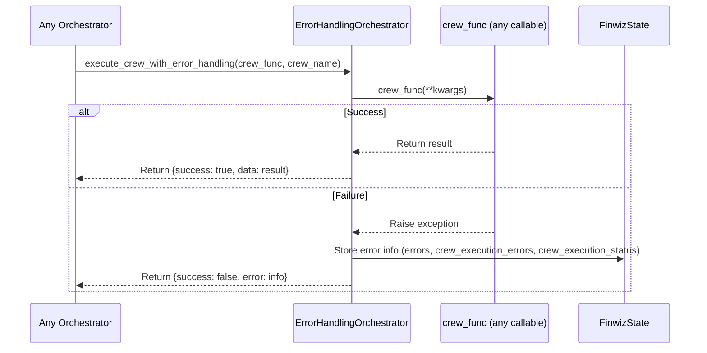

## Progress Tracking Flow

`DeepAnalysisOrchestrator` does not call `ProgressTrackingOrchestrator`
directly. `FinwizFlow._update_progress()` is the only caller of
`update_progress()`, and `_update_progress()` itself has no caller anywhere
in `src/finwiz` — it is dead code. `save_batch_metrics_to_file()` likewise
has no caller. The diagram below describes what these methods would do if
invoked, not a wired path in the live flow.

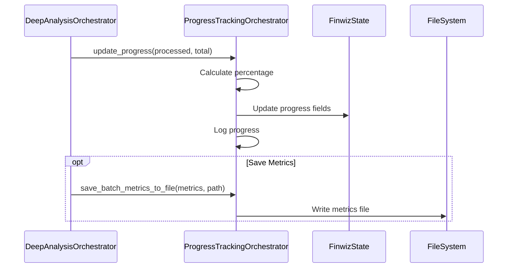

## Data Parsing Flow

**`UtilityOrchestrator` is narrower than this diagram previously claimed.**
Its real purpose is SEC filing URL extraction and validation only
(`orchestrators/utility_orchestrator.py`) — it has no
`parse_crew_output_for_holding`, no `parse_crew_output`, and no public
`calculate_grade_distribution` (only a private `_calculate_grade_distribution`
exists, on the unrelated monitoring metrics class in
`infrastructure/monitoring/metrics.py`). Where crew-output parsing and
grade-distribution aggregation actually happen elsewhere in the codebase
was not confirmed while fixing this doc — treat that as still needing
investigation rather than inferring it from this diagram.

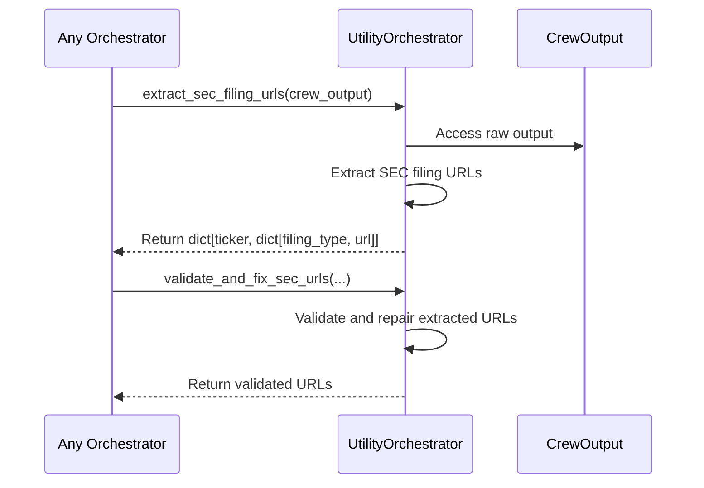

## Lazy Loading Pattern

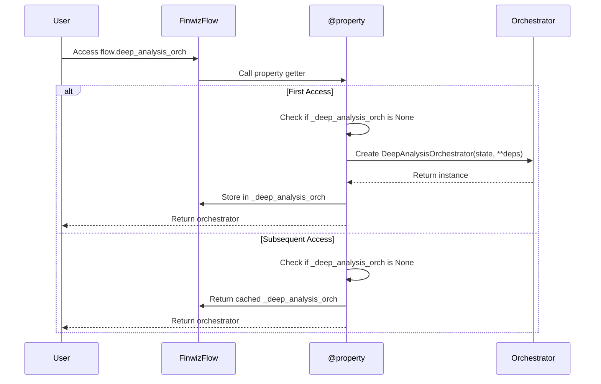

## Dependency Injection

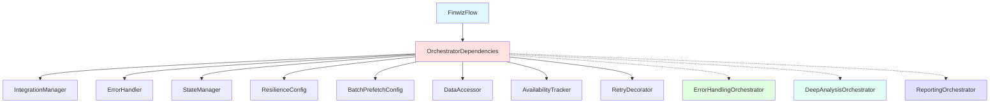

## Communication Patterns

### 1. Synchronous Communication

Most orchestrator interactions are synchronous:

```python
# Flow calls orchestrator
result = await self.deep_analysis_orch.analyze_and_update_portfolio()
```

`ErrorHandlingOrchestrator.execute_crew_with_error_handling()` is a generic
wrapper (any callable, not specifically a crew) that exists for this
purpose, but see "Error Handling Flow" above — nothing calls it today.

### 2. State-Based Communication

Orchestrators communicate through shared state:

```python
# Orchestrator A updates state
self.state.deep_analysis_results = results

# Orchestrator B reads state
results = self.state.deep_analysis_results
```

### 3. Return Value Communication

Phases hand data to each other through return values inside
`run_sequential_workflow`, not through listener events:

```python
discovery_data = self.discovery_orch.check_investment_discovery() or {}
self.alternatives_orch.match_alternatives_after_discovery(discovery_data)
```

## Performance Considerations

### Lazy Loading Benefits

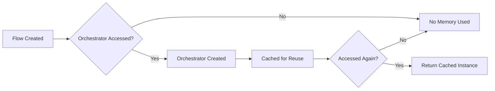

### Parallel Execution

Discovery's three `check_*` calls are sequential today, not parallel — see
"3. Discovery Flow" above. What does run concurrently is deep analysis: one
`analyze_holding()` call per holding, via
`DeepAnalysisOrchestrator.run_deep_analysis_concurrent()`.

## Best Practices

### 1. Orchestrator Communication

✅ **DO**:

- Use state for persistent data
- Return data for downstream listeners
- Use error handling orchestrator for crew execution
- Keep orchestrators focused on single responsibility

❌ **DON'T**:

- Create circular dependencies
- Store large data in memory
- Skip error handling
- Mix responsibilities

### 2. State Management

✅ **DO**:

- Update state through orchestrators
- Use Pydantic models for type safety
- Validate state updates
- Document state fields

❌ **DON'T**:

- Modify state directly from Flow
- Use unstructured state
- Skip validation
- Create state inconsistencies

### 3. Error Handling

✅ **DO**:

- Wrap crew executions with error handling
- Log errors with context
- Return structured error info
- Update state with error status

❌ **DON'T**:

- Ignore errors
- Raise unhandled exceptions
- Lose error context
- Skip error logging

## Related Documentation

- [Architecture Documentation](ARCHITECTURE.md)
- [Developer Guide](../development/DEVELOPER_GUIDE.md)
- Migration Guide (internal spec)

---

**Version**: 1.0
**Last Updated**: 2025-01-18
**Status**: Production
