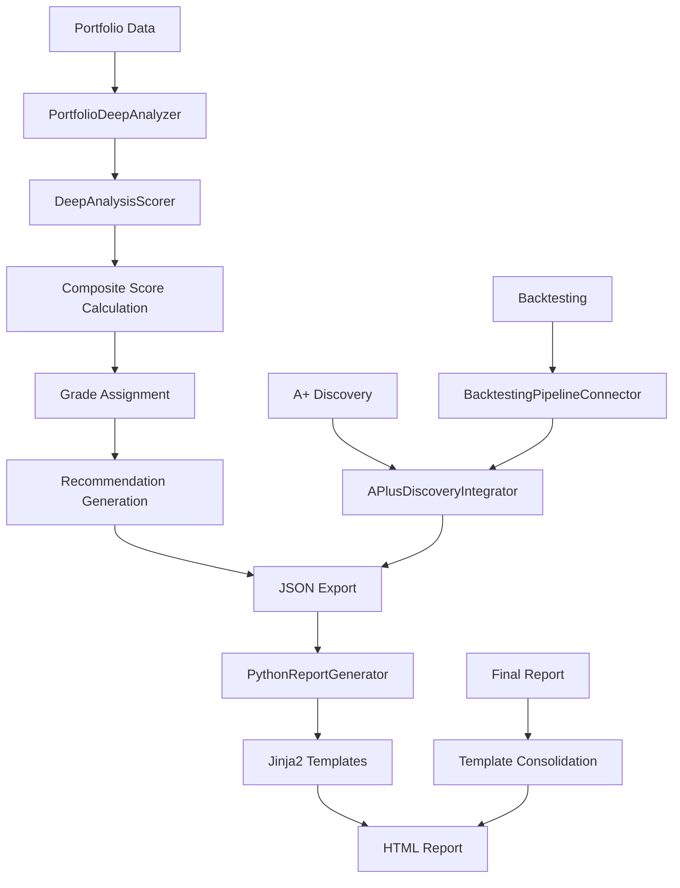

# Python Scoring Engine Architecture

The Python Scoring Engine represents FinWiz's **AI Minimalism** approach: use deterministic Python calculations for scoring and reserve AI exclusively for analysis requiring reasoning.

## Overview

The Python Scoring Engine is a high-performance, deterministic alternative to AI-based scoring that provides:

- **10-20x faster execution** (10-30 seconds vs 5-10 minutes per ticker)
- **100% cost reduction** for calculations ($0 vs $0.05-0.10 per ticker)
- **Deterministic results** (same input = same output)
- **Full testability** with unit tests and validation

## Architecture Components

### Core Scoring Engine

```python
# src/finwiz/scoring/deep_analysis_scorer.py
class DeepAnalysisScorer:
    """Pure Python scoring engine for financial analysis."""

    def calculate_composite_score(self, data: dict) -> float:
        """Calculate weighted composite score (0.0-1.0)."""
        # calculate_risk_score returns (score, details) where the score is
        # already 0.0-1.0 with 1.0 = LOW risk. It enters the composite directly;
        # there is no 0-5 scale and no inversion.
        fundamental, _ = self.calculate_fundamental_score(data)
        technical, _ = self.calculate_technical_score(data)
        risk, _ = self.calculate_risk_score(data)
        return 0.40 * fundamental + 0.30 * technical + 0.30 * risk
```

### Portfolio Analyzer

```python
# src/finwiz/scoring/portfolio_deep_analyzer.py
class PortfolioDeepAnalyzer:
    """Concurrent portfolio analysis using Python scoring."""

    def analyze_portfolio_holdings(self, portfolio: Portfolio) -> dict:
        """Analyze all holdings concurrently with Python scoring."""
        # Process holdings in parallel for maximum performance
        # Export JSON files to proper output directories
        # Update portfolio with analysis results
```

### Report Generator

```python
# src/finwiz/reporting/python_report_generator.py
class PythonReportGenerator:
    """French HTML report generation (NO AI)."""

    def generate_family_financial_plan(self, data: dict) -> str:
        """Generate the family report.

        NOT Jinja2 — this module imports no template engine and loads no
        template file. `_generate_html_report` assembles the page from a Python
        f-string plus `self._get_css_styles()` and the `_generate_*_section()`
        helpers (see also finwiz/reporting/sections/).
        """
```

## Scoring Methodology

### Composite Score Calculation

The composite score combines three weighted components:

```
Composite Score = (Fundamental × 0.40) + (Technical × 0.30) + (Risk × 0.30)
```

#### Fundamental Score (40% weight)

Based on financial health metrics:

```python
def calculate_fundamental_score(self, data: dict) -> float:
    """Calculate fundamental score (0.0-1.0)."""
    base_score = 0.5

    # ROE bonus/penalty
    roe = data.get("roe", 0)
    if roe > 0.20:  # 20%+
        base_score += 0.3
    elif roe > 0.15:  # 15-20%
        base_score += 0.2
    elif roe < 0.05:  # <5%
        base_score -= 0.2

    # Debt-to-equity penalty
    debt_equity = data.get("debt_to_equity", 0)
    if debt_equity > 0.5:
        base_score -= 0.2
    elif debt_equity > 0.3:
        base_score -= 0.1

    # Growth bonus
    revenue_growth = data.get("revenue_growth", 0)
    if revenue_growth > 0.15:  # 15%+
        base_score += 0.2
    elif revenue_growth > 0.10:  # 10-15%
        base_score += 0.1

    return max(0.0, min(1.0, base_score))
```

#### Technical Score (30% weight)

Based on momentum and trend indicators:

```python
def calculate_technical_score(self, data: dict) -> float:
    """Calculate technical score (0.0-1.0)."""
    base_score = 0.5

    # RSI analysis
    rsi = data.get("rsi", 50)
    if 30 <= rsi <= 70:  # Neutral zone
        base_score += 0.2
    elif rsi < 30:  # Oversold
        base_score += 0.3
    elif rsi > 70:  # Overbought
        base_score -= 0.2

    # Trend analysis
    trend = data.get("trend_direction", "neutral")
    if trend == "bullish":
        base_score += 0.3
    elif trend == "bearish":
        base_score -= 0.3

    return max(0.0, min(1.0, base_score))
```

#### Risk Score (30% weight, inverted)

Lower risk = higher contribution to composite score:

```python
def calculate_risk_score(self, data: dict) -> int:
    """Calculate risk score (0-5 scale, 0=Very Low, 5=Very High)."""
    risk_score = 2  # Base moderate risk

    # Volatility adjustment
    volatility = data.get("volatility", 0.2)
    if volatility > 0.4:  # High volatility
        risk_score += 2
    elif volatility > 0.3:
        risk_score += 1
    elif volatility < 0.15:  # Low volatility
        risk_score -= 1

    # Maximum drawdown adjustment
    max_drawdown = abs(data.get("max_drawdown", 0.1))
    if max_drawdown > 0.3:  # >30% drawdown
        risk_score += 1
    elif max_drawdown < 0.1:  # <10% drawdown
        risk_score -= 1

    return max(0, min(5, risk_score))
```

### Grade Assignment

Grades are assigned based on composite score thresholds:

| Grade | Score Range | Description |
|-------|-------------|-------------|
| A+ | >= 0.95 | Exceptional opportunity |
| A | 0.85 - 0.95 | Strong buy candidate |
| B+ | 0.80 - 0.85 | Good, solid across dimensions |
| B | 0.75 - 0.80 | Attractive, minor weaknesses |
| C+ | 0.70 - 0.75 | Mixed signals |
| C | 0.65 - 0.70 | Minimum acceptable |
| D | 0.50 - 0.65 | Below average |
| F | < 0.50 | Poor investment |

### Recommendation Logic

Investment recommendations follow deterministic rules:

```python
def generate_recommendation(self, composite_score: float, grade: str) -> str:
    """Generate BUY/HOLD/SELL recommendation."""
    if grade in ["A+", "A"]:
        return "BUY"
    elif grade in ["B", "C"]:
        return "HOLD"
    else:  # D, F
        return "SELL"
```

## Integration Architecture

### Flow Integration

The Python scoring engine integrates with CrewAI Flow through convenience functions:

`scoring/__init__.py` exports exactly three names: `DeepAnalysisScorer`,
`PortfolioDeepAnalyzer` and `analyze_portfolio_with_python`.
`generate_python_report` is not among them — it lives in
`finwiz.reporting.python_report_generator`.

```python
# src/finwiz/scoring/__init__.py
def analyze_portfolio_with_python(holdings: list[HoldingDecision], session_id: str) -> dict:
    """Convenience function for Flow integration."""
    analyzer = PortfolioDeepAnalyzer()
    return analyzer.analyze_portfolio_holdings(holdings)


def generate_python_report(analysis_data: dict) -> str:
    """Convenience function for report generation."""
    generator = PythonReportGenerator()
    return generator.generate_family_financial_plan(analysis_data)
```

### Data Flow Architecture



### Performance Optimization

#### Sequential Processing

`analyze_portfolio_holdings` iterates holdings in a plain `for` loop. There is
no ThreadPoolExecutor — `portfolio_deep_analyzer.py` never imports
`concurrent.futures`, and nothing under `src/finwiz/scoring/` does. Scoring is
pure Python arithmetic on already-collected data, so it is fast enough
sequentially; the parallelism in this pipeline is at the deep-analysis
orchestrator level, where each holding gets its own thread and event loop.

```python
def analyze_portfolio_holdings(self, holdings: list[HoldingDecision]) -> dict:
    """Analyze holdings sequentially."""
    results = {}
    for holding in holdings:
        try:
            data = self._extract_holding_data(holding)
            results[holding.ticker] = self._analyze_single_holding(data)
        except Exception as e:
            logger.error(f"Analysis failed for {holding.ticker}: {e}")
            results[holding.ticker] = self._create_error_result(holding.ticker, str(e))

    return results
```

#### Memory Management

- Process holdings in batches to control memory usage
- Use generators for large datasets
- Implement proper cleanup after analysis
- Monitor memory consumption during execution

## Performance Characteristics

### Execution Time Comparison

| Component | AI Approach | Python Approach | Speedup |
|-----------|-------------|-----------------|---------|
| Single Ticker Analysis | 5-10 minutes | 10-30 seconds | 10-20x |
| 66-Holding Portfolio | 3-6 hours | 10-20 minutes | 10-18x |
| Report Generation | 30-60 seconds | <1 second | 30-60x |
| **Total Portfolio** | **3.5-6.5 hours** | **10-21 minutes** | **10-19x** |

### Cost Comparison

| Component | AI Cost | Python Cost | Savings |
|-----------|---------|-------------|---------|
| Scoring Calculations | $0.05-0.10 | $0.00 | 100% |
| Report Generation | $0.10-0.30 | $0.00 | 100% |
| Data Consolidation | $0.05-0.15 | $0.00 | 100% |
| **Per Ticker** | **$0.20-0.55** | **$0.00** | **100%** |
| **66-Holding Portfolio** | **$13.20-36.30** | **$0.00** | **100%** |

*Note: Data fetching costs (APIs) remain the same in both approaches*

### Quality Metrics

| Metric | AI Approach | Python Approach |
|--------|-------------|-----------------|
| Consistency | 95% (probabilistic) | 100% (deterministic) |
| Testability | Limited (prompt testing) | Full (unit tests) |
| Debuggability | Difficult (LLM black box) | Easy (stack traces) |
| Maintainability | Complex (prompt engineering) | Simple (code review) |
| Auditability | Limited (AI reasoning) | Complete (calculation steps) |

## Implementation Status

### ✅ Completed Components

- **DeepAnalysisScorer**: Complete Python scoring engine
- **PortfolioDeepAnalyzer**: Sequential portfolio analyzer
- **PythonReportGenerator**: f-string HTML report generation
- **Integration Functions**: Flow-compatible convenience functions
- **Flow Integration**: `FinwizFlow` Phase 3 calls
  `deep_analysis_orch.analyze_and_update_portfolio()`, which drives the
  deterministic collect/quantify stages. The AI crew runs only as the
  qualitative stage — the Python-first integration this document once listed as
  a gap has been closed.

## Benefits and Trade-offs

### Benefits

✅ **Performance**: 10-20x faster execution
✅ **Cost**: 100% reduction for calculations
✅ **Reliability**: Deterministic, consistent results
✅ **Testability**: Full unit test coverage
✅ **Maintainability**: Standard Python code review process
✅ **Auditability**: Complete calculation transparency
✅ **Scalability**: No LLM rate limits for calculations

### Trade-offs

⚠️ **Flexibility**: Less adaptable than AI reasoning
⚠️ **Complexity**: Requires manual formula updates
⚠️ **Coverage**: May miss nuanced analysis patterns
⚠️ **Innovation**: No automatic improvement from AI learning

### When to Use Each Approach

#### Use Python Scoring For

- High-volume portfolio analysis (66+ holdings)
- Production environments requiring consistency
- Cost-sensitive applications
- Regulatory environments requiring auditability
- Performance-critical workflows

#### Use AI Scoring For

- Single-ticker deep analysis requiring nuanced reasoning
- Research and development of new scoring methodologies
- Complex market condition analysis
- Qualitative factor integration
- Experimental analysis approaches

## Hybrid Approach

For maximum flexibility, FinWiz supports a hybrid approach:

```python
# Optional AI summary after Python scoring
if os.getenv("DEEP_ANALYSIS_AI_SUMMARY", "false").lower() == "true":
    # Python scoring (10-30 seconds, $0)
    python_result = scorer.calculate_composite_score(data)

    # Optional AI summary (5-10 seconds, $0.01)
    ai_summary = generate_ai_summary(python_result, data)

    # Total: 15-40 seconds, $0.01 (vs 5-10 minutes, $0.05-0.10)
```

This provides:

- **80-90% cost savings** ($0.01 vs $0.05-0.10 per ticker)
- **75-85% time savings** (15-40 seconds vs 5-10 minutes)
- **Best of both worlds**: Python reliability + AI insights

## Related Topics

- [Report Aggregation Architecture](REPORT_AGGREGATION_DEVELOPER_GUIDE.md) - Integration patterns
- AI Minimalism - Decision framework for AI vs Python
- [Performance Configuration](../how-to/PERFORMANCE_CONFIGURATION.md) - Optimization settings
- Testing Standards - Unit testing approaches

## Further Reading

- Implementation Tasks - Detailed implementation plan
- [Flow Architecture](ARCHITECTURE.md) - CrewAI Flow integration patterns
- [Validation Framework](design_principles.md) - Data quality assurance

---

**Version**: 2.0
**Last Updated**: 2025-10-26
**Status**: Core components implemented, integration in progress
