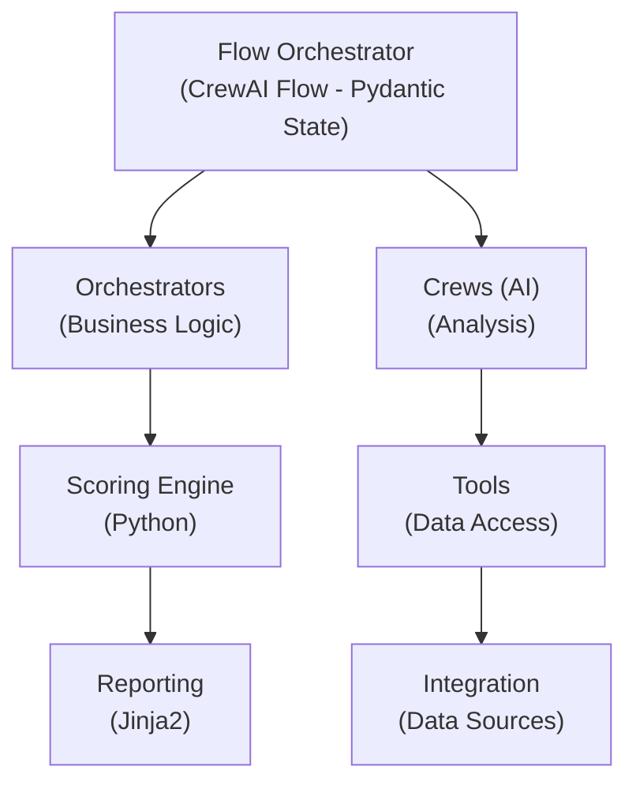
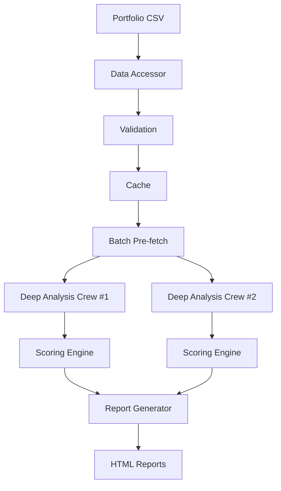

# Explanations

Conceptual guides to help you understand FinWiz's architecture, design decisions, and underlying principles.

## What Are Explanations?

Explanations are **understanding-oriented** discussions that provide context and background. They help you understand *why* FinWiz works the way it does, not just *how* to use it.

## Available Explanations

### Core Architecture

- **[Architecture Overview](ARCHITECTURE.md)** - Complete system architecture
- **[Orchestrator Interactions](ORCHESTRATOR_INTERACTIONS.md)** - How orchestrators work together
- **[Python Scoring Engine](PYTHON_SCORING_ENGINE.md)** - Scoring engine architecture

### Design Philosophy

- **[Design Principles](design_principles.md)** - Core design philosophy
- **[Optimization Theory](optimization_theory.md)** - Optimization approaches
- **AI Minimalism (see CLAUDE.md)** - AI Minimalism philosophy

### Technical Concepts

- **[Deep Analysis](deep_analysis.md)** - Deep analysis system explained
- **[Data Quality](DATA_QUALITY_AND_FLOW_GUIDE.md)** - Data quality principles
- **[Investment Methodology](investment_methodology.md)** - Investment analysis approach
- **[Recommendation Engine](recommendation_engine.md)** - How recommendations work

### Integration Patterns

- **[Python Pipeline](python_pipeline/overview.md)** - Pure Python analysis pipeline

### Reporting

- **[Report Aggregation Guide](REPORT_AGGREGATION_DEVELOPER_GUIDE.md)** - Report aggregation
- **[Report File Structure](REPORT_FILE_STRUCTURE.md)** - Report file organization

### Evolution and History

- **[Test Structure Evolution](test_structure_evolution.md)** - Testing evolution
- **[LLM Model Analysis 2025](llm_model_analysis_2025.md)** - LLM model comparison

## Explanation Categories

### By Topic

#### Understanding the System

Start with these to understand FinWiz's design:

1. [Architecture Overview](ARCHITECTURE.md) - How everything fits together
2. [Design Principles](design_principles.md) - Core philosophy
3. [Orchestrator Interactions](ORCHESTRATOR_INTERACTIONS.md) - Orchestrator framework
4. [Python Scoring Engine](PYTHON_SCORING_ENGINE.md) - Scoring system

#### Design Decisions

Understand *why* FinWiz works this way:

1. AI Minimalism (see CLAUDE.md) - Minimize AI, maximize Python
2. [Data Quality](DATA_QUALITY_AND_FLOW_GUIDE.md) - Data quality principles
3. [Optimization Theory](optimization_theory.md) - Optimization approaches

#### Technical Deep-Dives

Detailed explanations of complex topics:

1. [Deep Analysis](deep_analysis.md) - Deep analysis system
2. [Investment Methodology](investment_methodology.md) - Investment analysis
3. [Recommendation Engine](recommendation_engine.md) - Recommendations
4. [Python Pipeline](python_pipeline/overview.md) - Pure Python analysis

### By User Type

#### For Users

Understand how FinWiz benefits you:

1. [Investment Methodology](investment_methodology.md)
2. AI Minimalism (see CLAUDE.md)
3. [Data Quality](DATA_QUALITY_AND_FLOW_GUIDE.md)
4. [Deep Analysis](deep_analysis.md)

#### For Developers

Understand FinWiz's technical architecture:

1. [Architecture Overview](ARCHITECTURE.md)
2. [Orchestrator Interactions](ORCHESTRATOR_INTERACTIONS.md)
3. [Python Scoring Engine](PYTHON_SCORING_ENGINE.md)
4. [Test Structure Evolution](test_structure_evolution.md)

#### For Architects

Understand design decisions and trade-offs:

1. [Design Principles](design_principles.md)
2. [Optimization Theory](optimization_theory.md)

## Key Concepts

### AI Minimalism

**Core Principle**: Use Python for deterministic tasks, AI only where reasoning is required.

**Why?**

- **Performance**: 10-20x faster with Python
- **Cost**: 100% reduction (zero LLM calls for calculations)
- **Reliability**: Deterministic results, easier testing
- **Transparency**: Mathematical formulas are auditable

**Learn More**: AI Minimalism (see CLAUDE.md)

### Pydantic-First Design

**Core Principle**: All data validated with strict Pydantic schemas.

**Why?**

- **Type Safety**: Catch errors at validation time
- **Documentation**: Schemas serve as documentation
- **IDE Support**: Auto-completion and type checking
- **API Stability**: Breaking changes detected early

**Learn More**: [Design Principles](design_principles.md)

### File-Based Data Passing

**Core Principle**: Pass file paths between crews, not large data objects.

**Why?**

- **Context Limits**: Avoids LLM context window limits
- **Caching**: Enables efficient data caching
- **Performance**: Reduces memory usage
- **Debugging**: Easy to inspect intermediate results

**Learn More**: [Architecture Overview](ARCHITECTURE.md)

### Concurrent Execution

**Core Principle**: Run independent tasks in parallel.

**Why?**

- **Performance**: 10-20x speedup for portfolio analysis
- **Resource Utilization**: Better use of CPU cores
- **Scalability**: Handles large portfolios efficiently
- **User Experience**: Faster results

**Learn More**: [Architecture Overview](ARCHITECTURE.md)

## Architecture Diagrams

### System Architecture

**Learn More**: [Architecture Overview](ARCHITECTURE.md)

### Data Flow

**Learn More**: [Data Quality Guide](DATA_QUALITY_AND_FLOW_GUIDE.md)

## Design Trade-offs

### AI vs Python

| Aspect | AI Approach | Python Approach |
|--------|-------------|-----------------|
| Speed | Slower (45-90s) | Faster (2-5s) |
| Cost | $0.05-0.10 per analysis | $0 |
| Consistency | Variable | Deterministic |
| Reasoning | Excellent | Limited |
| Testing | Difficult | Easy |
| Use Cases | Complex analysis | Calculations |

**Learn More**: [Design Principles](design_principles.md)

### Batch vs Sequential

| Aspect | Batch Processing | Sequential |
|--------|------------------|------------|
| Speed | 10-20x faster | Baseline |
| Complexity | Higher | Lower |
| Resource Usage | Higher (parallel) | Lower |
| Debugging | More difficult | Easier |
| Best For | Large portfolios | Small portfolios |

**Learn More**: [Architecture Overview](ARCHITECTURE.md)

## Additional Resources

### Core Documentation

- [Operations Guide](../how-to/OPERATIONS_GUIDE.md) - Deployment, operations, and migration
- [Developer Guide](../development/DEVELOPER_GUIDE.md) - Architecture and development

### Tutorials

- [Getting Started](../tutorials/getting_started.md) - First-time setup
- [First Analysis](../tutorials/first_analysis.md) - Your first analysis

### How-To Guides

- [Batch Processing](../how-to/BATCH_PROCESSING.md) - High-performance analysis

### Reference

- [API Reference](../reference/api/index.md) - API documentation

## Contributing Explanations

Good explanations should:

- **Provide Context**: Explain *why*, not just *what*
- **Use Examples**: Illustrate concepts with real examples
- **Show Trade-offs**: Discuss benefits and limitations
- **Link to Code**: Reference actual implementation
- **Stay Current**: Update with architectural changes

See [Developer Guide](../development/DEVELOPER_GUIDE.md#contributing) for contribution guidelines.

## Need Help?

- **Understanding concepts**: Read the explanations above
- **Learning FinWiz**: Start with [Tutorials](../tutorials/index.md)
- **Solving problems**: Check [How-To Guides](../how-to/index.md)
- **Looking up details**: See [Reference](../reference/index.md)

---

*Explore the explanations above to deepen your understanding of FinWiz's architecture and design.*
