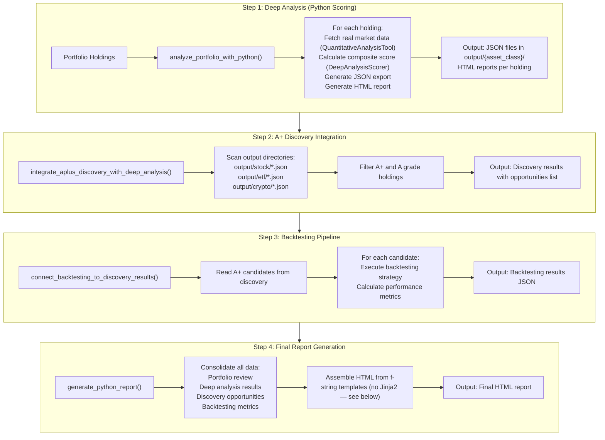

# Data Flow Architecture

This document describes the complete data flow through the Pure Python Pipeline.

## Overview

The pipeline processes data through four sequential stages, with each stage producing outputs consumed by the next stage.

## Complete Data Flow



## Stage 1: Deep Analysis

### Input

- `holdings`: List of `HoldingDecision` objects
- `session_id`: Unique session identifier

### Processing

For each holding:

1. **Data Fetching**
   - Calls `QuantitativeAnalysisTool` for real market data
   - Retrieves volatility, beta, max drawdown, etc.
   - Asset-specific metrics (ROE for stocks, expense ratio for ETFs)

2. **Score Calculation**
   - Uses `DeepAnalysisScorer` for composite score
   - Calculates fundamental, technical, and risk scores
   - Assigns grade based on composite score

3. **Export Generation**
   - Creates JSON export with all analysis data
   - Generates HTML report using Jinja2 template
   - Saves to appropriate asset class directory

### Output

- **Individual JSON exports**: `output/{asset_class}/{ticker}_{session_id}.json`
- **Individual HTML reports**: `output/{asset_class}/{ticker}_{session_id}.html`
- **Consolidated export**: `output/deep_analysis_consolidated_{session_id}.json`
- **Performance metrics**: Execution time, success/failure counts

## Stage 2: A+ Discovery

### Input

- `session_id`: Session identifier from Stage 1
- JSON exports from Stage 1

### Processing

1. **Directory Scanning**
   - Scans `output/stock/` for stock analysis files
   - Scans `output/etf/` for ETF analysis files
   - Scans `output/crypto/` for crypto analysis files

2. **Grade Filtering**
   - Reads each JSON file
   - Filters holdings with grade "A+" or "A"
   - Excludes grades "B", "C", "D", "F"

3. **Consolidation**
   - Combines opportunities across asset classes
   - Removes duplicate tickers
   - **Does not sort.** `aplus_holdings` is built by appending in
     directory-glob order and returned as-is — there is no `sort`/`sorted`
     call anywhere in `aplus_discovery_integrator.py`.

### Output

`integrate_aplus_discovery_with_deep_analysis()` returns a dict — **it never
writes `output/aplus_discovery_{session_id}.json` to disk.** The
backtesting connector's fallback path checks for that filename, but nothing
ever creates it.

- Return value contains:
  - `has_a_plus_analysis`: Boolean
  - `total_opportunities_found`: Count
  - `aplus_holdings`: List of opportunities
  - `total_analyzed`: Total holdings count

## Stage 3: Backtesting

### Input

- `session_id`: Session identifier
- Discovery results from Stage 2

### Processing

1. **Candidate Retrieval**
   - Calls `integrate_aplus_discovery_with_deep_analysis()`
   - Falls back to reading discovery JSON if needed
   - Removes duplicate candidates

2. **Backtesting Execution — currently simulated, not real**
   - `connect_backtesting_to_discovery_results` does not execute a strategy
     or load historical price data. For each A+ candidate it assigns
     constant/formula-derived placeholder values: `annual_return` (0.12,
     +0.05 if grade A+), `sharpe_ratio` (1.2, +0.3 if grade A+),
     `max_drawdown` (fixed -0.15), `win_rate` (fixed 0.65). The module's own
     comment says a real implementation "would" load price data, execute a
     trading strategy, and calculate performance metrics — that part isn't
     built yet.

3. **Results Aggregation**
   - Combines all backtesting results
   - Calculates execution time
   - Generates summary statistics

### Output

- **Backtesting results**: `output/backtesting_results_{session_id}.json`
- Contains:
  - `backtesting_executed`: Boolean
  - `candidates_count`: Number tested
  - `candidates`: List of candidates
  - `results`: List of metrics per candidate
  - `execution_time_seconds`: Total time

## Stage 4: Report Generation

### Input

- `portfolio_review`: Portfolio review object
- `deep_analysis_results`: Results from Stage 1
- `session_id`: Session identifier

### Processing

1. **Data Consolidation**
   - Reads deep analysis results
   - Reads discovery results (if available)
   - Reads backtesting results (if available)

2. **Statistics Calculation**
   - Portfolio-level statistics
   - Asset class distribution
   - Grade distribution
   - Recommendation breakdown

3. **HTML Assembly — not Jinja2**
   - `PythonReportGenerator._generate_html_report` assembles the document
     from an f-string and inlines CSS from `assets/report_styles.css` via
     `_get_css_styles()`. The module has no Jinja2 import or usage at all.
   - Applies CSS styling
   - Generates responsive HTML

### Output

- **Final HTML report**: `output/finwiz_family_financial_plan.html`
- Contains:
  - Executive summary
  - Portfolio overview
  - Holdings analysis
  - Strategic recommendations
  - Deep analysis results
  - Performance metrics

## File Structure

### Input Files

```
data/
├── stock.csv           # Stock holdings
├── etf.csv            # ETF holdings
└── crypto.csv         # Crypto holdings (optional)
```

### Intermediate Files

```
output/
├── stock/
│   ├── AAPL_{session_id}.json
│   ├── AAPL_{session_id}.html
│   ├── MSFT_{session_id}.json
│   ├── MSFT_{session_id}.html
│   └── ...
├── etf/
│   ├── SPY_{session_id}.json
│   ├── SPY_{session_id}.html
│   └── ...
├── crypto/
│   ├── BTC_{session_id}.json
│   ├── BTC_{session_id}.html
│   └── ...
└── deep_analysis_consolidated_{session_id}.json
```

### Discovery Files

No discovery output file is written. `integrate_aplus_discovery_with_deep_analysis()`
returns its results as an in-memory dict only — nothing writes
`output/aplus_discovery_{session_id}.json` (the backtesting connector's
fallback path checks for that filename, but it's never created).

### Backtesting Files

```
output/
└── backtesting_results_{session_id}.json
```

### Final Output

```
output/
└── finwiz_family_financial_plan.html
```

## Data Dependencies

### Stage Dependencies

- **Stage 2** depends on Stage 1 JSON exports
- **Stage 3** depends on Stage 2 discovery results
- **Stage 4** depends on all previous stages

### Optional Dependencies

- **Backtesting** is optional (skipped if no A+ candidates)
- **Discovery** is optional (skipped if no analysis results)
- **Report** always generates (even with partial data)

## Error Handling

### Stage 1: Deep Analysis

- **Holding failure**: Continues with remaining holdings
- **Data fetch failure**: Skips holding, logs error
- **Export failure**: Logs error, continues

### Stage 2: A+ Discovery

- **No exports found**: Returns empty results
- **JSON parse error**: Skips file, logs warning
- **Directory missing**: Returns empty results

### Stage 3: Backtesting

- **No candidates**: Skips execution, returns status
- **Backtesting failure**: Logs error, continues
- **Metric calculation error**: Uses default values

### Stage 4: Report Generation

- **Missing data**: Uses available data only
- **Template error**: Falls back to basic template
- **Export failure**: Logs error, returns path

## Performance Characteristics

### Stage Execution Times

| Stage | Typical Time | Notes |
|-------|--------------|-------|
| Deep Analysis | 0.5-1s per holding | Depends on data fetching |
| A+ Discovery | <1s | File I/O only |
| Backtesting | 2-5s | Depends on candidate count |
| Report Generation | <1s | Template rendering |

### Memory Usage

| Stage | Typical Memory | Notes |
|-------|----------------|-------|
| Deep Analysis | 10-50 MB | Per holding |
| A+ Discovery | <10 MB | Minimal footprint |
| Backtesting | <50 MB | Depends on candidates |
| Report Generation | <20 MB | Template + data |

## Related Documentation

- **[Components](components.md)** - Detailed component documentation
- **[JSON Exports](json-exports.md)** - Export structure specifications
- **[Performance](overview.md#performance-comparison)** - Performance characteristics
- **[How-to Guide](../../how-to/use_python_pipeline.md)** - Usage instructions
