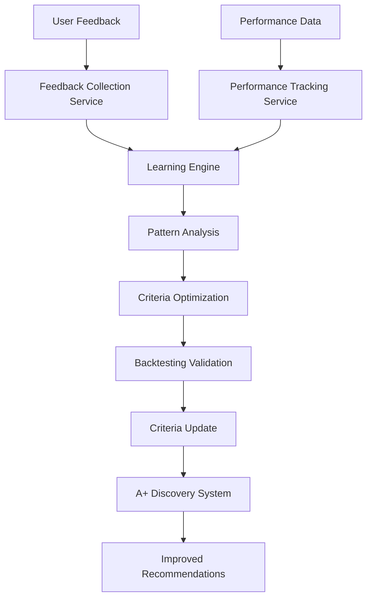

# A+ Investment Feedback Learning System

## Overview

The A+ Investment Feedback Learning System is a comprehensive machine learning framework that continuously improves the quality of investment discovery by collecting user feedback, tracking performance outcomes, and automatically adjusting discovery criteria based on real-world results.

## Architecture

### Core Components

1. **Feedback Collection Service** - Collects user feedback on A+ recommendations
2. **Performance Tracking Service** - Monitors investment performance over time
3. **Learning Engine** - Analyzes patterns and optimizes criteria
4. **Criteria Optimization Engine** - Implements learning-based adjustments
5. **Integration Tools** - Seamlessly integrates with existing FinWiz workflows

### Data Flow



## Key Features

### 1. User Feedback Collection

- **Recommendation Acceptance/Rejection** tracking
- **Sentiment Analysis** (very positive to very negative)
- **Confidence Ratings** (1-5 scale)
- **Detailed Reasoning** collection
- **User Comments** for qualitative insights

### 2. Performance Outcome Tracking

- **Alpha Calculation** vs benchmarks
- **Grade Maintenance** monitoring (A+ retention)
- **Risk-Adjusted Returns** (Sharpe ratio, Sortino ratio)
- **Drawdown Analysis** and volatility tracking
- **Market Regime** performance analysis

### 3. Machine Learning & Optimization

- **Adaptive Criteria Adjustment** based on feedback patterns
- **Asset-Specific Learning** for ETFs, stocks, and crypto
- **Market Regime Adaptation** for different economic conditions
- **Statistical Significance Testing** for all adjustments
- **Backtesting Validation** before implementation

### 4. Success Metrics Monitoring

The system tracks five key success metrics:

1. **Portfolio Grade Improvement**: Target 10%+ average improvement
2. **Discovery Rate**: Target 5+ A+ opportunities monthly
3. **Recommendation Precision**: Target 80% maintain A+ grade over 6 months
4. **User Adoption**: Target 70% acceptance rate
5. **Relative Performance**: Target 2%+ annual outperformance vs benchmarks

## Implementation Guide

### 1. Setting Up the Feedback Service

```python
from finwiz.services.feedback_service import get_feedback_service
from finwiz.schemas.feedback import LearningConfiguration

# Configure learning parameters
config = LearningConfiguration(
    min_feedback_samples=10,
    learning_rate=0.1,
    confidence_threshold=0.7,
    adjustment_frequency_days=30,
    require_backtesting=True,
    auto_rollback_enabled=True,
)

# Initialize service
feedback_service = get_feedback_service(config)
```

### 2. Collecting User Feedback

```python
from finwiz.schemas.feedback import UserFeedback, RecommendationOutcome, FeedbackSentiment

# Create feedback record
feedback = UserFeedback(
    user_id="user_123",
    recommendation_id="rec_456",
    symbol="AAPL",
    asset_type="stock",
    recommended_grade="A+",
    recommended_score=0.96,
    outcome=RecommendationOutcome.ACCEPTED,
    sentiment=FeedbackSentiment.POSITIVE,
    confidence_rating=4,
    reasons=["Strong fundamentals", "Good growth prospects"],
    user_comments="Excellent recommendation",
)

# Collect feedback
feedback_id = await feedback_service.collect_user_feedback(feedback)
```

### 3. Recording Performance Outcomes

```python
from finwiz.schemas.feedback import PerformanceFeedback, PerformanceOutcome

# Create performance record
performance = PerformanceFeedback(
    original_recommendation_id="rec_456",
    symbol="AAPL",
    holding_period_days=90,
    absolute_return=0.15,
    benchmark_return=0.10,
    alpha=0.05,
    current_grade="A+",
    grade_maintained=True,
    performance_outcome=PerformanceOutcome.OUTPERFORMED,
    met_expectations=True,
)

# Record performance
performance_id = await feedback_service.record_performance_outcome(performance)
```

### 4. Analyzing Feedback Patterns

```python
# Generate comprehensive feedback analysis
analysis = await feedback_service.analyze_feedback_patterns(days_back=90)

print(f"Total feedback items: {analysis.total_feedback_items}")
print(f"Acceptance rates by asset: {analysis.acceptance_by_asset_type}")
print(f"Key insights: {analysis.key_insights}")
print(f"Recommended adjustments: {analysis.recommended_adjustments}")
```

### 5. Optimizing Criteria

```python
from finwiz.schemas.investment_discovery import APlusCriteria

# Current criteria
current_criteria = APlusCriteria(
    etf_max_expense_ratio=0.15,
    stock_min_roe=0.20,
    crypto_min_market_cap=10e9,
)

# Optimize based on feedback
adjustment = await feedback_service.adjust_criteria_based_on_learning(
    current_criteria=current_criteria,
    force_adjustment=False
)

if adjustment:
    print(f"Criteria adjusted: {adjustment.adjustment_reason}")
    print(f"Expected improvement: {adjustment.expected_improvement:.1%}")
```

## CLI Usage

The system includes a comprehensive CLI for management and analysis:

### Collect Feedback
```bash
python -m finwiz.tools.feedback_cli collect-feedback \
    --user-id "user_123" \
    --recommendation-id "rec_456" \
    --symbol "AAPL" \
    --asset-type "stock" \
    --outcome "accepted" \
    --sentiment "positive" \
    --confidence 4 \
    --reasons "Strong fundamentals" \
    --comments "Great recommendation"
```

### Analyze Feedback

```bash
python -m finwiz.tools.feedback_cli analyze-feedback \
    --days 90 \
    --output-file "feedback_analysis.json"
```

### Get Learning Metrics

```bash
python -m finwiz.tools.feedback_cli learning-metrics --days 30
```

### Optimize Criteria

```bash
python -m finwiz.tools.feedback_cli optimize-criteria \
    --criteria-file "current_criteria.json" \
    --force \
    --dry-run
```

### Rollback Adjustment

```bash
python -m finwiz.tools.feedback_cli rollback-adjustment \
    --adjustment-id "adj_123" \
    --reason "Performance degradation detected"
```

## Integration with Investment Discovery

The feedback system is fully integrated with the Investment Discovery Crew:

### 1. Feedback Learning Agent

A dedicated agent analyzes feedback and optimizes criteria:

```yaml
feedback_learning_agent:
  role: "Feedback Learning Specialist and Criteria Optimization Expert"
  goal: >
    Analyze user feedback and performance outcomes to continuously improve A+
    discovery criteria through machine learning approaches.
```

### 2. Feedback Learning Task

Automated task that runs after each discovery cycle:

```yaml
feedback_learning_task:
  description: >
    Analyze collected user feedback and performance outcomes to continuously
    improve A+ discovery criteria and ensure measurable improvements.
```

### 3. Tools Integration

All discovery agents have access to feedback tools:

- `feedback_collection_tool` - Collect user feedback
- `performance_tracking_tool` - Track performance outcomes
- `criteria_optimization_tool` - Optimize criteria
- `feedback_analysis_tool` - Analyze patterns
- `learning_metrics_tool` - Monitor effectiveness

## Configuration Options

### Learning Configuration

```python
LearningConfiguration(
    # Learning parameters
    min_feedback_samples=10,        # Minimum samples before learning
    learning_rate=0.1,              # Rate of criteria adjustment
    confidence_threshold=0.7,       # Minimum confidence for adjustments
    
    # Adjustment limits
    max_criteria_change=0.2,        # Maximum change per adjustment (20%)
    adjustment_frequency_days=30,   # Minimum days between adjustments
    
    # Validation requirements
    require_backtesting=True,       # Require backtesting validation
    min_backtest_years=3,          # Minimum years for backtesting
    
    # Rollback conditions
    auto_rollback_enabled=True,     # Enable automatic rollback
    rollback_performance_threshold=-0.1,  # Performance drop trigger
    rollback_acceptance_threshold=-0.2,   # Acceptance drop trigger
    
    # Asset-specific settings
    asset_specific_learning=True,   # Learn separately by asset type
    weight_by_asset_performance=True,  # Weight learning by performance
)
```

## Monitoring and Alerts

### Key Metrics Dashboard

The system provides comprehensive monitoring:

- **Acceptance Rates** by asset type and time period
- **Performance Outcomes** with alpha and grade maintenance
- **Learning Effectiveness** with improvement trends
- **User Satisfaction** through confidence ratings
- **Data Quality** scores and sample adequacy

### Automated Alerts

- **Low Acceptance Rate** (< 50%) triggers criteria review
- **Performance Degradation** (< -10%) triggers rollback consideration
- **Insufficient Data** alerts when sample sizes are too small
- **System Errors** in feedback collection or processing

## Best Practices

### 1. Data Quality

- **Encourage Complete Feedback** with reasons and comments
- **Validate Input Data** before processing
- **Monitor Data Quality** scores regularly
- **Clean Historical Data** periodically

### 2. Learning Optimization

- **Start Conservative** with small learning rates
- **Validate All Changes** through backtesting
- **Monitor Performance** after each adjustment
- **Maintain Rollback Capability** for all changes

### 3. User Experience

- **Make Feedback Easy** to provide
- **Show Impact** of feedback on improvements
- **Provide Transparency** in how feedback is used
- **Respect Privacy** in data collection and storage

### 4. System Maintenance

- **Regular Monitoring** of learning metrics
- **Periodic Review** of criteria adjustments
- **Performance Validation** of learning algorithms
- **Documentation Updates** as system evolves

## Troubleshooting

### Common Issues

1. **Insufficient Feedback Data**
   - Solution: Lower min_feedback_samples temporarily
   - Monitor: Data collection rates and user engagement

2. **Criteria Not Adjusting**
   - Check: Adjustment frequency and confidence thresholds
   - Verify: Feedback quality and statistical significance

3. **Performance Degradation**
   - Action: Review recent criteria changes
   - Consider: Rollback to previous criteria

4. **Low User Adoption**
   - Analyze: Rejection reasons and patterns
   - Adjust: Criteria to better match user preferences

### Debugging Tools

- **Feedback Analysis Reports** for pattern identification
- **Learning Metrics Dashboard** for system health
- **Criteria History Tracking** for change analysis
- **Performance Validation** for adjustment effectiveness

## Future Enhancements

### Planned Features

1. **Advanced ML Models** for pattern recognition
2. **Real-time Adaptation** to market conditions
3. **Multi-objective Optimization** balancing multiple goals
4. **Ensemble Learning** combining multiple algorithms
5. **Predictive Analytics** for recommendation success

### Research Areas

- **Behavioral Finance** integration for user psychology
- **Market Regime Detection** for adaptive criteria
- **Reinforcement Learning** for dynamic optimization
- **Natural Language Processing** for comment analysis
- **Causal Inference** for understanding feedback relationships

## Conclusion

The A+ Investment Feedback Learning System transforms FinWiz from a static analysis tool into a continuously improving discovery engine. By systematically collecting feedback, tracking performance, and optimizing criteria, the system ensures that A+ recommendations become more accurate and valuable over time.

The combination of rigorous statistical analysis, machine learning optimization, and practical implementation considerations makes this system a powerful tool for enhancing investment discovery quality and user satisfaction.