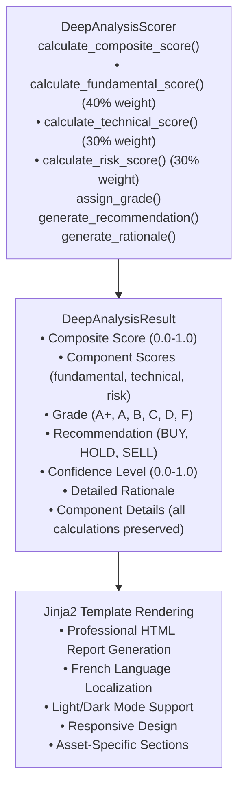

# Python Scoring Engine Documentation

## Overview

The FinWiz Python Scoring Engine is a deterministic, high-performance alternative to AI-based scoring that provides consistent, testable, and cost-effective deep analysis scoring. This engine replaces AI agents with mathematical algorithms for calculating composite scores, grades, and recommendations.

## Architecture

### Core Principles

1. **Deterministic Calculations**: Same input always produces same output
2. **Performance Optimized**: 10-20x faster than AI-based scoring
3. **Cost Effective**: $0 calculation costs vs $0.05-0.10 per ticker
4. **Fully Testable**: Complete unit test coverage with predictable results
5. **Data Preservation**: All raw metrics and analysis data preserved

### Component Architecture



## Scoring Methodology

### Composite Score Calculation

The composite score is calculated using a weighted average of three components:

```python
composite_score = (
    0.40 * fundamental_score +  # 40% weight
    0.30 * technical_score +    # 30% weight
    0.30 * risk_score          # 30% weight
)
```

### Grade Thresholds

| Score Range | Grade | Description         |
| ----------- | ----- | ------------------- |
| ≥ 0.95      | A+    | Exceptional quality |
| 0.85 - 0.95 | A     | High quality        |
| 0.80 - 0.85 | B+    | Good+ quality       |
| 0.75 - 0.80 | B     | Good quality        |
| 0.70 - 0.75 | C+    | Fair+ quality       |
| 0.65 - 0.70 | C     | Minimum acceptable  |
| 0.50 - 0.65 | D     | Below average       |
| < 0.50      | F     | Poor quality        |

### Recommendation Logic

| Composite Score  | Recommendation | Rationale                                 |
| ---------------- | -------------- | ----------------------------------------- |
| ≥ 0.85 (A or A+) | BUY            | Strong fundamentals and favorable outlook |
| 0.65 - 0.85      | HOLD           | Mixed signals, monitor developments       |
| ≤ 0.65           | SELL           | Weak fundamentals or elevated risks       |

`buy_threshold` is 0.85 and `sell_threshold` is 0.65
(`scoring/thresholds.py:46-47`). A 0.70 holding is a HOLD.

## Asset-Specific Scoring

### Stock Scoring (40% Fundamental Weight)

**Fundamental Analysis Components:**

- **ROE (Return on Equity)** - 40% of fundamental score
  - Target: 15%+ (Excellent: 20%+)
  - Measures management efficiency in generating returns
- **Debt-to-Equity Ratio** - 30% of fundamental score
  - Target: ≤0.3 (Conservative: ≤0.5)
  - Lower ratios indicate financial stability
- **Revenue Growth** - 20% of fundamental score
  - Target: 10%+ annually (Strong: 25%+)
  - Indicates business expansion and market share gains
- **Profit Margin** - 10% of fundamental score
  - Target: 10%+ (Excellent: 20%+)
  - Measures operational efficiency

**Scoring Thresholds:**

```python
# ROE Scoring
if roe >= 0.20:     score = 1.0  # 20%+
elif roe >= 0.15:   score = 0.8  # 15-20%
elif roe >= 0.10:   score = 0.6  # 10-15%
elif roe >= 0.05:   score = 0.4  # 5-10%
else:               score = 0.2  # <5%
```

### ETF Scoring (40% Fundamental Weight)

**Fundamental Analysis Components:**

- **Expense Ratio** - 50% of fundamental score
  - Target: ≤0.25% (Excellent: ≤0.10%)
  - Lower fees improve long-term returns
- **Tracking Error** - 30% of fundamental score
  - Target: ≤0.50% (Excellent: ≤0.20%)
  - Measures how closely ETF follows benchmark
- **Assets Under Management (AUM)** - 20% of fundamental score
  - Target: ≥$1B (Excellent: ≥$5B)
  - Higher AUM indicates liquidity and stability

### Crypto Scoring (40% Fundamental Weight)

**Fundamental Analysis Components:**

- **Market Capitalization** - 40% of fundamental score
  - Target: ≥$1B (Excellent: ≥$100B)
  - Higher market cap indicates stability and adoption
- **24-Hour Volume** - 30% of fundamental score
  - Target: ≥$100M (Excellent: ≥$1B)
  - Higher volume indicates liquidity
- **Age/Maturity** - 20% of fundamental score
  - Target: ≥2 years (Excellent: ≥5 years)
  - Older projects have proven track records
- **Supply Metrics** - 10% of fundamental score
  - Circulating vs max supply
  - Constrains future dilution

### Technical Analysis (30% Weight)

**Universal Technical Components:**

- **RSI (Relative Strength Index)** - 40% of technical score
  - Target range: 30-70 (Optimal: 40-60)
  - Measures momentum and overbought/oversold conditions
- **Trend Analysis** - 40% of technical score
  - Based on price vs 50-day and 200-day moving averages
  - Strong uptrend: Price > MA50 > MA200
- **MACD Momentum** - 20% of technical score
  - Bullish: MACD > Signal line
  - Measures momentum convergence/divergence

### Risk Assessment (30% Weight)

**Risk Components (Higher score = Lower risk):**

- **Volatility** - 50% of risk score
  - Target: ≤15% annually (Excellent: ≤10%)
  - Lower volatility indicates stability
- **Maximum Drawdown** - 30% of risk score
  - Target: ≤20% (Excellent: ≤10%)
  - Measures worst-case loss scenarios
- **Beta** - 20% of risk score
  - Target: 0.8-1.2 (Optimal: close to 1.0)
  - Measures market sensitivity

## Performance Improvements

### Speed Improvements

| Metric              | AI-Based Scoring | Python Scoring | Improvement           |
| ------------------- | ---------------- | -------------- | --------------------- |
| **Execution Time**  | 5-10 minutes     | 10-30 seconds  | **10-20x faster**     |
| **LLM Calls**       | 5-10 per ticker  | 0 per ticker   | **100% reduction**    |
| **Cost per Ticker** | \$0.05-0.10      | \$0.00         | **100% cost savings** |
| **Consistency**     | Variable         | Deterministic  | **100% reproducible** |

### Scalability Benefits

**Portfolio Analysis (66 holdings):**

- AI-Based: 5.5-11 hours, \$3.30-6.60
- Python-Based: 11-33 minutes, \$0.00
- **Savings: 10-20x faster, 100% cost reduction**

### Quality Improvements

1. **Deterministic Results**: Same input always produces same output
2. **Full Test Coverage**: Every calculation path unit tested
3. **Data Preservation**: All raw metrics preserved for transparency
4. **Audit Trail**: Complete calculation details available
5. **No Hallucinations**: Mathematical calculations only, no AI interpretation

## Configuration Options

### Optimization Modes

The Python scoring engine supports three optimization modes:

#### 1. Maximum Speed Mode (Default)

```bash
# Environment Variables
RISK_ASSESSMENT_USE_MINI=true
USE_MINIMAL_RISK_TOOLS=true
DEEP_ANALYSIS_AI_SUMMARY=false
```

**Characteristics:**

- **Execution Time**: 10-30 seconds per ticker
- **LLM Calls**: 0 for calculations
- **Cost**: \$0.00 per ticker
- **Components**: Python scoring + gpt-4o-mini + minimal tools

#### 2. Balanced Mode (Hybrid Approach)

```bash
# Environment Variables
RISK_ASSESSMENT_USE_MINI=true
USE_MINIMAL_RISK_TOOLS=true
DEEP_ANALYSIS_AI_SUMMARY=true
```

**Characteristics:**

- **Execution Time**: 15-40 seconds per ticker
- **LLM Calls**: 1 for optional AI summary
- **Cost**: \$0.01 per ticker
- **Components**: Python scoring + optional AI summary + gpt-4o-mini

#### 3. Baseline Mode (AI Comparison)

```bash
# Environment Variables
RISK_ASSESSMENT_USE_MINI=false
USE_MINIMAL_RISK_TOOLS=false
DEEP_ANALYSIS_AI_SUMMARY=true
```

**Characteristics:**

- **Execution Time**: 5-10 minutes per ticker
- **LLM Calls**: 5-10 for full AI analysis
- **Cost**: \$0.05-0.10 per ticker
- **Purpose**: Comparison and debugging baseline

### Batch Processing Configuration

```bash
# Batch processing settings
DEEP_ANALYSIS_BATCH_SIZE=5        # Concurrent analysis batch size
BATCH_PREFETCH_ENABLED=true       # Enable batch data pre-fetching
```

## Usage Examples

### Basic Usage

```python
from finwiz.scoring.deep_analysis_scorer import DeepAnalysisScorer

# Initialize scorer
scorer = DeepAnalysisScorer()

# Prepare data (from data collection task)
data = {
    "current_price": 150.0,
    "roe": 0.25,              # 25% ROE
    "debt_to_equity": 0.3,    # Low debt
    "revenue_growth": 0.15,   # 15% growth
    "rsi": 55.0,              # Neutral RSI
    "volatility": 0.18,       # 18% volatility
    "beta": 1.1,              # Slightly aggressive
    # ... additional metrics
}

# Calculate composite score
result = scorer.calculate_composite_score(
    ticker="AAPL",
    asset_class="stock",
    data=data
)

print(f"Grade: {result.grade}")                    # A
print(f"Score: {result.composite_score:.2f}")      # 0.78
print(f"Recommendation: {result.recommendation}")   # BUY
print(f"Confidence: {result.confidence:.1%}")      # 85%
```

### Complete Analysis Pipeline

```python
# Complete analysis with export generation
result, crew_export = scorer.analyze_and_export(
    ticker="AAPL",
    asset_class="stock",
    collected_data=data,
    session_id="analysis_2025_01_25"
)

# Access detailed analysis
detailed = crew_export["detailed_analysis"]
print(f"Raw metrics preserved: {len(detailed['raw_metrics'])}")
print(f"Sentiment data: {detailed['sentiment_data']}")
print(f"Technical indicators: {detailed['technical_indicators']}")
```

### Custom Scoring Thresholds

Thresholds are **injected, not assigned**. `DeepAnalysisScorer` has no
`GRADE_THRESHOLDS`, `BUY_THRESHOLD` or `SELL_THRESHOLD` attribute — setting
those names on the instance is a silent no-op that changes nothing. Build a
`ScoringThresholds` and pass it to the constructor:

```python
from dataclasses import replace

from finwiz.scoring.deep_analysis_scorer import DeepAnalysisScorer
from finwiz.scoring.thresholds import get_thresholds

custom = replace(
    get_thresholds(),
    grade_a_plus=0.97,        # stricter A+
    grade_a=0.90,             # stricter A
    buy_threshold=0.90,       # stricter buy
    sell_threshold=0.55,      # more aggressive sell
)

scorer = DeepAnalysisScorer(thresholds=custom)
```

## Data Preservation

### Raw Metrics Preservation

The Python scoring engine preserves ALL raw data from the analysis:

```python
detailed_analysis = {
    # Raw metrics (Requirement 18.21)
    "raw_metrics": {
        "volatility": 0.18,
        "beta": 1.1,
        "max_drawdown": -0.15,
        "sharpe_ratio": 1.2,
        "rsi": 55.0,
        "macd": 0.05,
        # ... all original metrics
    },

    # Sentiment data (Requirement 18.22)
    "sentiment_data": {
        "sentiment_score": 0.65,
        "trending_topics": ["earnings", "growth"],
        "article_count": 25,
        "news_sources": ["Reuters", "Bloomberg"],
    },

    # Technical indicators (Requirement 18.23)
    "technical_indicators": {
        "support_levels": [145.0, 140.0],
        "resistance_levels": [155.0, 160.0],
        "trend_direction": "uptrend",
        "momentum_indicators": {...},
    },

    # Fundamental data (Requirement 18.24)
    "fundamental_data": {
        "revenue": 365000000000,
        "earnings": 95000000000,
        "sec_filings": {...},
        "financial_statements": {...},
    },

    # Calculation results (Requirement 18.25)
    "calculation_results": {
        "composite_score": 0.78,
        "fundamental_score": 0.82,
        "technical_score": 0.75,
        "risk_score": 0.77,
        "grade": "A",
        "recommendation": "BUY",
    }
}
```

## Error Handling

### Graceful Degradation

```python
# Missing data handling
def _safe_get_float(self, data: Dict[str, Any], key: str, default: float) -> float:
    """Safely extract float value with fallback to default."""
    try:
        value = data.get(key, default)
        if value is None:
            return default
        return float(value)
    except (ValueError, TypeError):
        self.logger.warning(f"Invalid value for {key}, using default {default}")
        return default
```

### Error Result Generation

```python
# Create default result for error cases
def _create_error_result(self, ticker: str, asset_class: str, error_msg: str) -> DeepAnalysisResult:
    """Create a default result when analysis fails."""
    return DeepAnalysisResult(
        ticker=ticker,
        asset_class=asset_class,
        fundamental_score=0.3,
        technical_score=0.3,
        risk_score=0.3,
        composite_score=0.3,
        grade="D",
        recommendation="SELL",
        confidence=0.1,
        rationale=f"Analysis failed: {error_msg}. Default low scores assigned."
    )
```

## Testing

### Unit Test Coverage

The Python scoring engine has comprehensive unit test coverage:

```python
# Test fundamental scoring
def test_should_calculate_stock_fundamental_score_with_excellent_metrics():
    scorer = FundamentalScorer()
    data = {
        "roe": 0.25,              # 25% ROE -> 1.0 score
        "debt_to_equity": 0.2,    # Low debt -> 1.0 score
        "revenue_growth": 0.30,   # 30% growth -> 1.0 score
        "profit_margin": 0.25     # 25% margin -> 1.0 score
    }

    # Public entry point; delegates to the per-asset analyzers.
    score, details = scorer.calculate_fundamental_score("stock", data)

    # Weighted: 0.4*1.0 + 0.3*1.0 + 0.2*1.0 + 0.1*1.0 = 1.0
    assert score == 1.0
    assert details["roe_score"] == 1.0
    assert details["debt_score"] == 1.0
```

### Performance Testing

```python
def test_should_complete_analysis_within_performance_targets():
    scorer = DeepAnalysisScorer()
    start_time = time.time()

    result = scorer.calculate_composite_score("AAPL", "stock", sample_data)

    execution_time = time.time() - start_time
    assert execution_time < 1.0  # Must complete in under 1 second
    assert result.composite_score >= 0.0
    assert result.composite_score <= 1.0
```

### Deterministic Testing

```python
def test_should_produce_identical_results_for_same_input():
    scorer = DeepAnalysisScorer()

    # Run analysis multiple times with same input
    results = []
    for _ in range(5):
        result = scorer.calculate_composite_score("AAPL", "stock", sample_data)
        results.append(result)

    # All results should be identical
    for result in results[1:]:
        assert result.composite_score == results[0].composite_score
        assert result.grade == results[0].grade
        assert result.recommendation == results[0].recommendation
```

## Integration with CrewAI Flow

### Flow Integration

The Python scoring engine integrates seamlessly with CrewAI Flow:

```python
# In DeepAnalysisCrew
@task
def python_scoring_task(self) -> Task:
    return Task(
        description="""
        Use Python scoring engine for deterministic analysis.

        Steps:
        1. Receive collected_data from data_collection_task
        2. Call DeepAnalysisScorer.analyze_and_export()
        3. Return DeepAnalysisResult and crew export dict

        NO AI REASONING - Pure Python calculations only.
        """,
        agent=self.python_scorer(),
        expected_output="DeepAnalysisResult with scores, grade, recommendation",
        output_pydantic=DeepAnalysisResult,
        async_execution=False  # Final task must be synchronous
    )
```

### Hybrid Approach (Optional AI Summary)

```python
# Optional AI summary after Python scoring
if should_use_ai_summary():
    # Python scoring completes first (10-30 seconds)
    python_result = scorer.calculate_composite_score(ticker, asset_class, data)

    # Optional AI summary adds 5-10 seconds
    ai_summary = generate_ai_summary(python_result, data)

    # Total time: 15-40 seconds vs 5-10 minutes
    # Total cost: $0.01 vs $0.05-0.10
```

## Monitoring and Metrics

### Performance Monitoring

```python
# Automatic performance logging
logger.info(
    f"🚀 PYTHON SCORING PERFORMANCE for {ticker}:\n"
    f"  ✅ Execution time: {execution_time:.2f}s (target: 10-30s)\n"
    f"  ✅ LLM calls: 0 (target: 0)\n"
    f"  ✅ Cost: $0.00 (target: $0.00)\n"
    f"  ✅ Data preservation: ALL raw metrics preserved\n"
    f"  ✅ Deterministic: Same input = same output"
)
```

### Accuracy Validation

```python
# Compare Python vs AI scoring (when both available)
def validate_scoring_accuracy(python_result, ai_result):
    """Validate Python scoring accuracy against AI baseline."""
    score_diff = abs(python_result.composite_score - ai_result.composite_score)

    # Scores should be within ±0.05
    assert score_diff <= 0.05, f"Score difference too large: {score_diff}"

    # Grades should match for most cases
    if score_diff <= 0.02:
        assert python_result.grade == ai_result.grade

    # Recommendations should align
    assert python_result.recommendation == ai_result.recommendation
```

## Migration Guide

### From AI-Based to Python Scoring

1. **Enable Python Scoring**:

   ```bash
   # Set environment variables
   export DEEP_ANALYSIS_AI_SUMMARY=false
   export RISK_ASSESSMENT_USE_MINI=true
   export USE_MINIMAL_RISK_TOOLS=true
   ```

2. **Update Crew Configuration**:

   ```python
   # In DeepAnalysisCrew
   @crew
   def crew(self) -> Crew:
       return Crew(
           agents=self.agents,
           tasks=self.tasks,
           reasoning=False,  # Disable for Python scoring
           planning=False,   # Disable for performance
           verbose=True
       )
   ```

3. **Validate Results**:

   ```python
   # Run parallel comparison
   python_result = python_scorer.calculate_composite_score(ticker, asset_class, data)
   ai_result = ai_crew.kickoff(inputs={"ticker": ticker})

   # Compare results
   validate_scoring_accuracy(python_result, ai_result)
   ```

### Gradual Migration Strategy

1. **Phase 1**: Run both Python and AI scoring in parallel
2. **Phase 2**: Use Python scoring with AI validation
3. **Phase 3**: Full Python scoring with optional AI summary
4. **Phase 4**: Pure Python scoring (maximum performance)

## Troubleshooting

### Common Issues

**Issue**: Scores seem too high/low

```python
# Solution: Check input data quality
missing_fields = scorer._identify_missing_fields(data)
if missing_fields:
    logger.warning(f"Missing fields may affect scoring: {missing_fields}")
```

**Issue**: Inconsistent grades between runs

```python
# Solution: Verify deterministic behavior
results = [scorer.calculate_composite_score(ticker, asset_class, data) for _ in range(3)]
assert all(r.grade == results[0].grade for r in results), "Non-deterministic results detected"
```

**Issue**: Performance slower than expected

```python
# Solution: Check optimization mode
from finwiz.config.performance.performance_config import OptimizationMode, get_performance_config_manager
config_manager = get_performance_config_manager()
mode = config_manager.get_mode()
logger.info(f"Current mode: {mode.value}")

# Ensure maximum speed mode
assert mode == OptimizationMode.MAXIMUM_SPEED
```

### Debug Logging

```python
# Enable detailed logging
import logging
logging.getLogger("finwiz.scoring").setLevel(logging.DEBUG)

# View calculation details
result = scorer.calculate_composite_score(ticker, asset_class, data)
logger.debug(f"Fundamental details: {result.fundamental_details}")
logger.debug(f"Technical details: {result.technical_details}")
logger.debug(f"Risk details: {result.risk_details}")
```

## Future Enhancements

### Planned Improvements

1. **Machine Learning Integration**: Optional ML models for enhanced predictions
2. **Sector-Specific Scoring**: Customized scoring for different industries
3. **ESG Integration**: Environmental, Social, Governance scoring
4. **Real-Time Updates**: Dynamic scoring with live market data
5. **Custom Scoring Models**: User-defined scoring algorithms

### Extensibility

```python
# Custom scoring algorithm example
class CustomStockScorer(DeepAnalysisScorer):
    """Custom scoring algorithm for specific use cases."""

    def calculate_fundamental_score(self, asset_class: str, data: Dict[str, Any]) -> tuple[float, Dict[str, Any]]:
        """Override with custom fundamental scoring logic."""
        if asset_class == "stock":
            return self._custom_stock_scoring(data)
        return super().calculate_fundamental_score(asset_class, data)

    def _custom_stock_scoring(self, data: Dict[str, Any]) -> tuple[float, Dict[str, Any]]:
        """Custom stock scoring algorithm."""
        # Implement custom logic
        pass
```

## Conclusion

The FinWiz Python Scoring Engine represents a significant advancement in financial analysis automation, providing:

- **10-20x performance improvement** over AI-based scoring
- **100% cost reduction** for calculation tasks
- **Complete deterministic behavior** for reliable results
- **Full data preservation** for transparency and auditability
- **Comprehensive test coverage** for production reliability

This engine enables high-frequency portfolio analysis at scale while maintaining the quality and depth of analysis that FinWiz users expect.

---

**Version**: 1.0
**Last Updated**: 2025-01-25
**Related Documentation**:

- [Jinja2 Template Documentation](../explanations/REPORT_FILE_STRUCTURE.md)
- [Performance Configuration Guide](PERFORMANCE_CONFIGURATION.md)
