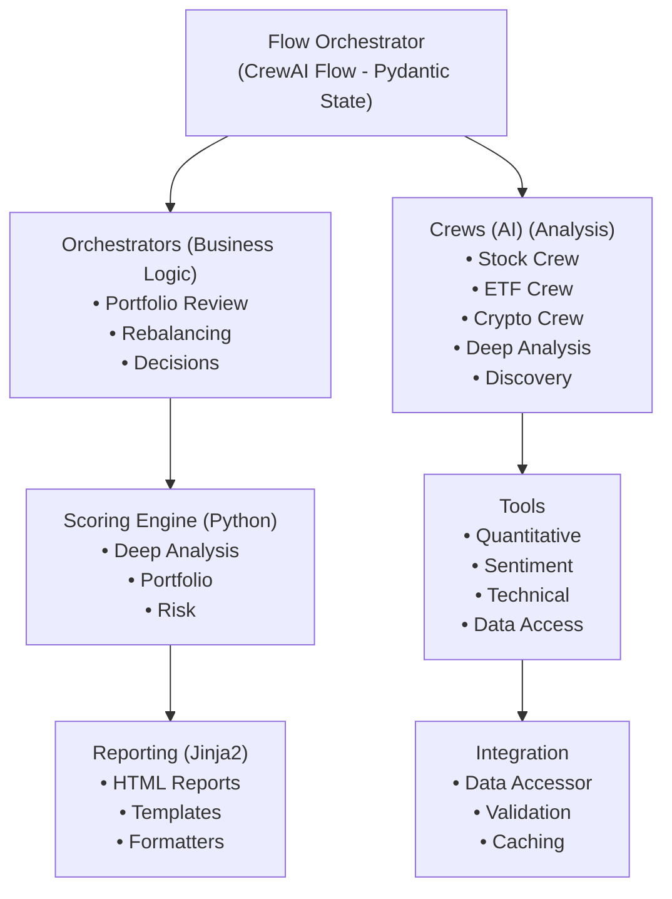

# FinWiz Documentation

Welcome to the FinWiz documentation! FinWiz is a sophisticated AI-powered financial analysis platform built with CrewAI, leveraging autonomous AI agents to perform comprehensive analysis of stocks, ETFs, cryptocurrencies, and portfolios.

## What is FinWiz?

FinWiz emphasizes **AI Minimalism** - using Python for deterministic tasks and AI only where reasoning is required:

- **Comprehensive Asset Analysis**: Deep analysis of stocks, ETFs, and cryptocurrencies
- **AI-Powered Insights**: Autonomous agents for research requiring reasoning
- **Python Scoring Engine**: 100% deterministic calculations with 10-20x speedup
- **Portfolio Management**: Review, rebalancing, and optimization
- **A+ Investment Discovery**: Proactive opportunity discovery
- **Quantitative Analysis**: Professional-grade libraries (Backtrader, TA-Lib, QuantLib)

## Quick Start

New to FinWiz? Start here:

1. **[Getting Started Tutorial](tutorials/getting_started.md)** - Step-by-step walkthrough
   - First-time setup
   - Running your first analysis
   - Understanding outputs

2. **[Developer Guide](development/DEVELOPER_GUIDE.md)** - Architecture and development
   - System architecture overview
   - Code organization and patterns
   - Creating custom crews
   - Testing and deployment

3. **[Operations Guide](how-to/OPERATIONS_GUIDE.md)** - Running FinWiz in production
   - Deployment and environment configuration
   - Operations, monitoring, and maintenance
   - Migration and troubleshooting

## Documentation Structure

Our documentation follows the [Diátaxis framework](https://diataxis.fr/) for clear, organized information:

### 📚 [Tutorials](tutorials/index.md)

**Learning-oriented** - Step-by-step lessons to get you started with FinWiz.

- [Getting Started](tutorials/getting_started.md) - Complete setup and configuration
- [First Analysis](tutorials/first_analysis.md) - Your first stock analysis
- [Portfolio Analysis](tutorials/portfolio_analysis.md) - Comprehensive portfolio review

### 🛠️ [How-to Guides](how-to/index.md)

**Problem-solving** - Practical guides for specific tasks and configurations.

- [Setup Environment](how-to/setup_environment.md) - Environment configuration
- [Batch Processing](how-to/BATCH_PROCESSING.md) - High-performance portfolio analysis
- [Python Scoring Engine](how-to/PYTHON_SCORING_ENGINE.md) - Deterministic scoring
- [Template Configuration](how-to/template_configuration.md) - Customize reports

### 📖 [Reference](reference/index.md)

**Information-oriented** - Technical reference for APIs, schemas, and commands.

- [API Reference](reference/api/index.md) - Complete API documentation
- [Schema Documentation](reference/schemas/index.md) - Data models and validation

### 💡 [Explanations](explanations/index.md)

**Understanding-oriented** - Conceptual guides to understand FinWiz's architecture and design.

- [Architecture](explanations/ARCHITECTURE.md) - System design overview
- [Design Principles](explanations/design_principles.md) - Core philosophy
- [Orchestrator Interactions](explanations/ORCHESTRATOR_INTERACTIONS.md) - Orchestrator framework
- [Python Scoring Engine](explanations/PYTHON_SCORING_ENGINE.md) - Scoring architecture
- [Deep Analysis](explanations/deep_analysis.md) - Deep analysis system

## Key Features

### AI Minimalism Philosophy

**Principle**: Use Python for deterministic tasks, AI only where reasoning is required.

**Benefits**:

- **10-20x Faster**: Deterministic Python analysis vs AI-based processing
- **100% Cost Reduction**: Zero LLM calls for calculations
- **Deterministic Results**: Same input always produces same output
- **Easier Testing**: Mathematical formulas are testable and auditable

**When to Use AI**:

- ✅ Analysis requiring reasoning (interpreting complex financial data)
- ✅ Synthesis of complex information (combining multiple data sources)
- ✅ Natural language understanding (parsing text)
- ✅ Creative content generation (writing analysis narratives)

**When to Use Python**:

- ❌ HTML generation (use Jinja2 templates)
- ❌ Data consolidation (use Python functions)
- ❌ Calculations and formulas (use Python/numpy)
- ❌ Data validation (use Pydantic)
- ❌ Template rendering (use Jinja2)

### Multi-Asset Analysis

- **Stocks**: Fundamental analysis using 10-K filings, technical indicators, sector comparisons
- **ETFs**: Expense ratio analysis, tracking error assessment, holdings diversification
- **Cryptocurrencies**: Technical analysis, volatility patterns, regulatory risk assessment

### Python Scoring Engine

Replace AI-based calculations with deterministic Python for maximum performance:

```python
from finwiz.scoring.deep_analysis_scorer import DeepAnalysisScorer

scorer = DeepAnalysisScorer()
result = scorer.calculate_composite_score(
    ticker="AAPL",
    asset_class="stock",
    data={"roe": 0.25, "debt_to_equity": 0.3, "revenue_growth": 0.15}
)

# Results: Grade: A, Score: 0.78, Recommendation: BUY
```

**Performance Comparison**:

- AI-based scoring: 45-90 seconds per holding
- Python scoring: 2-5 seconds per holding
- **Speedup**: 10-20x faster
- **Cost**: 100% reduction (zero LLM calls)

### Batch Processing

High-performance portfolio analysis with concurrent execution:

**Configuration**:

```bash
BATCH_PREFETCH_ENABLED=true
DEEP_ANALYSIS_BATCH_SIZE=5  # Concurrent crews
BATCH_PREFETCH_MIN_HOLDINGS=10
```

**Performance**:

- 66 holdings: 5.5-11 hours → 20-40 minutes (10-20x speedup)
- Data pre-fetch: 2-5 seconds (Yahoo Finance)
- Concurrent execution: 5 crews in parallel (configurable)

### Portfolio Management

- **Portfolio Review**: Automated evaluation with keep/sell recommendations
- **Deep Analysis**: Comprehensive per-holding analysis with grading (A+ to F)
- **Alternative Suggestions**: For holdings marked "SELL"
- **Rebalancing**: Professional-grade optimization with multiple strategies
- **Cost Analysis**: Transaction costs, tax implications, opportunity cost

### A+ Investment Discovery

Proactive discovery of exceptional investment opportunities:

- **Market Screening**: Scan entire universes (S&P 500, crypto markets, etc.)
- **Deep Analysis**: Comprehensive analysis of candidates
- **Grade Validation**: Only A+ grade (score ≥ 0.95) assets reported
- **Monitoring**: Track discovered opportunities over time

### Quantitative Analysis

Professional-grade quantitative analysis framework:

- **Backtesting**: Backtrader-based strategy testing
- **Technical Analysis**: TA-Lib indicators (50+ indicators)
- **Portfolio Optimization**: PyPortfolioOpt integration
- **Derivatives Pricing**: QuantLib integration
- **Risk Management**: VaR, CVaR, stress testing

## Documentation Features

### Professional Documentation System

- **GitHub Pages**: Clean, fast documentation built with MkDocs + Material
- **Mobile Responsive**: Optimized experience across all devices
- **Full-Text Search**: Built into the Material theme
- **Professional Navigation**: Clear hierarchical structure
- **Diátaxis Framework**: Organized by documentation type

### Interactive Documentation

- **Code Examples**: Practical, runnable examples throughout
- **API Explorer**: Interactive API reference
- **Schema Browser**: Browse and validate Pydantic schemas
- **Configuration Guide**: Environment variable reference

## Getting Help

### Core Documentation

- **[Getting Started](tutorials/getting_started.md)** - Setup and first analysis
- **[Operations Guide](how-to/OPERATIONS_GUIDE.md)** - Deployment, operations, and migration
- **[Developer Guide](development/DEVELOPER_GUIDE.md)** - Architecture and development
- **[API Reference](reference/api/index.md)** - API documentation
- **[Tutorials](tutorials/index.md)** - Learning-oriented guides

### Troubleshooting

- **[Troubleshooting Guide](how-to/troubleshooting.md)** - Common issues and solutions
- **[Developer Guide](development/DEVELOPER_GUIDE.md#testing)** - Testing strategies

### Community

- **GitHub Repository**: [finwiz/finwiz](https://github.com/fjacquet/finwiz)
- **Issue Tracker**: [Report bugs and request features](https://github.com/fjacquet/finwiz/issues)
- **Discussions**: [Community Q&A](https://github.com/fjacquet/finwiz/discussions)

## Quick Links

### For Users

- [Installation Guide](tutorials/getting_started.md)
- [First Analysis](tutorials/first_analysis.md)
- [Portfolio Analysis](tutorials/portfolio_analysis.md)
- [Troubleshooting](how-to/troubleshooting.md)

### For Developers

- [Architecture Overview](development/DEVELOPER_GUIDE.md#architecture-overview)
- [Development Setup](development/DEVELOPER_GUIDE.md#development-setup)
- [Creating Custom Crews](development/DEVELOPER_GUIDE.md#creating-custom-crews)
- [Testing Guide](development/DEVELOPER_GUIDE.md#testing)
- [Contributing](development/DEVELOPER_GUIDE.md#contributing)

### Key Features

- [AI Minimalism](explanations/design_principles.md)
- [Python Scoring Engine](how-to/PYTHON_SCORING_ENGINE.md)
- [Batch Processing](how-to/BATCH_PROCESSING.md)
- [A+ Discovery](explanations/deep_analysis.md)

## System Requirements

### Minimum Requirements

- Python 3.13 (`requires-python = ">=3.13,<3.14"` — 3.12 and 3.14 are not supported)
- 2GB RAM (4GB+ recommended)
- 1GB free storage
- Internet connection for API access

### Required API Keys

- **OPENAI_API_KEY**: OpenAI API for LLM operations
- **SERPER_API_KEY**: Google search via Serper

### Optional API Keys

- ALPHA_VANTAGE_API_KEY - Financial data
- TWELVE_DATA_API_KEY - Technical indicators
- CHART_IMG_API_KEY - Chart generation
- X-CMC_PRO_API_KEY - Cryptocurrency data
- PPLX_API_KEY - Perplexity research

## Architecture Overview



## Core Design Principles

1. **AI Minimalism**: Use Python for deterministic tasks, AI only for reasoning
2. **Pydantic-First**: All outputs validated with strict schemas
3. **File-Based Data Passing**: Pass file paths (not data) between crews
4. **Concurrent Execution**: SME crews run in parallel for maximum performance
5. **Clean Separation**: Analysis (AI) vs presentation (Python templates)

## Version Information

- **Current Version**: 5.12.0
- **Python Version**: 3.13
- **CrewAI Version**: 1.15.12+
- **Documentation Updated**: 2026-08-16

## License

FinWiz is released under the MIT License. See the [LICENSE](https://github.com/fjacquet/finwiz/blob/main/LICENSE) file for details.

---

**Ready to get started?** Jump into the [Getting Started tutorial](tutorials/getting_started.md) or see the [Operations Guide](how-to/OPERATIONS_GUIDE.md) for deployment!

---

*Documentation built with MkDocs + Material and hosted on GitHub Pages*
