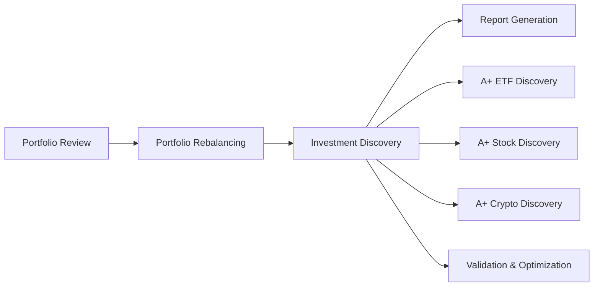

# Investment Discovery Integration

## Overview

The Investment Discovery feature has been successfully integrated into the main FinWiz flow. This integration enables proactive discovery of A+ grade investment opportunities that can enhance portfolio quality.

## Integration Points

### 1. Main Flow Integration

The investment discovery functionality is integrated into `src/finwiz/main.py` as a new flow step:

- **Method**: `check_investment_discovery()`
- **Execution**: Runs after portfolio review and rebalancing
- **Dependencies**: Requires portfolio review data to be available
- **Feature Flag**: Controlled by `investment_discovery` feature flag

### 2. Feature Flag Configuration

The investment discovery feature is controlled by the `investment_discovery` feature flag:

- **Default**: Enabled (100% rollout)
- **Environment Variable**: `FF_INVESTMENT_DISCOVERY`
- **Rollout Control**: `FF_INVESTMENT_DISCOVERY_ROLLOUT`
- **Fallback Strategy**: Disable if feature is turned off

### 3. Data Flow



### 4. Report Integration

Investment discovery results are integrated into the unified reporting system:

- **Output Directory**: `output/discovery/`
- **Report Section**: "Opportunités A+ Découvertes"
- **Data Access**: Report crew has access to discovery results via DirectoryReadTool
- **Schema Support**: Full schema validation for discovery results

## Configuration

### Environment Variables

```bash
# Enable/disable investment discovery
FF_INVESTMENT_DISCOVERY=true

# Control rollout percentage (0-100)
FF_INVESTMENT_DISCOVERY_ROLLOUT=100.0
```

### Input Data

The investment discovery crew receives the following inputs from the main flow:

- `portfolio_data`: Current portfolio holdings and analysis
- `portfolio_review_json`: Path to portfolio review results
- `portfolio_rebalancing_result`: Rebalancing recommendations (if available)
- `full_date`: Current analysis date
- `session_id`: Session identifier for continuity
- `report_language`: Language preference for outputs

### Output Data

The investment discovery crew produces:

- `investment_discovery_result`: Complete discovery analysis
- `investment_discovery_available`: Boolean flag indicating if results are available

## Usage

The investment discovery integration is automatic when:

1. The `investment_discovery` feature flag is enabled
2. Portfolio review data is available
3. The main FinWiz flow is executed

No additional configuration or manual intervention is required.

## Error Handling

If investment discovery fails:

- The error is logged but doesn't stop the main flow
- `investment_discovery_available` is set to `false`
- The report generation continues without discovery results
- Graceful degradation ensures core functionality remains intact

## Output Files

Investment discovery results are saved to:

- `output/discovery/a_plus_etfs.md` - ETF discovery results
- `output/discovery/a_plus_stocks.md` - Stock discovery results  
- `output/discovery/a_plus_cryptos.md` - Crypto discovery results
- `output/discovery/validation_results.md` - Validation outcomes
- `output/discovery/optimization_results.md` - Portfolio optimization recommendations

## Requirements Satisfied

This integration satisfies the following requirements from the specification:

- **5.1**: Integration with existing grading system and portfolio reports
- **5.4**: Data flow between portfolio review and discovery systems
- **All requirements**: Complete end-to-end integration of discovery functionality

## Testing

The integration has been tested to ensure:

- ✅ Investment discovery crew can be imported and initialized
- ✅ Feature flag controls work correctly
- ✅ Main flow integration is functional
- ✅ Schema validation works properly
- ✅ Output directories are created
- ✅ Report crew can access discovery results