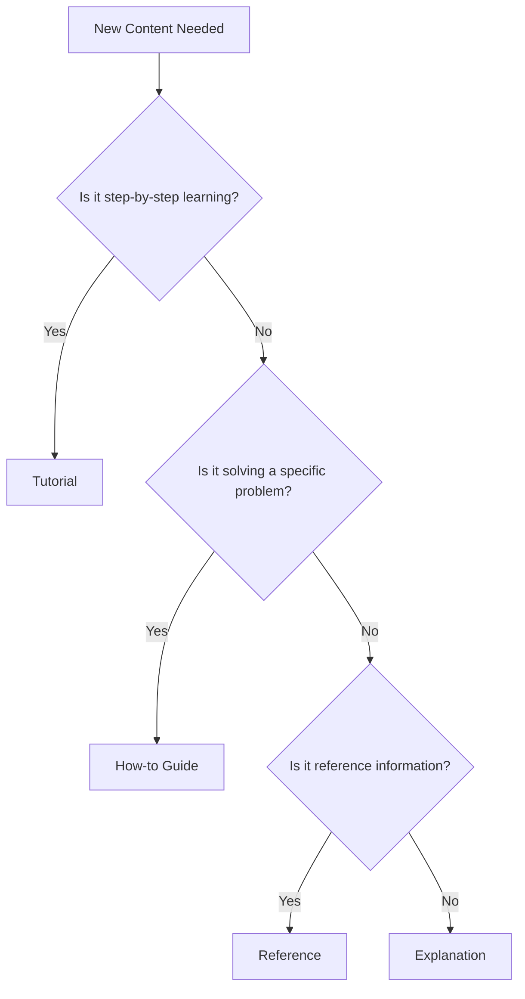

# Content Creation Workflows and Standards

This guide defines the workflows, standards, and best practices for creating and maintaining documentation content in the FinWiz MkDocs site.

## Content Framework

### Diátaxis Classification

All content must be classified into one of four categories:

| Category | Purpose | Characteristics | Examples |
|----------|---------|-----------------|----------|
| **Tutorials** | Learning by doing | Step-by-step, beginner-friendly | Getting started, first analysis |
| **How-to Guides** | Problem solving | Goal-oriented, assumes knowledge | Setup guides, troubleshooting |
| **Reference** | Information lookup | Comprehensive, accurate | API docs, CLI commands |
| **Explanations** | Understanding | Context, background, theory | Architecture, design principles |

### Content Decision Tree



## Content Creation Workflow

### 1. Planning Phase

#### Content Proposal

Before creating content, submit a proposal including:

- **Content type** (Tutorial/How-to/Reference/Explanation)
- **Target audience** (Beginner/Intermediate/Advanced)
- **Learning objectives** or problem being solved
- **Estimated scope** (length, complexity)
- **Related content** (dependencies, cross-references)

#### Content Outline

Create a detailed outline with:

```markdown
# Content Title

## Target Audience
- Primary: [Who is this for?]
- Prerequisites: [What should they know?]

## Learning Objectives / Goals
- [ ] Objective 1
- [ ] Objective 2
- [ ] Objective 3

## Outline
1. Introduction
2. Main sections...
3. Conclusion/Next steps

## Success Criteria
- [ ] User can accomplish X
- [ ] User understands Y
```

### 2. Creation Phase

#### File Setup

1. **Create file** in appropriate directory:

   ```bash
   # Tutorials
   touch docs/tutorials/new-tutorial.md

   # How-to guides
   touch docs/how-to/new-guide.md

   # Reference
   touch docs/reference/new-reference.md

   # Explanations
   touch docs/explanations/new-explanation.md
   ```

2. **Use content template** (see Templates section)

3. **Add to navigation** in `.pages` file

#### Content Development

Follow the writing standards and style guide while developing content.

### 3. Review Phase

#### Self-Review Checklist

Before submitting for review:

- [ ] **Content type alignment**: Matches Diátaxis category
- [ ] **Target audience**: Appropriate level and tone
- [ ] **Completeness**: All sections filled out
- [ ] **Code examples**: Tested and working
- [ ] **Links**: All internal/external links work
- [ ] **Images**: Optimized and accessible
- [ ] **Grammar**: Proofread for errors
- [ ] **Formatting**: Follows style guide

#### Peer Review Process

1. **Create pull request** with content changes
2. **Request review** from documentation team
3. **Address feedback** and make revisions
4. **Final approval** from documentation maintainer

#### Technical Review

For technical content:

1. **Code review**: All examples tested
2. **Accuracy check**: Technical details verified
3. **Integration test**: Content works with existing docs

### 4. Publication Phase

#### Pre-Publication

1. **Final validation**:

   ```bash
   make docs-validate
   ```

2. **Build test**:

   ```bash
   make docs-build
   ```

There is no `make docs-deploy-staging` target and no staging environment
in this repo — the only deploy target is `docs-deploy`, which runs
`mkdocs gh-deploy --clean` directly against production. Preview locally
with `make docs-serve` instead before merging.

#### Publication

1. **Merge to main branch**
2. **Automatic deployment** via GitHub Actions
3. **Verify live site** functionality

#### Post-Publication

1. **Monitor for issues** (broken links, formatting)
2. **Collect feedback** from users
3. **Schedule review** for future updates

## Content Templates

### Tutorial Template

```markdown
# Tutorial Title

Brief description of what the user will learn and accomplish.

## Prerequisites

- Requirement 1
- Requirement 2
- Link to setup guide if needed

## What You'll Learn

By the end of this tutorial, you'll be able to:

- [ ] Learning objective 1
- [ ] Learning objective 2
- [ ] Learning objective 3

## Step 1: [Action Verb] [Object]

Explanation of what we're doing and why.

```bash
# Code example with explanation
command --option value
```

Expected output:

```
Output example
```

## Step 2: [Next Action]

Continue with clear, sequential steps...

## Troubleshooting

Common issues and solutions:

### Issue: Problem description

**Symptoms**: What the user sees
**Cause**: Why it happens
**Solution**: How to fix it

## Next Steps

- Link to related tutorials
- Link to how-to guides for advanced topics
- Link to reference documentation

## Summary

Recap what was accomplished and key takeaways.

```

### How-to Guide Template

```markdown
# How to [Accomplish Specific Task]

Brief description of the problem this guide solves.

## Prerequisites

- Requirement 1
- Requirement 2

## Overview

Quick summary of the approach and main steps.

## Method 1: [Approach Name] (Recommended)

### When to Use

Describe scenarios where this method is best.

### Steps

1. **Action 1**: Detailed instruction
   ```bash
   command example
   ```

1. **Action 2**: Next instruction

   ```bash
   another command
   ```

### Verification

How to confirm the task was completed successfully:

```bash
verification command
```

## Method 2: [Alternative Approach]

### When to Use

When Method 1 isn't suitable...

### Steps

Alternative approach steps...

## Troubleshooting

Common problems and solutions.

## Related Guides

- Link to related how-to guides
- Link to reference documentation

```

### Reference Template

```markdown
# [Component/API/Tool] Reference

Comprehensive reference for [component name].

## Overview

Brief description of what this component does.

## Quick Reference

| Item | Description | Example |
|------|-------------|---------|
| Item 1 | Description | `example` |
| Item 2 | Description | `example` |

## Detailed Reference

### Section 1

Comprehensive details...

#### Subsection

Specific information...

### Parameters/Options

| Parameter | Type | Required | Description | Default |
|-----------|------|----------|-------------|---------|
| param1 | string | Yes | Description | - |
| param2 | int | No | Description | 0 |

### Examples

#### Basic Example

```python
# Code example with explanation
example_code()
```

#### Advanced Example

```python
# More complex example
advanced_example()
```

## See Also

- Related reference pages
- Relevant tutorials
- How-to guides

```

### Explanation Template

```markdown
# [Concept/System] Explanation

Introduction to the concept and why it matters.

## Overview

High-level explanation of the concept.

## Background

Historical context or motivation for the concept.

## How It Works

Detailed explanation of the underlying mechanisms.

### Key Concepts

#### Concept 1

Explanation of important concept...

#### Concept 2

Another important concept...

## Benefits and Trade-offs

### Benefits

- Benefit 1
- Benefit 2

### Trade-offs

- Trade-off 1
- Trade-off 2

## Real-world Applications

Examples of how this concept is used in practice.

## Further Reading

- Links to tutorials
- Links to how-to guides
- External resources
```

## Writing Standards

> **Canonical source:** [`style-guide.md`](style-guide.md) is the
> authoritative reference for these rules — it covers the same voice/tone,
> clarity, inclusivity, heading, code-block, list, link, image, table, and
> admonition guidance in more depth. The summary below is kept as a quick
> reference; if the two ever disagree, `style-guide.md` wins.

### Voice and Tone

- **Active voice**: "Configure the API" not "The API should be configured"
- **Present tense**: "The system validates" not "The system will validate"
- **Direct address**: "You can configure" not "One can configure"
- **Conversational but professional**: Friendly but authoritative

### Language Guidelines

#### Clarity

- **Short sentences**: Aim for 15-20 words per sentence
- **Simple words**: Use common terms when possible
- **Specific terms**: Be precise in technical language
- **Consistent terminology**: Use the same terms throughout

#### Structure

- **Logical flow**: Information in logical order
- **Clear headings**: Descriptive section titles
- **Scannable content**: Use lists, tables, and formatting
- **Progressive disclosure**: Simple to complex information

#### Inclusivity

- **Gender-neutral language**: Avoid gendered pronouns
- **Accessible language**: Consider non-native speakers
- **Cultural sensitivity**: Avoid idioms and cultural references
- **Technical level**: Match audience expertise

### Formatting Standards

#### Headings

```markdown
# H1: Page Title (only one per page)
## H2: Major sections
### H3: Subsections
#### H4: Sub-subsections (use sparingly)
```

#### Code Blocks

Always specify language:

```markdown
```python
# Python code example
def example_function():
    return "Hello, World!"
```

```bash
# Shell commands
make docs-serve
```

```yaml
# Configuration files
key: value
nested:
  key: value
```

```

#### Lists

**Unordered lists** for non-sequential items:
```markdown
- Item 1
- Item 2
- Item 3
```

**Ordered lists** for sequential steps:

```markdown
1. First step
2. Second step
3. Third step
```

**Task lists** for checklists:

```markdown
- [ ] Incomplete task
- [x] Completed task
```

#### Links

**Internal links** (relative):

```markdown
[Link text](../reference/api.md)
[Section link](../tutorials/getting-started.md#installation)
```

**External links**:

```markdown
[External site](https://example.com)
```

#### Images

```markdown

*Caption text (optional)*
```

**Image guidelines**:

- Use descriptive alt text
- Optimize file size (< 500KB)
- Use PNG for screenshots, JPG for photos
- Include captions when helpful

#### Tables

```markdown
| Column 1 | Column 2 | Column 3 |
|----------|----------|----------|
| Data 1   | Data 2   | Data 3   |
| Data 4   | Data 5   | Data 6   |
```

#### Admonitions

```markdown
!!! note
    Additional information that's helpful but not critical.

!!! warning
    Important information that could prevent errors.

!!! danger
    Critical information about potential problems.

!!! tip
    Helpful suggestions or best practices.
```

## Quality Assurance

### Content Quality Checklist

#### Accuracy

- [ ] **Technical accuracy**: All code examples work
- [ ] **Current information**: No outdated references
- [ ] **Complete coverage**: All necessary information included
- [ ] **Correct links**: All links work and point to right content

#### Usability

- [ ] **Clear objectives**: User knows what they'll accomplish
- [ ] **Logical flow**: Information in sensible order
- [ ] **Appropriate depth**: Right level of detail for audience
- [ ] **Actionable content**: User can follow instructions

#### Accessibility

- [ ] **Alt text**: All images have descriptive alt text
- [ ] **Heading structure**: Proper heading hierarchy
- [ ] **Color contrast**: Text readable in light/dark modes
- [ ] **Screen reader friendly**: Content works with assistive technology

#### SEO and Discoverability

- [ ] **Descriptive titles**: Clear, searchable page titles
- [ ] **Meta descriptions**: Helpful page descriptions
- [ ] **Internal linking**: Connected to related content
- [ ] **Search keywords**: Uses terms users would search for

### Validation Tools

#### Automated Checks

```bash
# Markdown linting
make docs-lint

# Link validation
make docs-validate

# Build validation
make docs-build
```

#### Manual Review

- **Readability**: Read content aloud
- **User testing**: Have someone follow instructions
- **Cross-browser testing**: Check in different browsers
- **Mobile testing**: Verify mobile experience

## Maintenance Workflows

### Content Lifecycle

#### Regular Review Schedule

**Monthly**:

- Review analytics for popular/unpopular content
- Check for broken links and outdated information
- Update screenshots and examples as needed

**Quarterly**:

- Full content audit for accuracy and relevance
- Reorganize content based on user feedback
- Archive or update outdated content

**Annually**:

- Major content strategy review
- Technology and tool updates
- Complete style guide review

#### Update Triggers

Update content when:

- **Code changes**: API or functionality changes
- **User feedback**: Reports of confusion or errors
- **Analytics data**: High bounce rates or low engagement
- **External changes**: Third-party tool updates

#### Deprecation Process

When content becomes outdated:

1. **Mark as deprecated** with clear notice
2. **Provide migration path** to new content
3. **Set removal date** (minimum 3 months notice — reconciled with `content-governance.md`, which previously specified 3 months for the same process while this document said 6)
4. **Archive content** rather than deleting
5. **Set up redirects** to new content

### Version Control

#### Branching Strategy

- **Main branch**: Published content
- **Feature branches**: New content development
- **Review branches**: Content under review

#### Commit Messages

Use clear, descriptive commit messages:

```
docs: add tutorial for portfolio analysis

- Add step-by-step tutorial for new users
- Include code examples and screenshots
- Link to related how-to guides

Closes #123
```

#### Change Documentation

For significant changes:

- Update changelog
- Notify users of breaking changes
- Provide migration guides

## Collaboration Guidelines

### Team Roles

#### Content Creator

- **Responsibilities**: Write and maintain content
- **Skills**: Subject matter expertise, writing ability
- **Review**: Submit content for peer review

#### Content Reviewer

- **Responsibilities**: Review content for quality and accuracy
- **Skills**: Editorial skills, technical knowledge
- **Authority**: Approve/reject content changes

#### Documentation Maintainer

- **Responsibilities**: Overall documentation strategy and quality
- **Skills**: Information architecture, user experience
- **Authority**: Final approval, strategic decisions

### Communication

#### Content Planning

- **Regular meetings**: Weekly content planning sessions
- **Shared roadmap**: Visible content development pipeline
- **User feedback**: Regular review of user comments and requests

#### Issue Tracking

Use GitHub issues for:

- Content requests
- Bug reports (broken links, errors)
- Enhancement suggestions
- Content audit findings

#### Style Discussions

- **Style guide updates**: Propose changes via pull request
- **Terminology decisions**: Document in glossary
- **Template updates**: Version control all templates

## Tools and Resources

### Writing Tools

#### Recommended Editors

- **VS Code**: With markdown extensions
- **Typora**: WYSIWYG markdown editor
- **GitBook**: For collaborative editing
- **Any text editor**: With markdown support

#### Helpful Extensions

- **Markdown linting**: Real-time style checking
- **Spell check**: Grammar and spelling validation
- **Link checking**: Validate links as you write
- **Preview**: Live preview of rendered content

### Reference Resources

#### Style Guides

- **Microsoft Writing Style Guide**: General writing principles
- **Google Developer Documentation Style Guide**: Technical writing
- **Diátaxis Framework**: Content organization principles

#### Technical Resources

- **MkDocs Documentation**: Platform-specific guidance
- **Material Theme Docs**: Theme customization
- **Markdown Guide**: Syntax reference

### Analytics and Feedback

#### Monitoring Tools

- **Google Analytics**: User behavior and popular content
- **GitHub Insights**: Repository activity and contributions
- **User feedback**: Comments and issue reports

#### Success Metrics

- **Page views**: Content popularity
- **Time on page**: Content engagement
- **Bounce rate**: Content effectiveness
- **User feedback**: Qualitative assessment

---

**Last Updated**: 2025-10-26
**Version**: 1.0
**Maintainer**: FinWiz Documentation Team
