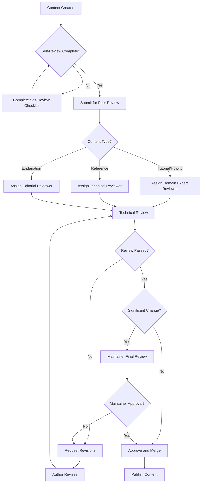
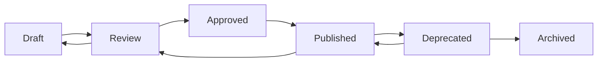

# Content Governance Framework

This document establishes the governance framework for FinWiz documentation, including review processes, approval workflows, and quality standards.

## Governance Structure

### Roles and Responsibilities

#### Documentation Maintainer

**Primary Responsibilities**:

- Overall documentation strategy and vision
- Final approval authority for significant changes
- Quality standards enforcement
- Governance framework updates

**Authority Level**: Strategic decisions, policy changes, major restructuring

**Current Maintainer**: FinWiz Documentation Team Lead

#### Content Reviewers

**Primary Responsibilities**:

- Technical accuracy review
- Editorial review for clarity and style
- Compliance with content standards
- Mentoring content creators

**Authority Level**: Approve/reject content changes, suggest improvements

**Qualification Requirements**:

- Subject matter expertise in relevant domain
- Strong writing and editing skills
- Familiarity with Diátaxis framework
- Understanding of target audience needs

#### Content Creators

**Primary Responsibilities**:

- Create and maintain documentation content
- Follow established standards and guidelines
- Respond to review feedback
- Keep content current and accurate

**Authority Level**: Create content within guidelines, propose improvements

**Qualification Requirements**:

- Domain expertise in content area
- Basic writing skills
- Familiarity with markdown and MkDocs
- Understanding of content standards

### Review Board

#### Composition

- **1 Documentation Maintainer** (permanent member)
- **3-5 Content Reviewers** (rotating 6-month terms)
- **1 User Experience Representative** (optional)
- **1 Technical Lead** (for technical content)

#### Meeting Schedule

- **Regular meetings**: Bi-weekly (1 hour)
- **Emergency meetings**: As needed for urgent issues
- **Quarterly reviews**: Comprehensive governance assessment

## Content Review Process

### Review Workflow



### Review Criteria

#### Technical Accuracy

- [ ] **Code examples work**: All code has been tested
- [ ] **Current information**: No outdated references or deprecated features
- [ ] **Complete coverage**: All necessary information included
- [ ] **Correct procedures**: Step-by-step instructions are accurate

#### Content Quality

- [ ] **Clear objectives**: User knows what they'll accomplish
- [ ] **Appropriate audience**: Content matches intended skill level
- [ ] **Logical structure**: Information flows in sensible order
- [ ] **Actionable content**: User can successfully follow instructions

#### Editorial Standards

- [ ] **Grammar and spelling**: No errors in language
- [ ] **Style compliance**: Follows established style guide
- [ ] **Consistent terminology**: Uses standard FinWiz terms
- [ ] **Proper formatting**: Correct use of markdown and structure

#### Framework Compliance

- [ ] **Diátaxis alignment**: Content fits chosen category correctly
- [ ] **Template usage**: Follows appropriate content template
- [ ] **Navigation integration**: Properly integrated into site structure
- [ ] **Cross-references**: Links to related content where appropriate

### Review Types

#### Standard Review

**Triggers**:

- New content creation
- Minor content updates
- Regular maintenance updates

**Process**:

1. Author completes self-review checklist
2. Single reviewer assigned based on content type
3. Review completed within 3 business days
4. Feedback provided with specific, actionable comments
5. Author addresses feedback and resubmits
6. Reviewer approves or requests additional changes

#### Comprehensive Review

**Triggers**:

- Major content restructuring
- New content categories or templates
- Significant technical changes
- User feedback indicating problems

**Process**:

1. Multiple reviewers assigned (technical + editorial)
2. Extended review period (5-7 business days)
3. Review board discussion if needed
4. Detailed feedback with improvement recommendations
5. Multiple revision cycles if necessary
6. Final maintainer approval required

#### Emergency Review

**Triggers**:

- Critical errors in published content
- Security-related documentation updates
- Time-sensitive information updates

**Process**:

1. Immediate reviewer assignment
2. 24-hour review turnaround
3. Expedited approval process
4. Post-publication comprehensive review scheduled

## Approval Workflows

### Approval Authority Matrix

| Content Type | Creator | Reviewer | Maintainer | Notes |
|--------------|---------|----------|------------|-------|
| New tutorials | Create | Required | Optional | Standard review process |
| How-to guides | Create | Required | Optional | Domain expert review |
| Reference docs | Create | Required | Optional | Technical accuracy critical |
| Explanations | Create | Required | Optional | Editorial review important |
| Style guide changes | Propose | Required | Required | Affects all content |
| Template updates | Propose | Required | Required | Structural changes |
| Navigation changes | Propose | Required | Required | Site-wide impact |
| Major restructuring | Propose | Required | Required | Strategic decision |

### Approval Criteria

#### Automatic Approval

Content that can be approved without maintainer review:

- Minor text corrections (typos, grammar)
- Code example updates (same functionality)
- Link updates (same destination, new URL)
- Image replacements (same content, better quality)

#### Maintainer Approval Required

Content requiring maintainer review:

- New content categories or sections
- Changes to site structure or navigation
- Updates to style guide or templates
- Content that affects multiple pages
- Controversial or sensitive topics

### Escalation Process

#### Reviewer Disagreement

When reviewers disagree:

1. **Discussion phase**: Reviewers discuss concerns directly
2. **Compromise attempt**: Seek middle-ground solution
3. **Maintainer decision**: Escalate to maintainer for final decision
4. **Documentation**: Record decision rationale for future reference

#### Author-Reviewer Conflict

When author disagrees with reviewer feedback:

1. **Clarification request**: Author requests specific clarification
2. **Discussion**: Direct discussion between author and reviewer
3. **Second opinion**: Request additional reviewer if needed
4. **Maintainer mediation**: Escalate to maintainer if unresolved

## Style Guide and Standards

### Writing Style Standards

#### Voice and Tone

- **Active voice**: "Configure the API" not "The API should be configured"
- **Present tense**: "The system validates" not "The system will validate"
- **Direct address**: "You can configure" not "One can configure"
- **Professional but approachable**: Authoritative yet friendly

#### Language Guidelines

**Clarity**:

- Use simple, common words when possible
- Keep sentences under 20 words
- Be specific and precise
- Avoid jargon without explanation

**Consistency**:

- Use the same terms throughout documentation
- Follow established terminology in glossary
- Maintain consistent formatting patterns
- Apply style rules uniformly

**Inclusivity**:

- Use gender-neutral language
- Consider non-native English speakers
- Avoid cultural references and idioms
- Use accessible language for technical level

### Technical Standards

#### Code Examples

```markdown
# Always specify language
```python
def example_function():
    return "Hello, World!"
```

# Include comments for clarity

```bash
# Start the development server
make docs-serve
```

# Show expected output when helpful

```
Expected output:
Server started at http://127.0.0.1:8000
```

```

#### Links and References

```markdown
# Internal links (relative paths)
[Setup Guide](../how-to/setup.md)

# External links (full URLs)
[MkDocs Documentation](https://www.mkdocs.org/)

# Section links within same page
[Installation](#installation)
```

#### Images and Media

```markdown
# Always include alt text


# Include captions when helpful
*Figure 1: The main dashboard showing key metrics*

# Optimize file sizes (< 500KB recommended)
```

### Formatting Standards

#### Headings

```markdown
# H1: Page Title (only one per page)
## H2: Major sections
### H3: Subsections
#### H4: Sub-subsections (use sparingly)
```

#### Lists and Tables

```markdown
# Unordered lists for non-sequential items
- Item 1
- Item 2
- Item 3

# Ordered lists for sequential steps
1. First step
2. Second step
3. Third step

# Tables for structured data
| Column 1 | Column 2 | Column 3 |
|----------|----------|----------|
| Data 1   | Data 2   | Data 3   |
```

## Content Audit and Update Schedule

### Regular Audit Schedule

#### Monthly Audits

**Scope**: High-traffic and critical content
**Focus Areas**:

- Accuracy of code examples
- Currency of external links
- User feedback and reported issues
- Analytics data review

**Process**:

1. Review analytics for top 20 pages
2. Check for reported issues or user feedback
3. Validate external links and references
4. Update outdated information
5. Schedule comprehensive review if needed

#### Quarterly Audits

**Scope**: Complete content inventory
**Focus Areas**:

- Content relevance and usefulness
- Structural organization and navigation
- Compliance with current standards
- Gap analysis for missing content

**Process**:

1. Complete content inventory and categorization
2. User journey analysis and pain point identification
3. Content performance analysis (engagement, bounce rate)
4. Competitive analysis and best practice review
5. Strategic recommendations for improvements

#### Annual Reviews

**Scope**: Comprehensive governance assessment
**Focus Areas**:

- Overall content strategy effectiveness
- Governance process improvements
- Technology and tooling updates
- Team structure and role definitions

**Process**:

1. Stakeholder feedback collection
2. Process efficiency analysis
3. Technology stack review and updates
4. Governance framework refinement
5. Strategic planning for next year

### Update Triggers

#### Automatic Updates

Content that should be updated automatically:

- **Code changes**: When APIs or functionality changes
- **Version updates**: When software versions change
- **Link rot**: When external links become invalid
- **Security updates**: When security practices change

#### Reactive Updates

Content updated in response to:

- **User feedback**: Reports of confusion or errors
- **Support tickets**: Common questions or issues
- **Analytics data**: High bounce rates or low engagement
- **Team feedback**: Internal reports of outdated information

#### Proactive Updates

Content updated proactively:

- **Industry changes**: New best practices or standards
- **Technology evolution**: New tools or methodologies
- **User needs evolution**: Changing user expectations
- **Competitive landscape**: Keeping pace with industry

### Content Lifecycle Management

#### Content States

1. **Draft**: Work in progress, not published
2. **Review**: Submitted for review process
3. **Approved**: Approved but not yet published
4. **Published**: Live on the documentation site
5. **Deprecated**: Marked for removal or replacement
6. **Archived**: Removed from navigation but preserved

#### Lifecycle Transitions



#### Deprecation Process

When content becomes outdated:

1. **Assessment**: Determine if content should be updated or removed
2. **Notice period**: Mark as deprecated with clear notice (minimum 3 months)
3. **Migration path**: Provide links to updated content or alternatives
4. **User notification**: Announce deprecation in release notes
5. **Removal**: Archive content after notice period
6. **Redirect setup**: Configure redirects to new content

## Quality Assurance

### Quality Metrics

#### Content Quality Indicators

- **Accuracy rate**: Percentage of content without factual errors
- **Completeness score**: Coverage of required information
- **Clarity rating**: User comprehension and task completion rates
- **Currency index**: Percentage of content updated within target timeframes

#### User Experience Metrics

- **Task completion rate**: Users successfully completing documented procedures
- **Time to information**: How quickly users find needed information
- **User satisfaction**: Feedback scores and qualitative comments
- **Support ticket reduction**: Decrease in questions covered by documentation

#### Process Efficiency Metrics

- **Review turnaround time**: Average time from submission to approval
- **Revision cycles**: Average number of revisions before approval
- **Content velocity**: Rate of new content creation and updates
- **Reviewer workload**: Distribution and balance of review assignments

### Quality Improvement Process

#### Continuous Improvement Cycle

1. **Measure**: Collect quality metrics and user feedback
2. **Analyze**: Identify patterns and improvement opportunities
3. **Plan**: Develop specific improvement initiatives
4. **Implement**: Execute improvements and process changes
5. **Monitor**: Track results and effectiveness
6. **Adjust**: Refine approach based on results

#### Feedback Integration

**User Feedback**:

- Regular surveys and feedback collection
- Issue tracking and resolution
- User testing and observation
- Analytics data analysis

**Team Feedback**:

- Retrospectives and process reviews
- Reviewer feedback on content quality
- Author feedback on review process
- Stakeholder input on strategic direction

## Governance Framework Maintenance

### Framework Review Process

#### Annual Governance Review

**Scope**: Complete framework assessment
**Participants**: All governance roles plus stakeholders
**Duration**: 2-week review period with 1-week implementation

**Review Areas**:

1. **Role effectiveness**: Are roles clearly defined and effective?
2. **Process efficiency**: Are review processes working well?
3. **Quality outcomes**: Are quality standards being met?
4. **User satisfaction**: Are users getting value from documentation?
5. **Team satisfaction**: Are team members satisfied with processes?

#### Framework Updates

**Change Process**:

1. **Proposal**: Anyone can propose governance changes
2. **Discussion**: Review board discusses proposal
3. **Trial period**: Test changes on limited scope if appropriate
4. **Evaluation**: Assess effectiveness of changes
5. **Adoption**: Formally adopt successful changes
6. **Documentation**: Update governance documentation

### Compliance Monitoring

#### Regular Compliance Checks

**Monthly**:

- Review process adherence
- Quality standard compliance
- Approval workflow effectiveness

**Quarterly**:

- Comprehensive process audit
- Stakeholder satisfaction assessment
- Framework effectiveness review

#### Non-Compliance Response

**Minor Issues**:

- Direct feedback to individuals
- Additional training or support
- Process clarification

**Major Issues**:

- Formal review and discussion
- Process improvement initiatives
- Framework adjustments if needed

---

**Last Updated**: 2025-10-26
**Version**: 1.0
**Maintainer**: FinWiz Documentation Team
