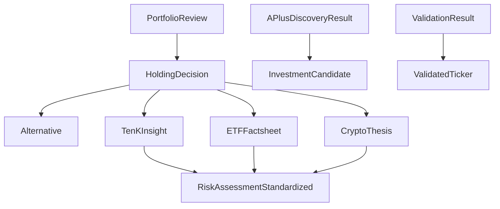

# Schema Reference

Comprehensive documentation for FinWiz's data schemas, validation models, and type definitions. All schemas are implemented using Pydantic v2 with strict validation.

## Schema Relationships



## Common Schema Patterns

### Base Analysis Schema

All analysis schemas inherit common fields:

```python
class BaseAnalysis(BaseModel):
    ticker: str = Field(..., description="Asset ticker symbol")
    analysis_date: datetime = Field(default_factory=datetime.now)
    confidence_level: float = Field(..., ge=0.0, le=1.0)
    data_sources: List[str] = Field(default_factory=list)

    model_config = {
        "extra": "forbid",
        "str_strip_whitespace": True,
        "validate_assignment": True
    }
```

### Standardized Risk Assessment

All assets use the same risk scoring framework:

```python
class RiskAssessmentStandardized(BaseModel):
    overall_risk_score: int = Field(..., ge=1, le=10)
    systematic_risk: float = Field(..., ge=0.0, le=1.0)
    idiosyncratic_risk: float = Field(..., ge=0.0, le=1.0)
    risk_factors: List[str] = Field(default_factory=list)
    risk_category: RiskCategory = Field(...)
```

### Investment Recommendations

Standardized recommendation format:

```python
class InvestmentRecommendation(BaseModel):
    recommendation: Literal["BUY", "HOLD", "SELL"]
    confidence: float = Field(..., ge=0.0, le=1.0)
    time_horizon: Literal["SHORT", "MEDIUM", "LONG"]
    price_target: Optional[float] = None
    rationale: str = Field(..., min_length=50)
```

## Validation Rules

### Strict Validation

All schemas use Pydantic v2 strict mode:

```python
model_config = {
    "extra": "forbid",           # Reject unknown fields
    "str_strip_whitespace": True, # Clean string inputs
    "validate_assignment": True,  # Validate on assignment
    "use_enum_values": True      # Use enum values in output
}
```

### Field Validation

Common validation patterns:

```python
# Ticker symbols
ticker: str = Field(..., pattern=r'^[A-Z]{1,5}$')

# Percentages
percentage: float = Field(..., ge=0.0, le=1.0)

# Risk scores
risk_score: int = Field(..., ge=1, le=10)

# Confidence levels
confidence: float = Field(..., ge=0.0, le=1.0)

# Required text with minimum length
rationale: str = Field(..., min_length=50)
```

### Custom Validators

```python
@field_validator('ticker')
@classmethod
def validate_ticker_format(cls, v: str) -> str:
    if not v.isalpha():
        raise ValueError('Ticker must contain only letters')
    return v.upper()

@field_validator('price_target')
@classmethod
def validate_price_target(cls, v: Optional[float]) -> Optional[float]:
    if v is not None and v <= 0:
        raise ValueError('Price target must be positive')
    return v
```

## Schema Examples

### Complete Stock Analysis

```json
{
  "ticker": "AAPL",
  "company_name": "Apple Inc.",
  "analysis_date": "2025-01-15T10:30:00Z",
  "recommendation": "BUY",
  "confidence_level": 0.85,
  "price_target": 180.00,
  "current_price": 150.00,
  "risk_assessment": {
    "overall_risk_score": 4,
    "systematic_risk": 0.6,
    "idiosyncratic_risk": 0.3,
    "risk_factors": ["Market volatility", "Tech sector exposure"],
    "risk_category": "MODERATE"
  },
  "financial_metrics": {
    "pe_ratio": 25.5,
    "revenue_growth": 0.15,
    "profit_margin": 0.25,
    "debt_to_equity": 0.3
  },
  "data_sources": [
    "SEC EDGAR",
    "Yahoo Finance",
    "Alpha Vantage"
  ]
}
```

### Portfolio Review

```json
{
  "portfolio_id": "user_portfolio_001",
  "analysis_date": "2025-01-15T10:30:00Z",
  "total_value": 100000.00,
  "holdings": [
    {
      "ticker": "AAPL",
      "decision": "KEEP",
      "current_allocation": 0.25,
      "recommended_allocation": 0.20,
      "rationale": "Strong fundamentals but overweight"
    }
  ],
  "alternatives": [
    {
      "ticker": "MSFT",
      "reason": "Better risk-adjusted returns",
      "confidence": 0.80
    }
  ],
  "overall_grade": "B+",
  "improvement_potential": 0.15
}
```

## Schema Validation Tools

### Validation Manager

```python
from finwiz.validation.manager import get_validation_manager

manager = get_validation_manager()
result = manager.validate_crew_output(data, "stock", "analysis")

if result.is_valid:
    validated_data = result.sanitized_data
else:
    for error in result.errors:
        print(f"Error in {error.field_path}: {error.message}")
```

### Schema Registry

```python
from finwiz.validation.registry import get_registry

registry = get_registry()
schema = registry.get_schema("TenKInsight")
validated_data = schema.model_validate(raw_data)
```

## Error Handling

### Validation Errors

```python
from pydantic import ValidationError

try:
    analysis = TenKInsight.model_validate(data)
except ValidationError as e:
    for error in e.errors():
        print(f"Field: {error['loc']}")
        print(f"Error: {error['msg']}")
        print(f"Input: {error['input']}")
```

### Error Response Schema

```python
class ValidationErrorResponse(BaseModel):
    field_path: str
    message: str
    error_type: str
    input_value: Any
    context: Dict[str, Any] = Field(default_factory=dict)
```

## Schema Evolution

### Versioning Strategy

- **Backward Compatible**: Add optional fields only
- **Breaking Changes**: Require new schema version
- **Migration Tools**: Automatic data migration utilities

### Deprecation Process

1. **Announce**: 6-month deprecation notice
2. **Mark**: Add deprecation warnings
3. **Migrate**: Provide migration tools
4. **Remove**: Remove in next major version

## Best Practices

### Schema Design

- **Use descriptive field names** that clearly indicate purpose
- **Include comprehensive field descriptions** for documentation
- **Set appropriate validation constraints** for data quality
- **Use enums for controlled vocabularies** to prevent typos
- **Provide sensible defaults** where appropriate

### Validation Strategy

- **Validate at boundaries** - crew inputs and outputs
- **Use strict mode** to catch unexpected data
- **Provide clear error messages** for debugging
- **Log validation failures** for monitoring
- **Graceful degradation** when possible

### Performance Considerations

- **Minimize validation overhead** in hot paths
- **Cache compiled schemas** for repeated use
- **Use appropriate field types** for memory efficiency
- **Consider lazy validation** for large datasets

## JSON Schema Export

All Pydantic schemas can be exported as JSON Schema:

```python
# Export schema for external tools
schema_json = TenKInsight.model_json_schema()

# Save to file for documentation
with open("TenKInsight.schema.json", "w") as f:
    json.dump(schema_json, f, indent=2)
```

## Testing Schemas

### Unit Tests

```python
def test_ten_k_insight_validation():
    valid_data = {
        "ticker": "AAPL",
        "recommendation": "BUY",
        "confidence_level": 0.85,
        # ... other required fields
    }

    analysis = TenKInsight.model_validate(valid_data)
    assert analysis.ticker == "AAPL"
    assert analysis.recommendation == "BUY"
```

### Property-Based Testing

```python
from hypothesis import given, strategies as st

@given(st.text(min_size=1, max_size=5, alphabet=st.characters(whitelist_categories=('Lu',))))
def test_ticker_validation(ticker):
    try:
        validated = ValidatedTicker(symbol=ticker)
        assert validated.symbol.isupper()
        assert validated.symbol.isalpha()
    except ValidationError:
        # Expected for invalid tickers
        pass
```

## Related Documentation

- **[API Reference](../api/index.md)** - How to use schemas in API calls
- **[Error Handling](../../development/DEVELOPER_GUIDE.md)** - Error handling strategies
- **[Testing Guide](../../development/DEVELOPER_GUIDE.md#testing)** - Testing schema validation
