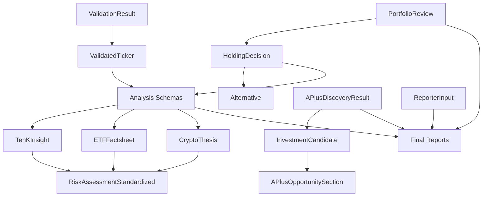
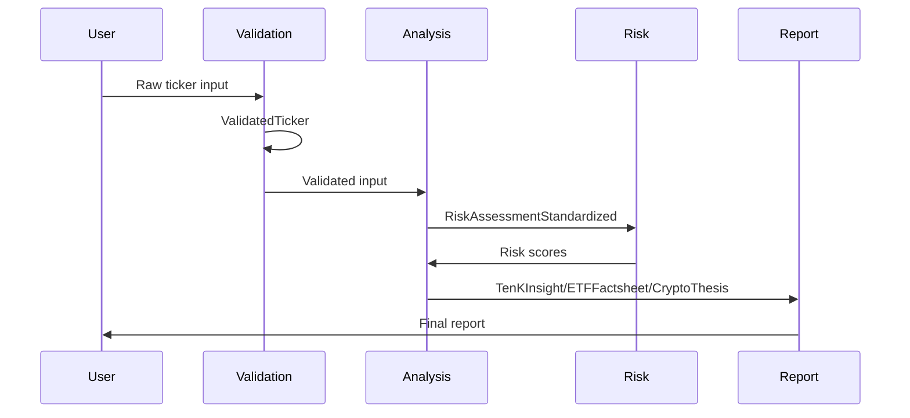
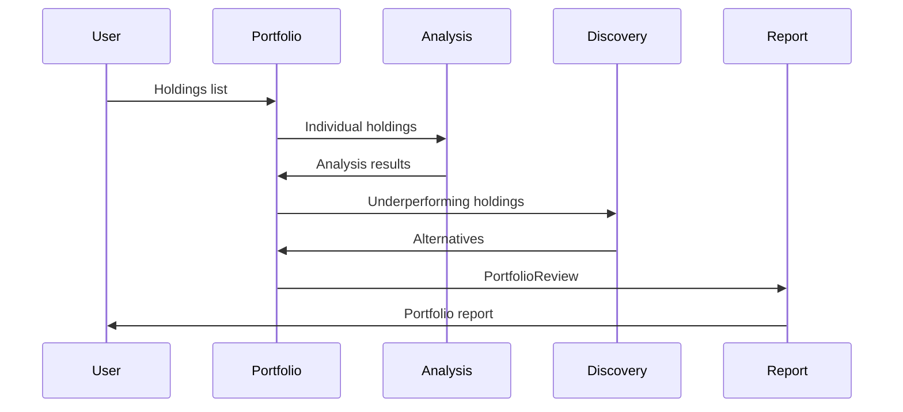
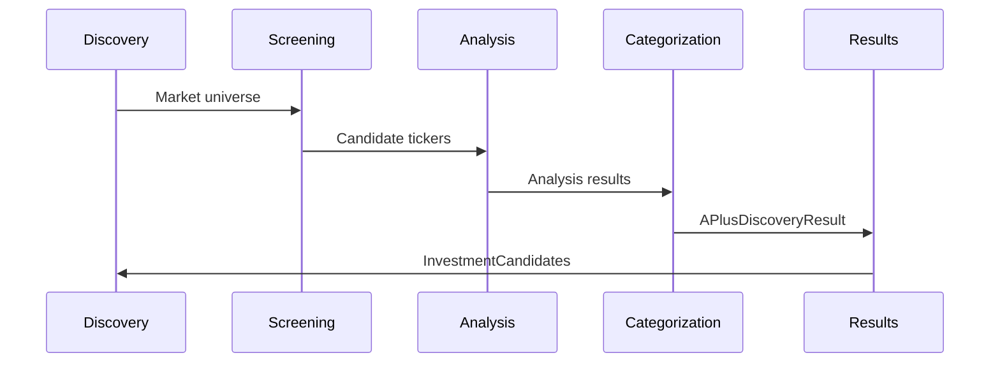

# Schema Relationships

Understanding how FinWiz schemas relate to each other and work together in the analysis pipeline.

## Schema Hierarchy



## Core Relationships

### Input Validation Flow

1. **Raw Input** → `ValidationResult` → `ValidatedTicker`
2. **ValidatedTicker** → Analysis Crews → Analysis Schemas
3. **Analysis Schemas** → Portfolio/Discovery Processing

```python
# Input validation pipeline
raw_ticker = "aapl"
validation_result = validate_input(raw_ticker)
if validation_result.is_valid:
    validated_ticker = ValidatedTicker.model_validate(validation_result.sanitized_data)
    analysis = run_analysis(validated_ticker)
```

### Analysis Schema Relationships

All analysis schemas share common patterns:

```python
# Common base structure
class BaseAnalysis:
    ticker: str
    analysis_date: datetime
    recommendation: Literal["BUY", "HOLD", "SELL"]
    confidence_level: float
    risk_assessment: RiskAssessmentStandardized
    rationale: str
    data_sources: List[str]
```

**Inheritance Pattern:**

- `TenKInsight` extends BaseAnalysis for stocks
- `ETFFactsheet` extends BaseAnalysis for ETFs
- `CryptoThesis` extends BaseAnalysis for cryptocurrencies
- All include `RiskAssessmentStandardized`

### Portfolio Integration

Portfolio schemas aggregate analysis results:

```python
# Portfolio contains multiple holdings
PortfolioReview:
    holdings: List[HoldingDecision]  # Each holding references analysis
    alternatives: List[Alternative]   # Suggested replacements

# Each holding decision references analysis
HoldingDecision:
    ticker: str                      # Links to analysis schema
    decision: str                    # Based on analysis recommendation
    grade: str                       # From analysis grading
    risk_score: int                  # From risk assessment
```

### Discovery Integration

Discovery schemas identify new opportunities:

```python
# Discovery results contain candidates
APlusDiscoveryResult:
    stock_opportunities: List[InvestmentCandidate]
    etf_opportunities: List[InvestmentCandidate]
    crypto_opportunities: List[InvestmentCandidate]

# Candidates can be converted to full analysis
InvestmentCandidate → TenKInsight/ETFFactsheet/CryptoThesis
```

## Data Flow Patterns

### Single Asset Analysis



### Portfolio Analysis



### Discovery Process



## Schema Composition Patterns

### Risk Assessment Integration

All analysis schemas include standardized risk assessment:

```python
# Risk assessment is embedded in all analysis schemas
class TenKInsight(BaseModel):
    # ... other fields
    risk_assessment: RiskAssessmentStandardized

class ETFFactsheet(BaseModel):
    # ... other fields
    risk_assessment: RiskAssessmentStandardized

class CryptoThesis(BaseModel):
    # ... other fields
    risk_assessment: RiskAssessmentStandardized
```

### Data Source Tracking

All schemas track data sources for transparency:

```python
# Common data source pattern
class AnalysisSchema(BaseModel):
    data_sources: List[str] = Field(default_factory=list)
    data_freshness: datetime = Field(default_factory=datetime.now)
    confidence_level: float = Field(..., ge=0.0, le=1.0)
```

### Validation Integration

All schemas support validation workflows:

```python
# Validation result contains sanitized data
ValidationResult:
    sanitized_data: Dict[str, Any]  # Can be used to create any schema

# Example usage
if validation_result.is_valid:
    analysis = TenKInsight.model_validate(validation_result.sanitized_data)
```

## Cross-Schema References

### Ticker-Based Linking

Schemas are linked through ticker symbols:

```python
# Portfolio holding references analysis by ticker
HoldingDecision:
    ticker: "AAPL"  # Links to TenKInsight with same ticker

# Alternative suggestions reference tickers
Alternative:
    ticker: "MSFT"     # New opportunity
    replaces: "IBM"    # Existing holding to replace
```

### Grade-Based Relationships

Grading system provides consistency across schemas:

```python
# Consistent grading scale
grade_pattern = r'^[A-F][+-]?$'

# Used in multiple schemas
TenKInsight.grade: str = Field(..., pattern=grade_pattern)
InvestmentCandidate.grade: str = Field(..., pattern=grade_pattern)
HoldingDecision.grade: str = Field(..., pattern=grade_pattern)
```

### Confidence Propagation

Confidence levels flow through the analysis pipeline:

```python
# Analysis confidence affects portfolio confidence
TenKInsight.confidence_level: float

# Portfolio aggregates individual confidences
PortfolioReview.confidence_level: float  # Weighted average

# Discovery inherits from analysis
InvestmentCandidate.confidence: float    # From underlying analysis
```

## Schema Evolution Patterns

### Backward Compatibility

Schemas evolve while maintaining compatibility:

```python
# Adding optional fields maintains compatibility
class TenKInsight(BaseModel):
    # Existing required fields
    ticker: str
    recommendation: str

    # New optional fields (backward compatible)
    esg_score: Optional[float] = None      # Added in v1.1
    analyst_coverage: Optional[int] = None  # Added in v1.2
```

### Version Management

Schema versions are tracked:

```python
class BaseSchema(BaseModel):
    schema_version: str = Field(default="1.0")

    model_config = {
        "extra": "forbid",
        "validate_assignment": True
    }
```

### Migration Support

Schema migrations handle version differences:

```python
def migrate_schema(data: dict, from_version: str, to_version: str) -> dict:
    """Migrate schema data between versions"""
    if from_version == "1.0" and to_version == "1.1":
        # Add default values for new fields
        data.setdefault("esg_score", None)
    return data
```

## Usage Patterns

### Schema Factory Pattern

Create appropriate schema based on asset class:

```python
def create_analysis_schema(asset_class: str, data: dict):
    """Factory function to create appropriate analysis schema"""
    schema_map = {
        "stock": TenKInsight,
        "etf": ETFFactsheet,
        "crypto": CryptoThesis
    }

    schema_class = schema_map.get(asset_class)
    if not schema_class:
        raise ValueError(f"Unknown asset class: {asset_class}")

    return schema_class.model_validate(data)
```

### Schema Aggregation

Combine multiple schemas into portfolio view:

```python
def create_portfolio_review(holdings_data: List[dict]) -> PortfolioReview:
    """Create portfolio review from individual holdings"""
    holdings = []

    for holding_data in holdings_data:
        # Create individual holding decision
        holding = HoldingDecision.model_validate(holding_data)
        holdings.append(holding)

    # Aggregate into portfolio
    return PortfolioReview(
        holdings=holdings,
        total_holdings=len(holdings),
        # ... other aggregated fields
    )
```

### Schema Validation Chain

Validate data through multiple schema layers:

```python
def validate_analysis_pipeline(raw_data: dict) -> TenKInsight:
    """Validate data through complete pipeline"""

    # Step 1: Input validation
    validation_result = ValidationResult.validate_input(raw_data)
    if not validation_result.is_valid:
        raise ValidationError("Input validation failed")

    # Step 2: Ticker validation
    ticker_data = validation_result.sanitized_data
    validated_ticker = ValidatedTicker.model_validate(ticker_data)

    # Step 3: Analysis schema validation
    analysis_data = run_analysis(validated_ticker)
    analysis = TenKInsight.model_validate(analysis_data)

    return analysis
```

## Best Practices

### Schema Design

1. **Consistent Patterns**: Use common patterns across related schemas
2. **Clear Relationships**: Make schema relationships explicit
3. **Validation Integration**: Include validation at every level
4. **Data Lineage**: Track data sources and transformations

### Error Handling

1. **Graceful Degradation**: Handle missing optional fields gracefully
2. **Clear Error Messages**: Provide actionable error information
3. **Validation Context**: Include context in validation errors
4. **Recovery Strategies**: Provide fallback options when possible

### Performance Considerations

1. **Lazy Loading**: Load related schemas only when needed
2. **Caching**: Cache validated schemas to avoid re-validation
3. **Batch Processing**: Process multiple schemas efficiently
4. **Memory Management**: Clean up unused schema instances

## Related Documentation

- [API Reference](../api/schemas.md) - Programmatic schema usage
